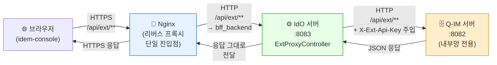
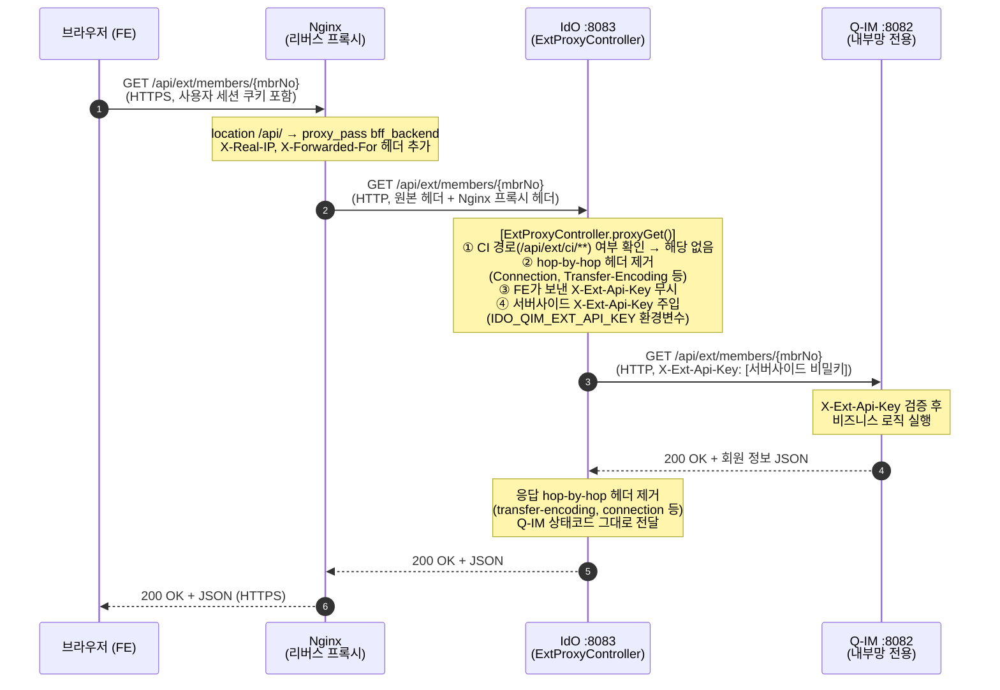
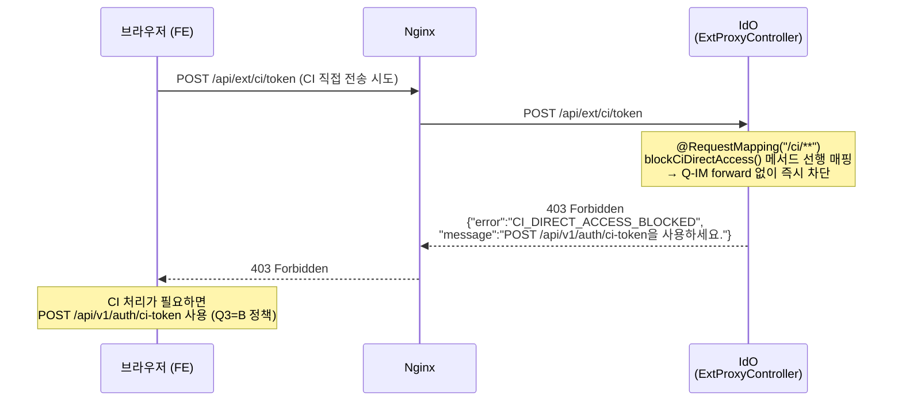
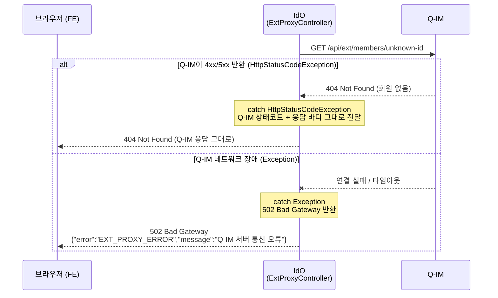
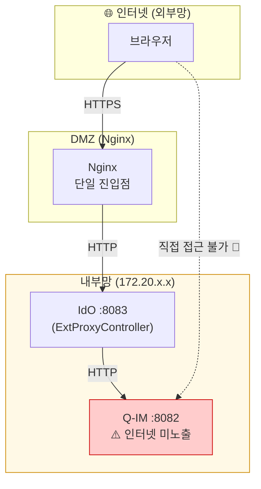
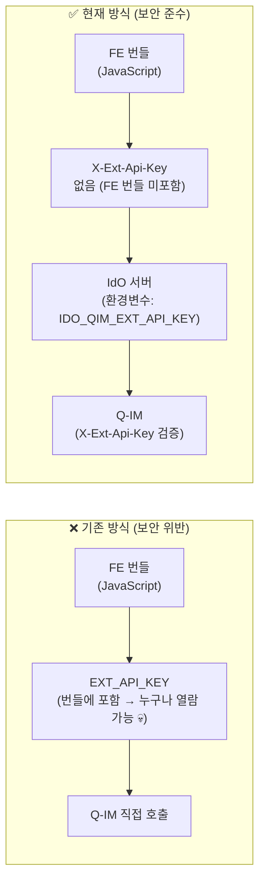
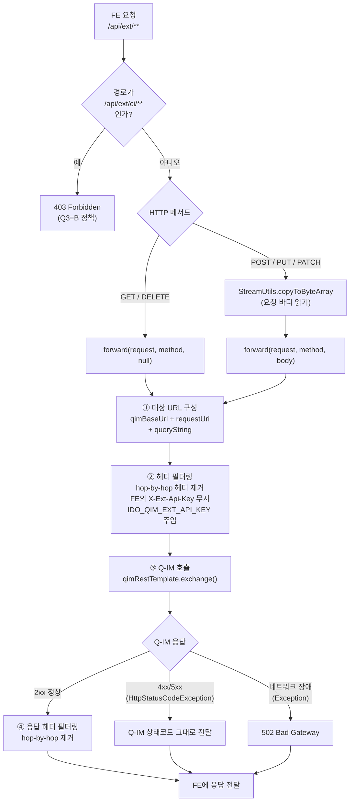
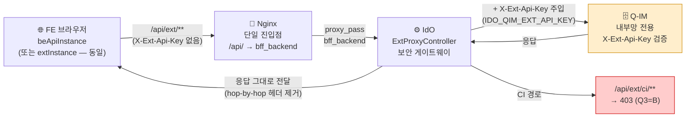

# OnePass 플랫폼: /api/ext/** 프록시 구조 및 Q-IM 연동 가이드

**문서 ID**: ARCH-EXT-PROXY-001  
**작성일**: 2026-05-14  
**대상 독자**: 프론트엔드(FE) 개발팀, 백엔드(BE) 개발팀, 보안 담당자

---

## 1. 개요: 왜 FE가 Q-IM을 직접 호출하는 것처럼 보일까?

OnePass 플랫폼의 프론트엔드(`idem-console`) 코드를 분석해보면, `extInstance`라는 API 클라이언트를 통해 `/api/ext/members/{mbrNo}`, `/api/ext/provision/users` 와 같은 수많은 API를 호출하는 것을 볼 수 있습니다. 이 경로들은 회원 정보와 관련된 Q-IM(식별 원장) 모듈의 기능들입니다.

**결론부터 말씀드리면, 사용자의 브라우저(FE)는 Q-IM 서버와 '직접' 네트워크 통신을 하지 않습니다.**

모든 `/api/ext/**` 요청은 **Nginx → IdO(정책 오케스트레이터) → Q-IM**의 2단계 경유를 거칩니다. IdO가 사용자를 대신하여 안전하게 Q-IM과 통신합니다. 이를 **Forward Proxy(포워드 프록시)** 구조라고 합니다.

> **`extInstance`의 현재 상태**: `extInstance`는 보안 패치(B-5)를 통해 이미 `beApiInstance`의 별칭(re-export)으로 변경되었습니다. 즉, `extInstance`를 사용하는 기존 코드는 내부적으로 IdO(8083)를 경유하고 있습니다. 신규 코드에서는 `beApiInstance`를 직접 사용하세요.

본 문서는 이 프록시 구조가 어떻게 동작하며, 왜 이런 아키텍처를 채택했는지 상세히 설명합니다.

---

## 2. 아키텍처 데이터 흐름: 투명한 프록시 (Transparent Proxy)

### 2.1 실제 네트워크 통신 경로

실제 요청은 **FE → Nginx → IdO → Q-IM**의 4단계를 거칩니다. Nginx는 모든 `/api/**` 요청을 IdO로 라우팅하는 단일 진입점입니다.



> **Nginx의 역할**: `nginx.conf`의 `location /api/` 블록이 모든 API 요청을 `bff_backend`(= `idem-hub:8083`)로 라우팅합니다. FE는 Nginx 주소 하나만 알면 됩니다.

---

### 2.2 단계별 상세 흐름



---

### 2.3 CI 경로 보안 차단 흐름

CI(연계정보) 관련 경로는 `ExtProxyController`가 프록시 실행 전에 **서버사이드에서 명시적으로 차단**합니다.



---

### 2.4 Q-IM 오류 응답 처리 흐름



---

## 3. 왜 이런 복잡한 프록시 구조를 사용하는가? (설계 의도)

### 3.1 보안 강화 (망 분리 및 Q-IM 은닉)

Q-IM은 모든 사용자의 식별 정보와 암호화된 연계정보(CI)를 보관하는 가장 민감한 **데이터 원장(SoR)**입니다. Q-IM 서버는 내부망(172.20.x.x)에만 노출되며, 인터넷 망에서 직접 접근이 불가능합니다.



### 3.2 API Key 보호 (서버 간 인증)

FE 코드(JavaScript)는 사용자의 브라우저에 다운로드되므로 누구나 분석할 수 있습니다. 여기에 Q-IM 인증 키를 포함하면 100% 유출됩니다.



현재 구조에서는 **오직 IdO 서버만이 Q-IM에 접근할 수 있는 비밀 키(`IDO_QIM_EXT_API_KEY`)를 환경변수로 안전하게 보유**합니다. FE 번들에는 이 키가 포함되지 않습니다.

### 3.3 민감 정보(CI) 유출 원천 차단 (Q3=B 정책)

OnePass의 핵심 보안 원칙: **"어떤 경우에도 연계정보(CI)의 평문이 프론트엔드로 전달되어서는 안 된다."**

`ExtProxyController`의 `@RequestMapping("/ci/**")` 매핑이 `/api/ext/ci/**` 경로를 프록시 실행 전에 403으로 차단합니다. CI가 필요한 경우 반드시 `POST /api/v1/auth/ci-token` 전용 엔드포인트를 사용해야 합니다.

### 3.4 라우팅 유연성 (Single Endpoint)

나중에 Q-IM 서비스의 주소가 바뀌거나, 기능이 여러 마이크로서비스로 분리되더라도 **FE 코드는 전혀 변경할 필요가 없습니다**. FE는 항상 Nginx 주소 하나만 알면 되며, 라우팅은 Nginx → IdO가 책임집니다.

---

## 4. 구현 상세 (ExtProxyController.java)

### 4.1 핵심 설계 결정



### 4.2 hop-by-hop 헤더 처리

프록시 체인에서 특정 헤더는 구간별로 제거해야 합니다. `ExtProxyController`는 두 방향 모두 처리합니다.

| 방향 | 제거 대상 헤더 | 이유 |
|------|------------|------|
| **FE → Q-IM** (요청) | `host`, `connection`, `keep-alive`, `transfer-encoding`, `te`, `trailers`, `upgrade`, `proxy-authorization`, `proxy-authenticate`, `x-ext-api-key`(FE 원본) | 프록시 체인 전달 불가 헤더, FE 번들 키 무시 후 서버사이드 키로 교체 |
| **Q-IM → FE** (응답) | `transfer-encoding`, `connection`, `keep-alive`, `te`, `trailers`, `upgrade` | 프록시 체인 전달 불가 hop-by-hop 헤더 |

### 4.3 실제 구현 코드 (핵심 부분)

```java
// idem-hub/src/main/java/io/github/hipstermin/idem/idem-hub/ext/ExtProxyController.java

@RestController
@RequestMapping("/api/ext")
public class ExtProxyController {

    // ① CI 경로 차단 — Q3=B 보안 정책 (forward 전에 선행 처리)
    @RequestMapping("/ci/**")
    public ResponseEntity<String> blockCiDirectAccess() {
        log.warn("[EXT-PROXY][보안차단] CI 직접 전송 경로 접근 차단 — Q3=B 위반");
        return ResponseEntity.status(HttpStatus.FORBIDDEN)
                .body("{\"error\":\"CI_DIRECT_ACCESS_BLOCKED\"," +
                      "\"message\":\"CI 처리는 POST /api/v1/auth/ci-token을 사용하세요.\"}");
    }

    // ② 메서드별 forward proxy (GET/POST/PUT/PATCH/DELETE 모두 지원)
    @GetMapping("/**")
    public ResponseEntity<byte[]> proxyGet(HttpServletRequest request) throws IOException {
        return forward(request, HttpMethod.GET, null);
    }

    @PostMapping("/**")
    public ResponseEntity<byte[]> proxyPost(HttpServletRequest request) throws IOException {
        byte[] body = StreamUtils.copyToByteArray(request.getInputStream()); // 바디 읽기
        return forward(request, HttpMethod.POST, body);
    }
    // PUT, PATCH, DELETE도 동일 패턴...

    private ResponseEntity<byte[]> forward(HttpServletRequest request,
                                           HttpMethod method, byte[] requestBody) {
        // 1. 대상 URL: {qimBaseUrl}/api/ext/... + 쿼리스트링
        String targetUrl = qimBaseUrl + request.getRequestURI();
        if (request.getQueryString() != null) {
            targetUrl += "?" + request.getQueryString();
        }

        // 2. 헤더 필터링 + 서버사이드 X-Ext-Api-Key 주입
        HttpHeaders headers = buildForwardHeaders(request);
        //   → hop-by-hop 헤더 제거
        //   → FE가 보낸 X-Ext-Api-Key 무시 (조작 방지)
        //   → IDO_QIM_EXT_API_KEY 환경변수 값으로 새로 주입

        try {
            // 3. Q-IM 호출
            ResponseEntity<byte[]> qimResponse = qimRestTemplate.exchange(
                    URI.create(targetUrl), method,
                    new HttpEntity<>(requestBody, headers), byte[].class);

            // 4. 응답 hop-by-hop 헤더 제거 후 FE에 그대로 전달
            return ResponseEntity
                    .status(qimResponse.getStatusCode())
                    .headers(buildResponseHeaders(qimResponse.getHeaders()))
                    .body(qimResponse.getBody());

        } catch (HttpStatusCodeException e) {
            // Q-IM의 4xx/5xx → 동일 상태코드로 FE에 전달
            return ResponseEntity.status(e.getStatusCode())
                    .headers(buildResponseHeaders(e.getResponseHeaders()))
                    .body(e.getResponseBodyAsByteArray());

        } catch (Exception e) {
            // 네트워크 장애 → 502 Bad Gateway
            return ResponseEntity.status(HttpStatus.BAD_GATEWAY)
                    .body(("{\"error\":\"EXT_PROXY_ERROR\",\"message\":\"" +
                           e.getMessage() + "\"}").getBytes());
        }
    }
}
```

---

## 5. FE 마이그레이션 가이드

### 5.1 `extInstance`의 현재 상태

```typescript
// idem-console/frontend/src/api/extInstance.ts
// ★ B-5 보안 패치 이후 — extInstance는 beApiInstance의 별칭(re-export)

/**
 * @deprecated 신규 코드에서는 beApiInstance를 직접 사용하세요.
 *             기존 ext/* 파일과의 하위호환을 위해 beApiInstance를 re-export합니다.
 */
import { beApiInstance } from 'api/beInstance';
export { beApiInstance as default };
```

즉, `extInstance`를 사용하는 기존 코드는 이미 `beApiInstance`와 동일하게 동작합니다. **두 인스턴스 모두 IdO(8083)를 경유**합니다.

### 5.2 API 인스턴스 선택 기준

```typescript
// idem-console/frontend/src/api/beInstance.ts
// beApiInstance: IdO 경유 — 모든 /api/** 요청에 사용
const beApiInstance = axios.create({
    baseURL: process.env.BE_API_ENDPOINT || '', // Nginx 주소 (IdO가 아님)
    headers: {
        'Content-Type': 'application/json',
        'X-BE-API-Key': process.env.BE_API_KEY || '',
        // ★ X-Ext-Api-Key는 포함되지 않음. IdO 서버에서 서버사이드로 주입.
    },
});
```

| 상황 | 사용할 인스턴스 | 비고 |
|------|--------------|------|
| Q-IM 데이터 조회 (`/api/ext/**`) | `beApiInstance` | `extInstance`도 동일 동작 (하위호환) |
| IdO 자체 API (`/api/v1/**`) | `beApiInstance` | 동일 인스턴스 사용 |
| 인증 결과 조회 (`/api/ext/auth-result/**`) | `beApiInstance` | IdO가 처리 후 Q-IM으로 프록시 |
| CI 직접 전송 | **사용 불가** | `/api/ext/ci/**` → 403. `POST /api/v1/auth/ci-token` 사용 |

### 5.3 마이그레이션 전/후

```typescript
// ✅ 신규 코드 작성 시 (권장)
import { beApiInstance } from 'api/beInstance';
const response = await beApiInstance.get('/api/ext/member/profile');

// ✅ 기존 코드 유지 시 (하위호환, 동작 동일)
import extInstance from 'api/extInstance'; // 내부적으로 beApiInstance
const response = await extInstance.get('/api/ext/member/profile');

// ❌ 절대 사용 금지 (B-5 패치 전 방식 — 복원 금지)
// EXT_API_ENDPOINT를 Q-IM 직접 주소로 설정하거나 EXT_API_KEY를 FE 번들에 포함하는 방식
```

---

## 6. 개발팀 가이드

### 6.1 프론트엔드 (FE) 팀

- **`EXT_API_ENDPOINT` 환경변수**: Q-IM 서버 주소가 아닌 **Nginx 주소**로 설정합니다. Nginx가 `/api/` 요청을 IdO로 자동 라우팅합니다.
- **신규 코드**: `beApiInstance`를 직접 사용하세요. `extInstance`는 하위호환용으로 유지되지만 신규 파일에서는 사용을 지양합니다.
- **CI 관련 API**: `/api/ext/ci/**` 경로는 403으로 차단됩니다. CI 처리가 필요하면 반드시 `POST /api/v1/auth/ci-token`을 사용하세요.

### 6.2 백엔드 (IdO) 팀

- **새 경로 차단 추가**: Q3=B 정책에 따라 새로운 민감 경로를 차단해야 하는 경우, `BLOCKED_PATH_PREFIXES` Set에 추가하거나 별도 `@RequestMapping`을 추가하세요.
- **`IDO_QIM_EXT_API_KEY` 설정 필수**: 운영 환경에서 이 환경변수가 비어있으면 `X-Ext-Api-Key` 헤더가 주입되지 않고, Q-IM이 요청을 거부합니다. K8s Secret / Vault에서 주입하세요.
- **`qimRestTemplate` 빈**: 커넥션 풀과 타임아웃이 별도로 설정된 전용 RestTemplate을 사용합니다. `@Qualifier("qimRestTemplate")`으로 주입됩니다.

### 6.3 백엔드 (Q-IM) 팀

- **인증 방식**: `/api/ext/**` 엔드포인트는 브라우저 쿠키나 세션 토큰을 검증하지 않아도 됩니다. **오직 `X-Ext-Api-Key` 헤더만 검증**하면 됩니다. 이 키는 항상 IdO 서버가 주입합니다.
- **직접 호출 거부**: Q-IM은 내부망에만 노출되므로, 외부에서 `X-Ext-Api-Key` 없이 직접 호출하면 자동으로 연결이 거부됩니다.

---

## 7. 운영 설정 참조

### 7.1 Nginx 라우팅 설정 (`nginx.conf`)

```nginx
upstream bff_backend {
    server idem-hub:8083;  # IdO 서버
    keepalive 32;
}

server {
    # 모든 /api/** 요청 → IdO로 라우팅 (/api/ext/** 포함)
    location /api/ {
        proxy_pass         http://bff_backend;
        proxy_http_version 1.1;
        proxy_set_header   Connection        "";
        proxy_set_header   Host              $host;
        proxy_set_header   X-Real-IP         $remote_addr;
        proxy_set_header   X-Forwarded-For   $proxy_add_x_forwarded_for;
        proxy_set_header   X-Forwarded-Proto $scheme;
        proxy_set_header   X-Correlation-Id  $http_x_correlation_id;
        proxy_read_timeout 30s;
    }
}
```

### 7.2 IdO 환경변수

| 환경변수 | 설명 | 비고 |
|---------|------|------|
| `QIM_BASE_URL` | Q-IM 서버 내부망 주소 | 예: `http://idem-registry:8082` |
| `IDO_QIM_EXT_API_KEY` | Q-IM 외부 API 인증 키 | K8s Secret 주입 필수. 비어있으면 Q-IM 인증 실패 |

---

## 8. 요약



사용자(브라우저)가 Q-IM 서버에 **'직접'** 무언가를 하는 것처럼 보이는 것은 **BFF(Backend for Frontend) 아키텍처 패턴**이 의도적으로 만들어낸 착시입니다.

실제로는 모든 요청이 **Nginx → IdO라는 강력한 보안 게이트웨이**를 거치며 필터링되고, 내부망의 안전한 터널을 통해서만 Q-IM으로 전달됩니다.

- **Q-IM은 인터넷 망에 전혀 노출되지 않습니다.**
- **API Key는 FE 번들에 포함되지 않고, IdO 서버가 서버사이드로 주입합니다.**
- **CI(연계정보)는 `/api/ext/ci/**` 차단 정책으로 FE에 노출되지 않습니다.**
