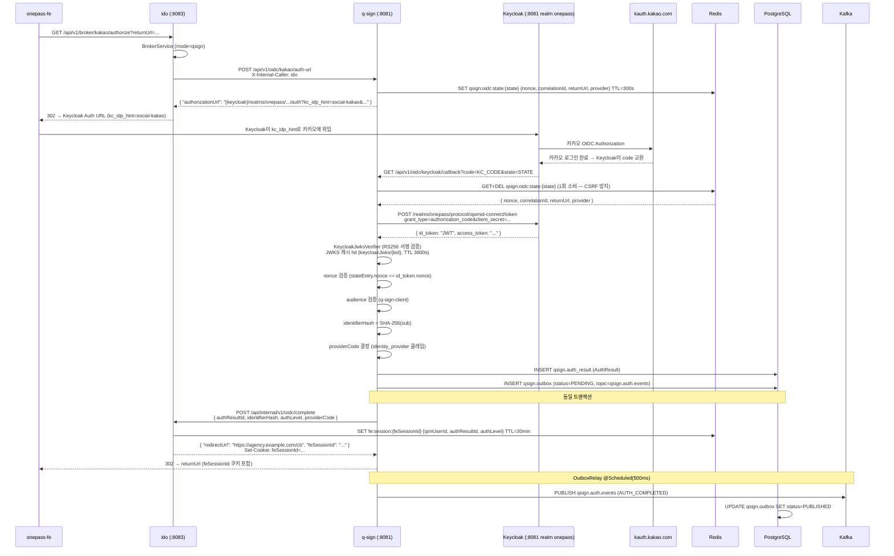
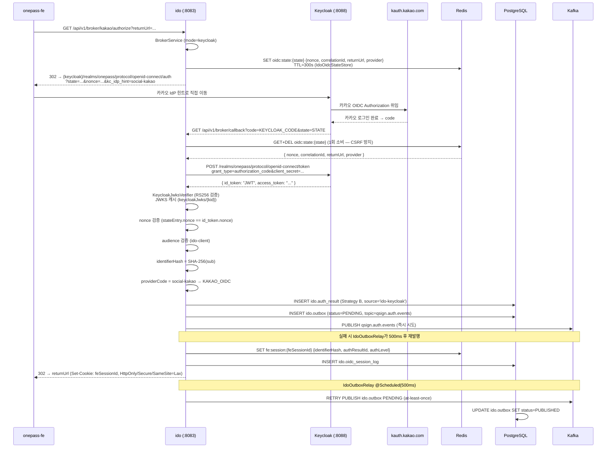
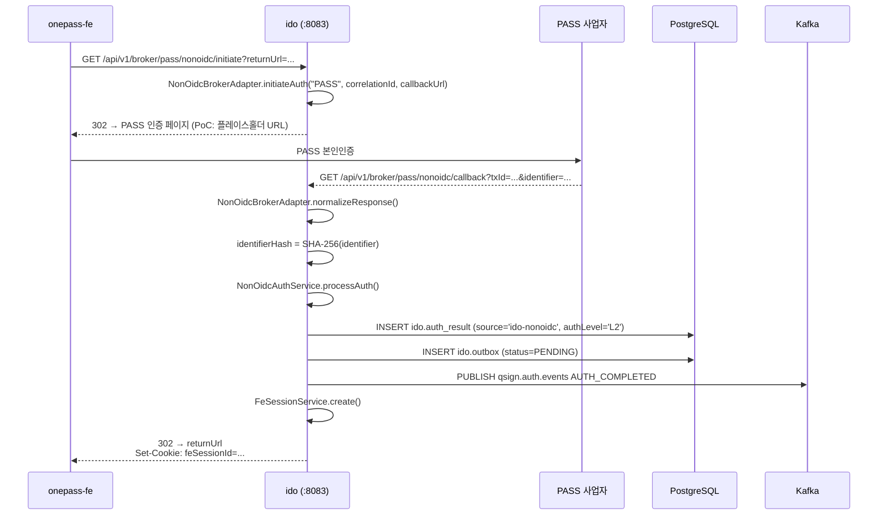
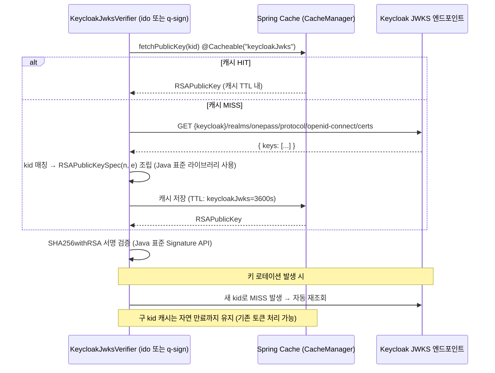
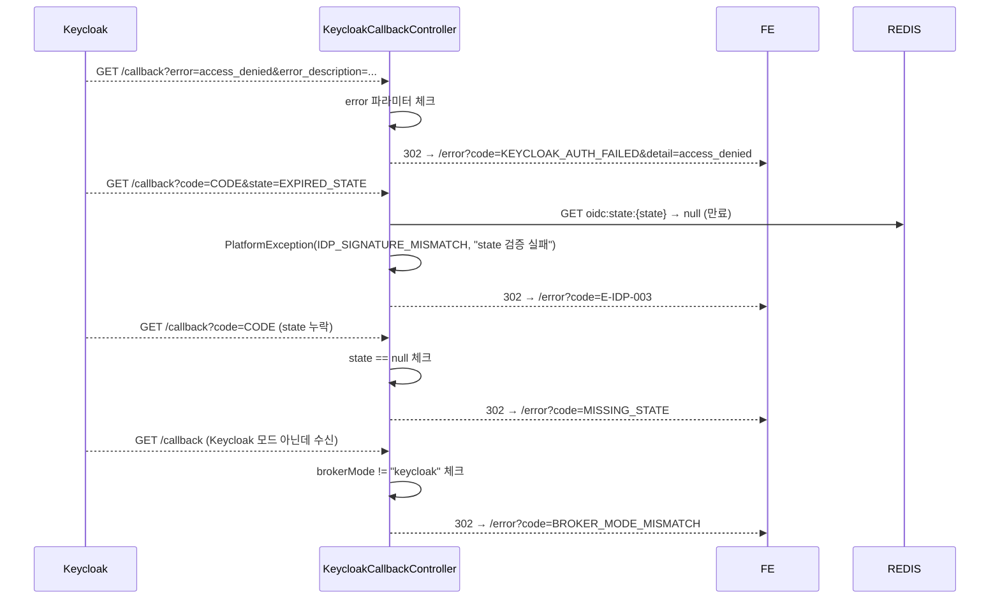

# OnePass 통합인증 플랫폼 — OIDC 브로커링 설계서

> **문서 분류**: 개발자 배포용 설계서 (Developer Design Document)  
> **버전**: v1.5.0  
> **최종 수정**: 2026-05-07  
> **대상 독자**: 백엔드 개발자, 인프라 엔지니어, 보안 검토자  
> **관련 모듈**: `ido`, `q-sign`, `onepass-fe`

---

## 목차

1. [개요 및 목적](#1-개요-및-목적)
2. [아키텍처 전체 구조](#2-아키텍처-전체-구조)
3. [브로커링 이중 모드 설계](#3-브로커링-이중-모드-설계)
4. [q-sign 직접 브로커 모드 (qsign mode)](#4-q-sign-직접-브로커-모드-qsign-mode)
5. [Keycloak OIDC 브로커 모드 (keycloak mode)](#5-keycloak-oidc-브로커-모드-keycloak-mode)
6. [비OIDC 브로커 모드 (nonoidc mode)](#6-비oidc-브로커-모드-nonoidc-mode)
7. [시퀀스 다이어그램 — 전체 흐름 비교](#7-시퀀스-다이어그램--전체-흐름-비교)
8. [보안 설계](#8-보안-설계)
9. [데이터 모델](#9-데이터-모델)
10. [Keycloak 서버 설정 가이드](#10-keycloak-서버-설정-가이드)
11. [환경별 설정](#11-환경별-설정)
12. [에러 처리 및 에러 코드](#12-에러-처리-및-에러-코드)
13. [모드 전환 운영 절차](#13-모드-전환-운영-절차)
14. [클래스 책임 맵](#14-클래스-책임-맵)
15. [API 명세](#15-api-명세)
16. [모니터링 및 장애 대응](#16-모니터링-및-장애-대응)
17. [개발 환경 시작 가이드](#17-개발-환경-시작-가이드)

---

## 1. 개요 및 목적

### 1.1 배경

OnePass 통합인증 플랫폼은 **카카오, 네이버 등 외부 OIDC 사업자** 및 **PASS·공인인증서 등 비OIDC 수단**을 통한 간편인증을 중개(브로커링)하는 플랫폼이다. 본 문서는 인증 브로커링의 **세 가지 구현 전략**을 상세히 설명한다.

| 구분 | q-sign Keycloak 어댑터 (현재 ✅) | Keycloak OIDC 브로커 (keycloak mode) | 비OIDC 브로커 (신규) |
|------|----------------------------------|--------------------------------------|---------------------|
| 브로커 역할 | `q-sign` Spring Boot 서비스 (Keycloak 클라이언트) | Keycloak (Red Hat SSO) | IdO 직접 처리 |
| OIDC 코드 교환 | `q-sign`이 **Keycloak** Token Endpoint 호출 | `ido`가 Keycloak Token Endpoint 호출 | 해당 없음 |
| JWT 검증 | `q-sign`의 `KeycloakJwksVerifier` (`keycloakJwks`) | `ido`의 `KeycloakJwksVerifier` | 해당 없음 |
| AuthResult 생성 | `qsign.auth_result` 테이블 | `ido.auth_result` 테이블 (Strategy B) | `ido.auth_result` 테이블 |
| FE 세션 발급 | q-sign → ido 내부 API 호출 | ido가 직접 발급 | ido가 직접 발급 |
| 지원 사업자 | Kakao, Naver, PASS, GPKI (kc_idp_hint) | Kakao, Naver (kc_idp_hint) | PASS, 금융인증서, GPKI, 공동인증서 |
| 전환 방법 | 기본 동작 (qsign mode) | `IDO_BROKER_MODE=keycloak` 환경변수 | provider 경로 자동 분기 |

### 1.2 설계 원칙

- **무중단 전환**: `ido.broker.mode` 설정 하나로 q-sign ↔ Keycloak 전환 (코드 변경 없음)
- **하위 컨슈머 불변**: 세 모드 모두 동일한 Kafka 토픽(`qsign.auth.events`)으로 `AUTH_COMPLETED` 이벤트 발행 → 하위 소비자(`QsignAuthEventConsumer` 등) 변경 불필요
- **보안 우선**: CSRF(state), Replay Attack(nonce), JWT 위조(JWKS RS256), Audience 검증 등 4중 방어
- **감사 추적**: 모든 브로커링 과정은 `ido.oidc_session_log` + Kafka 이벤트로 추적 가능
- **Strategy B 통일**: Keycloak·비OIDC 모두 IdO가 직접 `ido.auth_result`를 생성, 동일 Kafka 버스 사용

### 1.3 용어 정의

| 용어 | 정의 |
|------|------|
| `ido` | Identity Orchestrator — 정책 오케스트레이터 서비스 (port 8083) |
| `q-sign` | Q-Sign — 인증 처리 서비스, 기존 브로커 역할 담당 (port 8081) |
| `onepass-fe` | React SPA 프론트엔드 (port 3000/3001) |
| `correlationId` | 단일 인증 요청의 전 과정 추적 UUID |
| `identifierHash` | SHA-256(사용자 고유 식별자 sub) — PII 직접 노출 방지 |
| `state` | CSRF 방어용 opaque 랜덤 값 (32자 UUID) |
| `nonce` | ID Token Replay Attack 방어용 랜덤 값 (32자 UUID) |
| `kc_idp_hint` | Keycloak에 특정 IdP(카카오 등)로 바로 리다이렉트하도록 지시하는 파라미터 |
| `acr` | Authentication Context Class Reference — 인증 수준 (1=L1, 2=L2, 3=L3) |
| `AuthLevel` | 플랫폼 인증 수준 (L1: 간편, L2: 본인인증, L3: 공인인증서) |
| `Strategy B` | IdO가 직접 `ido.auth_result`를 생성하는 방식 (q-sign이 콜백을 수신하지 않음) |
| `PoC` | Proof of Concept — 현재 구현체는 실제 외부 SDK 호출 전 플레이스홀더 포함 |

---

## 2. 아키텍처 전체 구조

```
┌───────────────────────────────────────────────────────────────────────────┐
│                        onepass-fe (React SPA)                             │
│                    http://localhost:3000  /  3001                         │
└───────────────────────┬───────────────────────────────────────────────────┘
                        │  GET /api/v1/broker/{provider}/authorize   (OIDC)
                        │  GET /api/v1/broker/{provider}/nonoidc/initiate (비OIDC)
                        ▼
┌───────────────────────────────────────────────────────────────────────────┐
│                              ido (:8083)                                  │
│                                                                           │
│  ┌──────────────────────┐   ┌───────────────────────────────────────────┐ │
│  │  BrokerController    │   │           BrokerService                   │ │
│  │  GET /{provider}/    │──▶│  mode=qsign  ──▶  q-sign 위임            │ │
│  │      authorize       │   │  mode=keycloak ▶  Keycloak URL 직접생성  │ │
│  └──────────────────────┘   └───────────────────────────────────────────┘ │
│                                                                           │
│  ┌────────────────────────────────────────────────────────────────────┐   │
│  │  KeycloakCallbackController  GET /api/v1/broker/callback           │   │
│  │  (keycloak 모드 전용)                                               │   │
│  │  ┌──────────────────────────────────────────────────────────────┐  │   │
│  │  │  KeycloakOidcService (11단계)                                 │  │   │
│  │  │   1. state 검증 (Redis 1회 소비)                              │  │   │
│  │  │   2. code → token 교환 (Keycloak Token EP)                   │  │   │
│  │  │   3. id_token JWKS 서명 검증 (KeycloakJwksVerifier)          │  │   │
│  │  │   4. nonce + audience 검증                                    │  │   │
│  │  │   5. identifierHash = SHA-256(sub)                           │  │   │
│  │  │   6. providerCode 결정 (identity_provider 클레임)             │  │   │
│  │  │   7. ido.auth_result INSERT (Strategy B)                     │  │   │
│  │  │   8. ido.outbox INSERT → Kafka qsign.auth.events             │  │   │
│  │  │   9. FE 세션 생성 → feSessionId 쿠키                          │  │   │
│  │  │  10. ido.oidc_session_log 기록                                │  │   │
│  │  └──────────────────────────────────────────────────────────────┘  │   │
│  └────────────────────────────────────────────────────────────────────┘   │
│                                                                           │
│  ┌────────────────────────────────────────────────────────────────────┐   │
│  │  OidcCompleteController  POST /api/internal/v1/oidc/complete       │   │
│  │  (qsign 모드 전용 — q-sign이 호출)                                  │   │
│  └────────────────────────────────────────────────────────────────────┘   │
│                                                                           │
│  ┌────────────────────────────────────────────────────────────────────┐   │
│  │  NonOidcBrokerController  GET /api/v1/broker/{provider}/nonoidc/*  │   │
│  │  (비OIDC 전용: pass / financial-cert / gpki / joint-cert)          │   │
│  │  ┌──────────────────────────────────────────────────────────────┐  │   │
│  │  │  NonOidcBrokerAdapter (IdpBrokerService 구현)                │  │   │
│  │  │   initiateAuth()   → 사업자 인증 페이지 redirect URL 반환     │  │   │
│  │  │   normalizeResponse() → IdOAuthInput 정규화                  │  │   │
│  │  │       → NonOidcAuthService.processAuth()                     │  │   │
│  │  │           (ido.auth_result + ido.outbox + Kafka 발행)        │  │   │
│  │  └──────────────────────────────────────────────────────────────┘  │   │
│  └────────────────────────────────────────────────────────────────────┘   │
│                                                                           │
│  ┌─────────────────────────────────────────────────────────────────────┐  │
│  │  IdoOutboxRelay  @Scheduled(500ms)                                  │  │
│  │  ido.outbox PENDING → Kafka qsign.auth.events 재발행 (at-least-once)│  │
│  └─────────────────────────────────────────────────────────────────────┘  │
└──────┬───────────────────────────────┬──────────────────────────────────┘
       │                               │
    qsign mode                  keycloak/nonoidc mode
       │                               │
       ▼                               ▼
┌──────────────────┐      ┌──────────────────────────┐
│  q-sign (:8081)  │      │   Keycloak (:8088)        │
│                  │      │                           │
│  KakaoOidcBroker │      │   Realm: onepass          │
│  ├ OidcStateStore│      │   Client: ido-client      │
│  ├ KakaoJwksVerif│      │   IdP: social-kakao       │
│  └ AuthResultRepo│      │       social-naver        │
│  OutboxRelay     │      └─────────────┬─────────────┘
└────────┬─────────┘                    │
         │                             │
         ▼                             ▼
kauth.kakao.com                kauth.kakao.com
(q-sign 직접 연결)              (Keycloak → 카카오)

                         ┌──────────────────────────────────────┐
                         │  외부 비OIDC 사업자                   │
                         │  PASS / 금융인증서 / GPKI / 공동인증서 │
                         │  (PoC: 플레이스홀더, 실 SDK 교체 예정) │
                         └──────────────────────────────────────┘

                         ┌───────────────────────────────────────┐
                         │  Kafka: qsign.auth.events             │
                         │  (모든 모드 공통 발행 — 하위 컨슈머 불변) │
                         │   QsignAuthEventConsumer (ido-module) │
                         └───────────────────────────────────────┘
```

---

## 3. 브로커링 이중 모드 설계

### 3.1 모드 전환 메커니즘

모드 전환은 **단일 환경변수** 변경만으로 가능하다. 코드 수정, 재컴파일, 서비스 재구성이 필요없다.

```yaml
# ido/src/main/resources/application.yml
ido:
  broker:
    mode: ${IDO_BROKER_MODE:qsign}   # qsign | keycloak
```

| 환경변수 값 | 동작 | 비고 |
|------------|------|------|
| `qsign` (기본) | 기존 q-sign 서비스에 URL 발급 위임 | q-sign 서비스 가동 필요 |
| `keycloak` | ido가 직접 Keycloak URL 생성 및 콜백 수신 | Keycloak 서버 가동 필요 |

> **비OIDC 모드**는 이 환경변수와 무관하게 `/api/v1/broker/{provider}/nonoidc/*` 경로로 **항상 활성화**된다.

### 3.2 BrokerService 분기 로직

```java
// BrokerService.buildAuthorizationUrl()
// 파일: ido/src/main/java/kr/go/smes/ido/broker/BrokerService.java
return switch (brokerMode) {
    case "keycloak" -> buildKeycloakAuthorizationUrl(provider, correlationId, returnUrl, requestedLevel);
    case "qsign"    -> buildQsignAuthorizationUrl(provider, correlationId, returnUrl, requestedLevel);
    default -> {
        log.warn("[BrokerService] 알 수 없는 브로커 모드: {} — qsign 폴백", brokerMode);
        yield buildQsignAuthorizationUrl(provider, correlationId, returnUrl, requestedLevel);
    }
};
```

**Keycloak URL 생성 핵심 코드**:
```java
// BrokerService.buildKeycloakAuthorizationUrl()
IdoOidcStateEntry entry = idoOidcStateStore.create(
        correlationId, returnUrl, requestedLevel, provider,
        keycloakProperties.getStateTtlSeconds()   // 기본 300s
);
String idpHint = keycloakProperties.resolveIdpHint(provider);  // kakao → social-kakao

String authUrl = UriComponentsBuilder
        .fromUriString(keycloakProperties.authorizationEndpoint())
        .queryParam("response_type", "code")
        .queryParam("client_id",     keycloakProperties.getClientId())
        .queryParam("redirect_uri",  keycloakProperties.getRedirectUri())
        .queryParam("scope",         "openid profile email")
        .queryParam("state",         entry.getState())
        .queryParam("nonce",         entry.getNonce())
        .queryParam("kc_idp_hint",   idpHint)
        .build(false).toUriString();
```

> **안전 폴백**: 알 수 없는 모드 값은 자동으로 `qsign`으로 폴백하여 서비스 중단을 방지한다.

### 3.3 콜백 엔드포인트 비교

| 구분 | q-sign 모드 | Keycloak 모드 | 비OIDC 모드 |
|------|------------|---------------|------------|
| OIDC 콜백 수신자 | `q-sign` `/api/v1/oidc/kakao/callback` | `ido` `/api/v1/broker/callback` | `ido` `/api/v1/broker/{provider}/nonoidc/callback` |
| FE 세션 발급 | q-sign → ido POST `/api/internal/v1/oidc/complete` | ido 자체 발급 | ido 자체 발급 |
| `OidcCompleteController` | **활성** — q-sign이 호출 | **비활성** — 409 반환 | **비활성** — 409 반환 |
| `KeycloakCallbackController` | **비활성** — 409 반환 | **활성** | 해당 없음 |
| `NonOidcBrokerController` | 별도 경로 (항상 활성) | 별도 경로 (항상 활성) | **활성** |
| AuthResult 저장 | `qsign.auth_result` | `ido.auth_result` | `ido.auth_result` |
| Outbox/Relay | `q-sign OutboxRelay` | `ido IdoOutboxRelay` | `ido IdoOutboxRelay` |

---

## 4. q-sign Keycloak 어댑터 모드 (qsign mode) ✅ 현재 구현

> **v1.5.0 변경 사항**: q-sign이 직접 카카오 Token Endpoint를 호출하던 방식에서
> **Keycloak을 OIDC 클라이언트로 사용**하는 방식으로 전환 완료.
> 카카오/네이버 등 외부 IdP와의 모든 통신은 Keycloak이 대신 처리한다.

### 4.1 책임 분리

```
FE(browser) → ido BrokerController → q-sign KeycloakAuthUrlController
                                           ↓
                             POST /api/v1/oidc/{provider}/auth-url
                             { correlationId, returnUrl, requestedLevel }
                                           ↓
                        state/nonce 생성 (Redis, qsign:oidc:state:{state})
                        kc_idp_hint 결정 (kakao→social-kakao 등)
                                           ↓
         Keycloak Authorization URL 반환 (kc_idp_hint 포함)
                http://localhost:8081/realms/onepass/protocol/openid-connect/auth
                  ?kc_idp_hint=social-kakao&state=...&nonce=...
                                           ↓ (302 redirect chain)
FE(browser) → Keycloak(:8081) → [Keycloak이 카카오로 위임]
                         → kauth.kakao.com → [카카오 로그인]
                                           ↓
                 q-sign KeycloakCallbackController
                       GET /api/v1/oidc/keycloak/callback
                       (콜백 수신: code, state)
                                           ↓
                 1. state 검증 (Redis 소비 — KeycloakStateStore)
                    key: qsign:oidc:state:{state}, TTL 300s
                 2. code → token 교환 (Keycloak Token EP)
                    POST {keycloak}/realms/onepass/protocol/openid-connect/token
                 3. id_token JWKS 검증 (KeycloakJwksVerifier)
                    JWKS URI: {keycloak}/realms/onepass/protocol/openid-connect/certs
                    캐시: @Cacheable("keycloakJwks")
                 4. nonce / audience / exp 검증
                 5. identifierHash = SHA-256(sub)
                 6. providerCode 결정 (identity_provider 클레임)
                 7. 잠금 확인 (LockRepository)
                 8. AuthResult INSERT (qsign.auth_result)
                    + Outbox 저장 (qsign.outbox) — 동일 트랜잭션
                 9. ido POST /api/internal/v1/oidc/complete
                                           ↓
                    ido: FE 세션 생성 (Redis fe:session:{id})
                    ido: feSessionId 쿠키 + redirectUrl 반환
                                           ↓
                    q-sign: 302 → returnUrl (feSessionId 쿠키 포함)
```

### 4.2 핵심 클래스

| 클래스 | 위치 | 역할 |
|--------|------|------|
| `BrokerController` | `ido/broker/` | GET `/{provider}/authorize` — FE 진입점 |
| `BrokerService` | `ido/broker/` | qsign 모드: q-sign Keycloak 어댑터에 URL 발급 위임 |
| `KeycloakAuthUrlController` | `q-sign/keycloak/` | POST `/api/v1/oidc/{provider}/auth-url` — Keycloak Authorization URL 발급 |
| `KeycloakCallbackController` | `q-sign/keycloak/` | GET `/api/v1/oidc/keycloak/callback` — Keycloak 콜백 수신 |
| `KeycloakCallbackService` | `q-sign/keycloak/` | Callback 전 과정 처리 (`@Transactional`) |
| `KeycloakProperties` | `q-sign/keycloak/` | `@ConfigurationProperties(prefix="qsign.keycloak")`, baseUrl/realm/clientId/clientSecret/idpHintMapping 등 헬퍼 포함 |
| `KeycloakJwksVerifier` | `q-sign/keycloak/` | Keycloak JWKS RS256 서명 검증 (`@Cacheable keycloakJwks`, TTL 3600s) |
| `KeycloakStateStore` | `q-sign/keycloak/` | state/nonce Redis 저장 (키: `qsign:oidc:state:{state}`, TTL 300s) |
| `KeycloakStateEntry` | `q-sign/keycloak/` | Redis 저장 DTO (state, nonce, correlationId, returnUrl, requestedLevel, provider) |
| `KeycloakIdTokenClaims` | `q-sign/keycloak/dto/` | id_token 클레임 DTO (iss, sub, aud, nonce, iat, exp, acr, identity_provider) |
| `KeycloakTokenResponse` | `q-sign/keycloak/dto/` | Keycloak Token Endpoint 응답 DTO |
| `AuthResultRepository` | `q-sign/infrastructure/` | `qsign.auth_result` CRUD |
| `QSignOutboxRepository` | `q-sign/outbox/` | `qsign.outbox` PENDING 조회·상태 갱신 |
| `OutboxRelay` | `q-sign/outbox/` | `@Scheduled(500ms)` `qsign.outbox` → Kafka 발행 |
| `OidcCompleteController` | `ido/broker/` | POST `/api/internal/v1/oidc/complete` — FE 세션 발급 |
| `FeSessionService` | `ido/fe/session/` | Redis 기반 FE 세션 관리 (Sliding TTL 30분, 절대만료 8시간) |

### 4.3 내부 API 연동 (ido → q-sign Keycloak 어댑터)

**Step 1: ido → q-sign Authorization URL 요청**

```
실제 흐름:
POST http://localhost:8081/api/v1/oidc/{provider}/auth-url   ← ido → q-sign Keycloak 어댑터
X-Correlation-Id: {correlationId}
X-Internal-Caller: ido
X-Internal-Sig: sig-{correlationId.substring(0,8)}

{
  "correlationId": "550e8400-...",
  "returnUrl": "https://agency-a.example.com/callback",
  "requestedLevel": "L1"
}

응답:
{ "authorizationUrl": "http://localhost:8081/realms/onepass/protocol/openid-connect/auth?client_id=q-sign-client&kc_idp_hint=social-kakao&state=...&nonce=..." }
```

**Step 2: q-sign → ido FE 세션 발급 요청**

```
POST /api/internal/v1/oidc/complete
X-Internal-Caller: q-sign
X-Internal-Sig: sig-{correlationId.substring(0,8)}
X-Correlation-Id: {correlationId}

{
  "authResultId":   "uuid",
  "identifierHash": "sha256-hex",
  "authLevel":      "L1",
  "providerCode":   "KAKAO_OIDC",
  "correlationId":  "uuid",
  "returnUrl":      "https://agency-a.example.com/callback"
}

성공 응답:
{
  "redirectUrl":  "https://agency-a.example.com/callback",
  "feSessionId":  "base64url-256bit"
}
Set-Cookie: feSessionId=...; HttpOnly; Secure; SameSite=Lax; Path=/

Keycloak 모드에서 이 엔드포인트 호출 시:
HTTP 409
{ "error": "BROKER_MODE_MISMATCH", "message": "keycloak 모드에서는 /api/v1/broker/callback을 사용하세요" }
```

> **보안**: `X-Internal-Sig`는 현재 PoC 수준의 단순 서명. 운영에서는 `HMAC-SHA256(correlationId + timestamp, sharedSecret)` + mTLS 적용 권고.

### 4.4 q-sign Keycloak Authorization URL 구조

```
http://localhost:8081/realms/onepass/protocol/openid-connect/auth
  ?response_type=code
  &client_id={qsign.keycloak.client-id}          ← q-sign-client
  &redirect_uri={qsign.keycloak.redirect-uri}    ← http://localhost:8081/api/v1/oidc/keycloak/callback
  &scope=openid profile email
  &state={32자 랜덤 UUID, Redis 저장 — KeycloakStateStore}
  &nonce={32자 랜덤 UUID, Redis 저장}
  &kc_idp_hint={idpHintMapping 조회 값}          ← kakao→social-kakao, naver→social-naver 등
```

> **핵심**: Authorization URL이 `kauth.kakao.com`이 아닌 **Keycloak 서버**를 가리킨다.
> 외부 IdP(카카오)로의 실제 리다이렉트는 Keycloak이 `kc_idp_hint`를 이용해 처리한다.

---

## 5. Keycloak OIDC 브로커 모드 (keycloak mode)

### 5.1 Strategy B — IdO가 직접 AuthResult 생성

Keycloak 도입 후 **q-sign이 더 이상 카카오 콜백을 수신하지 않는다**. 대신:

- **IdO**가 Keycloak으로부터 authorization code를 직접 수신
- **IdO**가 Keycloak Token Endpoint에 code 교환 요청
- **IdO**가 id_token JWKS 검증
- **IdO**가 `ido.auth_result` 테이블에 직접 INSERT
- **IdO**가 Kafka `qsign.auth.events` 토픽에 직접 발행

기존 `QsignAuthEventConsumer`는 변경 없이 이 이벤트를 소비한다.

### 5.2 핵심 클래스

| 클래스 | 위치 | 역할 |
|--------|------|------|
| `BrokerController` | `ido/broker/` | GET `/{provider}/authorize` — FE 진입점 |
| `BrokerService` | `ido/broker/` | keycloak 모드: Keycloak Authorization URL 직접 생성 |
| `IdoOidcStateStore` | `ido/broker/state/` | state/nonce Redis 저장 (키: `oidc:state:{state}`) |
| `IdoOidcStateEntry` | `ido/broker/state/` | Redis 저장 DTO (state, nonce, correlationId, returnUrl, requestedLevel, provider) |
| `KeycloakProperties` | `ido/broker/keycloak/` | `@ConfigurationProperties(prefix="ido.keycloak")` |
| `KeycloakCallbackController` | `ido/broker/keycloak/` | GET `/api/v1/broker/callback` — Keycloak 콜백 수신 |
| `KeycloakOidcService` | `ido/broker/keycloak/` | 11단계 콜백 처리 오케스트레이터 |
| `KeycloakJwksVerifier` | `ido/broker/keycloak/` | JWKS RS256 서명 검증 (`@Cacheable keycloakJwks`, TTL 1시간) |
| `KeycloakJwtClaims` | `ido/broker/keycloak/dto/` | id_token 클레임 DTO |
| `KeycloakTokenResponse` | `ido/broker/keycloak/dto/` | Token Endpoint 응답 DTO |
| `IdoOutboxRepository` | `ido/infrastructure/outbox/` | `ido.outbox` CRUD (JdbcTemplate 기반) |
| `IdoOutboxRelay` | `ido/infrastructure/outbox/` | `@Scheduled(500ms)` `ido.outbox` → Kafka 재발행 |

### 5.3 처리 단계 (KeycloakOidcService.handleCallback)

```java
// 파일: ido/src/main/java/kr/go/smes/ido/broker/keycloak/KeycloakOidcService.java
@Transactional
public CallbackResult handleCallback(String code, String state) {
```

| 단계 | 설명 | 구현 |
|------|------|------|
| 1 | **state 검증** (CSRF 방지, 1회 소비) | `IdoOidcStateStore.consumeAndValidate(state)` |
| 2 | **Authorization Code → Token 교환** | POST `{keycloak}/realms/{realm}/protocol/openid-connect/token` |
| 3 | **id_token JWKS 서명 검증 + 클레임 파싱** | `KeycloakJwksVerifier.verifyAndParse(idToken, correlationId)` |
| 4 | **nonce 검증** (replay attack 방지) | `id_token.nonce == stateEntry.nonce` |
| 5 | **audience 검증** | `id_token.aud.contains(keycloakProperties.getClientId())` |
| 6 | **identifierHash 생성** | `SHA-256(sub)` → hex encoding |
| 7 | **providerCode 결정** | `identity_provider` 클레임 → `KeycloakProperties.resolveProviderCode()` |
| 8 | **AuthResult 저장** (Strategy B) | `ido.auth_result` INSERT (`ON CONFLICT DO NOTHING`) |
| 9 | **Outbox 이벤트 저장 + 즉시 Kafka 발행** | `ido.outbox` INSERT → `KafkaTemplate.send()` |
| 10 | **FE 세션 생성** | `FeSessionService.create(identifierHash, authResultId, authLevel, returnUrl)` |
| 11 | **OIDC 세션 로그 기록** | `ido.oidc_session_log` INSERT |

### 5.4 Keycloak Authorization URL 구조

```
http://localhost:8088/realms/onepass/protocol/openid-connect/auth
  ?response_type=code
  &client_id=ido-client
  &redirect_uri=http://localhost:8083/api/v1/broker/callback
  &scope=openid profile email
  &state={IdoOidcStateStore가 생성, Redis 저장, TTL 300s}
  &nonce={IdoOidcStateStore가 생성, Redis 저장}
  &kc_idp_hint=social-kakao   ← Keycloak이 바로 카카오로 리다이렉트
```

### 5.5 idpHint / providerCode 매핑

```yaml
# application.yml
ido.keycloak.idp-hint-mapping:
  kakao: social-kakao    # kc_idp_hint 파라미터 값
  naver: social-naver
```

```java
// KeycloakProperties.resolveProviderCode()
// identity_provider 클레임 역매핑: social-kakao → KAKAO_OIDC
idpHintMapping.entrySet().stream()
    .filter(e -> e.getValue().equals(identityProvider))
    .map(e -> e.getKey().toUpperCase() + "_OIDC")
    .findFirst()
    .orElse(identityProvider.toUpperCase().replace("-", "_"));
```

### 5.6 acr → AuthLevel 매핑

```yaml
ido.keycloak.acr-to-auth-level:
  "1": L1    # 간편인증
  "2": L2    # 본인인증
  "3": L3    # 공인인증서
```

```java
// KeycloakProperties.resolveAuthLevel()
// null 또는 미등록 acr → L1 (최소 수준, 안전 우선)
acrToAuthLevel.getOrDefault(acr, "L1");
```

### 5.7 KeycloakJwksVerifier 동작

```java
// 파일: ido/src/main/java/kr/go/smes/ido/broker/keycloak/KeycloakJwksVerifier.java
// JWKS 엔드포인트: {baseUrl}/realms/{realm}/protocol/openid-connect/certs

public KeycloakJwtClaims verifyAndParse(String idToken, String correlationId) {
    String kid = extractKid(idToken);          // JWT 헤더에서 kid 추출
    RSAPublicKey publicKey = fetchPublicKey(kid); // @Cacheable(keycloakJwks, key=#kid)

    Jws<Claims> jws = Jwts.parser()
            .verifyWith(publicKey)
            .build()
            .parseSignedClaims(idToken);       // JJWT RS256 검증
    // ...
}

@Cacheable(value = "keycloakJwks", key = "#kid")  // TTL: CacheManager에서 3600s 설정
public RSAPublicKey fetchPublicKey(String kid) { ... }
```

---

## 6. 비OIDC 브로커 모드 (nonoidc mode)

### 6.1 개요

PASS·금융인증서·GPKI·공동인증서 등 **OIDC를 사용하지 않는 인증 수단**을 IdO가 직접 브로커링하는 모드다. `IdpBrokerService` 인터페이스를 통해 추상화되어 있으며, `NonOidcBrokerAdapter`가 구현체다.

> **현재 상태**: PoC 단계 — 실제 사업자 SDK/REST API 연동 코드 교체 전 플레이스홀더 구현. 실운영 전환 시 각 사업자별 인증 로직 교체 필요.

### 6.2 지원 인증 수단

| provider (경로변수) | providerCode | AuthLevel | 사업자 |
|---------------------|-------------|-----------|--------|
| `pass` | `PASS` | L2 | 통신 3사 본인인증 |
| `financial-cert` | `FINANCIAL_CERT` | L3 | 금융인증서 |
| `gpki` | `GPKI` | L3 | 정부 공개키 인증서 |
| `joint-cert` | `JOINT_CERT` | L3 | 공동인증서 |

### 6.3 흐름

```
[인증 시작]
FE → GET /api/v1/broker/{provider}/nonoidc/initiate
         ?returnUrl=https://agency.example.com/cb
         &requestedLevel=L2
     → NonOidcBrokerController
         → NonOidcBrokerAdapter.initiateAuth(providerCode, correlationId, callbackUrl)
         ← IdpBrokerResult { redirectUrl, providerTxId, status }

status=REDIRECT_REQUIRED  → 302 → 사업자 인증 페이지
status=DIRECT_CALL_REQUIRED → 202 { "providerTxId": "..." }
status=CIRCUIT_OPEN         → 503

[콜백 수신]
사업자 → GET /api/v1/broker/{provider}/nonoidc/callback
              ?txId={providerTxId}&identifier={rawIdentifier}&returnUrl=...
         → NonOidcBrokerController
             → NonOidcBrokerAdapter.normalizeResponse(
                   providerCode, correlationId, providerTxId, rawResponse)
                 → NonOidcAuthService.processAuth(command)
                     → ido.auth_result INSERT
                     → ido.outbox INSERT
                     → Kafka qsign.auth.events 즉시 발행 시도
                 ← authResultId
             → FeSessionService.create(identifierHash, authResultId, authLevel, returnUrl)
         ← 302 → returnUrl  (feSessionId 쿠키 포함)
```

### 6.4 핵심 클래스

| 클래스 | 위치 | 역할 |
|--------|------|------|
| `IdpBrokerService` | `ido/broker/` | 브로커 인터페이스 (`initiateAuth`, `normalizeResponse`) |
| `IdpBrokerResult` | `ido/broker/` | 인증 시작 결과 DTO (redirectUrl, providerTxId, status) |
| `NonOidcBrokerController` | `ido/broker/nonoidc/` | GET `/api/v1/broker/{provider}/nonoidc/*` 진입점 |
| `NonOidcBrokerAdapter` | `ido/broker/nonoidc/` | `IdpBrokerService` 구현 — provider별 분기 |
| `NonOidcAuthCommand` | `ido/broker/nonoidc/` | processAuth 명령 DTO |
| `NonOidcAuthService` | `ido/broker/nonoidc/` | AuthResult 생성 + Kafka 발행 + 잠금 처리 |

### 6.5 NonOidcAuthService 처리

```java
// 파일: ido/src/main/java/kr/go/smes/ido/broker/nonoidc/NonOidcAuthService.java
@Transactional
public String processAuth(NonOidcAuthCommand command) {
    // 1. identifierHash = SHA-256(rawIdentifier)
    // 2. authResultId 생성 (UUID)
    // 3. authLevel 결정 (resolveAuthLevel: PASS→L2, FINANCIAL_CERT/GPKI/JOINT_CERT→L3)
    // 4. ido.auth_result INSERT (source_system='ido-nonoidc')
    // 5. ido.outbox INSERT (status=PENDING)
    // 6. Kafka qsign.auth.events 즉시 발행 시도 (실패 시 OutboxRelay가 재처리)
}

public void recordFailure(String identifierHash, String providerCode, String correlationId) {
    // ido.auth_lock UPDATE — 5회 실패 시 30분 잠금
    // AUTH_LOCKED 이벤트 발행
}
```

**AuthLevel 자동 결정**:
```java
// NonOidcAuthService.resolveAuthLevel()
return switch (providerCode.toUpperCase()) {
    case "PASS"            -> "L2";
    case "FINANCIAL_CERT",
         "GPKI",
         "JOINT_CERT"      -> "L3";
    default               -> "L1";
};
```

---

## 7. 시퀀스 다이어그램 — 전체 흐름 비교

### 7.1 q-sign 모드 전체 시퀀스 (Keycloak 어댑터 — 현재 구현 ✅)



### 7.2 Keycloak 모드 전체 시퀀스



### 7.3 비OIDC 모드 시퀀스 (PASS 예시)



### 7.4 Authorization URL 구조 비교

| 항목 | q-sign 모드 (Keycloak 어댑터 ✅) | Keycloak 모드 |
|------|----------------------------------|---------------|
| Authorization Endpoint | `{keycloak}/realms/onepass/protocol/openid-connect/auth` | `{keycloak}/realms/onepass/protocol/openid-connect/auth` |
| `kc_idp_hint` | **있음** — `social-kakao` 등 (KeycloakProperties.resolveIdpHint()) | `social-kakao` |
| state/nonce 생성자 | q-sign `KeycloakStateStore` (키: `qsign:oidc:state:{state}`) | ido `IdoOidcStateStore` |
| redirect_uri | q-sign 콜백 URL (`/api/v1/oidc/keycloak/callback`, port 8081) | ido 콜백 URL (`/api/v1/broker/callback`, port 8083) |
| Token 교환 대상 | Keycloak Token EP | Keycloak Token EP |
| scope | `openid profile email` | `openid profile email` |
| JWKS 검증 | Keycloak JWKS (`keycloakJwks` cache) | Keycloak JWKS (`keycloakJwks` cache) |

### 7.5 JWKS 캐시 및 키 로테이션 시퀀스



### 7.6 에러 처리 흐름



---

## 8. 보안 설계

### 8.1 4중 보안 방어 계층

| 계층 | 방어 대상 | 구현 | 위치 |
|------|----------|------|------|
| Layer 1 — CSRF | state 위조 | Redis 32자 UUID, TTL 300s, 1회 소비 | `IdoOidcStateStore` / `OidcStateStore` |
| Layer 2 — Replay Attack | nonce 재사용 | state 엔트리에 nonce 포함, 소비 시 함께 삭제 | `IdoOidcStateStore` / `OidcStateStore` |
| Layer 3 — JWT 위조 | id_token 서명 | JWKS RS256 서명 검증, kid 기반 공개키 조회 (Java 표준 라이브러리) | `KeycloakJwksVerifier` (ido·q-sign 공통) |
| Layer 4 — Audience | 다른 클라이언트 토큰 사용 | `aud == client_id` 검증 | `KeycloakOidcService.validateAudience()` |

### 8.2 개인정보 보호

```java
// identifierHash 계산 (KeycloakOidcService, NonOidcAuthService, KakaoOidcClient 공통)
MessageDigest md   = MessageDigest.getInstance("SHA-256");
byte[]        hash = md.digest(sub.getBytes(StandardCharsets.UTF_8));
String identifierHash = HexFormat.of().formatHex(hash);
```

- **sub 원문**: id_token payload에만 존재, 메모리에서 즉시 해제
- **identifierHash**: Q-IM 조회 키 + `ido.auth_result.identifier_hash` + Kafka 이벤트 파티션 키
- **이메일**: DB에 영구 저장하지 않음
- **provider_subject** (`ido.oidc_session_log`): 감사 목적 저장 — **운영 환경에서 암호화 저장 권고**

### 8.3 쿠키 보안 설정

```java
// KeycloakCallbackController, OidcCompleteController, NonOidcBrokerController 공통
ResponseCookie cookie = ResponseCookie.from("feSessionId", session.getFeSessionId())
        .httpOnly(true)     // JavaScript 접근 차단 (XSS 방어)
        .secure(true)       // HTTPS 전용
        .sameSite("Lax")    // CSRF 방어 (cross-origin redirect 허용)
        .path("/")
        .build();
response.addHeader(HttpHeaders.SET_COOKIE, cookie.toString());
```

### 8.4 내부 서비스 간 인증

| 헤더 | 값 | 설명 |
|------|-----|------|
| `X-Internal-Caller` | `ido` / `q-sign` | 호출자 서비스 식별 |
| `X-Internal-Sig` | `sig-{correlationId.substring(0,8)}` | PoC 수준 서명 |
| `X-Correlation-Id` | UUID | 전체 흐름 추적 |

> **운영 권고**: `X-Internal-Sig` 를 `HMAC-SHA256(correlationId + timestamp, sharedSecret)` 로 교체 + mTLS 적용.

### 8.5 FE 세션 보안 (FeSessionServiceImpl)

```yaml
ido.fe.session:
  sliding-ttl-minutes: 30       # 요청마다 TTL 갱신
  absolute-timeout-minutes: 480 # 8시간 절대 만료

ido.fe.allowed-return-urls:
  - https://agency-a.example.com
  - https://agency-b.example.com
  - http://localhost:3000  # dev
```

- Redis 키: `fe:session:{feSessionId}` (Sliding TTL)
- 역인덱스: `fe:user-sessions:{qimUserId}` Set → 일괄 무효화 지원
- `feSessionId`: `SecureRandom 256-bit → Base64URL(no-padding)` 생성

---

## 9. 데이터 모델

### 9.1 V3 마이그레이션 테이블 목록

| 테이블 | 스키마 | 생성 마이그레이션 | 설명 |
|--------|--------|-----------------|------|
| `ido.auth_result` | ido | V3 | Keycloak/비OIDC AuthResult SoR (Strategy B) |
| `ido.auth_lock` | ido | V3 | 연속 인증 실패 잠금 (5회→30분) |
| `ido.oidc_session_log` | ido | V3 | OIDC 세션 감사 이력 |
| `ido.oidc_nonce_used` | ido | V3 | nonce 사용 이력 (replay 방지 보조) |
| `ido.provider_config` | ido | V3 | 인증 수단 설정 캐시 |
| `ido.outbox` | ido | V1 | Transactional Outbox (Keycloak/비OIDC 공용) |
| `ido.processed_event` | ido | V2 | 멱등 컨슈머 이벤트 처리 이력 |
| `qsign.auth_result` | qsign | V1 | q-sign 모드 AuthResult SoR |
| `qsign.outbox` | qsign | V1 | q-sign Transactional Outbox |
| `qsign.oidc_session_log` | qsign | V3 | q-sign OIDC 세션 감사 이력 |

### 9.2 ido.auth_result 스키마

```sql
CREATE TABLE ido.auth_result (
    auth_result_id      VARCHAR(36)   NOT NULL,          -- UUID PK
    correlation_id      VARCHAR(36)   NOT NULL,           -- 흐름 추적 ID
    auth_level          VARCHAR(10)   NOT NULL,           -- L1 / L2 / L3
    provider_code       VARCHAR(50)   NOT NULL,           -- KAKAO_OIDC / PASS / FINANCIAL_CERT / GPKI / JOINT_CERT
    provider_tx_id      VARCHAR(200),                     -- Keycloak sub 또는 사업자 txId
    identifier_hash     VARCHAR(64)   NOT NULL,           -- SHA-256(sub | rawIdentifier)
    verification_result VARCHAR(20)   NOT NULL DEFAULT 'SUCCESS',
    source_system       VARCHAR(50)   NOT NULL,           -- ido-keycloak | ido-nonoidc | ido-adapter
    session_ref         VARCHAR(36),                      -- 연관 FE 세션 ID (선택)
    authenticated_at    TIMESTAMPTZ   NOT NULL DEFAULT NOW(),
    created_at          TIMESTAMPTZ   NOT NULL DEFAULT NOW(),
    CONSTRAINT pk_ido_auth_result PRIMARY KEY (auth_result_id),
    CONSTRAINT chk_ido_auth_level
        CHECK (auth_level IN ('L1','L2','L3')),
    CONSTRAINT chk_ido_source_system
        CHECK (source_system IN ('ido-keycloak','ido-nonoidc','ido-adapter'))
);
CREATE INDEX idx_ido_auth_result_correlation ON ido.auth_result (correlation_id);
CREATE INDEX idx_ido_auth_result_identifier  ON ido.auth_result (identifier_hash, authenticated_at DESC);
```

### 9.3 Redis 키 구조

| 키 패턴 | 모듈 | TTL | 값 구조 | 용도 |
|---------|------|-----|---------|------|
| `oidc:state:{state}` | ido | 300s | `IdoOidcStateEntry` JSON | Keycloak/비OIDC CSRF 방어 |
| `qsign:oidc:state:{state}` | q-sign | 300s | `KeycloakStateEntry` JSON | q-sign Keycloak 어댑터 CSRF 방어 |
| `fe:session:{feSessionId}` | ido | sliding 30min | `FeSession` 객체 | FE 세션 |
| `fe:user-sessions:{qimUserId}` | ido | 8h | `Set<feSessionId>` | 사용자별 세션 역인덱스 |
| `keycloakJwks::{kid}` | ido | 3600s | `RSAPublicKey` | Keycloak JWKS 캐시 (ido 모듈) |
| `keycloakJwks::{kid}` | q-sign | 3600s | `RSAPublicKey` | Keycloak JWKS 캐시 (q-sign 모듈) |

**IdoOidcStateEntry JSON 필드** (ido 모듈 — Keycloak/비OIDC 모드):
```json
{
  "state":          "uuid-no-dash",
  "nonce":          "uuid-no-dash",
  "correlationId":  "550e8400-...",
  "returnUrl":      "https://agency.example.com/callback",
  "requestedLevel": "L1",
  "provider":       "kakao"
}
```

**KeycloakStateEntry JSON 필드** (q-sign 모듈 — qsign mode Keycloak 어댑터):
```json
{
  "state":          "uuid-no-dash",
  "nonce":          "uuid-no-dash",
  "correlationId":  "550e8400-...",
  "returnUrl":      "https://agency.example.com/callback",
  "requestedLevel": "L1",
  "provider":       "kakao"
}
```

**FeSession 필드**:
```json
{
  "feSessionId":       "base64url-256bit",
  "qimUserId":         "identifierHash (PoC)",
  "authResultId":      "uuid",
  "authLevel":         "L1",
  "createdAt":         "2026-05-07T12:00:00Z",
  "lastActivityAt":    "2026-05-07T12:15:00Z",
  "absoluteExpiresAt": "2026-05-07T20:00:00Z",
  "returnUrl":         "https://agency.example.com/callback",
  "advisoryFlag":      false
}
```

### 9.4 ido.provider_config 초기 데이터

```sql
INSERT INTO ido.provider_config
    (provider_code, display_name, auth_level, broker_mode, idp_hint, active)
VALUES
    ('KAKAO_OIDC',     '카카오 간편인증',     'L1', 'keycloak', 'social-kakao', TRUE),
    ('NAVER_OIDC',     '네이버 간편인증',     'L1', 'keycloak', 'social-naver', TRUE),
    ('PASS',           'PASS 본인인증',       'L2', 'direct',   NULL,           TRUE),
    ('FINANCIAL_CERT', '금융인증서',          'L3', 'direct',   NULL,           TRUE),
    ('GPKI',           '정부 공개키 인증서',  'L3', 'direct',   NULL,           TRUE),
    ('JOINT_CERT',     '공동인증서',          'L3', 'direct',   NULL,           TRUE)
ON CONFLICT (provider_code) DO NOTHING;
```

---

## 10. Keycloak 서버 설정 가이드

### 10.1 Realm 생성

```
Keycloak Admin Console → Create Realm
  Realm name: onepass
  Enabled: ON
```

### 10.2 ido-client 등록

```
Clients → Create Client
  Client ID:        ido-client
  Client Protocol:  openid-connect
  Client Type:      Confidential

Settings 탭:
  Root URL:          http://localhost:8083
  Valid Redirect URIs: http://localhost:8083/api/v1/broker/callback
  Web Origins:       http://localhost:8083

Credentials 탭:
  Client Authenticator: Client Id and Secret
  Secret: (복사 → KEYCLOAK_CLIENT_SECRET 환경변수로 설정)
```

### 10.3 카카오 Identity Provider 등록

```
Identity Providers → Add Provider → OpenID Connect v1.0
  Alias:           social-kakao        ← kc_idp_hint 값과 일치해야 함
  Display Name:    카카오
  Authorization URL: https://kauth.kakao.com/oauth/authorize
  Token URL:       https://kauth.kakao.com/oauth/token
  JWKS URL:        https://kauth.kakao.com/.well-known/jwks.json
  Client ID:       {카카오 앱 REST API 키}
  Client Secret:   {카카오 앱 Client Secret}
  Scopes:          openid profile_nickname account_email
```

### 10.4 필수 Mapper 설정

**nonce Mapper** (ido-client → Mappers):
```
Name: nonce-passthrough
Mapper Type: Hardcoded claim
Token Claim Name: nonce
Claim Value: ${AUTH_NONCE}     ← 실제로는 OIDC 흐름에서 자동 처리
```

**identity_provider Mapper** (social-kakao IdP → Mappers):
```
Name: identity-provider-claim
Mapper Type: Hardcoded attribute
User Attribute: identity_provider
Attribute Value: social-kakao
Token Claim Name: identity_provider
```

### 10.5 네이버 Identity Provider 등록

```
Identity Providers → Add Provider → OpenID Connect v1.0
  Alias:           social-naver        ← kc_idp_hint 값과 일치
  Display Name:    네이버
  Authorization URL: https://nid.naver.com/oauth2.0/authorize
  Token URL:       https://nid.naver.com/oauth2.0/token
  UserInfo URL:    https://openapi.naver.com/v1/nid/me
  Client ID:       {네이버 앱 Client ID}
  Client Secret:   {네이버 앱 Client Secret}
  Scopes:          openid name email
```

---

## 11. 환경별 설정

### 11.1 로컬 개발 (application.yml)

```yaml
# ido/src/main/resources/application.yml (핵심 설정)

ido:
  broker:
    mode: ${IDO_BROKER_MODE:qsign}      # qsign | keycloak

  keycloak:
    base-url:     ${KEYCLOAK_BASE_URL:http://localhost:8088}
    realm:        ${KEYCLOAK_REALM:onepass}
    client-id:    ${KEYCLOAK_CLIENT_ID:ido-client}
    client-secret: ${KEYCLOAK_CLIENT_SECRET:change-me}
    redirect-uri: ${KEYCLOAK_REDIRECT_URI:http://localhost:8083/api/v1/broker/callback}
    state-ttl-seconds: 300
    idp-hint-mapping:
      kakao: social-kakao
      naver: social-naver
    acr-to-auth-level:
      "1": L1
      "2": L2
      "3": L3

  qsign:
    base-url:              ${QSIGN_BASE_URL:http://localhost:8081}
    internal-sig-ttl-seconds: 60

  outbox:
    relay-interval-ms: 500
    batch-size:        100
    max-retry:         3

  kafka:
    topic-auth-events: ${IDO_KAFKA_TOPIC_AUTH_EVENTS:qsign.auth.events}
```

### 11.2 Docker Compose 환경변수

```yaml
# docker-compose.yml
services:
  onepass-ido:
    environment:
      # DB
      DB_HOST: postgres
      DB_PORT: 5432
      DB_NAME: onepass
      DB_USERNAME: onepass
      DB_PASSWORD: ${DB_PASSWORD}

      # Redis
      SPRING_DATA_REDIS_HOST: redis

      # Kafka
      SPRING_KAFKA_BOOTSTRAP_SERVERS: kafka:9092
      IDO_KAFKA_TOPIC_AUTH_EVENTS: qsign.auth.events

      # CORS
      CORS_ORIGIN_DEV:  http://localhost:3000
      CORS_ORIGIN_PROD: https://agency-a.example.com

      # 브로커 모드 (qsign → keycloak 전환)
      IDO_BROKER_MODE: ${IDO_BROKER_MODE:-qsign}

      # Keycloak (mode=keycloak 시 필수)
      KEYCLOAK_BASE_URL:      http://keycloak:8088
      KEYCLOAK_REALM:         onepass
      KEYCLOAK_CLIENT_ID:     ido-client
      KEYCLOAK_CLIENT_SECRET: ${KEYCLOAK_CLIENT_SECRET}    # 필수 — change-me 사용 금지
      KEYCLOAK_REDIRECT_URI:  https://ido.example.com/api/v1/broker/callback
```

### 11.3 환경변수 요약 테이블

| 환경변수 | 기본값 | 설명 | 운영 필수 |
|---------|--------|------|----------|
| `IDO_BROKER_MODE` | `qsign` | 브로커 모드 선택 | 선택 |
| `KEYCLOAK_BASE_URL` | `http://localhost:8088` | Keycloak 서버 URL | keycloak 모드 필수 |
| `KEYCLOAK_REALM` | `onepass` | Keycloak Realm | keycloak 모드 필수 |
| `KEYCLOAK_CLIENT_ID` | `ido-client` | ido-client ID | keycloak 모드 필수 |
| `KEYCLOAK_CLIENT_SECRET` | `change-me` | Client Secret | **운영 필수 (변경 필수)** |
| `KEYCLOAK_REDIRECT_URI` | `http://localhost:8083/api/v1/broker/callback` | 콜백 URL | keycloak 모드 필수 |
| `IDO_KAFKA_TOPIC_AUTH_EVENTS` | `qsign.auth.events` | 인증 이벤트 Kafka 토픽 | 선택 |
| `QSIGN_BASE_URL` | `http://localhost:8081` | q-sign 서버 URL | qsign 모드 필수 |

---

## 12. 에러 처리 및 에러 코드

### 12.1 플랫폼 에러 코드

| 에러 코드 | HTTP 상태 | 발생 조건 | 조치 |
|----------|-----------|----------|------|
| `E-QS-001` | 401 | 인증 실패 (일반) | 재시도 안내 |
| `E-QS-002` | 401 | 인증 잠금 (5회 연속 실패) | 30분 후 재시도 또는 관리자 해제 |
| `E-IDP-001` | 502 | Kakao OIDC Token EP 오류 | Kakao 상태 확인 |
| `E-IDP-002` | 502 | Keycloak Token EP 오류 | Keycloak 서버 상태 확인 |
| `E-IDP-003` | 400 | state 검증 실패 (CSRF/만료) | 재인증 안내 |
| `E-IDP-004` | 400 | nonce 불일치 (replay 의심) | 재인증 안내 |
| `E-IDP-005` | 400 | JWT 서명 검증 실패 | JWKS 서버 및 키 로테이션 확인 |
| `E-IDP-401` | 502 | Keycloak/IdP 서버 불가용 | 장애 대응 절차 (Circuit Breaker 확인) |
| `IDP_RESPONSE_INVALID` | 400 | id_token 형식 오류 | 사업자 API 변경 확인 |
| `BROKER_MODE_MISMATCH` | 409 | 잘못된 모드에서 콜백 수신 | `IDO_BROKER_MODE` 설정 확인 |
| `MISSING_CODE` | 400 | code 파라미터 누락 | 요청 무결성 오류 |
| `MISSING_STATE` | 400 | state 파라미터 누락 | 요청 무결성 오류 |
| `INVALID_RETURN_URL` | 400 | returnUrl 화이트리스트 미포함 | 허용 URL 설정 확인 |

### 12.2 Keycloak 특화 에러 파라미터

| `error` 파라미터 | 원인 | 조치 |
|----------------|------|------|
| `access_denied` | 사용자 인증 거부/취소 | 재시도 안내 |
| `invalid_request` | redirect_uri 불일치 | Keycloak Valid Redirect URIs 확인 |
| `server_error` | Keycloak 내부 오류 | Keycloak 서버 상태 확인 |

### 12.3 Circuit Breaker 설정 (Resilience4j)

```yaml
# ido/src/main/resources/application.yml
resilience4j:
  circuitbreaker:
    instances:
      keycloak-client:          # (구: qsign-client → v1.3.0에서 keycloak-client로 변경)
        register-health-indicator: true
        sliding-window-type:    COUNT_BASED
        sliding-window-size:    10
        failure-rate-threshold: 50      # 50% 이상 실패 → OPEN
        slow-call-duration-threshold: 3s
        slow-call-rate-threshold: 80
        wait-duration-in-open-state: 30s
        permitted-calls-in-half-open-state: 5
        minimum-number-of-calls: 5

      qim-client:
        failure-rate-threshold: 60
        slow-call-duration-threshold: 3s
        slow-call-rate-threshold: 80
        wait-duration-in-open-state: 15s
        permitted-calls-in-half-open-state: 3
        minimum-number-of-calls: 5

  retry:
    instances:
      keycloak-client:
        max-attempts: 3
        wait-duration: 500ms
        retry-exceptions:
          - java.io.IOException
          - java.util.concurrent.TimeoutException
      qim-client:
        max-attempts: 3
        wait-duration: 300ms

  timelimiter:
    instances:
      keycloak-client:
        timeout-duration: 5s
      qim-client:
        timeout-duration: 5s
```

---

## 13. 모드 전환 운영 절차

### 13.1 qsign → keycloak 전환 체크리스트

**사전 준비:**
- [ ] Keycloak 서버 가동 확인: `curl http://localhost:8088/realms/onepass`
- [ ] ido-client Realm + Client 등록 완료 (§10.2)
- [ ] 카카오/네이버 IdP 등록 완료 (§10.3, §10.5)
- [ ] `KEYCLOAK_CLIENT_SECRET` 환경변수 설정 (운영: Vault/SecretManager 사용)
- [ ] `KEYCLOAK_REDIRECT_URI` 환경변수 설정 (Keycloak Valid Redirect URIs와 일치)
- [ ] Keycloak → ido 네트워크 통신 확인

**전환 단계:**
```bash
# Step 1: 환경변수 변경
export IDO_BROKER_MODE=keycloak

# Step 2: ido 서비스 재시작 (Graceful shutdown)
./gradlew :ido:bootRun
# 또는 Docker: docker compose up -d --no-deps onepass-ido

# Step 3: 전환 검증
curl -v "http://localhost:8083/api/v1/broker/kakao/authorize?returnUrl=http://localhost:3000"
# → 302 Location: http://localhost:8088/realms/onepass/protocol/openid-connect/auth?...&kc_idp_hint=social-kakao

# Step 4: DB 검증 (실제 인증 후)
psql -c "SELECT auth_result_id, source_system, auth_level FROM ido.auth_result ORDER BY created_at DESC LIMIT 5;"

# Step 5: Kafka 이벤트 검증
kafka-console-consumer.sh --topic qsign.auth.events --from-beginning --max-messages 1
```

**롤백 절차:**
```bash
# 즉시 롤백 (q-sign 모드 복구)
export IDO_BROKER_MODE=qsign
# ido 서비스 재시작 (q-sign 서비스가 가동 중이어야 함)
```

### 13.2 Canary 배포 권고

| 단계 | 트래픽 | 확인 지표 | 기준 |
|------|--------|----------|------|
| 1단계 | 10% | 인증 성공률, 오류율 | 오류율 < 1% |
| 2단계 | 50% | auth_result 증가율, latency | p99 < 3s |
| 3단계 | 100% | 전체 지표 안정화 | 24h 유지 |

### 13.3 keycloak → qsign 롤백 트리거

- Keycloak 인증 성공률 < 95%
- Circuit Breaker `keycloak-client` OPEN 상태 > 2분
- Keycloak 응답 시간 p99 > 5s

---

## 14. 클래스 책임 맵

### 14.1 ido 모듈 (ido/src/main/java/kr/go/smes/ido/)

#### broker/ 패키지

| 클래스 | 역할 | 의존성 |
|--------|------|--------|
| `BrokerController` | GET `/{provider}/authorize` 진입점, 302 리다이렉트 | `BrokerService` |
| `BrokerService` | 모드 분기 (`qsign`/`keycloak`), Authorization URL 발급 | `IdoOidcStateStore`, `KeycloakProperties`, `RestTemplate` |
| `OidcCompleteController` | POST `/api/internal/v1/oidc/complete` (qsign 모드 전용) | `FeSessionService` |
| `IdpBrokerService` | 비OIDC 브로커 인터페이스 (`initiateAuth`, `normalizeResponse`) | — |
| `IdpBrokerResult` | 인증 시작 결과 DTO | — |
| `dto/OidcCompleteRequest` | q-sign → ido FE 세션 발급 요청 DTO | — |

#### broker/keycloak/ 패키지

| 클래스 | 역할 | 의존성 |
|--------|------|--------|
| `KeycloakCallbackController` | GET `/api/v1/broker/callback` — Keycloak 콜백 수신 | `KeycloakOidcService` |
| `KeycloakOidcService` | 11단계 콜백 처리 오케스트레이터 (`@Transactional`) | `IdoOidcStateStore`, `KeycloakJwksVerifier`, `FeSessionService`, `JdbcTemplate`, `KafkaTemplate` |
| `KeycloakJwksVerifier` | JWKS RS256 서명 검증, 공개키 캐시 (`@Cacheable keycloakJwks`) | `KeycloakProperties`, `RestTemplate` |
| `KeycloakProperties` | `@ConfigurationProperties(prefix="ido.keycloak")`, 헬퍼 메서드 포함 | Spring Boot |
| `dto/KeycloakJwtClaims` | id_token 클레임 DTO (sub, nonce, aud, acr, identity_provider) | Jackson |
| `dto/KeycloakTokenResponse` | Token Endpoint 응답 DTO (id_token, access_token) | Jackson |

#### broker/nonoidc/ 패키지

| 클래스 | 역할 | 의존성 |
|--------|------|--------|
| `NonOidcBrokerController` | GET `/api/v1/broker/{provider}/nonoidc/*` 진입점 | `IdpBrokerService`, `FeSessionService`, `NonOidcAuthService` |
| `NonOidcBrokerAdapter` | `IdpBrokerService` 구현 — provider별 분기 (PoC 플레이스홀더) | `NonOidcAuthService` |
| `NonOidcAuthService` | AuthResult 생성, Kafka 발행, 잠금 처리 (`@Transactional`) | `JdbcTemplate`, `KafkaTemplate`, `ObjectMapper` |
| `NonOidcAuthCommand` | 비OIDC 인증 처리 명령 DTO | — |

#### broker/state/ 패키지

| 클래스 | 역할 | 의존성 |
|--------|------|--------|
| `IdoOidcStateStore` | state/nonce Redis 저장 (`oidc:state:{state}`, TTL=300s) | `StringRedisTemplate` |
| `IdoOidcStateEntry` | Redis 저장 DTO (state, nonce, correlationId, returnUrl, requestedLevel, provider) | Jackson |

#### infrastructure/outbox/ 패키지

| 클래스 | 역할 | 의존성 |
|--------|------|--------|
| `IdoOutboxRelay` | `@Scheduled(500ms)` `ido.outbox` PENDING → Kafka 재발행 (at-least-once) | `IdoOutboxRepository`, `KafkaTemplate`, `ObjectMapper` |
| `IdoOutboxRepository` | `ido.outbox` CRUD (`JdbcTemplate` — FOR UPDATE SKIP LOCKED 지원) | `JdbcTemplate` |
| `IdoOutboxRecord` | Outbox 레코드 DTO (eventId, topic, payload, status, retryCount) | — |

#### kafka/ 패키지

| 클래스 | 역할 | 의존성 |
|--------|------|--------|
| `QsignAuthEventConsumer` | Kafka `qsign.auth.events` 소비 (AUTH_COMPLETED/FAILED/LOCKED) | `IdempotentEventStore` |
| `IdempotentEventStore` | 중복 이벤트 방지 (`ido.processed_event` INSERT ON CONFLICT DO NOTHING) | `JdbcTemplate` |

#### fe/session/ 패키지

| 클래스 | 역할 | 의존성 |
|--------|------|--------|
| `FeSessionService` | FE 세션 관리 인터페이스 | — |
| `FeSessionServiceImpl` | Redis 기반 구현 (Sliding TTL, 역인덱스, Advisory 플래그) | `RedisTemplate` |
| `FeSession` | FE 세션 도메인 객체 (feSessionId, qimUserId, authLevel, advisoryFlag 등) | — |

### 14.2 q-sign 모듈 (q-sign/src/main/java/kr/go/smes/qsign/)

> **v1.5.0 변경**: 기존 `kr.go.smes.qsign.broker.oidc` (Kakao 직접 연결) 패키지 전체 삭제,
> `kr.go.smes.qsign.keycloak` 패키지 신규 추가.

#### keycloak/ 패키지 (신규 — v1.5.0)

| 클래스 | 역할 | 의존성 |
|--------|------|--------|
| `KeycloakAuthUrlController` | POST `/api/v1/oidc/{provider}/auth-url` — Keycloak Authorization URL 발급 (다중 provider 지원) | `KeycloakProperties`, `KeycloakStateStore` |
| `KeycloakCallbackController` | GET `/api/v1/oidc/keycloak/callback` — Keycloak 콜백 수신, 오류 처리 후 `KeycloakCallbackService` 위임 | `KeycloakCallbackService` |
| `KeycloakCallbackService` | Callback 전 과정 처리 (`@Transactional`): state 소비 → token 교환 → JWKS 검증 → identifierHash → AuthResult + Outbox → ido 호출 | `KeycloakProperties`, `KeycloakStateStore`, `KeycloakJwksVerifier`, `AuthResultRepository`, `QSignOutboxRepository`, `RestTemplate` |
| `KeycloakProperties` | `@ConfigurationProperties(prefix="qsign.keycloak")`: baseUrl, realm, clientId, clientSecret, redirectUri, stateTtlSeconds, idpHintMapping(kakao/naver/pass/gpki) / 헬퍼: `tokenEndpoint()`, `authorizationEndpoint()`, `jwksUri()`, `resolveIdpHint()` | Spring Boot |
| `KeycloakJwksVerifier` | Keycloak JWKS RS256 서명 검증, 공개키 캐시 (`@Cacheable "keycloakJwks"`, TTL 3600s), **jjwt 미사용 — Java 표준 `Signature` API** | `KeycloakProperties`, `RestTemplate` |
| `KeycloakStateStore` | state/nonce Redis 저장 (키: `qsign:oidc:state:{state}`, TTL=stateTtlSeconds) | `StringRedisTemplate`, `KeycloakProperties` |
| `KeycloakStateEntry` | Redis 저장 DTO (`@Getter @Builder`): state, nonce, correlationId, returnUrl, requestedLevel, provider + `toJson()`/`fromJson()` | Jackson |
| `dto/KeycloakIdTokenClaims` | id_token 클레임 DTO: iss, sub, aud(String or List), nonce, iat, exp, acr, identity_provider | Jackson |
| `dto/KeycloakTokenResponse` | Keycloak Token Endpoint 응답 DTO: accessToken, idToken, expiresIn, tokenType, scope | Jackson |

#### 기존 유지 패키지 (변경 없음)

| 클래스 | 역할 | 의존성 |
|--------|------|--------|
| `AuthController` | POST `/api/v1/auth/broker-input`, `/api/v1/auth/oidc`, GET `/{authResultId}` | `AuthService` |
| `AuthServiceImpl` | `issueFromOidc()`, `issueFromIdOAuthInput()` — TODO 제거 완료 (v1.5.0) | `AuthResultRepository`, `LockRepository`, `KafkaTemplate` |
| `OutboxRelay` | `@Scheduled(500ms)` `qsign.outbox` → Kafka 재발행 (at-least-once) | `QSignOutboxRepository`, `KafkaTemplate` |

#### 삭제된 클래스 (v1.5.0)

| 클래스 (삭제됨) | 삭제 사유 |
|----------------|-----------|
| `KakaoAuthUrlController` | Keycloak 어댑터로 대체 (`KeycloakAuthUrlController`) |
| `KakaoOidcBrokerController` | Keycloak 어댑터로 대체 (`KeycloakCallbackController`) |
| `KakaoOidcBrokerService` | Keycloak 어댑터로 대체 (`KeycloakCallbackService`) |
| `KakaoOidcClient` | Keycloak Token EP 호출로 대체 (`KeycloakCallbackService` 내장) |
| `KakaoJwksVerifier` | Keycloak JWKS 검증으로 대체 (`KeycloakJwksVerifier`) |
| `OidcStateStore` | Keycloak 전용 State Store로 대체 (`KeycloakStateStore`) |
| `OidcStateEntry` | Keycloak 전용 State Entry로 대체 (`KeycloakStateEntry`) |
| `KakaoIdTokenClaims` | Keycloak ID Token 클레임으로 대체 (`KeycloakIdTokenClaims`) |
| `KakaoTokenResponse` | Keycloak Token 응답으로 대체 (`KeycloakTokenResponse`) |

### 14.3 의존성 그래프 (qsign mode — q-sign Keycloak 어댑터 ✅)

```
onepass-fe
    │ GET /api/v1/broker/kakao/authorize
    ▼
BrokerController (ido)
    │ buildAuthorizationUrl("kakao", correlationId, returnUrl, "L1")
    ▼
BrokerService (ido, mode=qsign)
    │ POST /api/v1/oidc/kakao/auth-url → q-sign KeycloakAuthUrlController
    ├─ KeycloakStateStore.create() → Redis (qsign:oidc:state:{state})
    └─ KeycloakProperties.authorizationEndpoint() + resolveIdpHint("kakao")
    │ 302 → Keycloak Auth URL (?kc_idp_hint=social-kakao)
    ▼
Keycloak(:8081) → social-kakao IdP → kauth.kakao.com → 카카오 로그인
    │ GET /api/v1/oidc/keycloak/callback?code=...&state=...
    ▼
KeycloakCallbackController (q-sign)
    │ keycloakCallbackService.handleCallback(code, state)
    ▼
KeycloakCallbackService (q-sign)
    ├─ KeycloakStateStore.consumeAndValidate(state)
    ├─ exchangeCodeForToken(code) → Keycloak Token EP
    ├─ KeycloakJwksVerifier.verify(idToken, correlationId)
    ├─ validateNonce() / validateAudience()
    ├─ computeIdentifierHash(sub)    -- SHA-256, Java 표준
    ├─ deriveProviderCode(identity_provider 클레임)
    ├─ saveAuthResult() → qsign.auth_result
    ├─ saveOutboxEvent() → qsign.outbox
    │   └─ OutboxRelay (@Scheduled 500ms) → Kafka qsign.auth.events
    └─ notifyIdo() → POST /api/internal/v1/oidc/complete
    │ { redirectUrl, feSessionId }
    ▼
KeycloakCallbackController (q-sign)
    │ Set-Cookie: feSessionId=...
    │ 302 → returnUrl
    ▼
onepass-fe

--- 비동기 (q-sign) ---
OutboxRelay (@Scheduled 500ms)
    ├─ QSignOutboxRepository.findPendingBatch()
    └─ KafkaTemplate.send("qsign.auth.events", identifierHash, payload)
        └─ handleSuccess → markPublished
        └─ handleFailure → incrementRetry / markFailed

--- Keycloak 모드 (ido) — 별도 플로우 ---
IdoOutboxRelay (@Scheduled 500ms)
    ├─ IdoOutboxRepository.findPendingBatch()  -- FOR UPDATE SKIP LOCKED
    └─ KafkaTemplate.send(topic, partitionKey, payload)

QsignAuthEventConsumer (ido)
    ├─ @KafkaListener topics="${ido.kafka.topic-auth-events:qsign.auth.events}"
    ├─ IdempotentEventStore.isAlreadyProcessed()
    ├─ handleAuthCompleted() / handleAuthFailed() / handleAuthLocked()
    └─ IdempotentEventStore.markProcessed()
```

---

## 15. API 명세

### 15.0 POST /api/v1/oidc/{provider}/auth-url (q-sign Keycloak 어댑터)

> **qsign mode 전용** — ido BrokerService가 q-sign에 Authorization URL 발급을 요청할 때 호출

| 항목 | 값 |
|------|-----|
| Method | POST |
| Path | `/api/v1/oidc/{provider}/auth-url` |
| 지원 provider | `kakao`, `naver`, `pass`, `gpki` |
| 처리 클래스 | `KeycloakAuthUrlController.generateAuthUrl()` |

**요청 헤더**:

| 헤더 | 필수 | 설명 |
|------|------|------|
| `X-Correlation-Id` | 선택 | 흐름 추적 UUID |
| `X-Internal-Caller` | 선택 | 호출자 서비스 식별 |

**요청 본문**:
```json
{
  "correlationId":  "550e8400-...",
  "returnUrl":      "https://agency.example.com/callback",
  "requestedLevel": "L1"
}
```

**응답 본문**:
```json
{
  "authorizationUrl": "http://localhost:8081/realms/onepass/protocol/openid-connect/auth?response_type=code&client_id=q-sign-client&kc_idp_hint=social-kakao&state=...&nonce=..."
}
```

---

### 15.1 GET /api/v1/broker/{provider}/authorize

OIDC 브로커 로그인 시작 (q-sign/Keycloak 모드 공용)

| 항목 | 값 |
|------|-----|
| Method | GET |
| Path | `/api/v1/broker/{provider}/authorize` |
| 지원 provider | `kakao`, `naver` |
| 처리 클래스 | `BrokerController.authorize()` |

**요청 파라미터**:

| 파라미터 | 위치 | 필수 | 설명 |
|---------|------|------|------|
| `provider` | path | 필수 | `kakao` \| `naver` |
| `returnUrl` | query | 선택 | 인증 완료 후 이동 URL |
| `requestedLevel` | query | 선택 (기본 `L1`) | 요청 인증 수준 |
| `X-Correlation-Id` | header | 선택 | 흐름 추적 ID (없으면 자동 생성) |

**응답**:
```
302 Found
Location: {Keycloak 또는 카카오 Authorization URL}
```

**에러 응답** (리다이렉트):
```
302 Found
Location: /error?code=IDP_PROVIDER_UNAVAILABLE
```

### 15.2 GET /api/v1/broker/callback

Keycloak Authorization Code 콜백 (Keycloak 모드 전용)

| 항목 | 값 |
|------|-----|
| Method | GET |
| Path | `/api/v1/broker/callback` |
| 처리 클래스 | `KeycloakCallbackController.callback()` |

**요청 파라미터**:

| 파라미터 | 위치 | 설명 |
|---------|------|------|
| `code` | query | Keycloak authorization code |
| `state` | query | CSRF 검증용 state |
| `error` | query | Keycloak 인증 실패 시 에러 코드 |
| `error_description` | query | 에러 상세 설명 |

**성공 응답**:
```
302 Found
Set-Cookie: feSessionId=...; HttpOnly; Secure; SameSite=Lax; Path=/
Location: {returnUrl 또는 /conversion/complete}
```

**에러 응답**:
```
302 Found
Location: /error?code={에러코드}&detail={설명}
```

**모드 불일치 응답** (q-sign 모드에서 호출 시):
```
302 Found
Location: /error?code=BROKER_MODE_MISMATCH&detail=broker+mode+is+qsign
```

### 15.3 POST /api/internal/v1/oidc/complete

q-sign → ido FE 세션 발급 요청 (q-sign 모드 전용)

| 항목 | 값 |
|------|-----|
| Method | POST |
| Path | `/api/internal/v1/oidc/complete` |
| 처리 클래스 | `OidcCompleteController.complete()` |

**요청 헤더**:

| 헤더 | 필수 | 설명 |
|-----|------|------|
| `X-Internal-Caller` | 선택 | 호출자 (`q-sign`) |
| `X-Internal-Sig` | 선택 | 내부 서명 |
| `X-Correlation-Id` | 선택 | 흐름 추적 ID |

**요청 바디** (`OidcCompleteRequest`):
```json
{
  "authResultId":   "uuid",
  "identifierHash": "sha256-hex-64chars",
  "authLevel":      "L1",
  "providerCode":   "KAKAO_OIDC",
  "correlationId":  "uuid",
  "returnUrl":      "https://agency.example.com/callback"
}
```

**성공 응답**:
```
HTTP 200
Set-Cookie: feSessionId=...; HttpOnly; Secure; SameSite=Lax; Path=/

{
  "redirectUrl": "https://agency.example.com/callback",
  "feSessionId": "base64url-256bit"
}
```

**Keycloak 모드에서 호출 시**:
```
HTTP 409
{
  "error":   "BROKER_MODE_MISMATCH",
  "message": "keycloak 모드에서는 /api/v1/broker/callback을 사용하세요"
}
```

### 15.4 GET /api/v1/broker/{provider}/nonoidc/initiate

비OIDC 인증 시작

| 항목 | 값 |
|------|-----|
| Method | GET |
| Path | `/api/v1/broker/{provider}/nonoidc/initiate` |
| 지원 provider | `pass`, `financial-cert`, `gpki`, `joint-cert` |
| 처리 클래스 | `NonOidcBrokerController.initiate()` |

**요청 파라미터**:

| 파라미터 | 위치 | 설명 |
|---------|------|------|
| `provider` | path | `pass` \| `financial-cert` \| `gpki` \| `joint-cert` |
| `returnUrl` | query | 인증 완료 후 이동 URL |
| `requestedLevel` | query | 요청 인증 수준 (provider에 따라 override) |

**응답** (REDIRECT_REQUIRED):
```
302 Found
Location: {사업자 인증 페이지 URL}
```

**응답** (DIRECT_CALL_REQUIRED):
```
HTTP 202
{ "providerTxId": "..." }
```

### 15.5 GET /api/v1/broker/{provider}/nonoidc/callback

비OIDC 사업자 콜백 수신

| 항목 | 값 |
|------|-----|
| Method | GET |
| Path | `/api/v1/broker/{provider}/nonoidc/callback` |
| 처리 클래스 | `NonOidcBrokerController.callback()` |

**요청 파라미터**:

| 파라미터 | 위치 | 설명 |
|---------|------|------|
| `txId` | query | 사업자 트랜잭션 ID |
| `identifier` | query | 사용자 식별 정보 |
| `returnUrl` | query | 기관 콜백 URL |

**성공 응답**:
```
302 Found
Set-Cookie: feSessionId=...; HttpOnly; Secure; SameSite=Lax; Path=/
Location: {returnUrl}
```

### 15.6 POST /api/v1/oidc/kakao/auth-url (q-sign 내부)

| 항목 | 값 |
|------|-----|
| Method | POST |
| Path | `/api/v1/oidc/kakao/auth-url` (q-sign :8081) |
| 처리 클래스 | `KakaoAuthUrlController.issueAuthorizationUrl()` |

**요청**:
```json
{
  "correlationId":  "uuid",
  "returnUrl":      "https://agency.example.com/callback",
  "requestedLevel": "L1"
}
```

**응답**:
```json
{ "authorizationUrl": "https://kauth.kakao.com/oauth/authorize?client_id=...&state=...&nonce=..." }
```

---

## 16. 모니터링 및 장애 대응

### 16.1 핵심 모니터링 지표

| 지표 | 확인 방법 | 알람 기준 | 대응 |
|------|----------|----------|------|
| 인증 성공률 | Prometheus `auth_result_count{status="SUCCESS"}` | < 95% | 브로커 모드/외부 IdP 상태 확인 |
| Keycloak 응답 시간 | Actuator Resilience4j metrics | > 3s | keycloak-client CB 상태 확인 |
| Circuit Breaker 상태 | `/actuator/health` → `circuitBreakers` | OPEN | 롤백 트리거 검토 |
| Outbox PENDING 건수 | `SELECT COUNT(*) FROM ido.outbox WHERE status='PENDING'` | > 100 | Kafka/IdoOutboxRelay 상태 확인 |
| FE 세션 생성 실패 | 로그 `[FeSession] 세션 생성` 오류 | 발생 즉시 | Redis 상태 확인 |
| JWKS 캐시 히트율 | `@Cacheable keycloakJwks` 메트릭 | 히트율 < 80% | JWKS 엔드포인트 상태 확인 |
| state 검증 실패 | 로그 `state 검증 실패` grep | 급증 | CSRF 공격 가능성 검토 |
| JWT 서명 검증 실패 | 로그 `JWT 서명 검증 실패` grep | 발생 | 키 로테이션 여부 확인 |

### 16.2 Actuator 엔드포인트

```bash
# 전체 헬스 체크
curl http://localhost:8083/actuator/health | jq .

# Circuit Breaker 상태 확인
curl http://localhost:8083/actuator/health | jq '.components.circuitBreakers'

# Flyway 마이그레이션 상태
curl http://localhost:8083/actuator/health | jq '.components.db'

# Prometheus 메트릭 수집
curl http://localhost:8083/actuator/prometheus | grep resilience4j
```

### 16.3 로그 패턴 가이드

```bash
# correlationId 기반 전체 흐름 추적
grep "correlationId=550e8400" /var/log/ido/*.log

# CSRF 의심 (state 검증 실패)
grep "state 검증 실패" /var/log/ido/*.log

# Replay attack 의심 (nonce 불일치)
grep "nonce 불일치" /var/log/ido/*.log

# JWT 서명 검증 실패
grep "JWT 서명 검증 실패\|id_token 서명 검증 실패" /var/log/ido/*.log

# Keycloak token 교환 실패
grep "Keycloak token 교환 실패" /var/log/ido/*.log

# Outbox 재발행 현황
grep "IdoOutboxRelay" /var/log/ido/*.log

# JWKS 캐시 동작
grep "JWKS 조회\|JWKS 캐시" /var/log/ido/*.log

# FE 세션 생성
grep "\[FeSession\] 세션 생성" /var/log/ido/*.log

# 비OIDC 인증 처리
grep "NonOidcAuthService\|NonOidcBrokerAdapter" /var/log/ido/*.log
```

### 16.4 장애 시나리오 대응

| 장애 | 증상 | 즉각 조치 | 복구 |
|------|------|----------|------|
| Keycloak 다운 | CB OPEN, 인증 실패 | `IDO_BROKER_MODE=qsign` 롤백 | Keycloak 재시작 후 검증 |
| Redis 다운 | state 저장 실패 → 인증 불가 | Redis 페일오버 | Sentinel/Cluster 확인 |
| Kafka 다운 | Outbox 즉시 발행 실패 | `ido.outbox` PENDING 쌓임 (자동 재발행) | Kafka 복구 후 Relay 재처리 |
| JWKS 캐시 만료 + Keycloak 다운 | 키 조회 실패 → 모든 JWT 검증 실패 | CB가 OPEN → q-sign 롤백 | Keycloak 복구 후 캐시 갱신 |
| DB 연결 오류 | auth_result 저장 실패 → 트랜잭션 롤백 | 500 응답 | DB 연결 풀 확인, 재시작 |
| 잠금 해제 필요 | auth_lock에 locked_until 남은 경우 | `UPDATE ido.auth_lock SET locked_until = NULL WHERE identifier_hash = ?` | 관리자 수동 처리 |

---

## 16.5 q-sign Keycloak 어댑터 검증 포인트 (v1.5.0)

| # | 검증 항목 | 확인 방법 |
|---|----------|-----------|
| 1 | `POST /api/v1/oidc/kakao/auth-url` 응답의 `authorizationUrl`이 `localhost:8081/realms/onepass`로 시작 | `curl -X POST ...` 후 URL 확인 |
| 2 | URL에 `kc_idp_hint=social-kakao` 포함 | authorizationUrl 파라미터 검사 |
| 3 | q-sign `application.yml`에 `kauth.kakao.com`, `nid.naver.com` 등 외부 IdP URL 없음 | `grep -r "kauth\|nid.naver" q-sign/src/` |
| 4 | `POST /api/v1/auth/broker-input` 기존 동작 유지 | 기존 테스트 케이스 수행 |
| 5 | ido 모듈 파일 변경 없음 | `git diff -- ido/` 출력이 없어야 함 |
| 6 | DB 마이그레이션 파일 변경 없음 | `git diff -- */db/migration/` 없어야 함 |
| 7 | `build.gradle.kts`에 jjwt 의존성 없음 | Gradle 의존성 트리 확인 |

---

## 17. 개발 환경 시작 가이드

### 17.1 필수 요건

| 도구 | 버전 | 비고 |
|------|------|------|
| JDK | 21+ | Amazon Corretto 21 권장 |
| Gradle | 9.5+ (Wrapper 사용) | `./gradlew` 사용 |
| Docker | 24+ | Docker Compose v2 |
| Docker Compose | v2.20+ | `docker compose` 명령 |

### 17.2 인프라 시작

```bash
# PostgreSQL, Redis, Kafka, Zookeeper 시작
docker compose up -d postgres redis kafka zookeeper

# Keycloak 시작 (keycloak 모드 사용 시)
docker compose up -d keycloak

# 상태 확인
docker compose ps
docker compose logs -f kafka
```

### 17.3 서비스 실행

```bash
# q-sign 서비스 (qsign 모드 필수, keycloak 모드에서는 선택)
./gradlew :q-sign:bootRun

# ido 서비스 (다른 터미널)
./gradlew :ido:bootRun

# React 프론트엔드 (다른 터미널)
cd onepass-fe && npm install && npm run dev
```

### 17.4 모드별 빠른 테스트

**q-sign 모드 테스트**:
```bash
# Authorization URL 발급 확인 (q-sign으로 위임)
curl -v "http://localhost:8083/api/v1/broker/kakao/authorize?returnUrl=http://localhost:3000" \
  -H "X-Correlation-Id: test-001" 2>&1 | grep "Location:"
# → Location: https://kauth.kakao.com/oauth/authorize?...
```

**keycloak 모드 전환 및 테스트**:
```bash
# 환경변수 설정 후 재시작
export IDO_BROKER_MODE=keycloak
export KEYCLOAK_CLIENT_SECRET=your-secret-here
./gradlew :ido:bootRun

# Authorization URL 확인 (Keycloak으로 위임)
curl -v "http://localhost:8083/api/v1/broker/kakao/authorize?returnUrl=http://localhost:3000" 2>&1 | grep "Location:"
# → Location: http://localhost:8088/realms/onepass/protocol/openid-connect/auth?...&kc_idp_hint=social-kakao
```

**비OIDC 모드 테스트**:
```bash
# PASS 인증 시작 (PoC 플레이스홀더 URL 반환)
curl -v "http://localhost:8083/api/v1/broker/pass/nonoidc/initiate?returnUrl=http://localhost:3000" 2>&1 | grep "Location:"
```

### 17.5 빌드 및 검증

```bash
# 전체 빌드 (테스트 제외)
./gradlew build -x test

# Java 컴파일만
./gradlew compileJava

# 단위 테스트
./gradlew test

# Docker 이미지 빌드
./gradlew :ido:bootBuildImage
./gradlew :q-sign:bootBuildImage
```

### 17.6 DB 마이그레이션 확인

```bash
# Flyway 마이그레이션 이력 확인
psql -h localhost -U onepass -d onepass -c "SELECT version, description, success FROM ido.flyway_schema_history ORDER BY installed_rank;"

# V3 테이블 생성 확인
psql -h localhost -U onepass -d onepass -c "\dt ido.*"
# → ido.auth_result, ido.auth_lock, ido.oidc_session_log, ido.oidc_nonce_used, ido.provider_config
```

---

## 부록 A. q-sign vs Keycloak 기능 대응표

| 기능 | q-sign 모드 | Keycloak 모드 |
|------|------------|---------------|
| state 저장 | q-sign `OidcStateStore` (Redis `oidc:state:`) | ido `IdoOidcStateStore` (Redis `oidc:state:`) |
| nonce 저장 | q-sign `OidcStateEntry` | ido `IdoOidcStateEntry` |
| Authorization URL 조립 | q-sign `KakaoOidcClient.buildAuthorizationUrl()` | ido `BrokerService.buildKeycloakAuthorizationUrl()` |
| 콜백 수신 컨트롤러 | q-sign `KakaoOidcBrokerController` | ido `KeycloakCallbackController` |
| Code → Token 교환 | q-sign `KakaoOidcClient.exchangeCode()` | ido `KeycloakOidcService.exchangeCodeForToken()` |
| JWKS 서명 검증 | q-sign `KakaoJwksVerifier` (카카오 직접) | ido `KeycloakJwksVerifier` (Keycloak) |
| identifierHash 계산 | q-sign `KakaoOidcClient.computeIdentifierHash()` | ido `KeycloakOidcService.computeIdentifierHash()` |
| AuthResult 저장 | `qsign.auth_result` | `ido.auth_result` (Strategy B) |
| Kafka 이벤트 발행 | q-sign `OutboxRelay` → `qsign.auth.events` | ido `IdoOutboxRelay` → `qsign.auth.events` |
| FE 세션 발급 | ido `OidcCompleteController` (q-sign이 POST 호출) | ido `KeycloakCallbackController` 직접 발급 |
| OIDC 세션 로그 | `qsign.oidc_session_log` | `ido.oidc_session_log` |

---

## 부록 B. 참조 링크

| 문서 | URL |
|------|-----|
| Keycloak 공식 문서 | https://www.keycloak.org/documentation |
| 카카오 OIDC 공식 문서 | https://developers.kakao.com/docs/latest/ko/kakaologin/rest-api#oidc |
| RFC 6749 (OAuth 2.0) | https://datatracker.ietf.org/doc/html/rfc6749 |
| RFC 7519 (JWT) | https://datatracker.ietf.org/doc/html/rfc7519 |
| OpenID Connect Core 1.0 | https://openid.net/specs/openid-connect-core-1_0.html |
| JJWT 라이브러리 | https://github.com/jwtk/jjwt |
| Resilience4j 문서 | https://resilience4j.readme.io/docs |
| Spring Cache 문서 | https://docs.spring.io/spring-framework/docs/current/reference/html/integration.html#cache |

---

## 부록 C. 변경 이력

| 버전 | 날짜 | 변경 유형 | 내용 |
|------|------|----------|------|
| v1.0.0 | 2026-05-06 | 신규 | q-sign 직접 브로커 설계 초안 |
| v1.1.0 | 2026-05-06 | 추가 | Keycloak 이중 모드 브로커 설계 추가 |
| v1.2.0 | 2026-05-06 | 보완 | 전체 시퀀스 다이어그램, Keycloak 설정 가이드, 운영 절차 완성 |
| v1.3.0 | 2026-05-06 | 수정 | P0: NonOidcBrokerAdapter+Controller 추가, IdoOutboxRelay 추가; P1: Kafka 토픽 키 통일 (`ido.kafka.topic-auth-events`); P2: Resilience4j 인스턴스 `qsign-client` → `keycloak-client` 변경; 설계서 Appendix D 비OIDC 흐름 다이어그램 추가 |
| v1.4.0 | 2026-05-07 | 전면 보완 | 실제 코드베이스 전면 재분석 기반 재작성: (1) 비OIDC 브로커 모드 §6 신규 섹션 추가 (NonOidcBrokerAdapter·Controller·AuthService 상세 기술); (2) KeycloakOidcService 11단계 처리 상세화; (3) BrokerService 분기 로직 실제 코드 기반 갱신; (4) FeSessionServiceImpl 동작 상세화 (Sliding TTL, 역인덱스, Advisory 플래그); (5) 클래스 책임 맵 §14 전면 갱신 (모든 패키지 포함); (6) API 명세 §15 비OIDC 엔드포인트 추가; (7) 시퀀스 다이어그램 q-sign/Keycloak/비OIDC 분리 및 정밀화; (8) 아키텍처 다이어그램 비OIDC + IdoOutboxRelay 반영; (9) 데이터 모델 ido.outbox/processed_event 추가; (10) 장애 대응 테이블 잠금 해제 시나리오 추가 |
| v1.5.0 | 2026-05-07 | 추가 | Q-IM SP 수신 API 연동 섹션(§18) 추가 — IdO 완전 중재 패턴, 3종 수신 API, EDA 내부 전파, instMbrId 매핑, AES 복호화, 멱등성 처리, Kafka Consumer 설계 |

---

## §18. Q-IM SP 수신 API 연동 (v1.5.0 신규)

> **참조 문서**: [qim-ido-integration-architecture.md](qim-ido-integration-architecture.md),
> [qim-sp-receiver-api-spec.md](qim-sp-receiver-api-spec.md)

### 18.1 개요 — IdO 완전 중재 패턴 (ADR-001)

Q-IM 명세서 v1.52는 SP(Service Provider)에게 3종의 수신 API 구현을 요구한다.  
**본 아키텍처에서는 IdO가 해당 SP 역할을 대리 수행한다.**

```
Q-IM 명세 관점:    SP = 중기원패스 유관기관 정보시스템
아키텍처 결정:     SP = IdO (Q-IM과 외부 세계 사이의 완전 중재자)

Q-IM ──► IdO (SP 수신 API) ──► Outbox ──► Kafka ──► 유관기관 Adapter
                                           ↑
                               qim.sp.member.events
                               (QimSpMemberEventConsumer)
```

**결정 근거**:
- Q-IM 설계 정책(외부 단절)을 지키면서도 Q-IM 명세서 v1.52를 완전 충족
- IdO가 보유한 AgencyMeta, PolicyEngine, Outbox, FeSessionService 재사용
- Q-IM 개발팀 변경 최소화 (Q-IM 입장에서 IdO는 하나의 SP)
- 외부 유관기관은 Q-IM을 직접 알 필요 없이 IdO API만 사용

### 18.2 구현된 수신 API 3종

| API | 엔드포인트 | 용도 |
|-----|-----------|------|
| MEMBER_QUERY | `POST /api/qim/sp/v1/member/query` | Q-IM이 전환/탈퇴 전 SP에 회원 존재 확인 |
| MEMBER_REGISTER | `POST /api/qim/sp/v1/member/register` | Q-IM이 회원 저장 후 SP에 통보 (신규/전환) |
| MEMBER_WITHDRAW | `POST /api/qim/sp/v1/member/withdraw` | Q-IM이 탈퇴 처리 후 모든 활성 SP에 전파 |

### 18.3 공통 처리 파이프라인

```
Q-IM 호출
  │
  ▼
[QimSpReceiverController]
  │ ① X-API-Key 검증 (PBKDF2 / 개발: CHANGEME 우회)
  │ ② 입력값 유효성 검사
  ▼
[QimSpReceiverService]
  │ ③ Idempotency-Key 중복 확인 (sp_receiver_idempotency, TTL 7일)
  │    └── 중복 시 저장된 응답 즉시 반환 (재처리 없음)
  │ ④ AES-256-CBC 복호화 (encCi → plainCi)
  │    └── AesSharedKeyDecryptor (Base64(IV[16] || CipherText))
  │ ⑤ SHA-256(CI) → identifierHash 산출
  │ ⑥ inst_mbr_id_mapping 조회/저장
  │    └── instMbrId = qimUserId (UUID 1:1 설계)
  │ ⑦ ido.outbox INSERT (topic: qim.sp.member.events)
  │ ⑧ 멱등성 저장 (idempotency_key → response_json)
  ▼
[응답 반환] ← SLA 목표 < 500ms
  │
  ▼ (비동기 — Outbox Relay)
[Kafka: qim.sp.member.events]
  │
  ▼
[QimSpMemberEventConsumer]
  │ ① 멱등 재처리 방지 (processed_event)
  │ ② 이벤트 타입 디스패치
  ▼
[QimSpMemberEventHandler]
  ├── onMemberRegistered()  → 감사 로그 / [Phase 2] 유관기관 알림
  ├── onMemberTransferred() → 감사 로그 / [Phase 2] 이전 SP 탈퇴 + 전환 알림
  └── onMemberWithdrawn()   → 매핑 상태 재확인 / [Phase 3] 개인정보 파기 스케줄
```

### 18.4 식별자 매핑 체계

```
Q-IM 발행 UUID    IdO 내부 매핑 테이블              SP 반환 instMbrId
──────────────    ─────────────────────────────    ────────────────────
mbrUuid      ──► inst_mbr_id_mapping.mbr_uuid
qimUserId    ──► inst_mbr_id_mapping.qim_user_id
                 inst_mbr_id_mapping.inst_mbr_id ──► (= qimUserId)
                 inst_mbr_id_mapping.identifier_hash (SHA-256 조회 최적화)
```

> **설계 원칙**: `instMbrId = qimUserId` (UUID 1:1).  
> Q-IM이 이미 전역 유일 UUID를 발행하므로 별도 ID 체계 불필요.  
> 향후 다른 ID 체계 요구 시 이 매핑 테이블을 통해 전환 가능.

### 18.5 보안 규약

| 항목 | 내용 |
|------|------|
| **인바운드 인증** | `X-API-Key` 헤더 검증 (`ido.qim.inbound-api-key-hash`) |
| **AES 공유키** | `ido.qim.aes-shared-key` (Base64 AES-256, Q-IM 발급) |
| **CI 암호화** | AES/CBC/PKCS5Padding, IV는 암호문 앞 16바이트 |
| **개발 환경** | `CHANGEME` 플레이스홀더 → Q-IM 팀 키 수령 후 교체 필요 |
| **키 관리** | 환경변수 주입: `QIM_INBOUND_API_KEY_HASH`, `QIM_AES_SHARED_KEY` |

> **[합의 필요 #1]**: AES 정확한 모드/패딩/IV 전달 방식은 Q-IM 팀과 확정 필요.  
> 현재 가정: `AES/CBC/PKCS5Padding`, IV = 암호문 앞 16바이트.

### 18.6 관련 DB 테이블 (V4 마이그레이션)

| 테이블 | 용도 |
|--------|------|
| `ido.inst_mbr_id_mapping` | instMbrId ↔ qimUserId UUID 매핑 SoR |
| `ido.sp_receiver_idempotency` | Idempotency-Key 기반 응답 재생 (TTL 7일) |
| `ido.qim_sp_receiver_log` | 전수 감사 로그 (멱등 재호출 포함) |
| `ido.agency_meta` (+컬럼) | fallback_login_url, fallback_enabled, qim_sp_notified |

### 18.7 EDA 이벤트 토픽 요약

```
토픽: qim.sp.member.events
생산자: IdO (QimSpReceiverService → Outbox → Relay)
소비자: IdO (QimSpMemberEventConsumer, group: ido-qim-sp-member-consumer)
파티션 키: qimUserId (순서 보장)

이벤트 타입:
  QIM_MEMBER_REGISTERED  — 신규 회원 등록 완료
  QIM_MEMBER_TRANSFERRED — 전환(TRANSFER) 등록 완료
  QIM_MEMBER_WITHDRAWN   — 회원 탈퇴 처리 완료
```

### 18.8 Q-IM 팀 합의 필요 사항

| # | 항목 | 현재 가정 | 확정 필요 |
|---|------|----------|----------|
| 1 | AES 암호화 모드 | CBC/PKCS5Padding | Q-IM 팀 확인 |
| 2 | IV 전달 방식 | 암호문 앞 16바이트 | Q-IM 팀 확인 |
| 3 | API Key 검증 방식 | 단순 문자열 비교 (개발) | PBKDF2 해시 비교 (운영) |
| 4 | instMbrId 설계 | qimUserId와 동일 UUID | Q-IM 수용 여부 확인 |
| 5 | 재시도 정책 | Q-IM이 5xx 수신 시 재시도 | 재시도 간격/횟수 합의 |
| 6 | TCC Confirm/Cancel | 현재 미구현 | 필요 여부 합의 |

### 18.9 미구현 (Phase 2/3 예정)

| 항목 | Phase | 설명 |
|------|-------|------|
| AgencyAdapterService 유관기관 알림 | Phase 2 | REGISTERED/TRANSFERRED 후 알림 발송 |
| 이전 SP 탈퇴 처리 | Phase 2 | TRANSFER 시 이전 SP 탈퇴 API 호출 |
| 개인정보 파기 스케줄링 | Phase 3 | WITHDRAWN 후 보존 정책 기반 파기 |
| TCC Confirm/Cancel | Phase 2 | 2단계 커밋 보상 트랜잭션 |
| API Key PBKDF2 해시 검증 | 운영 전 필수 | 현재 단순 문자열 비교 |

---

*OnePass 통합인증 플랫폼 OIDC 브로커링 설계서 v1.5.0*  
*마지막 업데이트: 2026-05-07*
