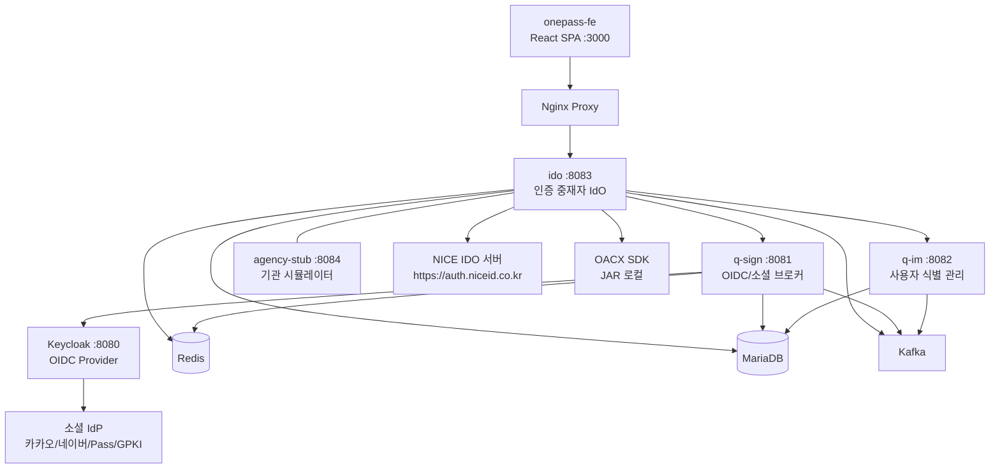
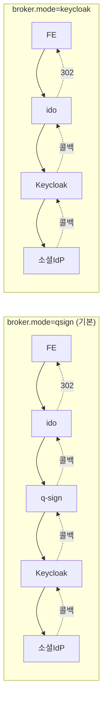
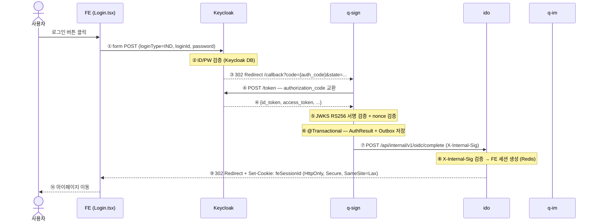
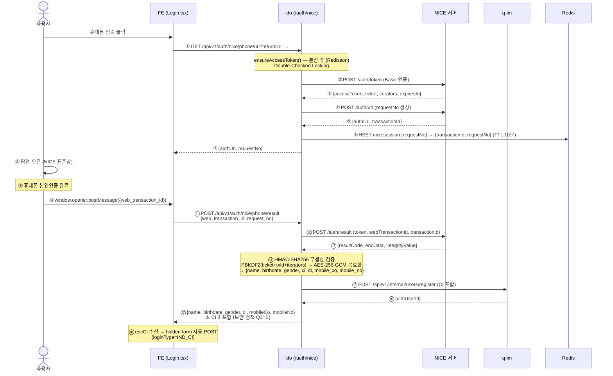
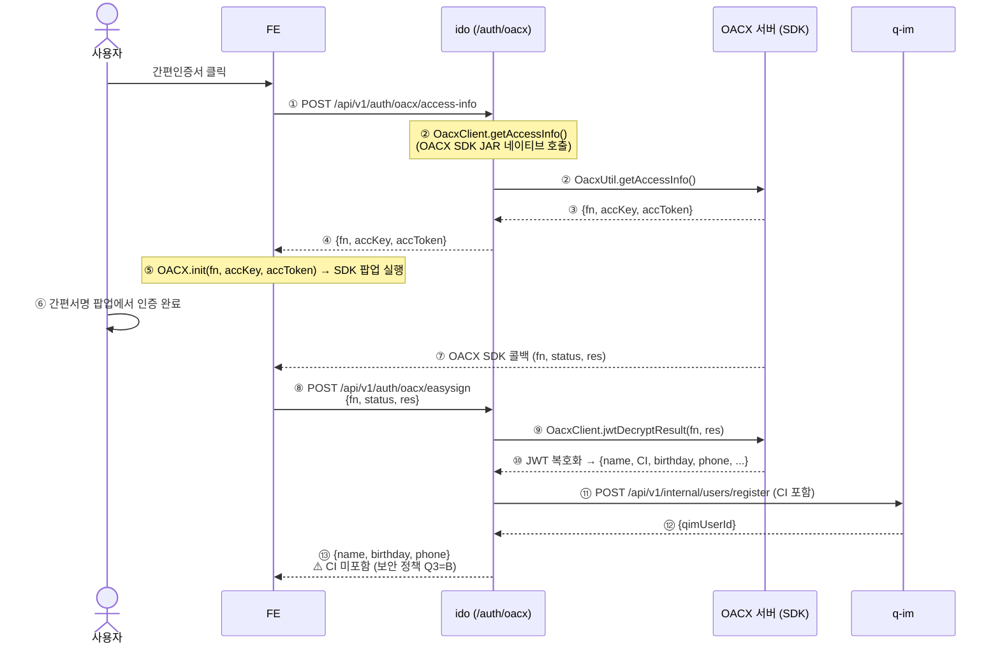
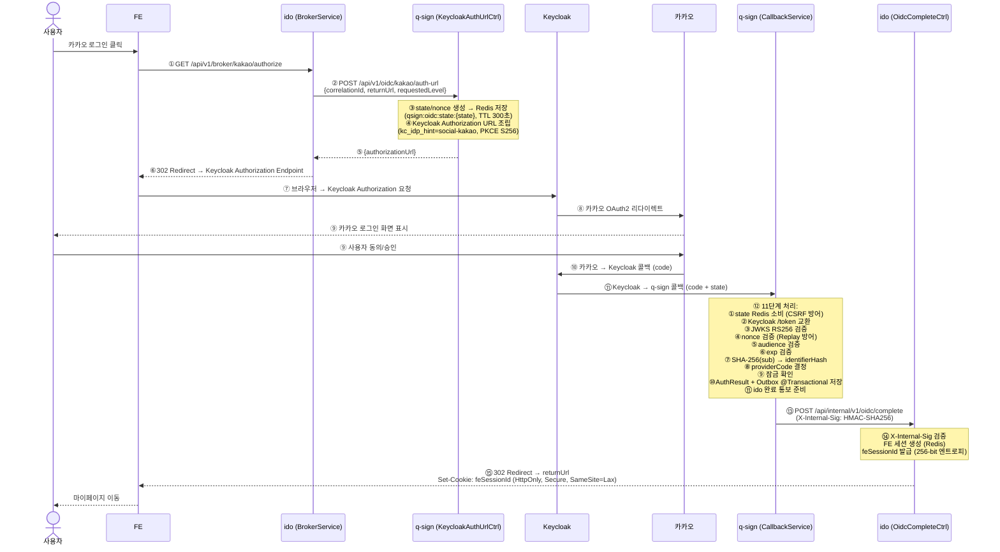
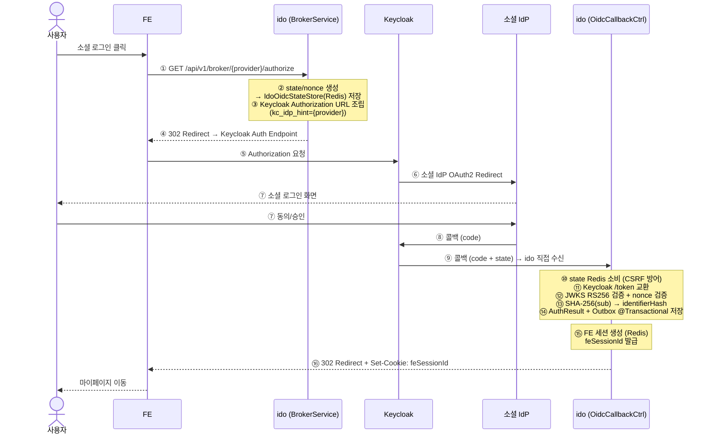

# 로그인 데이터 흐름 (A→Z 완전 추적)

**문서 번호**: FLOW-2026-001  
**버전**: 1.1  
**작성일**: 2026-05-11  
**최종 수정**: 2026-05-11  
**작성자**: AI 코드 분석 시스템  
**분류**: 내부 기술 문서 / 데이터 흐름

> **변경 이력**
> - v1.0 (2026-05-11): 최초 작성
> - v1.1 (2026-05-11): 전체 시퀀스 다이어그램 Mermaid 변환, keycloak 모드 시퀀스 추가, FE 세션 생성 공통 흐름 다이어그램 추가, 시스템 구성도 Mermaid 변환

---

## 목차

1. [개요](#1-개요)
2. [로그인 유형 분류](#2-로그인-유형-분류)
3. [A. 개인회원 ID/PW 로그인 흐름](#3-a-개인회원-idpw-로그인-흐름)
4. [B. 개인회원 NICE 휴대폰 인증 로그인 흐름](#4-b-개인회원-nice-휴대폰-인증-로그인-흐름)
5. [C. 개인회원 OACX 간편인증서 로그인 흐름](#5-c-개인회원-oacx-간편인증서-로그인-흐름)
6. [D. 소셜 로그인 흐름 (qsign 모드 — 카카오/네이버 등)](#6-d-소셜-로그인-흐름-qsign-모드)
7. [E. 소셜 로그인 흐름 (keycloak 모드)](#7-e-소셜-로그인-흐름-keycloak-모드)
8. [FE 세션 생성 공통 흐름](#8-fe-세션-생성-공통-흐름)
9. [SLO (로그아웃) 흐름](#9-slo-로그아웃-흐름)
10. [데이터 상태 및 저장소 요약](#10-데이터-상태-및-저장소-요약)
11. [보안 검증 체계](#11-보안-검증-체계)
12. [오류 처리 흐름](#12-오류-처리-흐름)

---

## 1. 개요

### 1.1 시스템 구성



### 1.2 아키텍처 결정 (ADR-001)

**IdO 완전 중재 패턴**: FE는 직접 Keycloak이나 소셜 IdP를 호출하지 않는다.  
모든 인증 요청은 ido를 경유한다.



---

## 2. 로그인 유형 분류

| 유형 | 진입 방법 | 처리 경로 | 상태 |
|------|-----------|-----------|------|
| A. 개인회원 ID/PW | Keycloak Login 폼 POST | Keycloak 직접 처리 → q-sign callback | 운영 가능 |
| B. 개인회원 NICE 휴대폰 | NICE 팝업 → FE postMessage | FE → ido(/auth/nice) → NICE 서버 | 운영 가능 |
| C. 개인회원 OACX 간편인증서 | OACX SDK 팝업 | FE → ido(/auth/oacx) → OACX 서버 | 운영 가능 |
| D. 기업회원 EzAuth | EzAuth SDK 팝업 | FE form POST → Keycloak → q-sign | 운영 가능 |
| E. 소셜 로그인 (qsign) | FE → ido → q-sign | q-sign → Keycloak → callback | 운영 가능 |
| F. 소셜 로그인 (keycloak) | FE → ido → Keycloak | Keycloak 직접 | 설정으로 전환 |

---

## 3. A. 개인회원 ID/PW 로그인 흐름

### 3.1 전체 시퀀스



### 3.2 각 단계 상세 설명

#### ① FE Login.tsx — form POST 전송

**파일**: `idem-console/frontend/src/pages/Login/index.tsx`

```tsx
// useKeycloakParams()로 URL 쿼리에서 action_url 파싱
const { actionUrl } = useKeycloakParams();
// actionUrl: 예) http://keycloak/realms/smes/login-actions/authenticate?session=...

// hidden form으로 POST 전송
<form ref={memberFormRef} method="POST" action={actionUrl || ''} style={{ display: 'none' }}>
  <input type="hidden" name="loginType" value="IND" />
  <input type="hidden" name="loginId" value={id} />
  <input type="hidden" name="password" value={password} />
</form>
```

**전달 데이터**:
```
POST {actionUrl}
Content-Type: application/x-www-form-urlencoded

loginType=IND
loginId={사용자아이디}
password={비밀번호}
```

> **⚠️ 주의**: `actionUrl`은 Keycloak이 사전에 생성하여 FE에 주입한 URL이다.  
> FE가 이 URL을 어떻게 받는지는 초기 로그인 페이지 렌더링 시 Keycloak이 주입하는 방식이다.  
> `useKeycloakParams()`는 URL 쿼리파라미터 `?action_url=...`에서 읽는다.

#### ② Keycloak — 자격증명 검증

Keycloak이 `loginId` + `password`를 내부 사용자 저장소(LDAP 또는 Keycloak DB)에서 검증한다.

#### ③ Keycloak → q-sign 리다이렉트 (Authorization Code)

```
HTTP 302 Location: http://idem-gate/api/v1/oidc/keycloak/callback
  ?code={authorization_code}
  &state={state_값}
  &session_state={session_state}
```

#### ④~⑥ q-sign: KeycloakCallbackService 11단계 처리

**파일**: `idem-gate/.../keycloak/KeycloakCallbackService.java`

```java
// 1단계: state Redis 소비 (CSRF 방어)
Optional<KeycloakStateEntry> stateEntry = stateStore.consumeAndValidate(state);
if (stateEntry.isEmpty()) throw new InvalidStateException();

// 2단계: Keycloak POST /token — authorization_code 교환
Map<String, Object> tokenResponse = keycloakClient.exchangeCode(code, pkceVerifier);
String idToken = (String) tokenResponse.get("id_token");

// 3단계: JWKS RS256 서명 검증
jwtVerifier.verify(idToken, keycloakProperties.getJwksUri());

// 4단계: nonce 검증 (Replay 공격 방어)
String tokenNonce = jwtParser.extractClaim(idToken, "nonce");
if (!stateEntry.get().getNonce().equals(tokenNonce)) throw new InvalidNonceException();

// 5단계: audience 검증
String audience = jwtParser.extractClaim(idToken, "aud");
if (!keycloakProperties.getClientId().equals(audience)) throw new InvalidAudienceException();

// 6단계: exp 검증
long exp = jwtParser.extractExpiration(idToken);
if (Instant.now().isAfter(Instant.ofEpochSecond(exp))) throw new TokenExpiredException();

// 7단계: SHA-256(sub) → identifierHash (PII 비보관)
String sub = jwtParser.extractClaim(idToken, "sub");
String identifierHash = sha256HexOf(sub);

// 8단계: providerCode 결정 (stateEntry의 provider → KakaoSocial, NaverSocial 등)
String providerCode = resolveProviderCode(stateEntry.get().getProvider());

// 9단계: 잠금 확인 (Redisson 분산 락)

// 10단계: @Transactional - AuthResult + Outbox 저장
AuthResult authResult = AuthResult.builder()
    .authResultId(UuidV7.generate())
    .identifierHash(identifierHash)
    .providerCode(providerCode)
    .correlationId(correlationId)
    .build();
authResultRepository.save(authResult);
outboxService.publishInTx(new AuthEvent(...));

// 11단계: ido에 완료 통보
notifyIdoAndGetRedirect(authResult, stateEntry.get());
```

#### ⑦ q-sign → ido: 완료 통보 (X-Internal-Sig HMAC 검증)

**파일**: `idem-gate/.../keycloak/KeycloakCallbackService.java`

```java
// HMAC-SHA256 내부 서명 생성
String sig = buildInternalSig(correlationId);
// 페이로드: {correlationId}:{epochSeconds}
// 키: application.properties의 qsign.internal-sig-secret

POST http://idem-hub/api/internal/v1/oidc/complete
X-Internal-Sig: {hmac_sha256_signature}
X-Correlation-Id: {correlationId}
Content-Type: application/json

{
  "authResultId": "{uuid_v7}",
  "identifierHash": "{sha256_of_sub}",
  "providerCode": "KakaoSocial",
  "correlationId": "{correlationId}",
  "returnUrl": "{기관_redirect_url}"
}
```

#### ⑧ ido: OidcCompleteController — FE 세션 생성

**파일**: `idem-hub/.../broker/OidcCompleteController.java`

```java
// X-Internal-Sig 검증
verifyInternalSig(request.getHeader("X-Internal-Sig"), body.getCorrelationId());

// PoC 주석: "identifierHash를 qimUserId 대용으로 사용, 실운영: Q-IM 조회 필요"
// ⚠️ 현재 미완성: q-im 조회 없이 identifierHash를 qimUserId로 사용 중
String qimUserId = body.getIdentifierHash();

// FE 세션 생성
FeSession session = feSessionService.create(
    qimUserId,
    body.getAuthResultId(),
    "L1",
    body.getReturnUrl()
);
```

#### ⑨ ido → FE: feSessionId 쿠키 + 302 리다이렉트

```
HTTP 302 Location: {returnUrl}
Set-Cookie: feSessionId={session_id}; Path=/; HttpOnly; Secure; SameSite=Lax; Max-Age=1800
Content-Type: application/json

{
  "redirectUrl": "{returnUrl}"
}
```

**feSessionId 쿠키 속성**:
- `HttpOnly`: JavaScript에서 접근 불가 (XSS 방어)
- `Secure`: HTTPS에서만 전송
- `SameSite=Lax`: CSRF 방어
- `Max-Age=1800`: 30분 (슬라이딩 TTL, Redis에서 갱신)

#### ⑩ FE 세션 Redis 저장 구조

**파일**: `idem-hub/.../fe/session/FeSessionServiceImpl.java`

```
Redis Keys:
  fe:session:{feSessionId}  → FeSession {
    feSessionId, qimUserId, authResultId, authLevel,
    createdAt, lastActivityAt, absoluteExpiresAt,
    returnUrl, advisoryFlag
  }
  TTL: 30분 (sliding), 절대 만료: 480분

  fe:user-sessions:{qimUserId}  → Set<feSessionId>
  TTL: 480분 (절대 만료와 동일)
```

---

## 4. B. 개인회원 NICE 휴대폰 인증 로그인 흐름

### 4.1 전체 시퀀스



### 4.2 각 단계 상세 설명

#### ① FE → ido: NICE URL 요청

**파일**: `idem-console/frontend/src/hooks/useNicePhoneAuth.ts` (호출부)  
**파일**: `idem-hub/.../auth/controller/AuthController.java`  
**파일**: `idem-hub/.../auth/service/NiceAuthService.java`

```
GET /api/v1/auth/nice/phone/url?returnUrl={returnUrl}
```

#### ② Access Token 확보 (분산 락 적용)

`NiceAuthService.ensureAccessToken()`:
1. Redis 캐시에 유효한 토큰 있으면 즉시 반환 (락 없음)
2. Redisson tryLock 획득 (최대 3초 대기, 10초 만료)
3. Double-Checked Locking: 락 획득 후 재확인
4. NICE POST /auth/token (Basic 인증) 호출
5. 응답 저장: `{accessToken, ticket, iterators, expiresIn}`
6. 락 해제

```
Redis Key: ido:lock:nice-token-refresh
```

#### ③~⑤ NICE URL 발급

```java
String requestNo = makeRequestNo(); // REQ_{yyyyMMddHHmmss}{uuid12자리}
NiceUrlApiResponse urlResponse = niceApiClient.requestAuthUrl(token, requestNo, effectiveReturnUrl);
// 응답: { authUrl, transactionId, requestNo }
```

#### ⑥ Redis 세션 저장

```
Redis Key: nice:session:{requestNo}
Value: NiceAuthSession { transactionId, requestNo }
TTL: 설정값 (기본 10분)
```

#### ⑦ FE 응답

```json
{
  "resultCode": "2000",
  "authUrl": "https://nice.checkplus.co.kr/...",
  "requestNo": "REQ_20260511123456abc123456789"
}
```

#### ⑧ 팝업 오픈 및 NICE 인증

FE가 `authUrl`로 팝업 창을 열고, 사용자가 NICE 표준창에서 휴대폰 본인인증을 완료한다.

#### ⑨~⑩ NICE 팝업 완료 → postMessage

NICE 팝업이 완료되면 `window.opener.postMessage`로 `web_transaction_id`를 전달한다.

#### ⑪ FE → ido: 결과 조회

```
POST /api/v1/auth/nice/phone/result
Content-Type: application/json

{
  "web_transaction_id": "{web_txn_id}",
  "request_no": "{requestNo}"
}
```

#### ⑫~⑬ NICE 결과 API 호출

```java
NiceAuthSession session = sessionStore.find(requestNo);
NiceResultApiResponse result = niceApiClient.requestAuthResult(
    token, webTransactionId, session.transactionId(), session.requestNo());
// 응답: { resultCode, encData, integrityValue }
```

#### ⑭ HMAC 검증 + AES-GCM 복호화

`NiceAuthService.decryptAndVerify()`:
```java
// 1. PBKDF2WithHmacSHA256으로 키 파생 (ticket + transactionId + iterators)
String keyString = NiceCryptoUtil.deriveKey(token.ticket(), transactionId, token.iterators());

// 2. 키 분리 (AES 키: 0~31자, HMAC 키: 48~79자)
byte[] aesKey = NiceCryptoUtil.extractAesKey(keyString);
String hmacKey = NiceCryptoUtil.extractHmacKey(keyString);

// 3. HMAC-SHA256 무결성 검증
String calculated = NiceCryptoUtil.hmacSha256Base64Url(response.getEncData(), hmacKey);
if (!calculated.equals(response.getIntegrityValue())) throw new DataIntegrityException();

// 4. AES-256-GCM 복호화
String decrypted = NiceCryptoUtil.aesGcmDecrypt(aesKey, response.getEncData());
Map<String, Object> resultMap = objectMapper.readValue(decrypted, ...);
```

복호화 결과 필드: `{ name, birthdate, gender, national_info, ci, di, mobile_co, mobile_no }`

#### ⑮~⑯ CI → Q-IM 등록 (S7-T6)

```java
// CI는 Q3=B 결정에 의해 FE 미반환 — Q-IM에만 전달
String ci = (String) resultMap.get("ci");
AuthResult authResult = AuthResult.builder()
    .ci(ci).di(...).name(...).birthday(...).gender(...).mobile(...).build();
QimRegisterResponse registerResult = imApiOutPort.register(authResult, correlationId);
// Q-IM POST /api/v1/internal/users/register
// → SHA-256(CI) → identifierHash 계산 → 기존 사용자 조회 or 신규 생성
// → qimUserId 반환
```

#### ⑰ FE 응답 (CI 제외 — Q3=B)

```json
{
  "resultCode": "2000",
  "resultData": {
    "name": "홍길동",
    "birthdate": "19900101",
    "gender": "M",
    "nationalInfo": "내국인",
    "di": "{di값}",
    "mobileCo": "SKT",
    "mobileNo": "01012345678"
  }
}
```

> **⚠️ CI는 FE에 절대 반환되지 않는다** (보안 정책 Q3=B).

#### ⑱ FE: encCi 수신 후 form 자동 POST

```tsx
// useNicePhoneAuth 콜백
if (result.resultCode === '2000') {
  setEncCi(result.ci || '');
}

// useEffect로 form 자동 제출
useEffect(() => {
  if (encCi && actionUrl && easyAuthFormRef.current) {
    easyAuthFormRef.current.submit();
  }
}, [encCi, actionUrl]);

// hidden form
<form ref={easyAuthFormRef} method="POST" action={actionUrl}>
  <input type="hidden" name="loginType" value="IND_CI" />
  <input type="hidden" name="encCi" value={encCi} />
</form>
```

---

## 5. C. 개인회원 OACX 간편인증서 로그인 흐름

### 5.1 전체 시퀀스



### 5.2 OACX 플로우 단계 요약

| 단계 | API | 설명 |
|------|-----|------|
| 1 | `POST /api/v1/auth/oacx/access-info` | OACX SDK 초기화용 접근키 발급 |
| 2 | OACX SDK 팝업 | `fn=simpleAuth`로 간편서명 팝업 실행 |
| 3 | `POST /api/v1/auth/oacx/easysign` | SDK 콜백 데이터 서버 처리 |
| 4 | CI → Q-IM 등록 | NICE 흐름과 동일하게 Q-IM에 CI 전달 |

**보안 정책 Q3=B**: CI는 FE 미반환 (`OacxEasysignResponse`에 ci 필드 없음)

---

## 6. D. 소셜 로그인 흐름 (qsign 모드)

### 6.1 전체 시퀀스 (카카오 예시)



### 6.2 BrokerService 처리 (qsign 모드)

**파일**: `idem-hub/.../broker/BrokerService.java`

```java
// broker.mode=qsign
String qsignUrl = qsignBaseUrl + "/api/v1/oidc/" + provider + "/auth-url";
Map<String, String> body = Map.of(
    "correlationId", correlationId,
    "returnUrl", returnUrl,
    "requestedLevel", requestedLevel
);
// X-Internal-Caller: ido 헤더 추가
// ⚠️ 현재 PoC: X-Internal-Sig = "sig-" + correlationId.substring(0,8) (운영 전 HMAC-SHA256으로 교체 필요)
String authUrl = qsignClient.post(qsignUrl, body);
return ResponseEntity.status(302).header("Location", authUrl).build();
```

### 6.3 KeycloakAuthUrlController 처리

**파일**: `idem-gate/.../keycloak/KeycloakAuthUrlController.java`

```java
// state/nonce 생성 및 Redis 저장
KeycloakStateEntry stateEntry = stateStore.create(correlationId, returnUrl, requestedLevel, provider);

// Keycloak Authorization URL 조립
String authUrl = buildKeycloakAuthUrl(stateEntry, idpHint);
// URL 구조:
// {keycloak.authorizationEndpoint}
//   ?response_type=code
//   &client_id={q-sign-client}
//   &redirect_uri={qsign.keycloak.redirectUri}
//   &scope=openid+profile+email
//   &state={state}
//   &nonce={nonce}
//   &kc_idp_hint={social-kakao|social-naver|...}
```

**Redis 저장**:
```
Key: qsign:oidc:state:{state}
Value: KeycloakStateEntry JSON {
  state, nonce, correlationId, returnUrl, requestedLevel, provider
}
TTL: qsign.keycloak.state-ttl-seconds (기본 300초)
```

### 6.4 Kafka Outbox 이벤트 (q-sign → Kafka)

`KeycloakCallbackService` 10단계에서 AuthResult 저장 시 Outbox 등록:

```json
// Kafka 토픽: qsign.auth.events
// Event Type: TYPE_AUTH_COMPLETED
{
  "eventType": "TYPE_AUTH_COMPLETED",
  "sourceService": "q-sign",
  "correlationId": "{correlationId}",
  "qimUserId": null,          // q-sign은 qimUserId 모름
  "eventVersion": 1,
  "authResultId": "{uuid_v7}",
  "identifierHash": "{sha256_of_sub}",
  "providerCode": "KakaoSocial",
  "timestamp": "2026-05-11T..."
}
```

---

## 7. E. 소셜 로그인 흐름 (keycloak 모드)

### 7.1 전체 시퀀스



**qsign 모드와 주요 차이점**:

| 항목 | qsign 모드 | keycloak 모드 |
|------|-----------|---------------|
| state/nonce 관리 | q-sign (Redis) | ido 직접 (Redis) |
| Keycloak 콜백 수신 | q-sign | ido |
| JWKS 검증 | q-sign | ido |
| HMAC 서명 (→ ido 통보) | q-sign → ido | 불필요 (ido가 직접 처리) |
| Outbox 저장 | q-sign DB | ido DB |
| 설정 | `broker.mode=qsign` | `broker.mode=keycloak` |

---

## 8. FE 세션 생성 공통 흐름

모든 로그인 방식 (A~E)이 최종적으로 이 흐름을 거친다.

### 8.0 FE 세션 생성 공통 시퀀스

```mermaid
sequenceDiagram
    participant TRIGGER as 인증 완료 트리거<br/>(q-sign 또는 ido)
    participant IDO as ido (FeSessionServiceImpl)
    participant RDS as Redis
    participant FE as FE / 브라우저

    TRIGGER->>IDO: 인증 완료 통보 (qimUserId, authResultId, authLevel, returnUrl)
    note over IDO: 256-bit 엔트로피 세션 ID 생성<br/>SecureRandom(32 bytes) → Base64URL
    IDO->>RDS: SET fe:session:{feSessionId} = FeSession JSON<br/>EX 1800 (30분 sliding)
    IDO->>RDS: SADD fe:user-sessions:{qimUserId} {feSessionId}<br/>EXPIRE fe:user-sessions:{qimUserId} 28800 (480분)
    IDO-->>FE: 302 Redirect → returnUrl<br/>Set-Cookie: feSessionId={id}; HttpOnly; Secure; SameSite=Lax; Max-Age=1800

    note over FE: 이후 모든 API 요청에 feSessionId 쿠키 자동 포함
    FE->>IDO: API 요청 (withCredentials: true)
    IDO->>RDS: GET fe:session:{feSessionId} → 세션 조회
    note over IDO: absoluteExpiresAt 확인 (480분 절대 만료)<br/>lastActivityAt 갱신 + TTL 1800초 재설정
```

### 8.1 FeSessionServiceImpl 세션 생성

**파일**: `idem-hub/.../fe/session/FeSessionServiceImpl.java`

```java
// 256-bit 엔트로피 세션 ID 생성
byte[] bytes = new byte[32];
SECURE_RANDOM.nextBytes(bytes);
String sessionId = Base64.getUrlEncoder().withoutPadding().encodeToString(bytes);

// 세션 객체 생성
FeSession session = FeSession.builder()
    .feSessionId(sessionId)
    .qimUserId(qimUserId)
    .authResultId(authResultId)
    .authLevel(authLevel)           // "L1", "L2", "L3"
    .createdAt(now)
    .lastActivityAt(now)
    .absoluteExpiresAt(now.plus(480분))  // 절대 만료
    .returnUrl(returnUrl)
    .advisoryFlag(false)
    .build();

// Redis 저장
// 1. 세션 본체 (슬라이딩 TTL)
redisTemplate.opsForValue().set(
    "fe:session:" + sessionId, session, Duration.ofMinutes(30));

// 2. 사용자별 세션 역인덱스 (무효화 지원)
redisTemplate.opsForSet().add("fe:user-sessions:" + qimUserId, sessionId);
redisTemplate.expire("fe:user-sessions:" + qimUserId, Duration.ofMinutes(480));
```

### 8.2 세션 Sliding TTL 갱신

API 요청마다 `FeSessionService.refresh()` 호출:
```java
redisTemplate.opsForValue().set(key, updated, Duration.ofMinutes(slidingTtlMinutes));
```

### 8.3 절대 만료 확인

```java
public boolean isAbsoluteExpired() {
    return absoluteExpiresAt != null && Instant.now().isAfter(absoluteExpiresAt);
}
// findById()에서 절대 만료 시 자동 expire() 호출
```

---

## 9. SLO (로그아웃) 흐름

### 9.1 SLO 시퀀스

```mermaid
sequenceDiagram
    actor 사용자
    participant FE as FE
    participant IDO as ido (/slo)
    participant KC as Keycloak
    participant KF as Kafka (Outbox)
    participant RDS as Redis

    사용자->>FE: 로그아웃 버튼 클릭
    FE->>IDO: POST /api/v1/slo/initiate<br/>(feSessionId 쿠키 자동 포함)

    IDO->>RDS: ① DEL fe:session:{feSessionId}<br/>DEL fe:user-sessions:{qimUserId} 항목 제거
    IDO->>KC: ② Keycloak 세션 종료 (Back-channel logout)
    IDO->>KF: ③ 기관 로그아웃 Webhook — Outbox 적재<br/>(Transactional Outbox 패턴)
    note over IDO: ④ 감사 로그 기록

    IDO-->>FE: 204 No Content<br/>Set-Cookie: feSessionId=; Max-Age=0 (쿠키 제거)
    FE-->>사용자: ⑤ 로그인 페이지로 이동
```

**파일**: `idem-console/frontend/src/api/feSession.ts`

```typescript
export const initiateSlo = async () => {
  await axios.post('/api/v1/slo/initiate', {}, { withCredentials: true });
};
```

### 9.2 사용자별 일괄 무효화

```java
// FeSessionServiceImpl.invalidateByQimUserId()
// 보안 이벤트(탈퇴, 정지 등) 발생 시 해당 사용자의 모든 세션 무효화
Set<Object> sessionIds = redisTemplate.opsForSet().members("fe:user-sessions:" + qimUserId);
for (Object sid : sessionIds) {
    redisTemplate.delete("fe:session:" + sid);
}
redisTemplate.delete("fe:user-sessions:" + qimUserId);
```

---

## 10. 데이터 상태 및 저장소 요약

### 10.1 Redis 저장 구조 전체

| Key 패턴 | 저장 데이터 | TTL | 용도 |
|----------|------------|-----|------|
| `qsign:oidc:state:{state}` | KeycloakStateEntry JSON | 300초 | CSRF 방어, 1회 소비 |
| `qsign:pkce:challenge:{state}` | `{method}:{challenge}` | 300초 | PKCE 검증, 1회 소비 |
| `fe:session:{feSessionId}` | FeSession JSON | 30분 (sliding) | FE 세션 |
| `fe:user-sessions:{qimUserId}` | Set<feSessionId> | 480분 | 사용자별 세션 역인덱스 |
| `nice:session:{requestNo}` | NiceAuthSession | 설정값 | NICE 인증 세션 |
| `ido:lock:nice-token-refresh` | Redisson Lock | 10초 (lease) | NICE 토큰 분산 락 |
| `nice:token:*` | NiceTokenSnapshot | expiresIn - 60초 | NICE Access Token |
| `ido:idempotency:{key}` | HandoffTicket | 1일 | Handoff 멱등성 |

### 10.2 DB 저장 구조

| 테이블 | 저장 데이터 | 비고 |
|--------|-----------|------|
| `auth_result` | authResultId, identifierHash, providerCode, correlationId | q-sign DB |
| `outbox` | 이벤트 레코드 (Transactional Outbox) | 각 서비스 DB |
| `handoff_ticket` | ticketId, qimUserId, state, encryptedPayload | ido DB |
| `qim_user` | qimUserId, status, eventVersion | q-im DB |
| `user_profile` | nameMasked, mobileMasked, ci(암호화), diMap | q-im DB |
| `auth_mean_mapping` | providerCode, identifierHash | q-im DB |
| `user_status_history` | 상태 변경 이력 | q-im DB |

### 10.3 데이터 생명주기

```
인증 시작
  └→ state/nonce 생성 (Redis, TTL 300초)
  └→ 사용자 인증 완료
      └→ state 소비 (Redis 삭제)
      └→ AuthResult 저장 (DB 영구)
      └→ AuthEvent 발행 (Kafka → 소비자)
      └→ FE 세션 생성 (Redis, 슬라이딩 30분)
          └→ 요청마다 TTL 갱신
          └→ 절대 만료 480분
          └→ SLO 시 즉시 삭제
          └→ 탈퇴/정지 시 일괄 삭제
```

---

## 11. 보안 검증 체계

### 11.1 CSRF 방어

- **state 파라미터**: UUID v4, Redis에 TTL 300초로 저장
- **1회 소비**: `consumeAndValidate()`에서 GET 후 즉시 DELETE
- **검증 실패 시**: 에러 페이지 리다이렉트

### 11.2 Replay 공격 방어

- **nonce**: state와 함께 Redis 저장, ID Token 클레임과 비교
- **ID Token exp**: 만료 시각 검증
- **audience**: `aud == clientId` 검증

### 11.3 PKCE (RFC 7636)

- **code_verifier**: FE가 생성 (S256 방식)
- **code_challenge**: `BASE64URL(SHA-256(code_verifier))`
- **Redis 저장**: `qsign:pkce:challenge:{state}`, 1회 소비

### 11.4 내부 서비스 간 서명

| 방향 | 방법 | 상태 |
|------|------|------|
| q-sign → ido | HMAC-SHA256(`correlationId:epochSeconds`, secret) | ✅ 완성 |
| ido → q-sign | `"sig-" + correlationId.substring(0,8)` | ⚠️ PoC 수준 |

### 11.5 PII 보호

- **identifierHash**: SHA-256(sub) — 원문 미보관
- **CI**: AES-256-GCM 암호화 저장 (q-im DB), FE 미반환
- **이름/전화번호**: 마스킹 저장 (`홍*동`, `010-****-5678`)

---

## 12. 오류 처리 흐름

### 12.1 q-sign 콜백 오류

```java
// KeycloakCallbackController.java
@ExceptionHandler(Exception.class)
String handleError(Exception e) {
    // → /error?code={error_code} 리다이렉트
}
```

### 12.2 FE 오류 표시

```tsx
// Login.tsx
useEffect(() => {
  if (actionUrl && error && code) {
    const message = ERROR_MESSAGES[code] || `로그인 오류 (${code})`;
    setErrorModal(true);
  }
}, [actionUrl, error, code]);
```

### 12.3 주요 오류 코드

| 코드 | 원인 | 처리 |
|------|------|------|
| `INVALID_STATE` | state 없음/만료/재사용 | 오류 페이지 |
| `INVALID_NONCE` | nonce 불일치 (위변조 의심) | 오류 페이지 |
| `TOKEN_EXPIRED` | ID Token 만료 | 재인증 안내 |
| `INVALID_AUDIENCE` | audience 불일치 | 오류 페이지 |
| `5003` | NICE HMAC 무결성 실패 | 오류 반환 |
| `5010` | Q-IM 등록 실패 | 오류 반환 |

---

*본 문서는 integration-sso 전체 코드베이스 완전 분석을 바탕으로 작성되었습니다.*  
*코드 수정 시 반드시 이 문서도 함께 업데이트하세요.*
