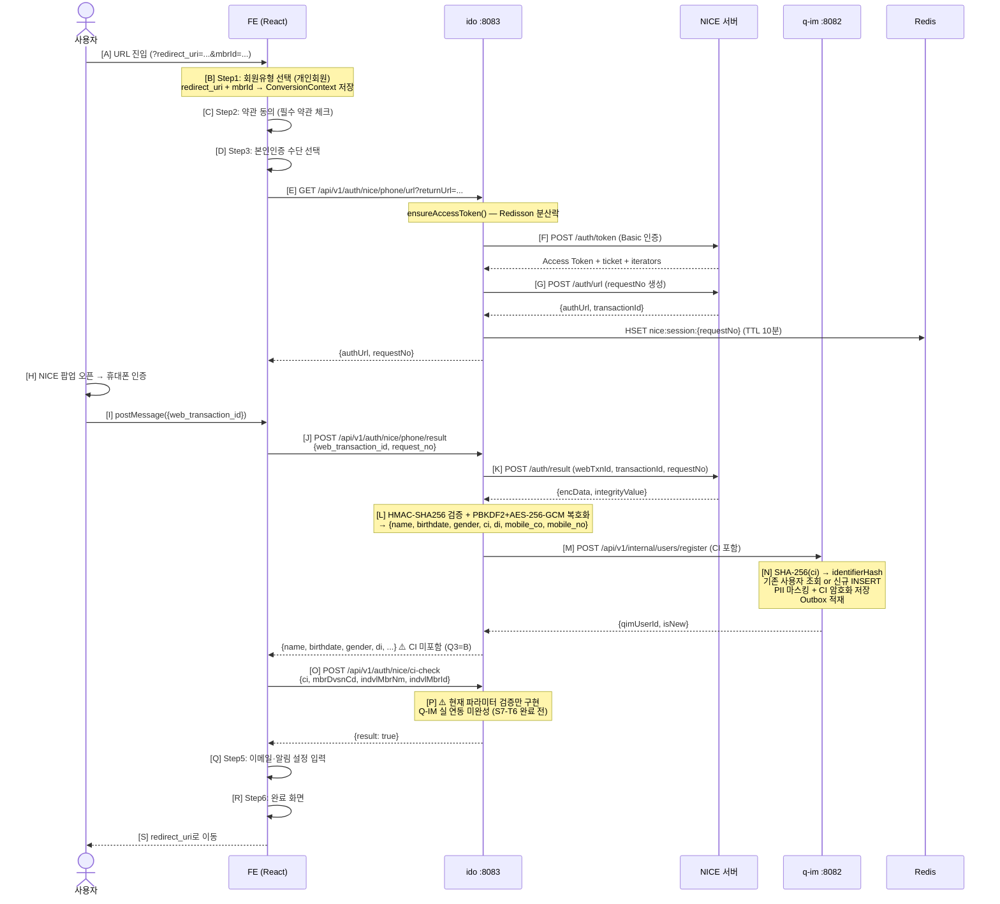
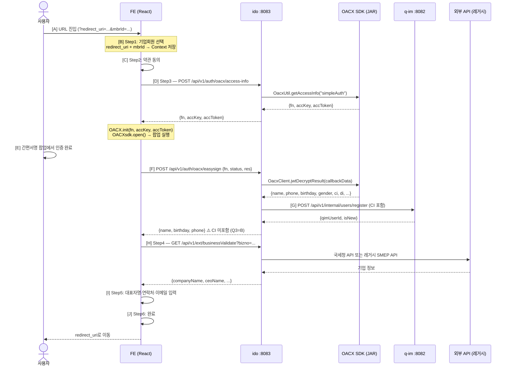
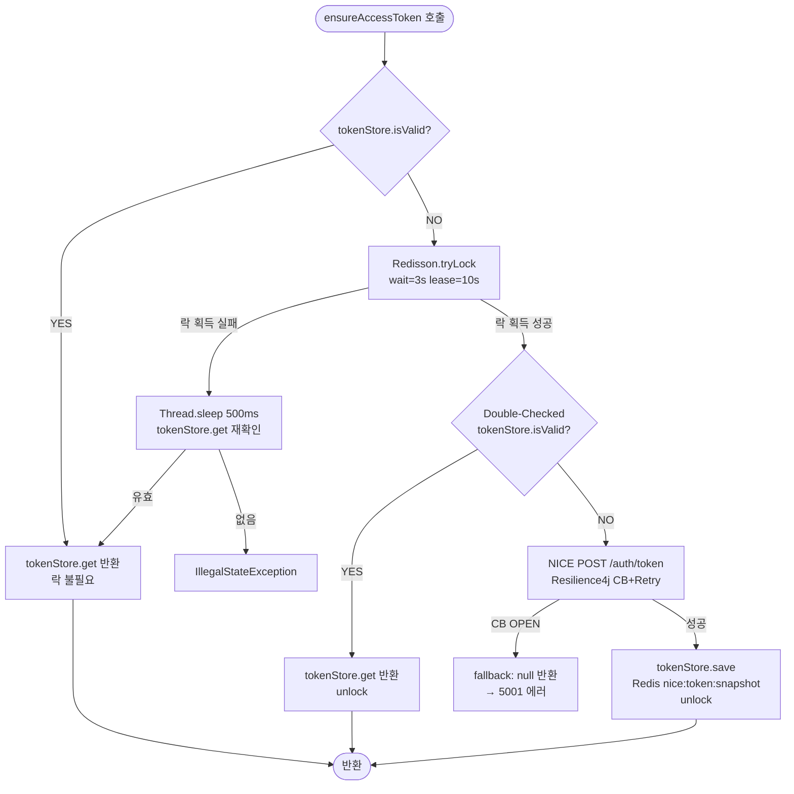
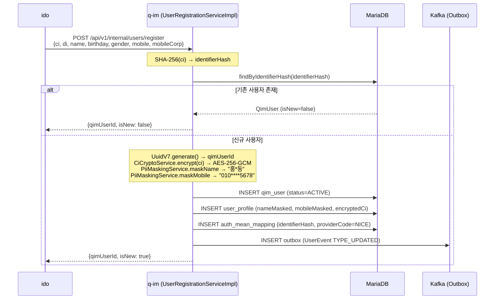

# 회원 전환(신규 가입) 데이터 흐름 (A→Z 완전 추적)

**문서 ID**: FLOW-2026-002  
**버전**: v1.1  
**작성일**: 2026-05-11  
**최종 수정**: 2026-05-11  
**작성자**: AI 분석 (GenSpark)  
**대상 독자**: 개발팀, 운영팀  

> **변경 이력**
> - v1.0 (2026-05-11): 최초 작성
> - v1.1 (2026-05-11): 개인/기업 전환 시퀀스 Mermaid 변환, Step 흐름 다이어그램 추가, 누락 내용 보완

---

## 목차

1. [회원 전환 개요](#1-회원-전환-개요)
2. [FE 라우트 구조](#2-fe-라우트-구조)
3. [개인 회원 전환 흐름 (A→Z)](#3-개인-회원-전환-흐름-az)
4. [기업 회원 전환 흐름 (A→Z)](#4-기업-회원-전환-흐름-az)
5. [NICE 휴대폰 본인인증 상세 흐름](#5-nice-휴대폰-본인인증-상세-흐름)
6. [CI 처리 및 Q-IM 등록 흐름](#6-ci-처리-및-q-im-등록-흐름)
7. [DB 변경 전체 목록](#7-db-변경-전체-목록)
8. [Kafka 이벤트 발행 목록](#8-kafka-이벤트-발행-목록)
9. [미구현 항목 및 주의사항](#9-미구현-항목-및-주의사항)

---

## 1. 회원 전환 개요

**회원 전환**이란 기존 SMEP(중소기업 통합관리 플랫폼) 회원이 "중기원패스" 통합회원으로 전환하는 프로세스다.

```
전환 전: SMEP 기존 회원 (개별 서비스 계정)
전환 후: 중기원패스 통합회원 (feSessionId 발급, Q-IM 등록 완료)
```

**전환 흐름 진입점**:
- `redirect_uri` + `mbrId` 파라미터를 포함한 URL로 진입
- 파라미터 없으면 "잘못된 접근" 모달 표시

**핵심 기술**: NICE 휴대폰 본인인증 (CI 기반 신원 확인)

### 1.1 전환 vs 신규 가입 흐름 비교

| 항목 | 회원 전환 | 신규 가입 |
|------|-----------|-----------|
| 진입 URL | `/conversion/step1?redirect_uri=...&mbrId=...` | `/register/step1?type=member\|business` |
| mbrId 파라미터 | 필수 (기존 SMEP 회원 ID) | 없음 |
| Step 컴포넌트 | `ConversionMemberStep2~6` | 동일 컴포넌트 재사용 |
| Q-IM 처리 | Upsert (기존 계정 연결 가능) | 신규 생성 |
| 완료 후 이동 | `redirect_uri`로 이동 | 서비스 메인으로 이동 |

---

## 2. FE 라우트 구조

```
/conversion/step1         → ConversionStep1 (회원유형 선택)
/conversion/member/step2  → ConversionMemberStep2 (약관 동의)
/conversion/member/step3  → ConversionMemberStep3 (본인인증)
/conversion/member/step4  → ConversionMemberStep4 (기존 회원 확인)
/conversion/member/step5  → ConversionMemberStep5 (정보 입력)
/conversion/member/step6  → ConversionMemberStep6 (완료)
/conversion/member/step8  → ConversionMemberStep8 (추가 단계)

/conversion/business/step2 → ConversionBusinessStep2
/conversion/business/step3 → ConversionBusinessStep3
/conversion/business/step4 → ConversionBusinessStep4
/conversion/business/step5 → ConversionBusinessStep5
/conversion/business/step6 → ConversionBusinessStep6
```

**신규 가입도 동일 라우트 사용**:
```
/register/step1            → RegisterStep1 (회원유형 선택, type=member|business)
/register/member/step2 ~6  → 동일 컴포넌트 (ConversionMemberStep2~6)
/register/business/step2~6 → 동일 컴포넌트 (ConversionBusinessStep2~6)
```

**상태 관리**: `ConversionContext` Provider → useConversion() 훅

---

## 3. 개인 회원 전환 흐름 (A→Z)

### 3.1 전체 시퀀스



### 3.2 Step별 상세 설명

#### Step1 — 회원유형 선택

**파일**: `idem-console/frontend/src/pages/ConversionSteps/member/Step1.tsx`

```typescript
const params = new URLSearchParams(window.location.search);
const redirectUri = params.get('redirect_uri');
const mbrId = params.get('mbrId');

if (!redirectUri || !mbrId) {
    setMissingParams(true);  // "잘못된 접근" 모달 표시
    return;
}
updateData({ redirectUri, mbrId });
```

**상태 전이**: `ConversionContext`에 `{ redirectUri, mbrId, memberType }` 저장

#### Step2 — 약관 동의

- 서비스 이용 약관 (필수)
- 개인정보 처리방침 (필수)
- 마케팅 수신 동의 (선택)

API 호출: `GET /api/v1/terms-bundle` 또는 외부 API

#### Step3 — 본인인증 (NICE 휴대폰 인증)

> 상세 흐름은 [5절 NICE 휴대폰 본인인증 상세 흐름](#5-nice-휴대폰-본인인증-상세-흐름) 참조

```
FE → GET /api/v1/auth/nice/phone/url
   ← { authUrl, requestNo }
FE → 팝업 오픈 → 사용자 인증
   → postMessage 수신
FE → POST /api/v1/auth/nice/phone/result
   ← { name, birthdate, gender, nationalInfo, di, mobileCo, mobileNo }
   (* CI는 응답에 없음 — Q3=B 보안 정책)
```

#### Step4 — 기존 회원 확인 (ci-check)

**파일**: `idem-console/frontend/src/api/nice/ciCheck.ts`

```
POST /api/v1/auth/nice/ci-check
Body:
{
  "ci": {nice_result.ci},
  "mbrDvsnCd": "A101",
  "indvlMbrNm": "홍길동",
  "indvlMbrId": "user123"
}
```

> ⚠️ **미완성**: 현재 파라미터 검증 후 `{ result: true }` 반환만 구현.  
> S7-T6 완료 후 Q-IM API 연동 필요 (CI로 기존 회원 조회 → 전환 가능 여부 확인).

#### Step5 — 추가 정보 입력

NICE 인증으로 획득한 정보(이름, 생년월일 등)는 자동 채워진다. 사용자는 이메일, 알림 수신 설정 등을 입력한다.

#### Step6 — 회원 전환 완료

전환 완료 화면 표시 후 `redirectUri`로 이동.

> ⚠️ **갭**: 현재 전환 완료 후 FE 세션(feSessionId)이 자동 발급되지 않는다. 로그인 페이지를 별도로 거쳐야 한다. (운영 전 UX 정책 결정 필요)

---

## 4. 기업 회원 전환 흐름 (A→Z)

### 4.1 전체 시퀀스



### 4.2 기업 전환 특이사항

- `POST /api/v1/auth/callback` (AuthController의 기업 간편인증 콜백) 사용
- 현재 FE Step3 기업인증 코드에 "미구현" 주석 다수 존재 (Q2=B 상태)
- 통합인증 서버에 auth-check 요청하는 흐름

---

## 5. NICE 휴대폰 본인인증 상세 흐름

**파일**: `idem-hub/src/main/java/kr/go/smes/idem-hub/auth/service/NiceAuthService.java`

### 5.1 Access Token 획득 — 분산 락 상태 머신



### 5.2 인증 URL 발급

```java
String requestNo = "REQ_" + yyyyMMddHHmmss + UUID.substring(0, 12);
String effectiveReturnUrl = returnUrl != null ? returnUrl : defaultReturnUrl;

NiceUrlApiResponse urlResponse = niceApiClient.requestAuthUrl(
    token.accessToken(), requestNo, effectiveReturnUrl);

// Redis에 세션 저장 (requestNo → transactionId)
sessionStore.save(responseRequestNo, urlResponse.getTransactionId());
// 키: nice:session:{requestNo}
// TTL: 10분 (K8s 환경 Pod 분산 대응)
```

FE 응답:
```json
{
  "resultCode": "2000",
  "authUrl": "https://nice.checkplus.co.kr/...",
  "requestNo": "REQ_20260511090000abc123"
}
```

### 5.3 인증 결과 조회 및 복호화

```java
// 1. requestNo로 Redis 세션 조회
NiceAuthSession session = sessionStore.find(requestNo);

// 2. NICE 결과 조회 API 호출
NiceResultApiResponse result = niceApiClient.requestAuthResult(
    token.accessToken(), webTransactionId,
    session.transactionId(), session.requestNo());
// 응답: { resultCode, encData, integrityValue }

// 3. HMAC + AES-GCM 복호화
//   a) PBKDF2WithHmacSHA256으로 키 파생
//      keyString = NiceCryptoUtil.deriveKey(ticket, transactionId, iterators)
//   b) 키 분리
//      aesKey  = keyString[0..31]   (32바이트 = AES-256)
//      hmacKey = keyString[48..79]  (32바이트)
//   c) HMAC-SHA256 무결성 검증
//      calculated = HMAC-SHA256(encData, hmacKey) → Base64URL
//      calculated != integrityValue → DataIntegrityException (5003)
//   d) AES-256-GCM 복호화
//      decrypted = AES-GCM.decrypt(aesKey, encData)
//   e) JSON 파싱
//      { name, birthdate, gender, national_info, ci, di, mobile_co, mobile_no }

// 4. 세션 삭제 (1회성)
sessionStore.remove(session.requestNo());

// 5. CI → Q-IM 등록 (S7-T6)
QimRegisterResponse reg = imApiOutPort.register(authResult, correlationId);

// 6. FE에 응답 (CI 제외 — Q3=B)
```

---

## 6. CI 처리 및 Q-IM 등록 흐름

### 6.1 CI / DI 개념

| 항목 | 설명 | FE 반환 | DB 저장 |
|------|------|---------|---------|
| CI (연계정보) | 주민등록번호 기반 고유 식별자. 서비스 간 공유 불가 (법적 규제) | ❌ | AES-256-GCM 암호화 |
| DI (중복가입확인정보) | 기관(사이트)별 고유 식별자. 동일인 확인용으로 기관 제공 가능 | ✅ | JSON 맵 (기관별) |
| identifierHash | SHA-256(CI) — 원문 복원 불가 | ❌ | hex 문자열 |

### 6.2 Q-IM 등록 시퀀스



### 6.3 CI 보안 정책 (Q3=B)

| 데이터 | FE 반환 여부 | DB 저장 형태 | 목적 |
|---|---|---|---|
| CI (연계정보) | ❌ 미반환 | AES-256-GCM 암호화 | 본인 확인, 탈퇴 시 삭제 |
| identifierHash | ❌ 미반환 | SHA-256(CI) → hex | 동일인 조회 키 |
| DI (중복확인정보) | ✅ 반환 가능 | JSON 맵 (기관별) | 기관에 제공 |
| 이름 | ❌ 원문 미저장 | "홍*동" 마스킹 | 표시용 |
| 전화번호 | ❌ 원문 미저장 | "010****5678" 마스킹 | 표시용 |

---

## 7. DB 변경 전체 목록

### 회원 전환 완료 시 DB 변경 (q-im)

| 테이블 | 작업 | 내용 | 조건 |
|---|---|---|---|
| `qim_user` | INSERT | qimUserId, status=ACTIVE, eventVersion=1 | 신규 사용자만 |
| `user_profile` | INSERT | nameMasked, mobileMasked, ci(암호화), birthYear, gender, nationalityType | 신규 사용자만 |
| `auth_mean_mapping` | INSERT | mappingId, providerCode=NICE, identifierHash(SHA-256(CI)), status=ACTIVE | 신규 사용자만 |
| `outbox` | INSERT | eventType=USER_UPDATED, payload=JSON | 신규 사용자만 |

### NICE 인증 관련 DB 변경 (ido)

현재 NICE 인증 결과는 Redis 세션으로만 관리 (DB 저장 없음).  
감사 로그는 Kafka를 통해 별도 저장.

---

## 8. Kafka 이벤트 발행 목록

| 토픽 | 이벤트 타입 | 발행 시점 | 내용 |
|---|---|---|---|
| `qim.user.events` | `USER_UPDATED` | 신규 사용자 등록 완료 | qimUserId, status=ACTIVE, reason=USER_REGISTERED |
| `ido.audit.events` | `NICE_URL_ISSUED` | NICE 인증 URL 발급 | requestNo, resultCode |
| `ido.audit.events` | `NICE_RESULT_RETRIEVED` | NICE 결과 조회 완료 | requestNo, webTransactionId, resultCode |

### UserEvent 구조 (신규 등록)

```json
{
  "eventType": "USER_UPDATED",
  "sourceService": "q-im",
  "correlationId": null,
  "qimUserId": "uuid-v7",
  "eventVersion": 1,
  "newStatus": "ACTIVE",
  "reason": "USER_REGISTERED",
  "needsSync": false
}
```

---

## 9. 미구현 항목 및 주의사항

### 9.1 미완성 기능 (개발 필요)

| 항목 | 상태 | 파일 | 설명 |
|---|---|---|---|
| `POST /api/v1/auth/nice/ci-check` | PoC | `AuthService.checkNiceCi()` | 파라미터 검증만 구현. Q-IM 실제 연동 필요 |
| 기업 간편인증 (Step3) | Q2=B 미구현 | `ConversionBusinessStep3.tsx` | "미구현" 주석 다수 |
| `POST /api/v1/auth/callback` | 향후 구현 | `AuthController.callback()` | 기업 간편인증 콜백 (FE 미연동) |
| 14세 미만 회원가입 | 미구현 | `ConversionStep1.tsx` | 버튼은 있으나 동작 없음 |
| 아이디 찾기 / 비밀번호 찾기 | 미구현 | `Login/index.tsx` | 버튼은 있으나 동작 없음 |

### 9.2 PoC 수준 코드 (운영 전 필수 수정)

| 코드 위치 | 문제 | 수정 방향 |
|---|---|---|
| `OidcCompleteController` | "identifierHash를 qimUserId 대용으로 사용" | Q-IM Upsert API 실호출로 교체 |
| `BrokerService.buildInternalSig()` | `"sig-" + correlationId.substring(0,8)` PoC 서명 | HMAC-SHA256으로 교체 |
| `AuthServiceImpl.issueFromOidc()` | identifierHash 임시 계산 | 주석 경고 참고, 직접 OIDC 경로 사용 시 수정 |

### 9.3 회원 전환 흐름 갭

현재 **FE 회원 전환 완료 후 Q-IM feSession이 발급되지 않는다**.  
회원 전환은 NICE 인증으로 Q-IM 등록까지만 완료되고, 별도의 로그인 플로우(로그인 페이지 → 소셜 로그인)를 통해 feSessionId를 발급받아야 한다.

→ **운영 전 확인 필요**: 전환 완료 후 자동 로그인 처리 여부 (UX 관점에서 중요).

### 9.4 NICE Circuit Breaker 낙오 시나리오

NICE 서버 장애 시 Resilience4j Circuit Breaker가 OPEN되면:
- `fetchAccessToken()` → null 반환 → 5001 에러
- `requestAuthUrl()` → null 반환 → 5002 에러
- `requestAuthResult()` → null 반환 → 5002 에러

→ 사용자에게 "인증 서비스 일시 불가" 안내 필요. FE 재시도 정책 정의 필요.

---

*문서 끝 — FLOW-2026-002 v1.1*
