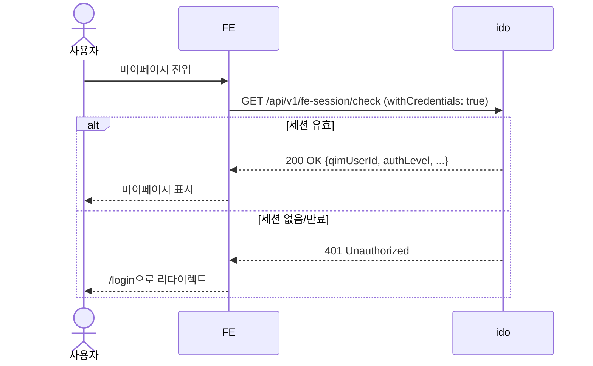
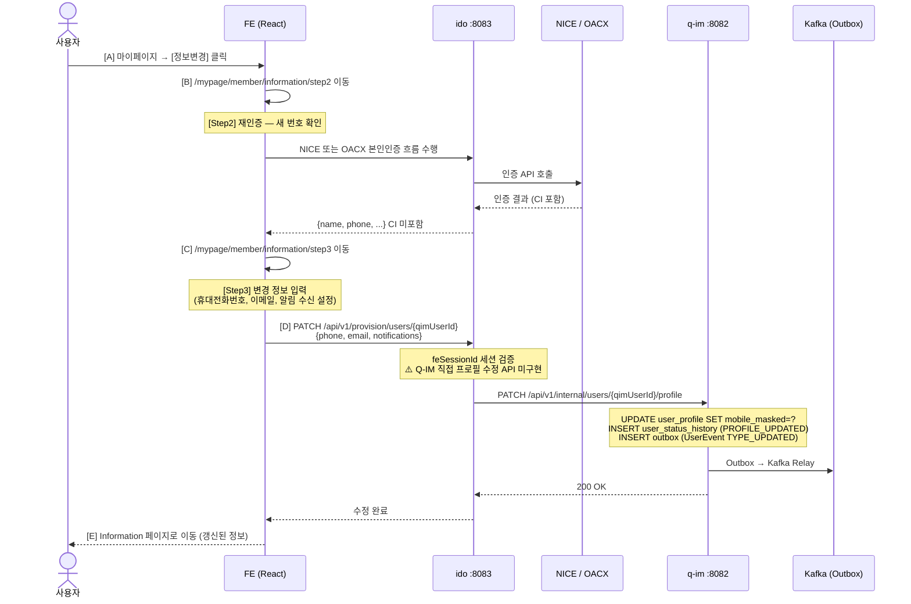
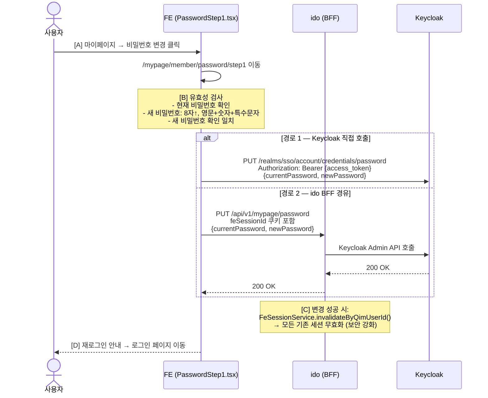
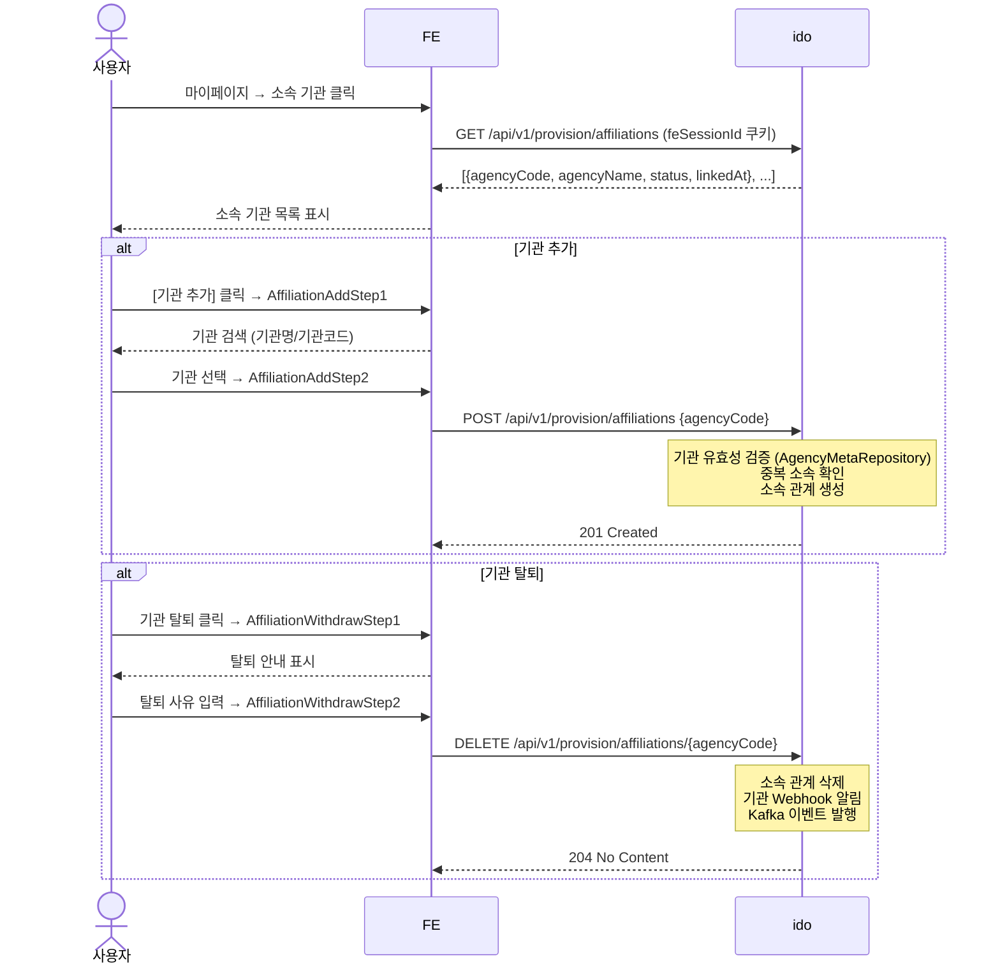
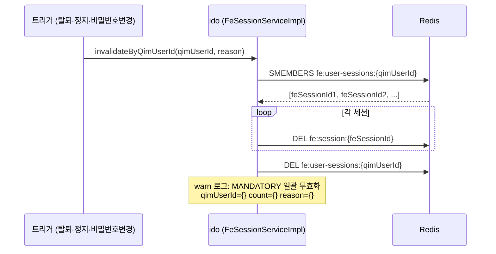

# 회원 수정 · 탈퇴 데이터 흐름 (A→Z 완전 추적)

**문서 ID**: FLOW-2026-003  
**버전**: v1.1  
**작성일**: 2026-05-11  
**최종 수정**: 2026-05-11  
**작성자**: AI 분석 (GenSpark)  
**대상 독자**: 개발팀, 운영팀, 보안팀

> **변경 이력**
> - v1.0 (2026-05-11): 최초 작성
> - v1.1 (2026-05-11): ASCII 다이어그램 → Mermaid 변환, 탈퇴/수정/세션무효화 시퀀스 다이어그램 추가, 비밀번호 변경·소속기관 시퀀스 추가

---

## 목차

1. [마이페이지 구조 개요](#1-마이페이지-구조-개요)
2. [회원 정보 수정 흐름 (A→Z)](#2-회원-정보-수정-흐름-az)
3. [회원 탈퇴 흐름 (A→Z)](#3-회원-탈퇴-흐름-az)
4. [비밀번호 변경 흐름 (A→Z)](#4-비밀번호-변경-흐름-az)
5. [소속 기관 관리 흐름 (A→Z)](#5-소속-기관-관리-흐름-az)
6. [DB 변경 전체 목록](#6-db-변경-전체-목록)
7. [Kafka 이벤트 발행 목록](#7-kafka-이벤트-발행-목록)
8. [세션 무효화 처리](#8-세션-무효화-처리)
9. [미구현 항목 및 주의사항](#9-미구현-항목-및-주의사항)

---

## 1. 마이페이지 구조 개요

### 1.1 라우트 구조

```
/mypage/member/            → MypageMember (개인 마이페이지 레이아웃)
  /information             → Information (나의 정보 조회)
  /information/step2       → InformationStep2 (정보 수정 — 인증)
  /information/step3       → InformationStep3 (정보 수정 — 저장)
  /password/step1          → PasswordStep1 (비밀번호 변경)
  /affiliation             → Affiliation (소속 기관 목록)
  /affiliation/add/step1   → AffiliationAddStep1
  /affiliation/add/step2   → AffiliationAddStep2
  /affiliation/withdraw/step1 → AffiliationWithdrawStep1
  /affiliation/withdraw/step2 → AffiliationWithdrawStep2
  /withdraw                → Withdraw (탈퇴 안내 step1)
  /withdraw/step2          → WithdrawStep2 (탈퇴 인증)
  /withdraw/complete       → WithdrawComplete (탈퇴 완료)

/mypage/business/          → MypageBusiness (기업 마이페이지 레이아웃)
  (동일 하위 구조)
```

### 1.2 인증 요구사항 및 세션 체크

마이페이지 라우트는 `isPrivate: true` — `feSessionId` 쿠키 필수.



**API 파일**: `onepass-fe/frontend/src/api/feSession.ts`

---

## 2. 회원 정보 수정 흐름 (A→Z)

### 2.1 정보 조회 (Information.tsx)

현재 `Information.tsx`의 모든 입력 필드가 `disabled` / `readOnly` 상태.  
조회 전용으로만 동작 중. 수정은 Step2에서 진행.

표시 정보:
- 아이디 (수정 불가)
- 이름 (수정 불가)
- 휴대전화번호 (수정 가능 → Step2)
- 이메일 (수정 가능 → Step2)

### 2.2 정보 수정 시퀀스



> ⚠️ **현재 상태**: Q-IM 직접 프로필 수정 API(`PATCH /api/v1/internal/users/{id}/profile`)가 미구현.  
> `UserController`에는 상태 변경(`/status`)만 있음. 이름/전화번호/이메일 변경 API 추가 필요.

### 2.3 수정 시 Q-IM DB 변경

```sql
-- Q-IM user_profile 업데이트 (현재 미구현, 향후 추가 필요)
UPDATE user_profile
SET mobile_masked = ?,
    updated_at = NOW(6)
WHERE qim_user_id = ?;

-- user_status_history 기록
INSERT INTO user_status_history
(qim_user_id, status_before, status_after, changed_by, change_reason, occurred_at)
VALUES (?, 'ACTIVE', 'ACTIVE', 'USER', 'PROFILE_UPDATED', NOW(6));

-- Outbox 적재
INSERT INTO outbox (event_type, payload, created_at)
VALUES ('USER_UPDATED', '{"qimUserId":"...","reason":"PROFILE_UPDATED"}', NOW(6));
```

---

## 3. 회원 탈퇴 흐름 (A→Z)

### 3.1 현재 구현 상태

```typescript
// Withdraw.tsx — 현재 "다음" 버튼은 "서비스 준비 중" 모달만 표시
<button type="button" className="btn point" 
  onClick={(): void => setDevNoticeModal(true)}>
  <span>다음</span>
</button>
// TODO: API 배포 후 복원 — goNext 로 다음 단계 이동
```

**현재 탈퇴 기능 완전 미구현** — "서비스 준비 중" 모달만 표시됨.

### 3.2 전체 탈퇴 시퀀스 (현재 + 향후)

```mermaid
sequenceDiagram
    actor 사용자
    participant FE as FE
    participant IDO as ido (/slo + /mypage)
    participant QIM as q-im
    participant KC as Keycloak
    participant RDS as Redis
    participant KF as Kafka (Outbox)

    사용자->>FE: [A] 마이페이지 → 탈퇴 메뉴 클릭
    FE-->>사용자: [B] 탈퇴 안내 + 보관 정보 표시 (Withdraw.tsx)
    사용자->>FE: [C] 다음 클릭
    note over FE: ⚠️ 현재: "서비스 준비 중" 모달만 표시<br/>향후: WithdrawStep2로 이동

    rect rgb(240, 248, 255)
        note over FE,KF: 향후 구현 예정
        FE->>IDO: [D] Step2 — 재인증 (본인 확인)
        FE->>IDO: [E] 탈퇴 사유 입력 후 최종 확인
        FE->>IDO: [F] DELETE /api/v1/internal/users/{qimUserId}?reason=USER_REQUEST
        IDO->>QIM: DELETE /api/v1/internal/users/{qimUserId}
        note over QIM: @Transactional {<br/>  status = WITHDRAWN<br/>  withdrawnAt = now<br/>  PII NULL (name, mobile, ci, di_map)<br/>  user_status_history INSERT<br/>  outbox INSERT (TYPE_WITHDRAWN)<br/>}
        QIM->>KF: Outbox → Kafka Relay (USER_WITHDRAWN)
        QIM-->>IDO: 200 OK

        IDO->>RDS: [G] DEL fe:session:{feSessionId} (모든 세션)<br/>DEL fe:user-sessions:{qimUserId}
        IDO->>KC: [H] Keycloak 세션 종료 (Back-channel logout)
        IDO->>KF: [I] 기관 탈퇴 Webhook Outbox 적재

        IDO-->>FE: 200 OK<br/>Set-Cookie: feSessionId=; Max-Age=0
        FE-->>사용자: [J] 탈퇴 완료 페이지 → 로그인 페이지 이동
    end
```

### 3.3 향후 구현 시 탈퇴 처리 상세 (Q-IM 기준)

**파일**: `q-im/src/main/java/kr/go/smes/qim/user/UserRegistrationServiceImpl.java`

```java
@Transactional
public void withdraw(String qimUserId, String reason) {
    // 1. 상태 변경
    QimUserJpaEntity user = userRepository.findById(qimUserId).orElseThrow(...);
    user.setStatus("WITHDRAWN");
    user.setWithdrawnAt(Instant.now());
    user.setWithdrawalReason(reason);
    userRepository.save(user);

    // 2. PII 즉시 삭제 (GDPR §17 Right to be Forgotten)
    jdbcTemplate.update("""
        UPDATE user_profile
        SET name_masked = NULL,
            mobile_masked = NULL,
            ci = NULL,
            di_map = NULL,
            extra_attributes = NULL,
            updated_at = NOW(6)
        WHERE qim_user_id = ?
        """, qimUserId);
    // auth_mean_mapping의 identifierHash는 유지 (탈퇴 이력 보존, 원문 복원 불가)

    // 3. 상태 이력 기록
    jdbcTemplate.update("""
        INSERT INTO user_status_history
        (qim_user_id, status_before, status_after, changed_by, change_reason, occurred_at)
        VALUES (?, ?, 'WITHDRAWN', 'SYSTEM', ?, NOW(6))
        """, qimUserId, oldStatus, reason);

    // 4. Kafka Outbox 적재
    outboxService.publishInTx(new UserEvent(
        UserEvent.TYPE_WITHDRAWN, "q-im",
        null, qimUserId, user.getEventVersion() + 1,
        "WITHDRAWN", reason, true));
}
```

### 3.4 탈퇴 후 데이터 보존 정책

| 데이터 | 처리 | 보존 기간 |
|---|---|---|
| 이름 (name_masked) | 즉시 NULL | 즉시 파기 |
| 전화번호 (mobile_masked) | 즉시 NULL | 즉시 파기 |
| CI 암호화 (ci) | 즉시 NULL | 즉시 파기 |
| DI 맵 (di_map) | 즉시 NULL | 즉시 파기 |
| identifierHash | 유지 | 영구 (재가입 방지 가능) |
| qimUserId | 유지 (status=WITHDRAWN) | 영구 |
| withdrawnAt | 유지 | 영구 |
| 지원사업 신청 이력 | 유지 | 5년 |
| 증명서 발급 이력 | 유지 | 180일 |
| 전자민원 신청 이력 | 유지 | 180일 |

> **FE 안내 문구** (Withdraw.tsx 탈퇴 안내 테이블에서 확인됨)

---

## 4. 비밀번호 변경 흐름 (A→Z)

**파일**: `onepass-fe/frontend/src/pages/Mypage/pages/PasswordStep1.tsx`

### 4.1 비밀번호 변경 시퀀스



> ⚠️ **현재 상태**: `PasswordStep1.tsx` 존재하나 구체적인 API 연동 구현 여부 확인 필요.  
> Keycloak 비밀번호 변경 후 FE 세션 처리 정책 미확정.

---

## 5. 소속 기관 관리 흐름 (A→Z)

### 5.1 소속 기관 조회 / 추가 / 탈퇴 시퀀스



---

## 6. DB 변경 전체 목록

### 회원 정보 수정 시

| 테이블 | 작업 | 내용 | 구현 상태 |
|---|---|---|---|
| `user_profile` | UPDATE | mobile_masked, updated_at | ⚠️ API 미구현 |
| `user_status_history` | INSERT | reason=PROFILE_UPDATED | ⚠️ API 미구현 |
| `outbox` | INSERT | eventType=USER_UPDATED | ⚠️ API 미구현 |

### 회원 탈퇴 시

| 테이블 | 작업 | 내용 | 구현 상태 |
|---|---|---|---|
| `qim_user` | UPDATE | status=WITHDRAWN, withdrawnAt, withdrawalReason | ✅ 구현됨 (미연동) |
| `user_profile` | UPDATE | 모든 PII 컬럼 NULL | ✅ 구현됨 (미연동) |
| `user_status_history` | INSERT | status_before→WITHDRAWN | ✅ 구현됨 (미연동) |
| `outbox` | INSERT | eventType=USER_WITHDRAWN | ✅ 구현됨 (미연동) |

> **구현됨 (미연동)**: Q-IM 서비스 코드는 완성되었으나 FE → ido → Q-IM 연결 미완성.

---

## 7. Kafka 이벤트 발행 목록

| 토픽 | 이벤트 타입 | 발행 시점 | 내용 |
|---|---|---|---|
| `qim.user.events` | `USER_UPDATED` | 프로필 수정 완료 | qimUserId, reason=PROFILE_UPDATED, needsSync=true |
| `qim.user.events` | `USER_SUSPENDED` | 상태 변경(정지) | qimUserId, newStatus, reason |
| `qim.user.events` | `USER_WITHDRAWN` | 탈퇴 처리 완료 | qimUserId, reason=USER_REQUEST, needsSync=true |
| `ido.handoff.events` | `HANDOFF_ISSUED` | Handoff 티켓 발급 | ticketId, agencyCode, qimUserId |

### UserEvent 구조 (탈퇴)

```json
{
  "eventType": "USER_WITHDRAWN",
  "sourceService": "q-im",
  "correlationId": null,
  "qimUserId": "uuid-v7",
  "eventVersion": 2,
  "newStatus": "WITHDRAWN",
  "reason": "USER_REQUEST",
  "needsSync": true
}
```

`needsSync=true`: 소비자(ido 등)가 캐시된 사용자 정보를 즉시 갱신해야 함을 표시.

---

## 8. 세션 무효화 처리

### 8.1 탈퇴/보안 이벤트 시 강제 무효화 시퀀스



### 8.2 세션 무효화 코드

```java
// FeSessionServiceImpl.invalidateByQimUserId()
void invalidateByQimUserId(String qimUserId, String reason) {
    Set<Object> sessionIds = redisTemplate.opsForSet()
        .members("fe:user-sessions:" + qimUserId);
    
    for (Object sid : sessionIds) {
        redisTemplate.delete("fe:session:" + sid);
    }
    redisTemplate.delete("fe:user-sessions:" + qimUserId);
    
    log.warn("[FeSession] MANDATORY 일괄 무효화 qimUserId={} count={} reason={}",
             qimUserId, sessionIds.size(), reason);
}
```

### 8.3 Advisory 플래그 (소프트 경고)

비밀번호 변경 권고, 의심 활동 감지 등 즉각 강제 로그아웃이 아닌 경우:

```java
// FeSessionServiceImpl.markAdvisoryFlag()
void markAdvisoryFlag(String qimUserId, String reason) {
    // 사용자의 모든 활성 세션에 advisoryFlag=true 설정
    // FE는 다음 API 응답에서 advisoryFlag=true 감지 시 안내 UI 표시
    // 기존 TTL 유지 (강제 로그아웃 아님)
}
```

---

## 9. 미구현 항목 및 주의사항

### 9.1 탈퇴 기능 (최우선 구현 필요)

| 항목 | 상태 | 필요 작업 |
|---|---|---|
| `Withdraw.tsx` 다음 버튼 | 개발 중 모달만 표시 | WithdrawStep2 인증 흐름 구현 |
| `WithdrawStep2.tsx` 본인인증 | 파일 존재, 구현 미완 | 재인증 → 탈퇴 API 연결 |
| `DELETE /api/v1/internal/users/{id}` | Q-IM 구현됨 | ido → Q-IM 연결 코드 필요 |
| FE 세션 무효화 (탈퇴 시) | Q-IM 이벤트 미구독 | Kafka 이벤트 소비자 구현 |
| Webhook 알림 (탈퇴) | HandoffServiceImpl 부분 구현 | 기관별 Webhook 전송 테스트 필요 |

### 9.2 회원 수정 기능

| 항목 | 상태 | 필요 작업 |
|---|---|---|
| Q-IM 프로필 업데이트 API | 미구현 | `PATCH /api/v1/internal/users/{id}/profile` 추가 |
| 알림 수신 설정 | 주석 처리 | UI + API 연동 구현 |
| 이메일 변경 | UI만 존재 | 인증 후 변경 API 구현 |

### 9.3 보안 고려사항

| 항목 | 위험도 | 내용 |
|---|---|---|
| 탈퇴 시 identifierHash 유지 | 중 | 재가입 방지 목적이나 정책 문서화 필요 |
| PII 삭제 감사 로그 부재 | 중 | GDPR 준수 증명을 위한 감사 로그 필요 |
| 탈퇴 후 기관 세션 연동 해제 | 고 | Webhook 실패 시 재시도 메커니즘 필요 |
| HMAC 비교 타이밍 공격 | 중 | `String.equals()` → `MessageDigest.isEqual()` 교체 권고 |

---

*문서 끝 — FLOW-2026-003 v1.1*
