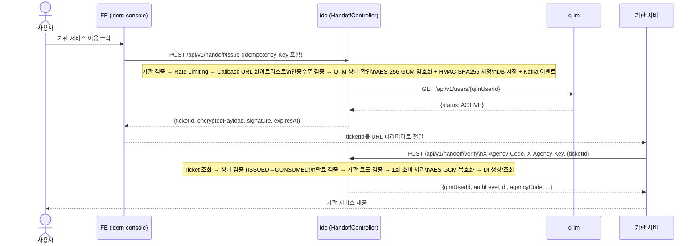
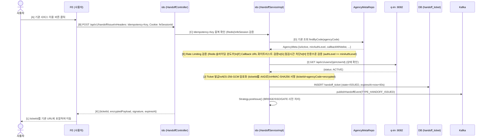
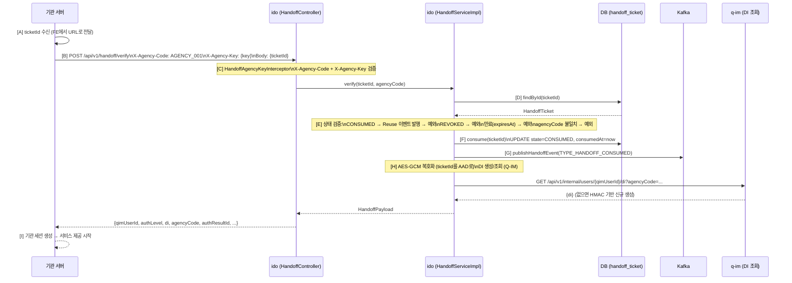
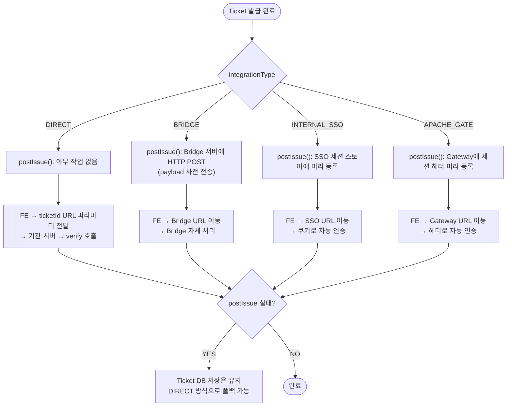

# Handoff Ticket 발급·검증·취소 데이터 흐름 (A→Z 완전 추적)

**문서 ID**: FLOW-2026-004  
**버전**: v1.1  
**작성일**: 2026-05-11  
**최종 수정**: 2026-05-11  
**작성자**: AI 분석 (GenSpark)  
**대상 독자**: 개발팀, 기관 연동 담당자, 보안팀

> **변경 이력**
> - v1.0 (2026-05-11): 최초 작성
> - v1.1 (2026-05-11): ASCII 다이어그램 → Mermaid 변환 (Overview/Issue/Verify 3개), 연동 전략 패턴 flowchart 추가, 보안 메커니즘 통합 표

---

## 목차

1. [Handoff 아키텍처 개요](#1-handoff-아키텍처-개요)
2. [Handoff 발급(Issue) 흐름 (A→Z)](#2-handoff-발급issue-흐름-az)
3. [Handoff 검증(Verify) 흐름 (A→Z)](#3-handoff-검증verify-흐름-az)
4. [Handoff 취소(Revoke) 흐름](#4-handoff-취소revoke-흐름)
5. [연동 유형별 전략 패턴](#5-연동-유형별-전략-패턴)
6. [Idempotency Key 처리](#6-idempotency-key-처리)
7. [Rate Limiting 처리](#7-rate-limiting-처리)
8. [보안 메커니즘](#8-보안-메커니즘)
9. [DB 변경 전체 목록](#9-db-변경-전체-목록)
10. [Kafka 이벤트 발행 목록](#10-kafka-이벤트-발행-목록)
11. [오류 코드 및 처리](#11-오류-코드-및-처리)

---

## 1. Handoff 아키텍처 개요

**Handoff Ticket**이란 통합플랫폼(ido)이 사용자를 외부 기관(Agency)으로 안전하게 인계할 때 사용하는 1회용 암호화 티켓이다.



### 핵심 보안 원칙
- **AES-256-GCM + HMAC-SHA256**: Ticket 페이로드 암호화 및 서명
- **1회 소비(consume-once)**: 검증 후 CONSUMED 상태, 재사용 불가
- **TTL 60초**: 발급 후 60초 내 검증 필수
- **기관 코드 검증**: 발급한 기관만 검증 가능 (agencyCode 불일치 거부)
- **Reuse Attempt 이벤트**: CONSUMED 티켓 재사용 시도 → Kafka 이벤트 발행 (보안 알림)

---

## 2. Handoff 발급(Issue) 흐름 (A→Z)

### 2.1 전체 시퀀스



### 2.2 단계별 상세

#### [A] FE: 기관 서비스 이용 버튼

사용자가 연동 기관의 서비스를 이용하려 클릭한다. FE는 현재 세션의 `qimUserId`와 `authResultId`를 알고 있다.

#### [B] POST /api/v1/handoff/issue

**파일**: `idem-hub/src/main/java/io/github/hipstermin/idem/idem-hub/api/HandoffController.java`

```
POST /api/v1/handoff/issue
Headers:
  Cookie: feSessionId={sessionId}
  Idempotency-Key: {UUID}         ← 클라이언트 생성 키 (선택)
Body:
{
  "qimUserId": "uuid-v7",
  "agencyCode": "AGENCY_001",
  "authResultId": "uuid-v7",
  "authLevel": "L1",
  "providerCode": "KAKAO",
  "redirectUri": "https://기관서버/callback",
  "correlationId": "uuid-v4"
}
```

#### [C] Idempotency-Key 중복 확인

**Redis 캐시 처리**:
```
키: ido:handoff:idempotency:{Idempotency-Key}
TTL: 1일

1. Redis 조회 → 있으면: 기존 응답 그대로 반환 (중복 요청 처리)
2. 없으면: 새 Ticket 발급 후 Redis에 응답 캐시
```

이를 통해 네트워크 재시도 등으로 인한 중복 티켓 발급을 방지한다.

#### [D] 기관 검증

```java
AgencyMeta agency = agencyMetaRepository.findByCode(agencyCode)
    .orElseThrow(() → PlatformException(AGENCY_NOT_REGISTERED));
if (!agency.isActive()) throw new PlatformException(AGENCY_NOT_REGISTERED);
```

**AgencyMeta 주요 속성**:
```
agencyCode: 기관 식별자
agencyName: 기관명
isActive: 활성 여부
minAuthLevel: 최소 인증수준 (L1/L2/L3)
integrationType: 연동 방식 (DIRECT/BRIDGE/INTERNAL_SSO/APACHE_GATE)
callbackWhitelist: 허용 Callback URL 목록
maintenanceWindows: 점검 시간대
dailyLimit: 일별 최대 발급 한도
tpsLimit: TPS 한도
```

#### [E] Rate Limiting 검증

```java
// AgencyRateLimiter.tryAcquire(agencyCode)
// Redis 슬라이딩 윈도우 카운터로 TPS + 일별 한도 검증
if (!rateLimiter.tryAcquire(agencyCode)) {
    auditIssue(cmd, null, OUTCOME_FAILURE, "RATE_LIMIT_EXCEEDED", null);
    throw new PlatformException(AGENCY_RATE_LIMIT_EXCEEDED);
}
```

#### [F] Callback URL 화이트리스트 검증

```java
// CallbackUrlValidator.validate()
// redirectUri가 agency.getCallbackWhitelist()에 포함되어야 함
callbackUrlValidator.validate(cmd.getRedirectUri(), agency.getCallbackWhitelist(), correlationId);
```

Open Redirect 공격 방지: 화이트리스트에 없는 URL로의 리다이렉트 차단.

#### [G] 점검 시간 차단

```java
if (policyEngine.isUnderMaintenance(agency)) {
    throw new PlatformException(AGENCY_MAINTENANCE);
}
```

기관이 점검 시간을 설정한 경우 해당 시간에 Handoff 발급 불가.

#### [H] 인증수준 검증

```java
if (!policyEngine.meetsMinAuthLevel(cmd.getAuthLevel(), agency.getMinAuthLevel())) {
    throw new PlatformException(IDO_AUTH_LEVEL_INSUFFICIENT);
}
```

예: 기관이 L2 이상 요구 → L1 인증 사용자 접근 차단.

#### [I] Q-IM 사용자 상태 확인

```java
UserStatus userStatus = policyEngine.resolveUserStatus(qimUserId, correlationId);
// QimClient.getUserStatus() → GET /api/v1/users/{qimUserId}
// (캐시 미스 시 Q-IM 직접 조회)

if (userStatus == SUSPENDED) throw PlatformException(IM_USER_SUSPENDED);
if (userStatus == WITHDRAWN) throw PlatformException(IM_USER_WITHDRAWN);
```

#### [J] Ticket 발급 및 암호화

```java
// HandoffServiceImpl.issue()

String ticketId = UuidV7.generate();
String plain = buildPlainPayload(ticketId, cmd);
// {
//   "ticketId": "uuid-v7",
//   "qimUserId": "uuid-v7",
//   "agencyCode": "AGENCY_001",
//   "authResultId": "uuid-v7",
//   "authLevel": "L1",
//   "providerCode": "KAKAO",
//   "issuedAt": "2026-05-11T09:00:00Z"
// }

String encrypted = handoffCryptoService.encrypt(plain, ticketId);
// AES-256-GCM (ticketId를 AAD로 사용)

String signature = handoffCryptoService.sign(ticketId, agencyCode, encrypted);
// HMAC-SHA256(ticketId + agencyCode + encrypted)

HandoffTicket ticket = HandoffTicket.builder()
    .ticketId(ticketId)
    .state(TicketState.ISSUED)
    .issuedAt(now)
    .expiresAt(now.plusSeconds(60))   ← TTL 60초
    .encryptedPayload(encrypted)
    .signature(signature)
    .build();

ticketRepository.save(ticket);
publishHandoffEvent(TYPE_HANDOFF_ISSUED, ticket, null);
```

#### [K] FE 응답

```json
{
  "ticketId": "uuid-v7",
  "correlationId": "uuid-v4",
  "agencyCode": "AGENCY_001",
  "state": "ISSUED",
  "issuedAt": "2026-05-11T09:00:00Z",
  "expiresAt": "2026-05-11T09:01:00Z",
  "encryptedPayload": "v1.xxx.yyy",
  "signature": "hmac_sha256_hex"
}
```

#### [L] FE → 기관 서비스 이동

```
FE: window.location.href = `https://기관서버/entry?ticketId=${ticketId}`
```

기관 서버가 ticketId를 받아 자체적으로 verify 호출.

---

## 3. Handoff 검증(Verify) 흐름 (A→Z)

### 3.1 전체 흐름



### 3.2 단계별 상세

#### [B] POST /api/v1/handoff/verify

```
POST /api/v1/handoff/verify
Headers:
  X-Agency-Code: AGENCY_001
  X-Agency-Key: {기관 API 키}
  X-Correlation-Id: {correlationId}
Body:
{
  "ticketId": "uuid-v7"
}
```

#### [C] 기관 헤더 검증

`HandoffAgencyKeyInterceptor`가 사전에 `X-Agency-Code`와 `X-Agency-Key`를 검증.

#### [D~E] Ticket 검증

```java
HandoffTicket ticket = ticketRepository.findById(ticketId)
    .orElseThrow(() → PlatformException(IDO_TICKET_EXPIRED));

// CONSUMED 체크 → Reuse 이벤트 발행
if (ticket.getState() == CONSUMED) {
    publishReuseAttemptEvent(ticket, correlationId);
    throw PlatformException(IDO_TICKET_CONSUMED);
}

// REVOKED 체크
if (ticket.getState() == REVOKED) throw PlatformException(IDO_TICKET_REVOKED);

// 만료 체크
if (ticket.isExpired()) throw PlatformException(IDO_TICKET_EXPIRED);

// 기관 코드 일치 검증
if (!ticket.getAgencyCode().equals(agencyCode)) 
    throw PlatformException(AGENCY_CODE_MISMATCH);
```

#### [F] 1회 소비 처리

```java
ticketRepository.consume(ticketId);
// UPDATE handoff_ticket SET state = 'CONSUMED', consumed_at = NOW() WHERE ticket_id = ?
```

#### [H] Payload 복호화 및 DI 생성

```java
HandoffPayload payload = policyEngine.buildHandoffPayload(ticket, correlationId);
// 1. AES-GCM 복호화 (ticketId를 AAD로 검증)
// 2. DI 생성/조회:
//    QimClient.getDi(qimUserId, agencyCode, correlationId)
//    → GET /api/v1/internal/users/{qimUserId}/di?agencyCode={agencyCode}
//    → Q-IM: DI 없으면 생성 (HMAC(qimUserId, agencyCode, secret) 방식)
//    → DI 있으면 기존 값 반환
// 3. HandoffPayload 조립

// HandoffPayload 구조:
{
  "qimUserId": "uuid-v7",
  "agencyCode": "AGENCY_001",
  "authLevel": "L1",
  "di": "DI값...",            ← 기관별 고유 식별자
  "authResultId": "uuid-v7",
  "providerCode": "KAKAO",
  "issuedAt": "2026-05-11T09:00:00Z"
}
```

---

## 4. Handoff 취소(Revoke) 흐름

```
DELETE /api/v1/handoff/{ticketId}
Headers:
  Cookie: feSessionId={sessionId}   또는 관리자 인증

처리:
1. ticketRepository.revoke(ticketId, revokeReason)
   UPDATE handoff_ticket SET state = 'REVOKED', revoke_reason = ?, revoked_at = NOW()
2. publishHandoffEvent(TYPE_HANDOFF_REVOKED, ticket, revokeReason)
3. 감사 로그 기록

사용 시나리오:
- 사용자가 기관 서비스 이동 취소
- 보안 의심 상황에서 티켓 강제 무효화
- 관리자 개입 필요 시
```

---

## 5. 연동 유형별 전략 패턴

**파일**: `idem-hub/src/main/java/io/github/hipstermin/idem/idem-hub/handoff/strategy/HandoffStrategyFactory.java`



**전략 실패 처리**: `postIssue` 실패해도 Ticket DB 저장은 유지됨.  
기관이 직접 `/verify`를 호출하는 DIRECT 폴백 가능.

---

## 6. Idempotency Key 처리

```
클라이언트: POST /api/v1/handoff/issue
Headers: Idempotency-Key: {UUID}

1차 요청:
  - Redis 조회: ido:handoff:idempotency:{key} → 없음
  - 정상 발급
  - Redis 저장: { ticketId, response } (TTL 1일)
  - 응답 반환

2차 요청 (동일 Idempotency-Key):
  - Redis 조회: ido:handoff:idempotency:{key} → 있음
  - 기존 응답 그대로 반환 (새 Ticket 미발급)
  - HTTP 200 반환
```

**목적**: 네트워크 타임아웃 후 재시도 시 중복 티켓 발급 방지.

---

## 7. Rate Limiting 처리

```
기관별 Rate Limit 검증 (AgencyRateLimiter):

1. TPS 제한:
   Redis 슬라이딩 윈도우 (1초)
   키: ido:rate:tps:{agencyCode}
   
2. 일별 한도:
   Redis Counter (자정 리셋)
   키: ido:rate:daily:{agencyCode}:{yyyyMMdd}

초과 시:
   → auditIssue(RATE_LIMIT_EXCEEDED) 감사 로그
   → PlatformException(AGENCY_RATE_LIMIT_EXCEEDED)
   → HTTP 429 Too Many Requests
```

---

## 8. 보안 메커니즘

| 위협 | 방어 | 구현 위치 |
|---|---|---|
| 티켓 재사용 | 1회 소비(CONSUMED 상태), Reuse 이벤트 발행 | `HandoffServiceImpl.verify()` |
| 티켓 위조 | AES-256-GCM + HMAC-SHA256 | `HandoffCryptoService` |
| 만료 티켓 사용 | expiresAt 검증 (TTL 60초) | `HandoffServiceImpl.verify()` |
| 기관 도용 | agencyCode + X-Agency-Key 이중 검증 | `HandoffAgencyKeyInterceptor` |
| Open Redirect | callbackWhitelist 검증 | `CallbackUrlValidator` |
| 저인증 접근 | minAuthLevel 검증 | `PolicyEngine.meetsMinAuthLevel()` |
| 정지/탈퇴 사용자 | Q-IM 상태 확인 | `PolicyEngine.resolveUserStatus()` |
| DDoS | Rate Limiting (TPS + 일별 한도) | `AgencyRateLimiter` |
| Replay | Idempotency Key (Redis 1일 TTL) | `HandoffController.issue()` |
| 감사 부재 | 전 경로 감사 로그 (성공/실패) | `AuditLogPublisher` |

---

## 9. DB 변경 전체 목록

### Handoff 발급 시

| 테이블 | 작업 | 내용 |
|---|---|---|
| `handoff_ticket` | INSERT | ticketId, agencyCode, qimUserId, state=ISSUED, expiresAt, encryptedPayload, signature |

### Handoff 검증 시

| 테이블 | 작업 | 내용 |
|---|---|---|
| `handoff_ticket` | UPDATE | state=CONSUMED, consumedAt=now |
| `user_profile.di_map` | UPDATE | 신규 기관 DI 생성 시 di_map JSON 업데이트 |

### Handoff 취소 시

| 테이블 | 작업 | 내용 |
|---|---|---|
| `handoff_ticket` | UPDATE | state=REVOKED, revokeReason, revokedAt=now |

---

## 10. Kafka 이벤트 발행 목록

| 토픽 | 이벤트 타입 | 발행 시점 | 내용 |
|---|---|---|---|
| `idem.hub.handoff.events` | `HANDOFF_ISSUED` | 티켓 발급 완료 | ticketId, agencyCode, qimUserId, state |
| `idem.hub.handoff.events` | `HANDOFF_CONSUMED` | 티켓 검증(소비) 완료 | ticketId, agencyCode, qimUserId |
| `idem.hub.handoff.events` | `HANDOFF_REVOKED` | 티켓 취소 | ticketId, revokeReason |
| `idem.hub.handoff.events` | `HANDOFF_REUSE_ATTEMPT` | 이미 소비된 티켓 재사용 시도 | ticketId, agencyCode → 보안 알림 |

### HandoffEvent 구조

```json
{
  "eventType": "HANDOFF_CONSUMED",
  "sourceService": "ido",
  "correlationId": "uuid-v4",
  "qimUserId": "uuid-v7",
  "eventVersion": 1,
  "ticketId": "uuid-v7",
  "agencyCode": "AGENCY_001",
  "authResultId": "uuid-v7",
  "ticketState": "CONSUMED",
  "revokeReason": null
}
```

---

## 11. 오류 코드 및 처리

| 오류 코드 | HTTP | 상황 | FE/기관 처리 |
|---|---|---|---|
| `AGENCY_NOT_REGISTERED` | 400 | 기관 미등록 또는 비활성 | 기관 등록 확인 |
| `AGENCY_RATE_LIMIT_EXCEEDED` | 429 | Rate Limit 초과 | 재시도 대기 |
| `AGENCY_MAINTENANCE` | 503 | 기관 점검 시간 | 점검 완료 후 재시도 |
| `IDO_AUTH_LEVEL_INSUFFICIENT` | 403 | 인증수준 미달 | 상위 인증 수행 후 재시도 |
| `IM_USER_SUSPENDED` | 403 | 사용자 정지 상태 | 정지 해제 후 재시도 |
| `IM_USER_WITHDRAWN` | 410 | 사용자 탈퇴 상태 | 재가입 필요 |
| `IDO_TICKET_EXPIRED` | 410 | 티켓 만료 (60초 초과) | 새 Ticket 발급 |
| `IDO_TICKET_CONSUMED` | 410 | 이미 소비된 티켓 | 새 Ticket 발급 + 보안 점검 |
| `IDO_TICKET_REVOKED` | 410 | 취소된 티켓 | 새 Ticket 발급 |
| `AGENCY_CODE_MISMATCH` | 403 | 발급 기관 != 검증 기관 | 기관 코드 확인 |
| `IDO_QIM_UNREACHABLE` | 503 | Q-IM 서비스 장애 | 잠시 후 재시도 |

---

*문서 끝 — FLOW-2026-004 v1.0*
