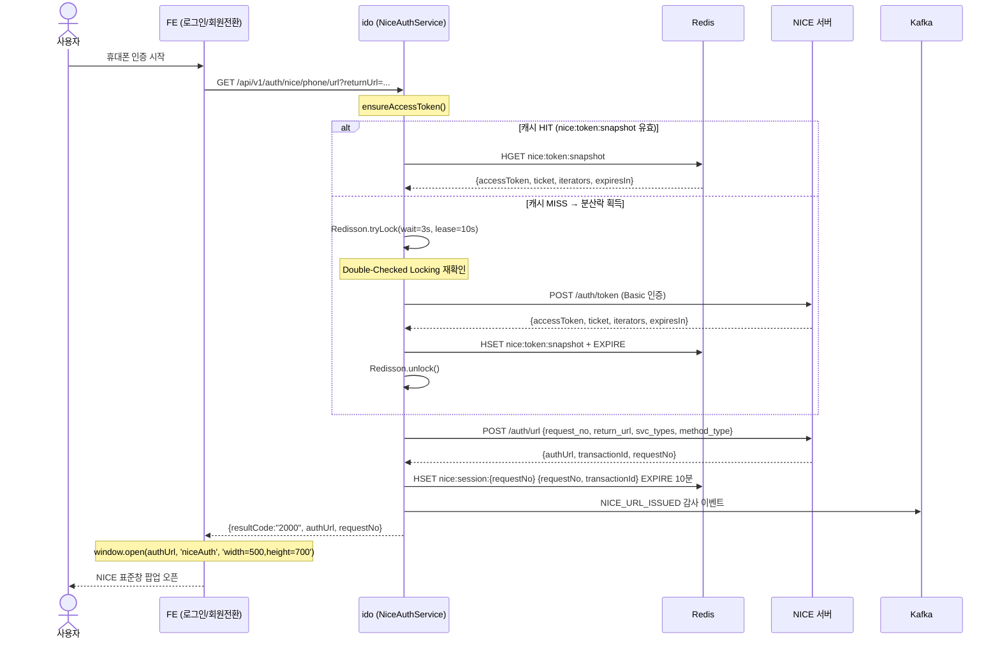
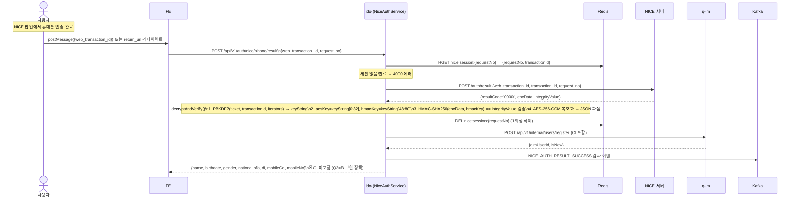
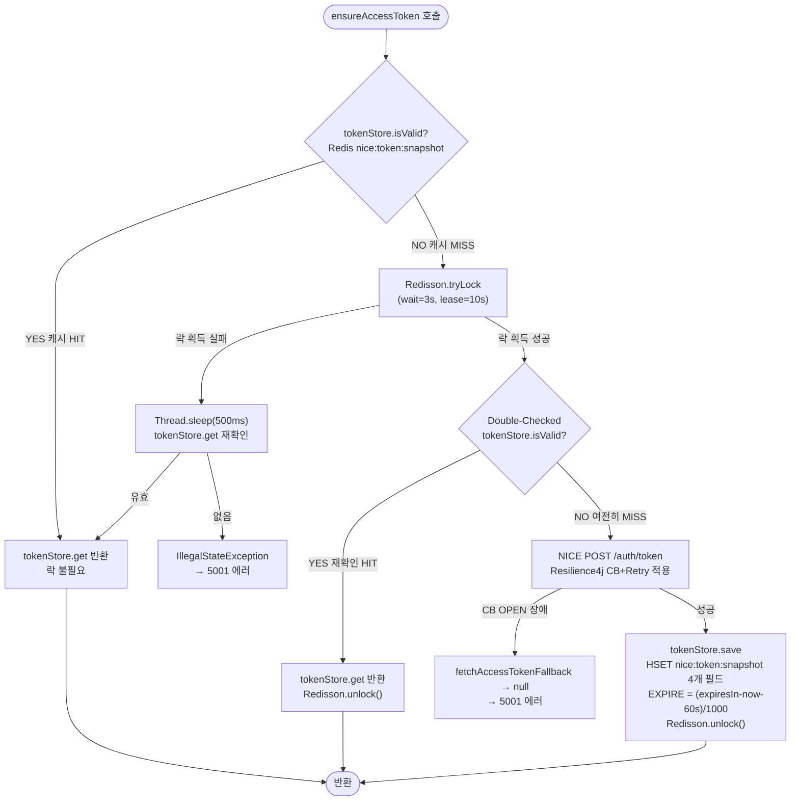
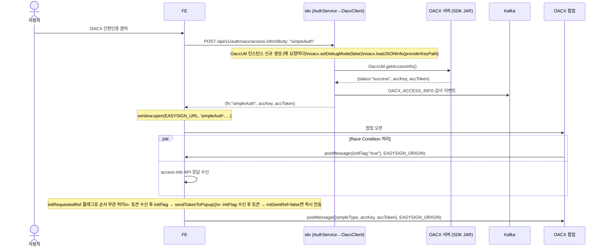
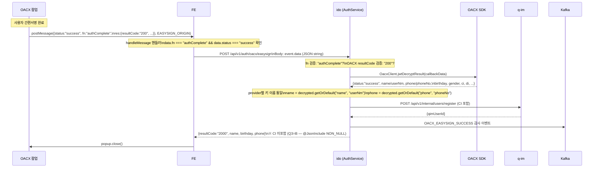
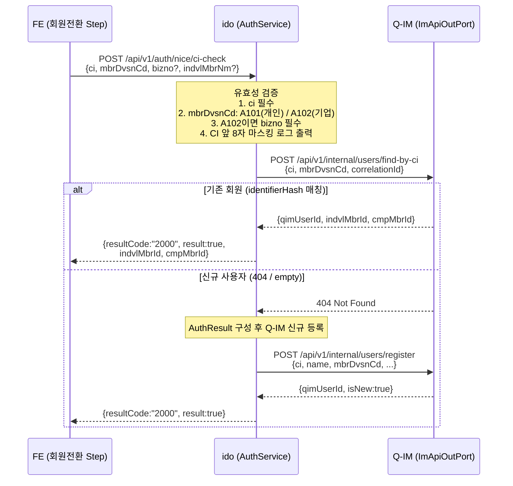

# NICE 본인인증 / OACX 간편인증서 데이터 흐름 A→Z

**문서 ID**: FLOW-2026-005  
**버전**: v1.2  
**작성일**: 2026-05-11  
**최종 수정**: 2026-05-11  
**작성자**: GenSpark AI (코드베이스 자동 분석)  
**분류**: 내부 기술 문서 (Internal Technical Document)  
**대상 독자**: 백엔드 개발팀, FE 개발팀, 보안 검토팀  

> **변경 이력**
> - v1.0 (2026-05-11): 최초 작성
> - v1.1 (2026-05-11): ASCII 시퀀스 다이어그램 3개 → Mermaid 변환, 분산락 flowchart 추가, OACX 팝업 통신 sequence 추가
> - v1.2 (2026-05-11): 9.1 ci-check 흐름 ASCII → Mermaid sequenceDiagram 변환

---

## 목차

1. [개요 — 비OIDC 본인인증 아키텍처](#1-개요)
2. [NICE 휴대폰 본인인증 — URL 발급 흐름](#2-nice-url-발급-흐름)
3. [NICE 휴대폰 본인인증 — 결과 조회 흐름](#3-nice-결과-조회-흐름)
4. [NICE 암호화 복호화 알고리즘 상세](#4-nice-암호화-복호화-알고리즘)
5. [NICE Access Token 관리 — 분산 락](#5-nice-access-token-분산-락)
6. [OACX 간편인증서 — 접근키 발급 흐름](#6-oacx-접근키-발급-흐름)
7. [OACX 간편인증서 — 간편서명 결과 처리 흐름](#7-oacx-간편서명-결과-흐름)
8. [CI 내부 처리 및 Q-IM 등록 흐름](#8-ci-내부-처리-및-q-im-등록)
9. [NICE CI 기반 회원 조회 (ci-check)](#9-nice-ci-기반-회원-조회)
10. [FE 훅 상세 — useNicePhoneAuth](#10-fe-훅-usenicePhoneAuth)
11. [FE 훅 상세 — OACX PersonalAuthTab](#11-fe-oacx-personalauthTab)
12. [Redis 키 전체 목록](#12-redis-키-목록)
13. [Kafka 이벤트 목록](#13-kafka-이벤트-목록)
14. [DB 변경 목록](#14-db-변경-목록)
15. [보안 메커니즘 요약](#15-보안-메커니즘-요약)
16. [에러 코드 및 처리](#16-에러-코드-및-처리)
17. [미구현/주의 항목](#17-미구현주의-항목)
18. [환경변수 및 설정 값 목록](#18-환경변수-및-설정-값-목록)

---

## 1. 개요

### 1.1 비OIDC 본인인증의 위치

OnePass 플랫폼의 인증 아키텍처(ADR-001)는 **IdO 완전 중재 패턴**을 따른다. 브라우저는 항상 `ido` 서비스와만 통신하며, `ido`가 외부 인증 시스템(NICE, OACX)과 직접 통신한다.

```
브라우저 (FE)
     │
     │ HTTP (Nginx Proxy)
     ▼
  ido:8083   ← 유일한 BFF(Backend for Frontend)
     │
     ├── NICE IDO API 서버  (https://auth.niceid.co.kr)
     │     └── POST /idem-hub/intc/v1.0/auth/{token|url|result}
     │
     └── OACX SDK (로컬 JAR)
           └── OacxUtil.getAccessInfo() / jwtDecryptResult()
```

### 1.2 인증 유형 비교

| 항목 | NICE 휴대폰 본인인증 | OACX 간편인증서 |
|------|---------------------|----------------|
| 연동 방식 | REST API (WebClient) | 네이티브 SDK (JAR) |
| 팝업 URL | NICE 서버 authUrl | EASYSIGN_URL (환경변수) |
| 팝업→FE 통신 | `postMessage` / URL 폴링 | `postMessage` |
| 복호화 위치 | ido 서버 (AES-256-GCM) | OACX SDK (JWT) |
| CI 반환 여부 | FE 미반환 (Q3=B) | FE 미반환 (Q3=B) |
| Q-IM 등록 | NiceAuthService에서 직접 | AuthService에서 직접 |
| 토큰/키 캐시 | Redis (nice:token:snapshot) | 없음 (매 요청마다 loadJSONInfo) |
| 분산 락 | Redisson (ido:lock:nice-token-refresh) | 없음 |
| Circuit Breaker | Resilience4j (nice-api-client CB) | 없음 |

---

## 2. NICE URL 발급 흐름

### 2.1 전체 시퀀스 다이어그램



### 2.2 단계별 상세 설명

#### 2.2.1 FE → ido 요청

**요청 형식**:
```
GET /api/v1/auth/nice/phone/url?returnUrl={returnUrl}
```

- `returnUrl` 파라미터: FE 팝업 콜백 수신 페이지 URL
  - `useNicePhoneAuth` 훅: `${window.location.origin}/nice-callback.html`
  - `PhoneAuthTab` (테스트): `${window.location.origin}/auth-test`
  - 미전달 시: `ido.auth.nice.return-url` 기본값 사용

**처리 컴포넌트**:
```
AuthController.getNicePhoneAuthUrl(returnUrl)
  → NiceAuthService.getNicePhoneAuthUrl(returnUrl)
```

#### 2.2.2 Access Token 확보 (`ensureAccessToken()`)

**상세 알고리즘** (분산 락 포함):

```
Step 1: tokenStore.isValid() 확인
        → Redis: HGET nice:token:snapshot expiresIn
        → 현재시각 < (expiresIn - 60,000ms) ? 유효
        
[캐시 HIT] → tokenStore.get() 반환 (락 없이 즉시)

[캐시 MISS]
Step 2: Redisson.getLock("ido:lock:nice-token-refresh")
        → tryLock(waitSeconds=3, leaseSeconds=10, SECONDS)

        [락 획득 실패]
        → Thread.sleep(500ms)
        → tokenStore.get() 재확인
        → 유효하면 반환, 없으면 IllegalStateException

        [락 획득 성공]
Step 3: Double-Checked Locking
        → tokenStore.isValid() 재확인
        → 유효하면 즉시 반환 (다른 Pod가 이미 갱신했을 수 있음)

Step 4: NICE API 호출
        POST https://auth.niceid.co.kr/ido/intc/v1.0/auth/token
        Authorization: Basic Base64(clientId:clientSecret)
        Body: {grant_type:"client_credentials", request_no: makeRequestNo()}
        
        [Resilience4j CB + Retry 적용]
        → CB OPEN 시: fetchAccessTokenFallback() → null 반환
        → Retry: 기본 설정 횟수만큼 재시도

        [성공]
Step 5: tokenStore.save(accessToken, expiresIn, ticket, iterators)
        → Redis HSET nice:token:snapshot 4개 필드
        → EXPIRE = (expiresIn - now - 60,000ms) / 1000초
        
Step 6: Redisson unlock() (finally 블록, 보유한 경우만)
```

#### 2.2.3 NICE URL API 호출

**요청**:
```json
POST https://auth.niceid.co.kr/ido/intc/v1.0/auth/url
Authorization: Bearer {accessToken}
Content-Type: application/json

{
  "request_no": "REQ_20260511123456a1b2c3d4e5f6",
  "return_url": "https://onepass.smes.go.kr/nice-callback.html",
  "svc_types": ["M"],
  "method_type": "GET"
}
```

**응답**:
```json
{
  "resultCode": "0000",
  "resultMessage": "성공",
  "authUrl": "https://nice.checkplus.co.kr/...",
  "transactionId": "txn_abc123",
  "requestNo": "REQ_20260511123456a1b2c3d4e5f6"
}
```

#### 2.2.4 Redis 세션 저장

```
Key:   nice:session:{requestNo}
Type:  Hash
Fields:
  - requestNo     → {requestNo}
  - transactionId → {transactionId}
TTL:   10분 (인증 팝업 유효 시간 이상)
```

> **설계 이유**: K8s 환경에서 URL 발급 Pod와 결과 조회 Pod가 다를 수 있음  
> → `ConcurrentHashMap`(단일 JVM) → Redis(공유 캐시)로 교체

#### 2.2.5 FE 응답 및 팝업 오픈

**응답**:
```json
{
  "resultCode": "2000",
  "resultMsg": "성공",
  "authUrl": "https://nice.checkplus.co.kr/...",
  "requestNo": "REQ_20260511123456a1b2c3d4e5f6"
}
```

**FE 팝업 오픈**:
```javascript
window.open(authUrl, 'niceAuth',
  'toolbar=no,scrollbars=no,location=no,resizable=no,status=no,menubar=no,width=500,height=700');
```

---

## 3. NICE 결과 조회 흐름

### 3.1 전체 시퀀스 다이어그램



### 3.2 단계별 상세 설명

#### 3.2.1 FE → ido 결과 조회 요청

**요청 형식**:
```
POST /api/v1/auth/nice/phone/result
Content-Type: application/json

{
  "web_transaction_id": "wtxn_xyz789",
  "request_no": "REQ_20260511123456a1b2c3d4e5f6"
}
```

**처리 컴포넌트**:
```
AuthController.getNicePhoneAuthResult(request)
  → NiceAuthService.getNicePhoneAuthResult(request)
```

**파라미터 검증**:
- `request_no` 필수 (null/blank 시 4000)
- `web_transaction_id` 실질적으로 필수 (NICE API에서 검증)

#### 3.2.2 Redis 세션 조회

```
HGET nice:session:{requestNo} requestNo      → storedRequestNo
HGET nice:session:{requestNo} transactionId  → transactionId

[세션 없음 or TTL 만료] → 4000: "인증 세션 정보를 찾을 수 없습니다"
```

> **1회성 처리**: 결과 조회 성공 후 `sessionStore.remove(requestNo)` → `DEL nice:session:{requestNo}`

#### 3.2.3 NICE 결과 API 호출

**요청**:
```json
POST https://auth.niceid.co.kr/ido/intc/v1.0/auth/result
Authorization: Bearer {accessToken}
Content-Type: application/json

{
  "web_transaction_id": "wtxn_xyz789",
  "transaction_id": "txn_abc123",
  "request_no": "REQ_20260511123456a1b2c3d4e5f6"
}
```

**응답**:
```json
{
  "resultCode": "0000",
  "resultMessage": "성공",
  "encData": "Base64URL인코딩된_암호화데이터",
  "integrityValue": "Base64URL인코딩된_HMAC값"
}
```

---

## 4. NICE 암호화 복호화 알고리즘

**구현체**: `idem-hub/src/main/java/io/github/hipstermin/idem/idem-hub/auth/util/NiceCryptoUtil.java`

### 4.1 전체 복호화 프로세스

```
[입력]
  - encData:        Base64URL(IV[16byte] + CipherText + GCM_Tag[16byte])
  - integrityValue: Base64URL(HMAC-SHA256(encData))
  - ticket:         NICE Access Token 발급 시 수신한 ticket (PBKDF2 패스워드)
  - transactionId:  NICE URL 발급 시 수신한 transactionId (PBKDF2 솔트)
  - iterators:      NICE Access Token 발급 시 수신한 반복 횟수

[Step 1] PBKDF2WithHmacSHA256 키 파생
  keyString = PBKDF2(
    password  = ticket.toCharArray(),
    salt      = transactionId.getBytes(UTF-8),
    iterations = iterators,
    keyLength  = 512 bit (64 byte)
  )
  → Base64URL 인코딩 (padding 없음)
  → 결과: ~86자 문자열

[Step 2] 키 분리
  aesKey  = keyString.substring(0, 32).getBytes(UTF-8)   → AES-256 키 (32바이트)
  hmacKey = keyString.substring(48, 80)                  → HMAC 키 (32자)

[Step 3] HMAC-SHA256 무결성 검증
  calculated = Base64URL(HMAC-SHA256(encData, hmacKey))
  if (calculated != integrityValue) → DataIntegrityException (5003)
  ※ 비교는 String.equals() 사용 (타이밍 공격 잠재적 위험 — §15.3 참조)

[Step 4] Base64URL 디코딩
  decoded = Base64URL_decode(encData)
  iv          = decoded[0..15]          (16바이트 IV)
  cipherText  = decoded[16..]           (암호문 + GCM 인증 태그 16바이트)

[Step 5] AES-256-GCM 복호화
  Cipher cipher = AES/GCM/NoPadding
  cipher.init(DECRYPT_MODE, SecretKeySpec(aesKey, "AES"),
              GCMParameterSpec(tagLen=128bit, iv))
  plaintext = cipher.doFinal(cipherText)

[Step 6] JSON 파싱
  Map<String, Object> resultMap = objectMapper.readValue(plaintext, UTF-8)

[출력 — resultMap 키]
  name:          이름
  birthdate:     생년월일 (YYYYMMDD)
  gender:        성별 (M/F)
  national_info: 내외국인 (0:내국인, 1:외국인)
  ci:            연계정보 88자 (내부 처리용, FE 미반환)
  di:            중복가입확인정보 (FE 반환)
  mobile_co:     통신사
  mobile_no:     휴대폰 번호
```

### 4.2 암호화 데이터 구조 시각화

```
encData (Base64URL 디코딩 후):
┌─────────────────────┬──────────────────────────────────────┬──────────────────┐
│  IV (16 bytes)      │  CipherText                          │  GCM Tag (16 B)  │
│  AES-GCM 초기화벡터 │  암호화된 JSON 데이터                │  인증 태그       │
└─────────────────────┴──────────────────────────────────────┴──────────────────┘
          ↑
  decoded[0..15]                decoded[16..len-17]              decoded[len-16..]
```

### 4.3 keyString 슬롯 배분

```
keyString (Base64URL 인코딩된 64바이트 = ~86자):
┌──────────────────────────────────┬───────────────┬──────────────────────────────────┐
│ Index 0~31 (32자)                │ Index 32~47   │ Index 48~79 (32자)               │
│ AES-256 Key                      │ (미사용)       │ HMAC-SHA256 Key                  │
│ .getBytes(UTF-8) → 32바이트       │               │ 문자열 그대로 HMAC 키로 사용     │
└──────────────────────────────────┴───────────────┴──────────────────────────────────┘
```

---

## 5. NICE Access Token 분산 락

**구현체**: `NiceAuthService.ensureAccessToken()` + `NiceTokenStore` (Redis)

### 5.1 분산 락 상태 머신



### 5.2 Redis 저장 구조

```
Key:   nice:token:snapshot
Type:  Hash
Fields:
  accessToken:  NICE Access Token 문자열
  expiresIn:    만료 시각 (epoch milliseconds)
  ticket:       PBKDF2 키 파생용 ticket (민감 정보!)
  iterators:    PBKDF2 반복 횟수 (정수)
TTL:   (expiresIn - now - 60,000ms) / 1000 초
```

> **보안 주의**: `ticket`은 AES 키 파생에 사용되는 민감 정보. Redis 접근 권한 관리 필수.

### 5.3 Circuit Breaker 설정

`NiceApiClient` 3개 메서드에 `@CircuitBreaker(name="nice-api-client")` 적용:
- `fetchAccessToken()` → fallback: null 반환
- `requestAuthUrl()` → fallback: null 반환
- `requestAuthResult()` → fallback: null 반환

> fallback null 반환 시 서비스 레이어에서 5001/5002 에러 처리

---

## 6. OACX 접근키 발급 흐름

### 6.1 전체 시퀀스 다이어그램



### 6.2 OacxClient 상세

**SDK 특성**:
- HTTP 클라이언트 아님 — JAR 파일 직접 의존 (`OACX-SDK-v1.3.2.jar`)
- 매 요청마다 `OacxUtil` 인스턴스 신규 생성 (SDK 내부 상태 없음)
- `oacx.loadJSONInfo(providerKeyPath)`: provider key JSON 매 요청 로드

**설정 경로**:
```yaml
ido:
  auth:
    oacx:
      provider-key-path: ${OACX_PROVIDER_KEY_PATH:}  # 절대 경로 필수
      debug-mode: false  # 운영: false 필수
```

**에러 처리**:
```java
if (providerKeyPath == null || providerKeyPath.isBlank()) {
    return OacxAccessInfoResponse.builder()
        .resultCode("5001")
        .resultMsg("OACX 설정 오류: provider-key-path 미설정")
        .build();
}
```

### 6.3 FE 팝업 통신 프로토콜

**FE → 팝업 메시지 (access-info 성공 후)**:
```json
{
  "simpleType": "simpleAuth",
  "accKey": "{accKey}",
  "accToken": "{accToken}"
}
```

**팝업 → FE 초기화 신호 (`initFlag`)**:
```json
{"initFlag": "true"}
```

**처리 순서 (race condition 처리)**:
1. FE: 팝업 오픈 + `access-info` API 호출 (병렬)
2. 팝업이 먼저 `initFlag`를 보낼 수도, FE가 먼저 토큰을 받을 수도 있음
3. `initRequestedRef.current` 플래그로 순서 무관하게 처리:
   - 토큰 수신 후 `initFlag`가 오면: 즉시 `sendTokenToPopup()`
   - `initFlag` 수신 후 토큰이 오면: `initSentRef`가 false이면 즉시 전송

---

## 7. OACX 간편서명 결과 흐름

### 7.1 전체 시퀀스 다이어그램



### 7.2 OACX provider별 키 이름 통일 처리

**AuthService.handleOacxEasysign() 내부**:
```java
// provider별 키 이름 차이 통일
String name = decrypted.getOrDefault("name", decrypted.get("userNm"));
String phone = decrypted.getOrDefault("phone", decrypted.get("phoneNo"));
```

| Provider | name 키 | phone 키 |
|----------|---------|----------|
| naver | `name` | `phone` |
| toss | `name` | `phone` |
| dream | `name` | `phone` |
| banksalad | `name` | `phone` |
| PASS (SKT/KT/LGU+) | `userNm` | `phoneNo` |

### 7.3 FE 응답 DTO (Q3=B — CI 미포함)

```json
{
  "resultCode": "2000",
  "resultMsg": "성공",
  "name": "홍길동",
  "birthday": "19900101",
  "phone": "010-1234-5678"
}
```

> `OacxEasysignResponse`에 `ci` 필드가 `null`로 유지 + `@JsonInclude(NON_NULL)` → JSON 자동 제외

---

## 8. CI 내부 처리 및 Q-IM 등록

### 8.1 보안 정책 (Q3=B)

**결정**: CI(연계정보)는 FE에 반환하지 않음
- NICE: `NicePhoneAuthResultResponse` DTO에 `ci` 필드 없음
- OACX: `OacxEasysignResponse` DTO의 `ci` 필드 null + `@JsonInclude(NON_NULL)`

**이유**: CI는 주민등록번호에 준하는 민감 PII — 브라우저 노출 최소화

### 8.2 NICE → Q-IM 등록 흐름

```java
// NiceAuthService.getNicePhoneAuthResult() 내부

String ciForInternalUse = (String) resultMap.get("ci");

AuthResult authResult = AuthResult.builder()
    .ci(ciForInternalUse)
    .di((String) resultMap.get("di"))
    .name((String) resultMap.get("name"))
    .birthday((String) resultMap.get("birthdate"))
    .gender((String) resultMap.get("gender"))
    .mobile((String) resultMap.get("mobile_no"))
    .mobileCorp((String) resultMap.get("mobile_co"))
    .build();

String correlationId = "nice-" + webTransactionId;
QimRegisterResponse result = imApiOutPort.register(authResult, correlationId);
// qimUserId, isNew 로그 기록
```

**ImApiOutPort → QimClientImpl 경로**:
```
imApiOutPort.register(authResult, correlationId)
  → QimClientImpl.registerUser(authResult, correlationId)
  → POST http://q-im:8082/api/v1/internal/users/register
     Header: X-Internal-Api-Key: "ido-internal"
     Body: {ci, di, name, birthday, gender, mobile, mobileCorp}
```

**Q-IM 처리 (UserRegistrationServiceImpl)**:
```
1. SHA-256(ci) → identifierHash
2. findByIdentifierHash(identifierHash)
   [기존 사용자] → 동일 qimUserId 반환 (Upsert)
   [신규 사용자]
     → UuidV7.generate() → qimUserId
     → CiCryptoService.encrypt(ci) → AES-256-GCM 암호화
     → PiiMaskingService.maskName/maskMobile
     → QimUser + UserProfile + AuthMeanMapping 3개 엔티티 저장
     → outboxService.publishInTx(UserEvent(TYPE_UPDATED))
```

### 8.3 OACX → Q-IM 등록 흐름

```java
// AuthService.handleOacxEasysign() 내부

String ciForInternalUse = decrypted.get("ci");
String correlationId = decrypted.getOrDefault("correlationId", 
    "oacx-" + System.currentTimeMillis());

AuthResult authResult = AuthResult.builder()
    .ci(ciForInternalUse)
    .di(decrypted.get("di"))
    .name(name)
    .birthday(decrypted.get("birthday"))
    .gender(decrypted.get("gender"))
    .mobile(phone)
    .mobileCorp(decrypted.get("mobileCorp"))
    .build();

imApiOutPort.register(authResult, correlationId);
```

> **주의**: OACX provider에 따라 CI를 미제공하는 경우 있음 → `ci == null` 시 Q-IM 등록 건너뜀 (warn 로그)

---

## 9. NICE CI 기반 회원 조회

### 9.1 ci-check 흐름



### 9.2 ci-check 응답 구조

**기존 회원 응답**:
```json
{
  "resultCode": "2000",
  "resultMsg": "기존 회원",
  "result": true,
  "indvlMbrId": "IND-12345678",
  "cmpMbrId": null
}
```

**신규 등록 완료 응답**:
```json
{
  "resultCode": "2000",
  "resultMsg": "신규 등록 완료",
  "result": true
}
```

---

## 10. FE 훅 — useNicePhoneAuth

**파일**: `idem-console/frontend/src/hooks/useNicePhoneAuth.ts`

### 10.1 훅 상태 관리

```typescript
const [busy, setBusy] = useState(false);          // 인증 진행 중 여부
const popupRef = useRef<Window | null>(null);      // 팝업 창 참조
const requestNoRef = useRef<string | undefined>(); // requestNo 저장
const callbacksRef = useRef({ onSuccess, onError }); // 콜백 최신 참조
```

### 10.2 팝업 닫힘 감지

```typescript
// 500ms 간격 폴링
useEffect(() => {
  if (!busy) return;
  const timer = setInterval(() => {
    if (popupRef.current?.closed) cleanup();  // 닫히면 상태 초기화
  }, 500);
  return () => clearInterval(timer);
}, [busy, cleanup]);
```

### 10.3 postMessage 수신 처리

```typescript
window.addEventListener('message', async (event: MessageEvent) => {
  // 1. Origin 검증: 같은 origin만 허용
  if (event.origin !== window.location.origin) return;
  
  // 2. 데이터 파싱
  data = typeof event.data === 'string' ? JSON.parse(event.data) : event.data;
  
  // 3. 타입/web_transaction_id 검증
  if (data.type !== 'nice-phone-auth' || !data.web_transaction_id) return;
  
  // 4. 결과 조회 (request_no: 메시지 data 우선, ref 백업)
  await fetchAuthResult(data.web_transaction_id, data.request_no || requestNoRef.current);
});
```

### 10.4 전체 흐름 상태 전이

```
[idle] 
  → startAuth() 호출
  → busy=true
  → GET /nice/phone/url (authUrl, requestNo 수신)
  → window.open(authUrl, ...)
  → [팝업 대기]
  
[팝업 대기]
  → postMessage 수신 (type:"nice-phone-auth", web_transaction_id)
  → fetchAuthResult() 호출
  → POST /nice/phone/result
  → onSuccess(결과) 또는 onError(메시지)
  → cleanup() → busy=false
  
[예외 경로]
  → 팝업 닫힘 감지 (closed) → cleanup() → busy=false
  → API 오류 → onError() → cleanup()
```

---

## 11. FE — OACX PersonalAuthTab

**파일**: `idem-console/frontend/src/pages/OacxTest/PersonalAuthTab.tsx`

> 주의: 이 컴포넌트는 **테스트/개발 전용** (`/oacx-test` 라우트). 실제 로그인 페이지에서는 별도 훅 사용 예정.

### 11.1 환경변수 의존성

```typescript
const EASYSIGN_URL = process.env.EASYSIGN_URL || '';    // OACX 팝업 URL
const EASYSIGN_ORIGIN = process.env.EASYSIGN_ORIGIN || ''; // postMessage origin 검증용
```

> **운영 전 설정 필수**: 두 환경변수가 미설정 시 팝업이 열리지 않음

### 11.2 race condition 처리 플래그

```typescript
const initSentRef = useRef(false);        // 토큰 전송 완료 여부
const initRequestedRef = useRef(false);   // 팝업이 initFlag 요청했는지 여부

// 팝업 → FE: initFlag 수신
if (data.initFlag === 'true') {
  if (initSentRef.current) return;  // 이미 보냈으면 무시
  initRequestedRef.current = true;
  sendTokenToPopup();               // 토큰 있으면 즉시 전송
}

// FE: access-info 성공 후
tokenRef.current = { accKey, accToken };
if (initRequestedRef.current) {
  sendTokenToPopup();               // initFlag 이미 왔으면 즉시 전송
}
```

### 11.3 간편서명 완료 처리

```typescript
if (data.status === 'success' && data.fn === 'authComplete') {
  // event.data 전체를 그대로 전달 (SDK 명세)
  const res = await beInstance.post('/api/v1/auth/oacx/easysign', event.data);
  // ...
  popup.close();
  cleanup();
}
```

---

## 12. Redis 키 목록

### NICE 관련 키

| Redis 키 | 타입 | TTL | 내용 | 생성 시점 | 삭제 시점 |
|---------|------|-----|------|----------|----------|
| `nice:token:snapshot` | Hash | expiresIn-60s | accessToken, expiresIn, ticket, iterators | ensureAccessToken() 갱신 | TTL 자동 만료 또는 invalidate() |
| `nice:session:{requestNo}` | Hash | 10분 | requestNo, transactionId | getNicePhoneAuthUrl() 성공 | 결과 조회 성공 시 DEL 또는 TTL 만료 |
| `ido:lock:nice-token-refresh` | Lock | 10초 | Redisson 분산 락 | ensureAccessToken() 락 획득 | 갱신 완료 후 unlock() |

### OACX 관련 키

- OACX는 Redis 사용 없음 (SDK 기반, 상태 없음)

---

## 13. Kafka 이벤트 목록

| 이벤트 | 토픽 | 발행 시점 | 주요 페이로드 |
|--------|------|----------|--------------|
| `NICE_URL_ISSUED` | `ido.audit.events` | NICE URL 발급 성공/실패 | requestNo, resultCode |
| `NICE_AUTH_RESULT_SUCCESS` | `ido.audit.events` | NICE 결과 복호화 + Q-IM 등록 성공 | requestNo, webTransactionId, resultCode |
| `NICE_INTEGRITY_FAIL` | `ido.audit.events` | HMAC 검증 실패 (데이터 위변조 의심) | requestNo, webTransactionId, resultCode=5003 |
| `NICE_QIM_REGISTER_FAIL` | `ido.audit.events` | Q-IM 등록 실패 | requestNo, errorMsg |
| `OACX_ACCESS_INFO` | `ido.audit.events` | OACX 접근키 발급 | fn, resultCode |
| `OACX_EASYSIGN_SUCCESS` | `ido.audit.events` | OACX 간편서명 성공 | provider, resultCode |
| `OACX_QIM_REGISTER_FAIL` | `ido.audit.events` | OACX Q-IM 등록 실패 | errorMsg |
| `CI_CHECK_EVENT` | `ido.audit.events` | CI 확인 처리 결과 | mbrDvsnCd, resultCode |
| `CALLBACK_EVENT` | `ido.audit.events` | 기업인증 콜백 수신 | txId, resultCode |

> `ido.audit.events` 토픽에서 감사 로그 시스템이 소비

---

## 14. DB 변경 목록

### NICE/OACX 인증이 트리거하는 DB 변경

NICE/OACX 인증 자체는 ido에서 처리되며 DB 직접 변경 없음. Q-IM 등록을 통해 간접 변경 발생:

| 테이블 | 변경 유형 | 발생 시점 | 내용 |
|--------|----------|---------|------|
| `qim_users` | INSERT | NICE/OACX 신규 사용자 등록 | qimUserId, identifierHash, status |
| `user_profiles` | INSERT | NICE/OACX 신규 사용자 등록 | encryptedCi, maskedName, maskedMobile, birthdate, gender |
| `auth_mean_mappings` | INSERT | NICE/OACX 신규 사용자 등록 | authMean(NICE/OACX), lastUsedAt |
| `outbox_messages` | INSERT | 위 3개와 동일 트랜잭션 | UserEvent(TYPE_UPDATED) → Kafka 발행 대기 |

---

## 15. 보안 메커니즘 요약

| 메커니즘 | 적용 위치 | 구현 상태 | 설명 |
|---------|----------|----------|------|
| PBKDF2WithHmacSHA256 키 파생 | `NiceCryptoUtil.deriveKey()` | ✅ 완성 | ticket+transactionId → 512bit 키 |
| HMAC-SHA256 무결성 검증 | `NiceCryptoUtil.hmacSha256Base64Url()` | ✅ 완성 | encData 위변조 탐지 |
| AES-256-GCM 복호화 | `NiceCryptoUtil.aesGcmDecrypt()` | ✅ 완성 | GCM 인증 태그로 추가 무결성 |
| Redisson 분산 락 | `ensureAccessToken()` | ✅ 완성 | K8s 다중 Pod 토큰 중복 발급 방지 |
| Circuit Breaker | `NiceApiClient` 3개 메서드 | ✅ 완성 | NICE 서버 장애 격리 |
| CI FE 미반환 (Q3=B) | `NiceAuthService`, `AuthService` | ✅ 완성 | DTO에 ci 필드 없음 |
| NICE 세션 1회 소비 | `sessionStore.remove(requestNo)` | ✅ 완성 | 결과 조회 후 즉시 삭제 |
| Redis Token TTL 관리 | `NiceTokenStore.save()` | ✅ 완성 | 만료 60초 전 재발급 유도 |
| ticket Redis 저장 | `NiceTokenStore` | ⚠️ 주의 | ticket은 AES 키 파생 민감 정보 |
| OACX origin 검증 | `PersonalAuthTab` `handleMessage` | ✅ 완성 | EASYSIGN_ORIGIN 비교 |
| NICE origin 검증 | `useNicePhoneAuth` `handleMessage` | ✅ 완성 | `window.location.origin` 비교 |
| HMAC 비교 타이밍 공격 | `NiceCryptoUtil.hmacSha256Base64Url()` | ⚠️ 취약 | String.equals() → `MessageDigest.isEqual()` 교체 권장 |

---

## 16. 에러 코드 및 처리

### NICE 에러 코드

| 에러 코드 | HTTP | 발생 원인 | 처리 방법 |
|---------|------|---------|---------|
| `4000` | 400 | request_no 누락 또는 세션 없음/만료 | 재인증 시도 |
| `5001` | 500 | NICE URL 발급 실패 (NICE 서버 오류) | 잠시 후 재시도 |
| `5002` | 500 | NICE 결과 조회 실패 | 잠시 후 재시도 |
| `5003` | 500 | HMAC 무결성 검증 실패 (위변조 의심) | 보안 이벤트 발생, 로그 확인 |
| `5010` | 500 | Q-IM 등록 실패 | Q-IM 서비스 상태 확인 |
| `5000` | 500 | 기타 내부 오류 | 로그 확인 |

### OACX 에러 코드

| 에러 코드 | HTTP | 발생 원인 | 처리 방법 |
|---------|------|---------|---------|
| `4000` | 400 | fn 값 유효하지 않음 (authComplete 아님) | FE SDK 버전 확인 |
| `4001` | 400 | OACX 인증 실패/취소 | 재인증 시도 |
| `5001` | 500 | OACX SDK 설정 오류 (provider-key-path 미설정) | 환경변수 확인 |
| `5002` | 500 | JWT 복호화 실패 | OACX SDK 버전/키 확인 |
| `5010` | 500 | Q-IM 등록 실패 | Q-IM 서비스 상태 확인 |

---

## 17. 미구현/주의 항목

### 17.1 [치명적] HMAC 비교 타이밍 공격 취약점

**위치**: `NiceCryptoUtil.hmacSha256Base64Url()` 결과 비교 (in `NiceAuthService.decryptAndVerify()`)

**현재 코드**:
```java
String calculated = NiceCryptoUtil.hmacSha256Base64Url(response.getEncData(), hmacKey);
if (!calculated.equals(response.getIntegrityValue())) {  // ← 일반 문자열 비교
    throw new DataIntegrityException();
}
```

**문제**: `String.equals()`는 두 문자열의 길이/내용에 따라 비교 시간이 달라져 타이밍 공격(Timing Attack)에 취약할 수 있음.

**권장 수정**:
```java
byte[] calculatedBytes = calculated.getBytes(StandardCharsets.UTF_8);
byte[] expectedBytes = response.getIntegrityValue().getBytes(StandardCharsets.UTF_8);
if (!MessageDigest.isEqual(calculatedBytes, expectedBytes)) {
    throw new DataIntegrityException();
}
```

### 17.2 [중요] OACX CI 미제공 시 Q-IM 등록 건너뜀

**위치**: `AuthService.handleOacxEasysign()`

```java
if (ciForInternalUse != null && !ciForInternalUse.isBlank()) {
    imApiOutPort.register(authResult, correlationId);
} else {
    log.warn("[OACX] CI 미포함 — Q-IM 등록 건너뜀 (provider가 CI를 미제공)");
    // ← 사용자 정보가 Q-IM에 등록되지 않음!
}
```

**문제**: CI 없는 OACX provider(일부)는 회원 식별 불가. 로그인 흐름 연결 시 문제 발생 가능.  
**권장**: CI 미제공 provider 목록 명시 및 처리 정책 확립 필요.

### 17.3 [중요] ci-check 엔드포인트 — FE 미연동

**위치**: `POST /api/v1/auth/nice/ci-check`

현재 구현 완성(`AuthService.checkNiceCi()`)되어 있으나, 실제 FE 회원전환 흐름에서 **이 API를 호출하지 않음**. FE `api/nice/ciCheck.ts`만 정의되어 있고 로그인/회원전환 페이지에서 미사용.

**영향**: NICE 휴대폰 인증 결과로 기존 회원 조회(매칭) 기능이 완전히 동작하지 않음.

### 17.4 [보통] NICE correlationId 형식

**위치**: `NiceAuthService.getNicePhoneAuthResult()`

```java
String correlationId = "nice-" + webTransactionId;
```

`webTransactionId` 형식에 특수문자나 긴 문자열이 포함될 경우 Redis/DB 키 문제 가능. UUID 형식으로 표준화 권장:
```java
String correlationId = UUID.randomUUID().toString();
```

### 17.5 [보통] NICE 결과 조회 — 세션 TTL 경합

**시나리오**: 사용자가 NICE 팝업에서 10분 이상 머물다 인증 완료 시 `nice:session:{requestNo}` TTL 만료.
→ `sessionStore.find(requestNo)` null → 4000 에러.

**현재 TTL**: 10분 (SESSION_TTL_MINUTES)
**권장**: 15분으로 연장 또는 NICE 팝업 세션 타임아웃과 동기화.

### 17.6 [보통] OACX 환경변수 미설정 시 무음 실패

`EASYSIGN_URL`이 빈 문자열이면 `window.open('')` → 같은 탭에서 빈 페이지 오픈. 사용자는 팝업이 차단된 것으로 오해.

**권장**: FE 시작 시 환경변수 존재 여부 검증 및 명확한 에러 메시지 표시.

---

## 18. 환경변수 및 설정 값 목록

### 18.1 ido 서비스 (NICE/OACX)

| 환경변수 | 기본값 | 필수 여부 | 설명 |
|---------|--------|---------|------|
| `NICE_CLIENT_ID` | `""` | 운영 필수 | NICE 계약 발급 클라이언트 ID |
| `NICE_CLIENT_SECRET` | `""` | 운영 필수 | NICE 클라이언트 시크릿 (로그 노출 금지) |
| `NICE_RETURN_URL` | `http://localhost:3000/otp/auth-result` | 운영 필수 | NICE 팝업 콜백 URL |
| `OACX_PROVIDER_KEY_PATH` | `""` | OACX 사용 시 필수 | OACX provider key JSON 절대 경로 |
| `INTEGRATION_AUTH_BASE_URL` | `""` | 기업인증 사용 시 필수 | 통합인증 서버 base URL |

### 18.2 FE (OACX)

| 환경변수 | 기본값 | 필수 여부 | 설명 |
|---------|--------|---------|------|
| `EASYSIGN_URL` | `""` | OACX 사용 시 필수 | OACX 간편서명 팝업 URL |
| `EASYSIGN_ORIGIN` | `""` | OACX 사용 시 필수 | postMessage origin 검증용 |

### 18.3 설정 값 주요 항목

| 설정 경로 | 기본값 | 설명 |
|----------|--------|------|
| `ido.auth.nice.timeout-seconds` | 10 | NICE API 타임아웃 (초) |
| `ido.auth.oacx.debug-mode` | false | OACX SDK 디버그 로그 (운영: false 필수) |
| `NiceAuthSessionStore.SESSION_TTL_MINUTES` | 10 | NICE 인증 세션 TTL |
| `NiceTokenStore.EXPIRY_SAFETY_MARGIN_MILLIS` | 60,000 | 토큰 만료 60초 전 재발급 |
| `NiceAuthService.LOCK_WAIT_SECONDS` | 3 | Redisson 락 대기 시간 |
| `NiceAuthService.LOCK_LEASE_SECONDS` | 10 | Redisson 락 만료 시간 |

---

*문서 끝 — FLOW-2026-005 v1.2*  
*다음 문서: `docs/_archive/2026-05-22/internal/analysis/code-completeness-analysis.md` (ANAL-2026-001)*
