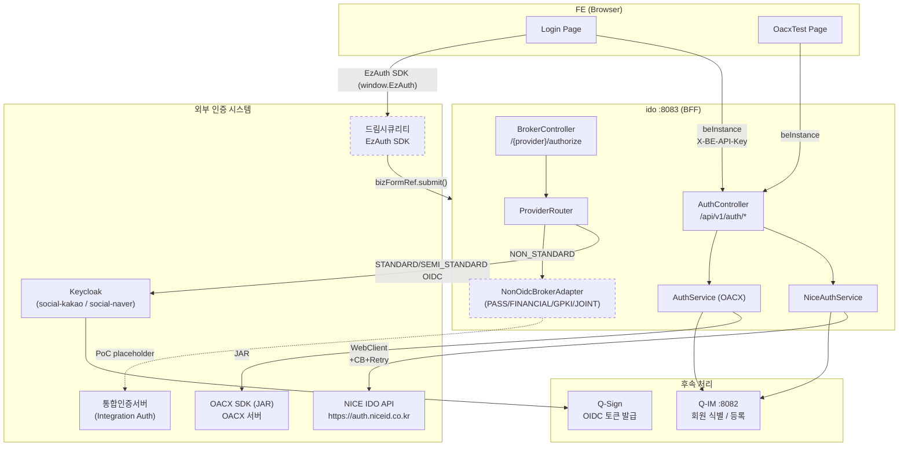
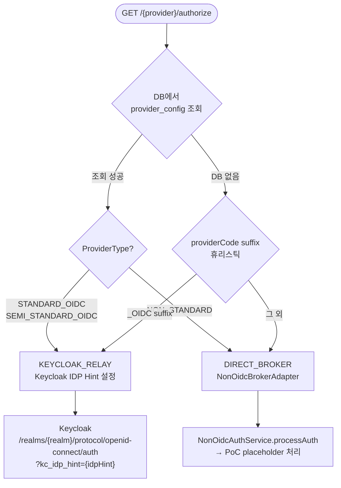
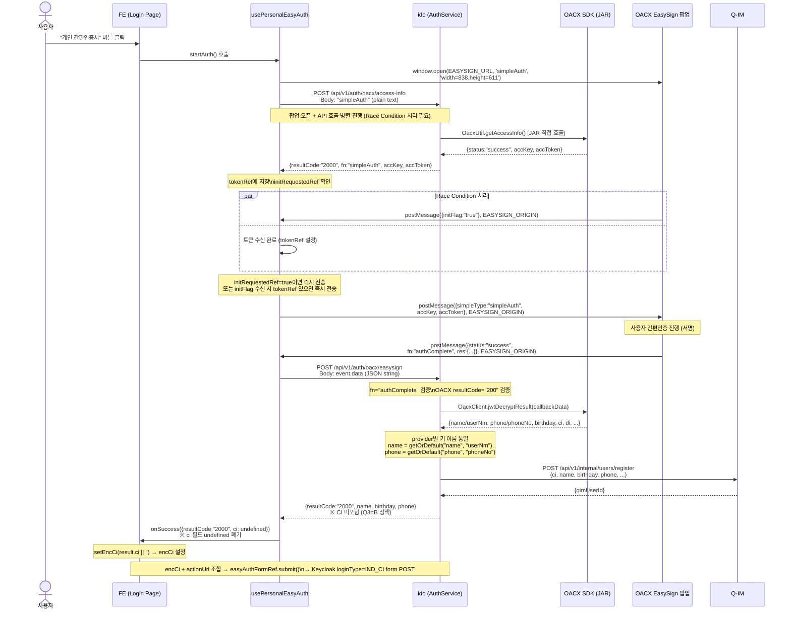
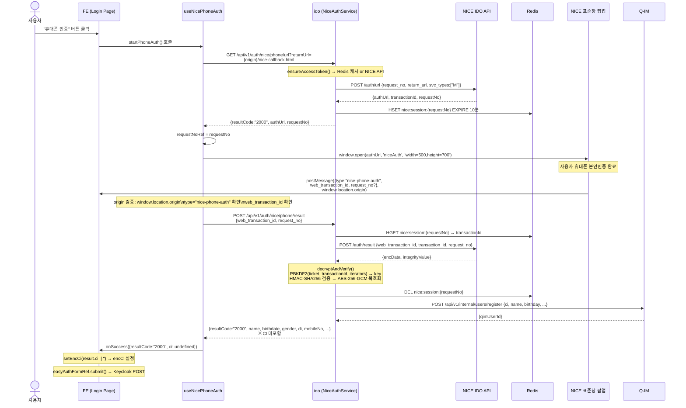
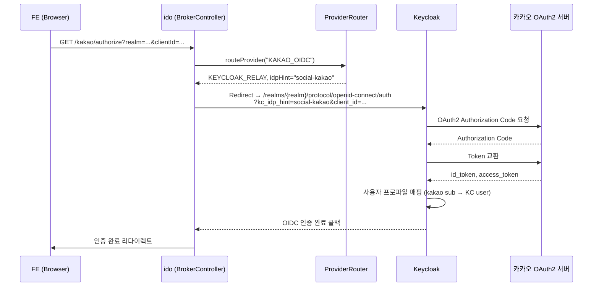
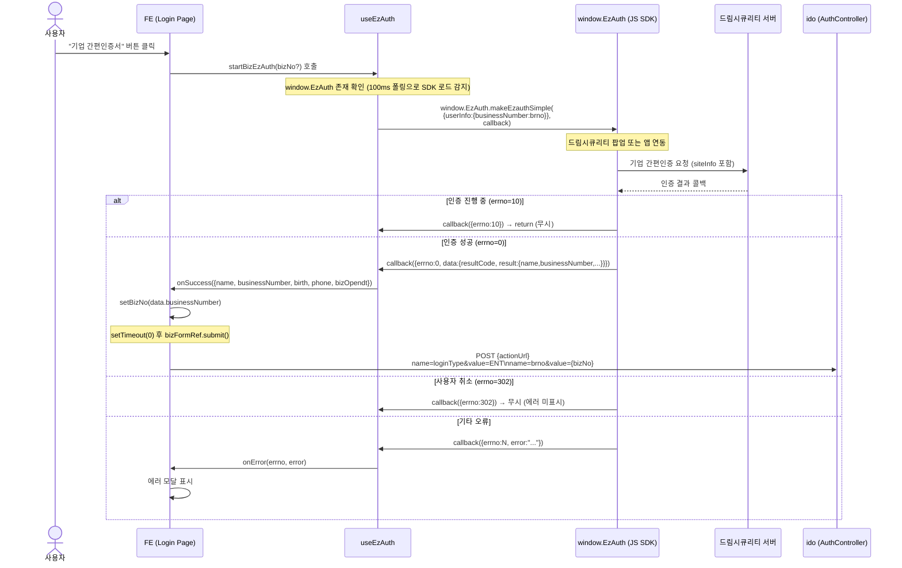
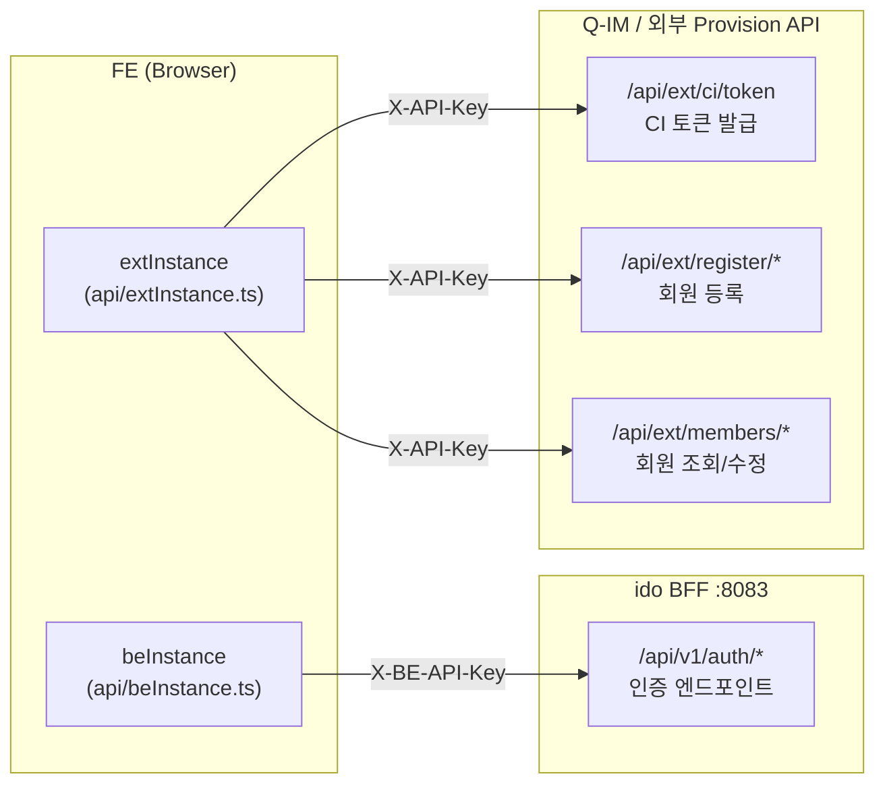
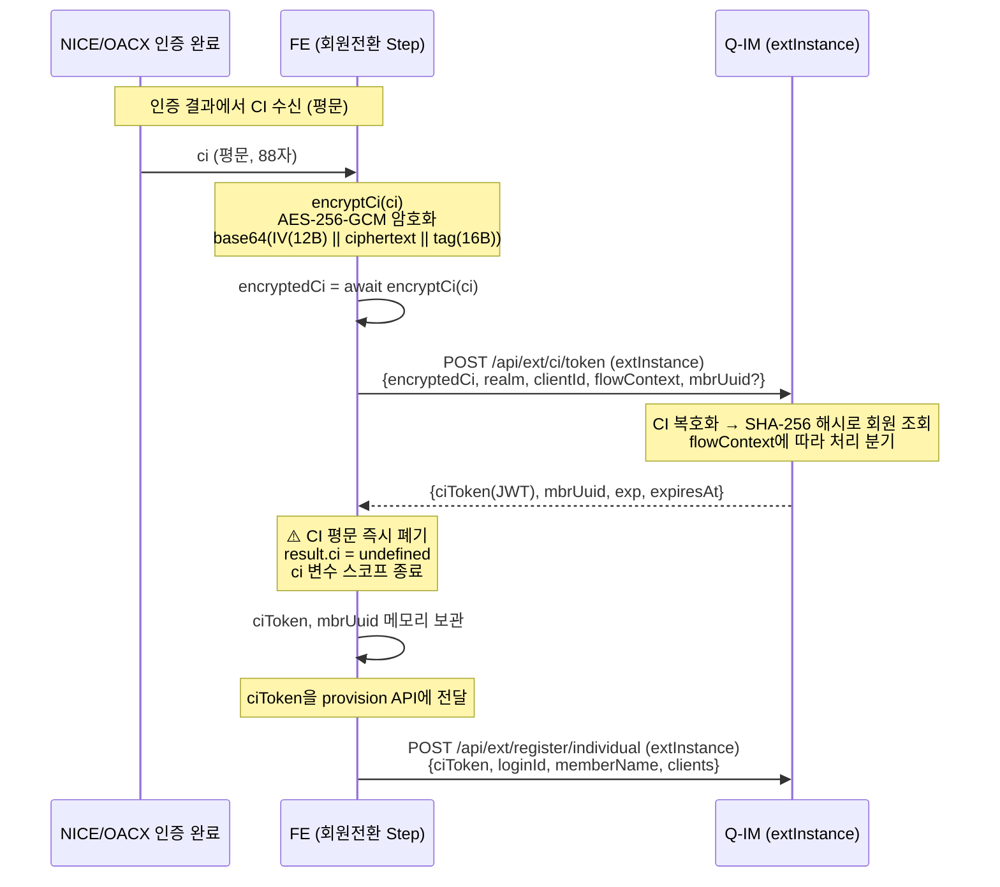

# 전체 인증수단 데이터 흐름 및 개발 가이드

**문서 ID**: FLOW-2026-006  
**버전**: v1.0  
**작성일**: 2026-05-11  
**최종 수정**: 2026-05-11  
**작성자**: GenSpark AI (코드베이스 자동 분석)  
**분류**: 내부 기술 문서 (Internal Technical Document)  
**대상 독자**: 백엔드 개발팀, FE 개발팀, 보안 검토팀  

> **변경 이력**
> - v1.0 (2026-05-11): 최초 작성 — 9종 인증수단 전체 데이터 흐름, FE 구현 가이드, 개발 요구사항 통합 정리

---

## 목차

1. [인증수단 전체 개요](#1-인증수단-전체-개요)
2. [인증 아키텍처 — 라우팅 결정 구조](#2-인증-아키텍처--라우팅-결정-구조)
3. [개인 인증수단 — 상세 흐름](#3-개인-인증수단--상세-흐름)
   - 3.1 [OACX 간편인증서 (개인)](#31-oacx-간편인증서-개인)
   - 3.2 [NICE 휴대폰 본인인증](#32-nice-휴대폰-본인인증)
   - 3.3 [카카오 소셜 로그인 (KAKAO_OIDC)](#33-카카오-소셜-로그인-kakao_oidc)
   - 3.4 [네이버 소셜 로그인 (NAVER_OIDC)](#34-네이버-소셜-로그인-naver_oidc)
   - 3.5 [PASS 본인인증 (PoC)](#35-pass-본인인증-poc)
4. [기업 인증수단 — 상세 흐름](#4-기업-인증수단--상세-흐름)
   - 4.1 [EzAuth 기업 간편인증 (드림시큐리티)](#41-ezauth-기업-간편인증-드림시큐리티)
   - 4.2 [금융인증서 FINANCIAL_CERT (PoC)](#42-금융인증서-financial_cert-poc)
   - 4.3 [GPKI 행정전자서명 (PoC)](#43-gpki-행정전자서명-poc)
   - 4.4 [공동인증서 JOINT_CERT (PoC)](#44-공동인증서-joint_cert-poc)
5. [FE 구현 가이드](#5-fe-구현-가이드)
   - 5.1 [API 인스턴스 이중 구조](#51-api-인스턴스-이중-구조)
   - 5.2 [CI 처리 파이프라인 (encryptCi → ciToken)](#52-ci-처리-파이프라인-encryptci--citoken)
   - 5.3 [인증 훅 패턴 비교](#53-인증-훅-패턴-비교)
   - 5.4 [Login 페이지 Form POST 구조](#54-login-페이지-form-post-구조)
6. [환경변수 및 설정 요구사항](#6-환경변수-및-설정-요구사항)
7. [PoC → 운영 전환 항목](#7-poc--운영-전환-항목)
8. [인증수단별 BE 엔드포인트 요약](#8-인증수단별-be-엔드포인트-요약)
9. [보안 고려사항 통합](#9-보안-고려사항-통합)
10. [미구현 / 개발 필요 항목](#10-미구현--개발-필요-항목)

---

## 1. 인증수단 전체 개요

### 1.1 인증수단 분류표

| # | 종류 | providerCode | 처리 경로 | 인증 레벨 | 구현 상태 | 회원 구분 |
|---|------|-------------|-----------|----------|----------|---------|
| 1 | NICE 휴대폰 본인인증 | `NICE` | ido → NiceAuthService → NICE API | L2 / AAL2 | ✅ 운영 완료 | 개인 |
| 2 | OACX 간편인증서 | `OACX` | ido → OacxClient (JAR) → OACX SDK | L2 / AAL2 | ✅ 운영 완료 | 개인 |
| 3 | 카카오 소셜 | `KAKAO_OIDC` | ido → Keycloak (social-kakao) | L1 / AAL1 | ✅ Keycloak 설정 의존 | 개인 |
| 4 | 네이버 소셜 | `NAVER_OIDC` | ido → Keycloak (social-naver) | L1 / AAL1 | ✅ Keycloak 설정 의존 | 개인 |
| 5 | PASS 본인인증 | `PASS` | ido → NonOidcBrokerAdapter | L2 / AAL2 | ⚠️ PoC placeholder | 개인 |
| 6 | EzAuth 기업 간편인증 | `EzAuth` | FE SDK → 드림시큐리티 서버 | — | ⚠️ Q2=B FE 미연결 | 기업 |
| 7 | 금융인증서 | `FINANCIAL_CERT` | ido → NonOidcBrokerAdapter | L3 | ⚠️ PoC placeholder | 개인/기업 |
| 8 | GPKI 행정전자서명 | `GPKI` | ido → NonOidcBrokerAdapter | L3 / AAL2 | ⚠️ PoC placeholder | 기업 |
| 9 | 공동인증서 | `JOINT_CERT` | ido → NonOidcBrokerAdapter | L3 | ⚠️ PoC placeholder | 개인/기업 |

### 1.2 전체 인증 아키텍처 개요도



### 1.3 인증수단별 CI 처리 여부

| 인증수단 | CI 반환 (FE) | Q-IM 등록 | CI 기반 식별 |
|---------|------------|---------|------------|
| NICE | ❌ (Q3=B 정책) | ✅ 서버측 자동 | ✅ identifierHash(SHA-256(CI)) |
| OACX | ❌ (Q3=B 정책) | ✅ 서버측 자동 | ✅ identifierHash |
| 카카오/네이버 | N/A (소셜 sub 사용) | Keycloak 중재 | Keycloak sub |
| PASS | ❌ (미구현) | ❌ (PoC) | 미정 |
| EzAuth | ❌ | ❌ (미연결) | siteInfo.txId |
| FINANCIAL/GPKI/JOINT | ❌ (미구현) | ❌ (PoC) | 미정 |

---

## 2. 인증 아키텍처 — 라우팅 결정 구조

### 2.1 ProviderRouter 라우팅 로직



### 2.2 idpHintMapping (Keycloak IDP 매핑)

`idem-gate/src/main/java/kr/go/smes/qsign/keycloak/KeycloakProperties.java`:

```
kakao   → "social-kakao"   (Keycloak Social Identity Provider)
naver   → "social-naver"   (Keycloak Social Identity Provider)
pass    → "pass"           (미구현, idpHint만 설정)
gpki    → "gpki"           (미구현, idpHint만 설정)
```

### 2.3 인증 레벨 정책 (AuthLevel)

`idem-common/.../AuthResult.java`:

| AuthLevel | 설명 | 해당 인증수단 |
|-----------|------|-------------|
| `L1` | 기본 소셜 인증 | KAKAO_OIDC, NAVER_OIDC |
| `L2` | 본인확인 인증 (CI 포함) | NICE, OACX, PASS |
| `L3` | 공인인증서 기반 | FINANCIAL_CERT, GPKI, JOINT_CERT |

---

## 3. 개인 인증수단 — 상세 흐름

### 3.1 OACX 간편인증서 (개인)

**providerCode**: `OACX`  
**처리 서비스**: `idem-hub/auth/service/AuthService.java` + `OacxClient.java`  
**FE 훅**: `hooks/usePersonalEasyAuth.ts`  
**실제 사용 위치**: Login 페이지 "개인 간편인증서" 버튼

#### 3.1.1 전체 데이터 흐름



#### 3.1.2 Race Condition 처리 상세

```
시나리오 A: 팝업이 먼저 initFlag 전송
  1. POPUP → HOOK: {initFlag:"true"}
  2. tokenRef.current == null → initRequestedRef=true, 전송 보류
  3. IDO 응답 수신 → tokenRef 설정
  4. initRequestedRef=true → 즉시 sendTokenToPopup()

시나리오 B: 토큰이 먼저 도착
  1. IDO 응답 수신 → tokenRef 설정
  2. initRequestedRef=false → 대기
  3. POPUP → HOOK: {initFlag:"true"}
  4. initSentRef=false → 즉시 sendTokenToPopup()

initSentRef: 전송 중복 방지 플래그 (한 번만 전송 보장)
```

#### 3.1.3 OACX provider별 반환 키 이름

| Provider | name 필드 | phone 필드 |
|----------|---------|----------|
| naver | `name` | `phone` |
| toss | `name` | `phone` |
| dream | `name` | `phone` |
| banksalad | `name` | `phone` |
| PASS (SKT/KT/LGU+) | `userNm` | `phoneNo` |

> **처리**: `AuthService.handleOacxEasysign()`에서 `getOrDefault()`로 키 이름 통일

#### 3.1.4 개발 체크리스트

- [ ] `EASYSIGN_URL` 환경변수 설정 (OACX 팝업 서버 URL)
- [ ] `EASYSIGN_ORIGIN` 환경변수 설정 (postMessage origin 검증용)
- [ ] `OACX_PROVIDER_KEY_PATH` 환경변수 설정 (절대 경로)
- [ ] OACX SDK JAR (`OACX-SDK-v1.3.2.jar`) classpath 포함 확인
- [ ] `oacx.debug-mode: false` (운영 환경)

---

### 3.2 NICE 휴대폰 본인인증

**providerCode**: `NICE`  
**처리 서비스**: `idem-hub/auth/service/NiceAuthService.java` + `NiceApiClient.java`  
**FE 훅**: `hooks/useNicePhoneAuth.ts`  
**실제 사용 위치**: Login 페이지 "휴대폰 인증" 버튼

#### 3.2.1 전체 데이터 흐름



#### 3.2.2 팝업 닫힘 감지 (폴링)

```typescript
// useNicePhoneAuth.ts — 500ms 간격 폴링
useEffect(() => {
  if (!busy) return;
  const timer = setInterval(() => {
    if (popupRef.current?.closed) cleanup(); // 닫히면 상태 초기화
  }, 500);
  return () => clearInterval(timer);
}, [busy, cleanup]);
```

> **PhoneAuthTab (테스트 페이지)**: 팝업 URL의 `web_transaction_id` 파라미터를 폴링으로 감지 (훅과 다른 방식)

#### 3.2.3 NICE Access Token 분산 락

- Redis 키: `nice:token:snapshot` (Hash, expiresIn-60초 TTL)
- 락: `ido:lock:nice-token-refresh` (Redisson, wait=3s, lease=10s)
- Circuit Breaker: `nice-api-client` (Resilience4j, OPEN 시 fallback=null)
- Retry: NICE API 호출 실패 시 재시도

#### 3.2.4 개발 체크리스트

- [ ] `NICE_CLIENT_ID`, `NICE_CLIENT_SECRET` 환경변수 설정
- [ ] `NICE_RETURN_URL` — 팝업 콜백 수신 URL 설정
- [ ] Redis 연결 확인 (nice:token:snapshot, nice:session:*)
- [ ] Redisson 연결 설정 확인
- [ ] NICE IDO API 방화벽 허용 (https://auth.niceid.co.kr)

---

### 3.3 카카오 소셜 로그인 (KAKAO_OIDC)

**providerCode**: `KAKAO_OIDC`  
**처리 경로**: `ProviderRouter` → `KEYCLOAK_RELAY` → Keycloak social-kakao  
**인증 레벨**: L1 / AAL1

#### 3.3.1 흐름



#### 3.3.2 Keycloak 설정 필요 항목

| 항목 | 값 | 비고 |
|------|-----|------|
| Identity Provider 이름 | `social-kakao` | idpHintMapping 매핑 키 |
| Provider Type | Keycloak OIDC / OpenID Connect v1.0 | |
| Client ID | 카카오 앱 REST API 키 | 카카오 개발자 콘솔 |
| Client Secret | 카카오 앱 시크릿 키 | |
| Authorization URL | `https://kauth.kakao.com/oauth/authorize` | |
| Token URL | `https://kauth.kakao.com/oauth/token` | |
| Default Scopes | `profile_nickname,account_email` | |
| First Login Flow | 기본 first broker login flow | 프로파일 매핑 커스터마이즈 가능 |

---

### 3.4 네이버 소셜 로그인 (NAVER_OIDC)

**providerCode**: `NAVER_OIDC`  
**처리 경로**: `ProviderRouter` → `KEYCLOAK_RELAY` → Keycloak social-naver  
**인증 레벨**: L1 / AAL1

카카오와 동일한 Keycloak OIDC IDP 구조. 아래 차이점만 있음:

| 항목 | 값 |
|------|-----|
| Identity Provider 이름 | `social-naver` |
| Authorization URL | `https://nid.naver.com/oauth2.0/authorize` |
| Token URL | `https://nid.naver.com/oauth2.0/token` |
| UserInfo URL | `https://openapi.naver.com/v1/nid/me` |
| Default Scopes | `name,email,mobile` |

> **주의**: 네이버는 OpenID Connect를 완전히 지원하지 않으므로 Keycloak에서 OAuth2 방식 구성 필요

---

### 3.5 PASS 본인인증 (PoC)

**providerCode**: `PASS`  
**처리 경로**: `NonOidcBrokerAdapter` (PoC placeholder)  
**인증 레벨**: L2 / AAL2

#### 3.5.1 현재 구현 상태

```java
// NonOidcBrokerAdapter.java
public NonOidcAuthResult authenticate(NonOidcAuthCommand command) {
    // TODO: PASS 통신3사 연동 구현 필요
    // placeholder: rawIdentifier 그대로 반환
    log.warn("NonOidc auth called with provider={}, rawIdentifier={}",
        command.getProviderCode(), command.getRawIdentifier());
    return NonOidcAuthResult.placeholder(command);
}
```

#### 3.5.2 개발 필요 사항

PASS 인증 연동을 위해 필요한 작업:

1. **통신3사 PASS API 계약** (SKT/KT/LGU+ 각각 또는 통합 API 게이트웨이)
2. **NonOidcBrokerAdapter 구현** — `processAuth()` 실제 API 호출 구현
3. **Keycloak IDP Hint** `pass` 설정 (idpHintMapping에 이미 정의됨)
4. **AuthLevel L2 보장** — CI 포함 응답 처리
5. **FE 훅 개발** — PASS 팝업 또는 앱 딥링크 연동

> **참고**: OACX 내부의 PASS provider(통신3사)와 별개의 providerCode임.  
> OACX PASS는 간편인증서 서비스를 통신사 앱으로 처리하는 반면,  
> 이 `PASS` providerCode는 독립적인 PASS 앱 본인인증을 의미.

---

## 4. 기업 인증수단 — 상세 흐름

### 4.1 EzAuth 기업 간편인증 (드림시큐리티)

**providerCode**: `EzAuth`  
**처리 경로**: FE `window.EzAuth` SDK → 드림시큐리티 서버 (FE 직접 연동)  
**FE 훅**: `hooks/useEzAuth.ts`  
**실제 사용 위치**: Login 페이지 "기업 간편인증서" 버튼

#### 4.1.1 전체 데이터 흐름



#### 4.1.2 EzAuth 콜백 errno 코드표

| errno | 의미 | FE 처리 |
|-------|------|---------|
| `0` | 인증 성공 | `onSuccess(data.result)` 호출 |
| `10` | 인증 진행 중 | 무시 (return) |
| `302` | 사용자 취소 | 무시 (`if (errno === 302) return`) |
| 기타 | 인증 오류 | `onError(errno, error)` → 에러 모달 |

#### 4.1.3 EzAuthBizResult 구조

```typescript
interface EzAuthBizResult {
  name: string;           // 대표자명
  businessNumber?: string; // 사업자등록번호 (10자리)
  birth?: string;         // 생년월일
  phone?: string;         // 연락처
  bizOpendt?: string;     // 개업일자
}
```

#### 4.1.4 BE 연동 현황 및 필요 작업

**현재 상태**: EzAuth는 FE에서 SDK로 직접 인증 후 결과를 bizFormRef로 POST.  
**미연결 항목**:
- `IntegrationAuthClient.java`에 `POST /auth-check/v1` 구현은 존재하나, EzAuth 결과를 ido가 검증하는 흐름 미연결
- `AuthCallbackRequest/Response` DTO 존재하나 EzAuth 콜백 처리 로직 미구현

**개발 필요 사항**:

```
[현재 흐름]  FE SDK → bizFormRef.submit() → Keycloak (직접)
[보완 흐름]  FE SDK → ido /api/v1/auth/ezauth/callback
              → IntegrationAuthClient.checkAuth(siteInfo, txId, tokenId)
              → 통합인증서버 검증
              → Q-IM 등록
              → Keycloak form POST
```

1. **`AuthController`에 EzAuth 콜백 엔드포인트 추가**
   ```java
   POST /api/v1/auth/ezauth/callback
   Body: AuthCallbackRequest {siteInfo, txId, tokenId, userToken, hubToken}
   ```
2. **`IntegrationAuthClient.checkAuth()` 실제 호출 연결**
3. **통합인증서버 결과로 Q-IM 등록**
4. **`INTEGRATION_AUTH_BASE_URL` 환경변수 설정**

#### 4.1.5 SDK 로드 방법

```html
<!-- index.html 또는 head에 SDK 스크립트 로드 -->
<script src="{드림시큐리티_SDK_URL}/ezauth.js"></script>

<!-- 또는 EzauthConfig로 설정 -->
<script>
  window.EzauthConfig = {
    siteId: "{등록된 사이트 ID}",
    serviceId: "{서비스 ID}"
  };
</script>
```

> `useEzAuth` 훅은 `window.EzAuth` 존재 여부를 100ms 폴링으로 감지하여 `ready` 상태 설정

---

### 4.2 금융인증서 FINANCIAL_CERT (PoC)

**providerCode**: `FINANCIAL_CERT`  
**처리 경로**: `NonOidcBrokerAdapter` (placeholder)  
**인증 레벨**: L3

#### 4.2.1 개발 필요 사항

금융인증서 연동을 위한 구현 항목:

1. **금융결제원 오픈뱅킹 또는 금융인증서 API 계약**
2. **NonOidcBrokerAdapter 구현** — 금융인증서 검증 로직
3. **AuthCallbackRequest/Response** — 금융인증서 특화 필드 추가
4. **DB**: `provider_config`에 `FINANCIAL_CERT` 레코드 추가 (현재 시딩 없음)

---

### 4.3 GPKI 행정전자서명 (PoC)

**providerCode**: `GPKI`  
**처리 경로**: `NonOidcBrokerAdapter` (placeholder)  
**인증 레벨**: L3 / AAL2  
**Keycloak idpHint**: `gpki` (KeycloakProperties에 매핑됨)

#### 4.3.1 개발 필요 사항

1. **행정안전부 GPKI 연동 계약 및 API 스펙 확인**
2. **공개키 기반 서명 검증 로직 구현**
3. **NonOidcBrokerAdapter** — GPKI 인증서 파싱 및 검증

---

### 4.4 공동인증서 JOINT_CERT (PoC)

**providerCode**: `JOINT_CERT`  
**처리 경로**: `NonOidcBrokerAdapter` (placeholder)  
**인증 레벨**: L3

> Login 페이지에서 "공동인증서" 버튼은 현재 `setDevNoticeModal(true)` — "서비스 준비 중" 안내 모달 표시

#### 4.4.1 개발 필요 사항

1. **금융결제원/한국전자인증 등 공동인증서 발급 기관과 연동 계약**
2. **공동인증서 플러그인** — ActiveX/NPAPI 대체 JS 인터페이스 구현
3. **NonOidcBrokerAdapter 구현** — 인증서 검증 로직

---

## 5. FE 구현 가이드

### 5.1 API 인스턴스 이중 구조

FE는 두 개의 독립적인 Axios 인스턴스를 사용합니다.



#### beInstance 상세 (`api/beInstance.ts`)

```typescript
const beInstance = axios.create({
  baseURL: process.env.BE_API_ENDPOINT || '',  // ido BFF URL
  headers: {
    'Content-Type': 'application/json',
    'X-BE-API-Key': process.env.BE_API_KEY || '',
  },
});
```

**사용 API**:
- `POST /api/v1/auth/oacx/access-info` — OACX 접근키 발급
- `POST /api/v1/auth/oacx/easysign` — OACX 간편서명 결과 처리
- `GET  /api/v1/auth/nice/phone/url` — NICE 인증 URL 발급
- `POST /api/v1/auth/nice/phone/result` — NICE 인증 결과 조회
- `POST /api/v1/auth/nice/ci-check` — CI 기반 회원 조회

#### extInstance 상세 (`api/extInstance.ts`)

```typescript
const extInstance = axios.create({
  baseURL: process.env.EXT_API_ENDPOINT || '',  // Q-IM / 외부 provision 서버 URL
  headers: {
    'Content-Type': 'application/json',
    'X-API-Key': process.env.EXT_API_KEY || '',
  },
});
```

**사용 API**:
- `POST /api/ext/ci/token` — CI 토큰 발급 (`ciToken.ts`)
- `POST /api/ext/register/individual` — 개인 회원 등록 (`registerIndividual.ts`)
- `POST /api/ext/register/enterprise` — 기업 회원 등록 (`registerEnterprise.ts`)
- `GET  /api/ext/members/{id}` — 회원 조회 (`ext/members.ts`)
- `PUT  /api/ext/members/{id}` — 회원 수정 (`ext/members.ts`)
- `GET  /api/ext/auth/result/{txId}` — 인증 결과 조회 (`ext/authResult.ts`)

---

### 5.2 CI 처리 파이프라인 (encryptCi → ciToken)

NICE/OACX 인증 후 CI를 안전하게 처리하는 전체 흐름:



#### flowContext 열거형

| 값 | 사용 시점 | mbrUuid 필요 여부 |
|----|---------|-----------------|
| `PROVISION_USER` | 신규 회원 전환 등록 | ❌ (신규 발급) |
| `CHECK_CONVERSION` | 기존 회원 전환 여부 확인 | ✅ (기존 회원 UUID) |
| `USER_WITHDRAW` | 회원 탈퇴 처리 | ✅ (탈퇴 대상 UUID) |

#### CiTokenRequest 타입

```typescript
interface CiTokenRequest {
  encryptedCi: string;    // AES-256-GCM 암호화된 CI: base64(IV(12B) || ciphertext || tag(16B))
  realm: string;          // Keycloak realm 이름
  clientId: string;       // SP Client ID
  flowContext: 'PROVISION_USER' | 'CHECK_CONVERSION' | 'USER_WITHDRAW';
  mbrUuid?: string;       // CHECK_CONVERSION/USER_WITHDRAW 시 필수
  kcUserId?: string;      // 감사 목적 (선택)
}
```

---

### 5.3 인증 훅 패턴 비교

| 항목 | `usePersonalEasyAuth` (OACX) | `useNicePhoneAuth` (NICE) | `useEzAuth` (기업 EzAuth) |
|------|------------------------------|--------------------------|--------------------------|
| 팝업 방식 | `window.open(EASYSIGN_URL)` | `window.open(authUrl)` | SDK 내부 처리 |
| 완료 신호 | `postMessage` (authComplete) | `postMessage` (nice-phone-auth) | SDK 콜백 함수 |
| origin 검증 | `EASYSIGN_ORIGIN` 환경변수 | `window.location.origin` | N/A (SDK) |
| 팝업 닫힘 감지 | 500ms 폴링 | 500ms 폴링 | N/A |
| Race Condition | `initSentRef`/`initRequestedRef` | 해당 없음 | 해당 없음 |
| BE 호출 | `beInstance.post('/api/v1/auth/oacx/easysign')` | `beInstance.post('/api/v1/auth/nice/phone/result')` | 없음 (SDK가 직접) |
| 결과 필드 | `{resultCode, name, birthday, phone}` | `{resultCode, name, birthdate, di, mobileNo}` | `{name, businessNumber, birth, phone}` |
| busy 상태 | ✅ | ✅ | `loading` 상태 |

#### 훅 공통 패턴

```typescript
// 모든 인증 훅의 공통 구조
const { busy/loading, startAuth } = useXxxAuth(
  onSuccess: (result) => void,   // 성공 콜백
  onError:   (message/errno, error?) => void,  // 에러 콜백
);

// 콜백 최신 참조 유지 (stale closure 방지)
const callbacksRef = useRef({ onSuccess, onError });
useEffect(() => { callbacksRef.current = { onSuccess, onError }; }, [onSuccess, onError]);
```

---

### 5.4 Login 페이지 Form POST 구조

Login 페이지는 **4개의 hidden form**을 사용하여 Keycloak에 POST합니다.

```
[개인 탭]
  ┌─ memberFormRef     → action={actionUrl}, loginType=IND, loginId, password
  ├─ easyAuthFormRef   → action={actionUrl}, loginType=IND_CI, encCi
  
[기업 탭]
  └─ bizFormRef        → action={actionUrl}, loginType=ENT, brno
```

#### Form 제출 트리거 조건

```typescript
// 1. 개인 ID/PW 로그인
onMemberSubmit → memberFormRef.current?.submit()

// 2. 개인 간편인증 / 휴대폰 인증 완료
useEffect(() => {
  if (encCi && actionUrl && easyAuthFormRef.current) {
    easyAuthFormRef.current.submit();  // encCi가 설정되면 자동 submit
  }
}, [encCi, actionUrl]);

// 3. 기업 EzAuth 성공
handleBizEzAuthSuccess → setBizNo(data.businessNumber)
  → setTimeout(0, () => bizFormRef.current?.submit())  // setState 반영 후 submit

// 4. 기업 사업자번호 직접 입력
onBizSubmit → bizFormRef.current?.submit()
```

#### actionUrl 구조

`useKeycloakParams` 훅이 URL 쿼리 파라미터에서 추출:
```
/login?action_url={actionUrl}&error=...&code=...&return_uri=...&return_client=...
```

- `action_url`: Keycloak 로그인 form action URL (필수)
- `error` + `code`: Q-Sign 에러 코드 (에러 모달 표시용)
- `return_uri`: 로그인 후 돌아갈 서비스 URL
- `return_client`: SP Client ID (회원가입 경로 전달용)

---

## 6. 환경변수 및 설정 요구사항

### 6.1 FE 환경변수 전체 목록

| 환경변수 | 기본값 | 사용 위치 | 필수 여부 | 설명 |
|---------|--------|---------|---------|------|
| `BE_API_ENDPOINT` | `""` | `beInstance.ts` | ✅ 필수 | ido BFF 서버 baseURL |
| `BE_API_KEY` | `""` | `beInstance.ts` | ✅ 필수 | ido BFF API 키 (`X-BE-API-Key`) |
| `EXT_API_ENDPOINT` | `""` | `extInstance.ts` | ✅ 필수 | Q-IM/Provision API baseURL |
| `EXT_API_KEY` | `""` | `extInstance.ts` | ✅ 필수 | 외부 API 키 (`X-API-Key`) |
| `EASYSIGN_URL` | `""` | `usePersonalEasyAuth.ts` | OACX 사용 시 필수 | OACX EasySign 팝업 URL |
| `EASYSIGN_ORIGIN` | `""` | `usePersonalEasyAuth.ts` | OACX 사용 시 필수 | postMessage origin 검증 |

> **⚠️ 주의**: `EASYSIGN_URL`이 빈 문자열이면 `window.open('')` → 같은 탭에서 빈 페이지 오픈.  
> 반드시 시작 시 환경변수 검증 로직 추가 권장.

### 6.2 ido 서비스 환경변수 전체 목록

| 환경변수 | 기본값 | 사용 위치 | 필수 여부 | 설명 |
|---------|--------|---------|---------|------|
| `NICE_CLIENT_ID` | `""` | `AuthProperties.NiceProperties` | NICE 사용 시 필수 | NICE 계약 클라이언트 ID |
| `NICE_CLIENT_SECRET` | `""` | `AuthProperties.NiceProperties` | NICE 사용 시 필수 | NICE 클라이언트 시크릿 |
| `NICE_RETURN_URL` | `http://localhost:3000/otp/auth-result` | `AuthProperties.NiceProperties` | 운영 필수 | NICE 팝업 콜백 URL |
| `OACX_PROVIDER_KEY_PATH` | `""` | `AuthProperties.OacxProperties` | OACX 사용 시 필수 | OACX provider key JSON 파일 절대 경로 |
| `INTEGRATION_AUTH_BASE_URL` | `""` | `AuthProperties.IntegrationProperties` | EzAuth/기타 사용 시 필수 | 통합인증서버 base URL |

### 6.3 설정값 (application.yml 주요 항목)

| 설정 경로 | 기본값 | 설명 |
|----------|--------|------|
| `ido.auth.nice.timeout-seconds` | `10` | NICE API 호출 타임아웃 (초) |
| `ido.auth.oacx.debug-mode` | `false` | OACX SDK 디버그 로그 (운영: false 필수) |
| `NiceAuthSessionStore.SESSION_TTL_MINUTES` | `10` | NICE 인증 세션 TTL (Redis) |
| `NiceTokenStore.EXPIRY_SAFETY_MARGIN_MILLIS` | `60,000` | 토큰 만료 60초 전 재발급 유도 |
| `NiceAuthService.LOCK_WAIT_SECONDS` | `3` | Redisson 분산 락 대기 시간 |
| `NiceAuthService.LOCK_LEASE_SECONDS` | `10` | Redisson 락 만료 시간 |

### 6.4 Keycloak 설정 항목 (소셜 로그인)

| Realm 설정 | 필요 항목 | 비고 |
|----------|---------|------|
| Identity Provider | `social-kakao` 등록 | 카카오 앱 키 필요 |
| Identity Provider | `social-naver` 등록 | 네이버 앱 키 필요 |
| idpHintMapping | `kakao → social-kakao` | `KeycloakProperties.java` |
| idpHintMapping | `naver → social-naver` | `KeycloakProperties.java` |
| Client | SP별 Client 등록 | redirect_uri 화이트리스트 포함 |

---

## 7. PoC → 운영 전환 항목

### 7.1 우선순위별 전환 항목

| 우선순위 | 항목 | 대상 서비스 | 예상 공수 | 비고 |
|---------|------|----------|--------|------|
| **P0 — 즉시** | HMAC 타이밍 공격 취약점 수정 | ido | 0.5일 | `MessageDigest.isEqual()` 교체 |
| **P0 — 즉시** | ci-check FE 연동 | FE | 1일 | `api/nice/ciCheck.ts` 호출 코드 추가 |
| **P1 — Q2** | EzAuth BE 검증 연결 | ido + FE | 3일 | `IntegrationAuthClient` 완전 연결 |
| **P1 — Q2** | EzAuth Q-IM 등록 | ido | 2일 | 기업회원 식별 흐름 완성 |
| **P2 — Q3** | PASS 본인인증 구현 | ido + FE | 5일 | 통신3사 API 계약 선행 필요 |
| **P2 — Q3** | 공동인증서 구현 | ido + FE | 5일 | 인증기관 계약 선행 필요 |
| **P3 — Q4** | 금융인증서 구현 | ido + FE | 5일 | 금융결제원 연동 계약 필요 |
| **P3 — Q4** | GPKI 구현 | ido + FE | 5일 | 행안부 연동 계약 필요 |

### 7.2 P0 — HMAC 타이밍 공격 취약점 수정

**파일**: `idem-hub/src/main/java/kr/go/smes/idem-hub/auth/util/NiceCryptoUtil.java`

```java
// 현재 코드 (취약)
if (!calculated.equals(response.getIntegrityValue())) {
    throw new DataIntegrityException();
}

// 수정 코드 (권장)
byte[] calculatedBytes = calculated.getBytes(StandardCharsets.UTF_8);
byte[] expectedBytes = response.getIntegrityValue().getBytes(StandardCharsets.UTF_8);
if (!MessageDigest.isEqual(calculatedBytes, expectedBytes)) {
    throw new DataIntegrityException();
}
```

### 7.3 P0 — ci-check FE 연동

**현재**: `api/nice/ciCheck.ts` 파일만 존재, 회원전환 흐름에서 미호출

**필요 작업**: 회원전환 Step 1에서 NICE/OACX 인증 완료 후 ci-check API 호출 로직 추가

```typescript
// 추가 필요 코드 (회원전환 페이지)
import checkNiceCi from 'api/nice/ciCheck';

// NICE/OACX 인증 완료 콜백에서
const ciCheckResult = await checkNiceCi({
  ci: result.ci,        // ⚠️ 현재 FE에 CI가 미반환됨 — 백엔드 정책 변경 또는 ciToken 방식 사용
  mbrDvsnCd: 'A101',
});
```

> **현재 문제**: Q3=B 정책으로 CI가 FE에 미반환됨. ci-check를 FE에서 직접 호출하려면  
> (a) CI를 일시적으로 FE에 반환하거나  
> (b) ciToken을 통해 서버 측에서 ci-check를 수행하는 방식으로 변경 필요.

### 7.4 P1 — EzAuth BE 검증 연결 상세

**필요 BE 작업**:

```java
// AuthController에 추가
@PostMapping("/api/v1/auth/ezauth/callback")
public ResponseEntity<EzAuthCallbackResponse> handleEzAuthCallback(
        @RequestBody AuthCallbackRequest request) {
    return ResponseEntity.ok(authService.processEzAuthCallback(request));
}
```

```java
// AuthService에 추가
public EzAuthCallbackResponse processEzAuthCallback(AuthCallbackRequest request) {
    // 1. IntegrationAuthClient.checkAuth(request) 호출
    // 2. AuthCheckResponse.resultData 파싱 (Base64 디코딩 + SignedData 검증)
    // 3. Q-IM 기업 회원 등록
    // 4. Keycloak 세션 처리
}
```

**`AuthCallbackRequest` 기존 DTO 재활용**:

```java
// idem-hub/auth/dto/AuthCallbackRequest.java (기존)
public class AuthCallbackRequest {
    String siteInfo;    // 사이트 정보
    String txId;        // 거래 ID
    String tokenId;     // 토큰 ID
    String userToken;   // 사용자 토큰
    String hubToken;    // Hub 토큰
}
```

---

## 8. 인증수단별 BE 엔드포인트 요약

### 8.1 ido AuthController 엔드포인트 전체

| HTTP | 경로 | 인증수단 | 설명 | 구현 상태 |
|------|------|---------|------|----------|
| `GET` | `/api/v1/auth/nice/phone/url` | NICE | NICE 인증 URL 발급 | ✅ |
| `POST` | `/api/v1/auth/nice/phone/result` | NICE | NICE 인증 결과 조회 | ✅ |
| `POST` | `/api/v1/auth/nice/ci-check` | NICE | CI 기반 회원 조회 | ✅ (FE 미연결) |
| `POST` | `/api/v1/auth/oacx/access-info` | OACX | OACX 접근키 발급 | ✅ |
| `POST` | `/api/v1/auth/oacx/easysign` | OACX | OACX 간편서명 결과 처리 | ✅ |
| `POST` | `/api/v1/auth/callback` | EzAuth | 기업인증 콜백 처리 | ⚠️ 미완성 |

### 8.2 BrokerController 엔드포인트

| HTTP | 경로 | 설명 | 구현 상태 |
|------|------|------|----------|
| `GET` | `/{provider}/authorize` | ProviderRouter 분기 → Keycloak or NonOidc | ✅ |

### 8.3 Q-IM 내부 API (ido가 호출)

| HTTP | 경로 | 설명 |
|------|------|------|
| `POST` | `/api/v1/internal/users/register` | 신규 사용자 등록 (CI 포함) |
| `POST` | `/api/v1/internal/users/find-by-ci` | CI 기반 기존 회원 조회 |

### 8.4 Q-IM 외부 API (FE extInstance가 호출)

| HTTP | 경로 | 설명 |
|------|------|------|
| `POST` | `/api/ext/ci/token` | CI 토큰 발급 (flowContext 기반) |
| `POST` | `/api/ext/register/individual` | 개인 회원 전환 등록 |
| `POST` | `/api/ext/register/enterprise` | 기업 회원 전환 등록 |
| `GET` | `/api/ext/members/{id}` | 회원 정보 조회 |
| `PUT` | `/api/ext/members/{id}` | 회원 정보 수정 |
| `GET` | `/api/ext/auth/result/{txId}` | 인증 결과 조회 |

---

## 9. 보안 고려사항 통합

### 9.1 인증수단별 보안 메커니즘

| 보안 항목 | NICE | OACX | 소셜(카카오/네이버) | EzAuth | PoC |
|---------|------|------|-----------------|--------|-----|
| CI FE 미반환 | ✅ Q3=B | ✅ Q3=B | N/A | N/A | ❌ 미정 |
| HMAC 무결성 검증 | ✅ (⚠️타이밍취약) | SDK 내부 | N/A | SDK 내부 | ❌ |
| AES-256-GCM 복호화 | ✅ | SDK 내부 | N/A | N/A | ❌ |
| postMessage origin 검증 | ✅ same-origin | ✅ EASYSIGN_ORIGIN | N/A | N/A | ❌ |
| 세션 1회 소비 | ✅ DEL after use | N/A | Keycloak | N/A | ❌ |
| 분산 락 (K8s) | ✅ Redisson | N/A | N/A | N/A | ❌ |
| Circuit Breaker | ✅ Resilience4j | ❌ | Keycloak | ❌ | ❌ |
| Q-IM CI AES 암호화 저장 | ✅ | ✅ | N/A | N/A | ❌ |

### 9.2 CI 보안 정책 요약 (Q3=B)

```
정책: CI는 ido 서버에서만 처리. FE(브라우저)에 절대 미반환.

NICE: NicePhoneAuthResultResponse DTO에 ci 필드 없음
OACX: OacxEasysignResponse.ci 필드 null + @JsonInclude(NON_NULL)
Q-IM: CI → AES-256-GCM 암호화 후 DB 저장, SHA-256(CI) → identifierHash
FE:   회원전환 필요 시 ciToken(JWT) 방식 사용 (CI 원문 불필요)
```

### 9.3 보안 권고사항

| 심각도 | 항목 | 위치 | 권장 조치 |
|--------|------|------|---------|
| 🔴 높음 | HMAC 타이밍 공격 취약점 | `NiceCryptoUtil` | `MessageDigest.isEqual()` 교체 |
| 🟠 중간 | Redis ticket 민감 정보 | `NiceTokenStore` | Redis ACL 접근 제한, 암호화 저장 고려 |
| 🟠 중간 | EASYSIGN_URL 미설정 무음 실패 | FE | 시작 시 환경변수 검증 |
| 🟡 낮음 | NICE 세션 TTL 경합 | `NiceAuthSessionStore` | SESSION_TTL_MINUTES 15분으로 연장 |
| 🟡 낮음 | correlationId 형식 | `NiceAuthService` | UUID.randomUUID() 표준화 |

---

## 10. 미구현 / 개발 필요 항목

### 10.1 즉시 수정 필요 (운영 영향)

| # | 항목 | 파일 | 설명 |
|---|------|------|------|
| 1 | HMAC 타이밍 공격 취약점 | `NiceCryptoUtil.java` | `String.equals()` → `MessageDigest.isEqual()` |
| 2 | ci-check FE 미연결 | 회원전환 페이지 | 기존 회원 매칭 기능 미작동 |
| 3 | EASYSIGN_URL 빈값 무음 실패 | FE 초기화 | 환경변수 검증 및 에러 표시 |

### 10.2 단기 개발 필요 (Q2-Q3)

| # | 항목 | 파일 | 설명 |
|---|------|------|------|
| 4 | EzAuth BE 검증 미연결 | `AuthController.java`, `AuthService.java` | 기업 간편인증 서버 검증 없이 통과 |
| 5 | EzAuth Q-IM 등록 없음 | `AuthService.java` | 기업 회원 식별 불가 |
| 6 | PASS 본인인증 placeholder | `NonOidcBrokerAdapter.java` | 실제 PASS 연동 구현 필요 |
| 7 | OACX CI 미제공 provider | `AuthService.java` | CI 없는 provider 처리 정책 확립 |

### 10.3 중장기 개발 필요 (Q3-Q4)

| # | 항목 | 파일 | 설명 |
|---|------|------|------|
| 8 | 금융인증서 FINANCIAL_CERT | `NonOidcBrokerAdapter.java` | 금융결제원 API 연동 |
| 9 | GPKI 행정전자서명 | `NonOidcBrokerAdapter.java` | 행안부 GPKI 연동 |
| 10 | 공동인증서 JOINT_CERT | FE + `NonOidcBrokerAdapter.java` | 공인인증기관 연동 |
| 11 | Any-ID 로그인 | FE (`Login/index.tsx`) | 현재 "서비스 준비 중" 모달 표시 |
| 12 | 기업인증서 로그인 | FE (기업 탭) | 현재 "서비스 준비 중" 모달 표시 |
| 13 | NICE 세션 TTL 연장 | `NiceAuthSessionStore.java` | 10분 → 15분 |

---

*문서 끝 — FLOW-2026-006 v1.0*  
*관련 문서: `docs/internal/dataflow/05-nice-oacx-auth-flow.md` (FLOW-2026-005)*
