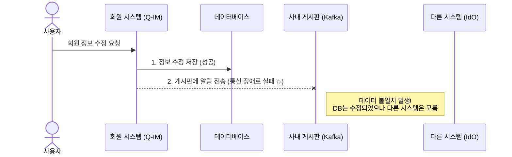
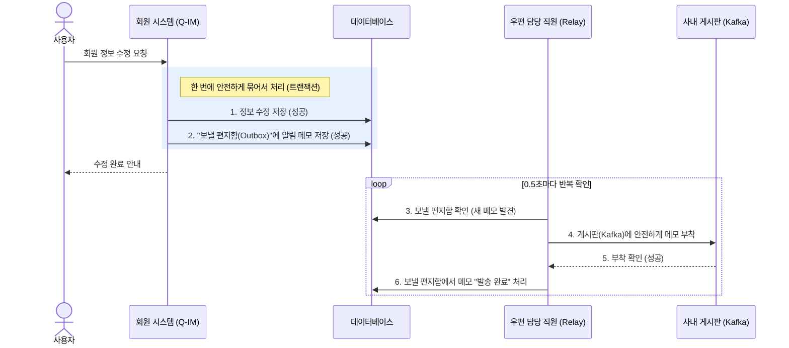
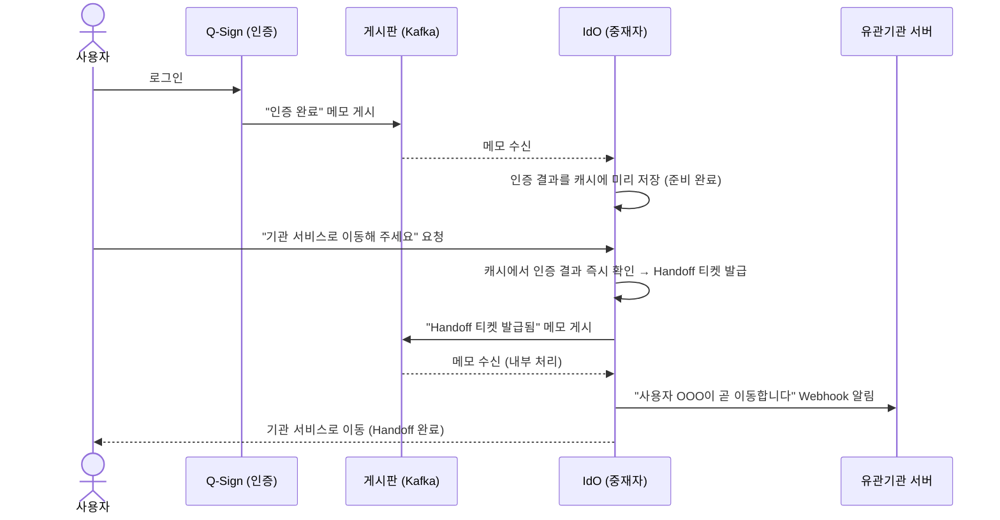
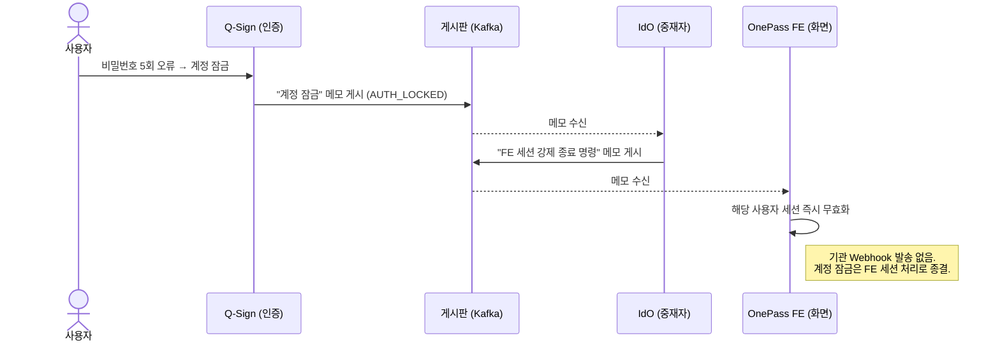
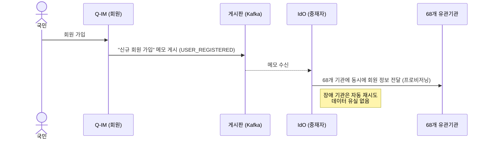
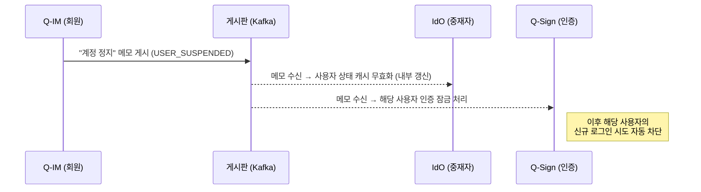

# OnePass 플랫폼: 데이터 안전 보장 및 메시지 전달 체계 가이드 (관리자/사무관용)

**문서 ID**: ARCH-KAFKA-MGR-001  
**작성일**: 2026-05-14  
**대상 독자**: 프로젝트 담당 사무관, 비즈니스 기획자, 프로젝트 관리자(PM)

---

## 1. 도입: 데이터는 어떻게 유실 없이 안전하게 전달되는가?

OnePass 플랫폼은 수백만 국민의 인증과 회원 정보를 다루는 국가 핵심 인프라입니다. 사용자가 로그인을 하거나 회원 정보를 수정할 때, 내부의 여러 시스템(인증 시스템, 회원 시스템, 중재자 시스템 등)은 서로 정보를 주고받아야 합니다.

이때 시스템 간에 직접 통신을 하게 되면, 한 시스템에 장애가 발생할 경우 다른 시스템도 멈춰버리는 **도미노 현상**이 발생할 수 있습니다.

이를 방지하기 위해 OnePass는 **Kafka(카프카)**라는 **"대용량 사내 게시판(메시지 버스)"**을 도입했습니다. 각 시스템은 서로 직접 연락하지 않고, 이 게시판에 "회원 가입 완료", "인증 완료" 등의 메모만 남기면 됩니다.

하지만 게시판에 메모를 붙이러 가는 길에 넘어지거나(네트워크 오류), 게시판이 공사 중(Kafka 서버 장애)이라면 어떻게 될까요? OnePass는 이러한 극한의 장애 상황에서도 **단 한 건의 데이터 유실도 허용하지 않는 "안전한 우편함(Outbox) 패턴"**을 적용했습니다.

---

## 2. 한 눈에 보는 비교: 일반 방식 vs OnePass의 안전한 방식

### 2.1 일반적인 시스템의 위험한 방식 (데이터 유실 가능성 존재)

일반적인 시스템은 업무 처리 후 바로 게시판(Kafka)에 메시지를 보내려 시도합니다. 이때 통신 장애가 발생하면 DB에는 정보가 저장되었지만, 다른 시스템에는 전달되지 않는 **'배달 사고'**가 발생합니다.

### 2.2 OnePass의 안전한 우편함(Outbox) 방식 (데이터 유실 제로)

OnePass는 업무 서류(DB 저장)와 알림 메모(게시판에 보낼 내용)를 **하나의 봉투에 넣고 동시에 처리(트랜잭션)**합니다. 그리고 우편 담당 직원(Relay 스케줄러)이 이 메모를 안전하게 게시판에 대신 전달합니다.

---

## 3. 장애 상황에서도 안전한 이유 (무장애 보장)

담당 사무관님께서 안심하실 수 있는 3가지 핵심 방어막입니다.

### 🛡️ 방어막 1: 사내 게시판(Kafka) 서버가 다운된다면?
만약 사내 게시판 서버가 정전으로 다운되어도 아무 문제가 없습니다.
우편 담당 직원(Relay)은 게시판이 복구될 때까지 메모를 버리지 않고 **계속해서 재시도**합니다. 데이터는 데이터베이스의 '보낼 편지함'에 안전하게 보관되어 있으므로 절대 유실되지 않습니다.

### 🛡️ 방어막 2: 우편 담당 직원(Relay)이 실수로 두 번 보낸다면?
통신 지연으로 인해 직원이 같은 메모를 게시판에 두 번 붙일 수도 있습니다.
하지만 메모를 읽는 수신자(Consumer) 시스템은 메모에 적힌 **'고유 일련번호(이벤트 ID)'**를 확인하여, 이미 처리한 메모는 똑똑하게 무시합니다. (이를 기술 용어로 '멱등성 보장'이라고 합니다.)

### 🛡️ 방어막 3: 순서가 섞이면 어떡하나요?
"회원 가입" 메모보다 "회원 탈퇴" 메모가 먼저 처리되면 시스템이 꼬일 수 있습니다.
OnePass는 같은 사용자에 대한 메모는 반드시 **동일한 번호표(파티션 키)**를 부여하여, 발행된 순서대로 정확하게 일렬로 처리되도록 보장합니다.

---

## 4. 각 시스템(팀)의 역할 요약

비즈니스 관점에서 각 시스템의 역할을 설명합니다.

### 4.1 Q-Sign (인증 담당) — 메모 작성자

사용자가 아이디/비밀번호, 소셜 로그인 등으로 **인증에 성공하거나 실패**했을 때,
그 결과를 게시판에 메모로 남깁니다.

| 상황 | 게시판에 남기는 메모 |
|------|---------------------|
| 인증 성공 | "OOO 사용자 인증이 완료되었습니다 (AUTH_COMPLETED)" |
| 인증 실패 | "OOO 사용자 인증이 실패했습니다 (AUTH_FAILED)" |
| 계정 잠금 | "OOO 사용자 계정이 잠겼습니다 (AUTH_LOCKED)" |

> **이 메모를 읽는 시스템**: IdO

---

### 4.2 Q-IM (회원정보 담당) — 메모 작성자

**회원 가입, 기업 전환, 계정 정지, 탈퇴** 등 회원 신상에 변화가 생겼을 때,
그 사실을 게시판에 메모로 남깁니다.

| 상황 | 게시판에 남기는 메모 |
|------|---------------------|
| 회원 가입 | "새 회원 OOO이 가입했습니다 (USER_REGISTERED)" |
| 기업 전환 | "OOO 사용자가 기업 회원으로 전환되었습니다 (BIZ_CONVERTED)" |
| 회원 정보 수정 | "OOO 사용자 정보가 변경되었습니다 (USER_UPDATED)" |
| 계정 정지 | "OOO 사용자 계정이 정지되었습니다 (USER_SUSPENDED)" |
| 회원 탈퇴 | "OOO 사용자가 탈퇴하였습니다 (USER_WITHDRAWN)" |

> **이 메모를 읽는 시스템**: IdO와 Q-Sign **둘 다** 이 게시판을 읽습니다.
> - **IdO**: 회원 가입·기업 전환 메모를 받으면 68개 기관에 회원 정보를 전달합니다. 나머지 메모는 내부 캐시를 최신 상태로 갱신합니다.
> - **Q-Sign(인증 시스템)**: 계정 정지·탈퇴 메모를 받으면 해당 사용자의 신규 인증 시도를 즉시 차단합니다.

---

### 4.3 IdO (중재자 시스템) — 메모 읽기 + 새 메모 작성

IdO는 가장 복잡한 역할을 맡습니다. **다른 시스템의 메모를 읽는 동시에, 자신도 새로운 메모를 작성**합니다.

#### ① 읽는 메모 (Consumer)

| 읽는 메모 출처 | 수신하는 상황 | IdO가 하는 일 |
|--------------|-------------|--------------| 
| **Q-Sign** | 인증 성공 (AUTH_COMPLETED) | 해당 인증 결과를 고속 캐시(Redis)에 미리 저장 → 기관 이동(Handoff) 요청 즉시 처리 준비 |
| **Q-Sign** | 계정 잠금 (AUTH_LOCKED) | 해당 사용자의 웹 화면(FE) 세션을 즉시 강제 종료 |
| **Q-Sign** | 인증 실패 (AUTH_FAILED) | 실패 기록 저장 (감사 로그) |
| **Q-IM** | 회원 가입 (USER_REGISTERED) / 기업 전환 (BIZ_CONVERTED) | 연동된 68개 기관 모두에 회원 정보 전달 (프로비저닝) |
| **Q-IM** | 정보 수정 (USER_UPDATED) / 계정 정지 (USER_SUSPENDED) / 탈퇴 (USER_WITHDRAWN) | 내부 캐시 무효화 → 다음 요청 시 최신 정보 재조회 |
| **IdO 내부** | Handoff 티켓 발급됨 | 기관 서버에 "사용자가 이동 중입니다" 알림(Webhook) 발송 준비 |

#### ② 새로 작성하는 메모 (Producer)

IdO는 자신의 업무를 처리한 뒤, 그 결과를 다시 게시판에 남겨 감사 추적과 연계 처리를 가능하게 합니다.

| IdO가 작성하는 메모 | 게시판 | 이유 |
|--------------------|--------|------|
| Handoff 티켓 발급/소비/만료/취소 | `ido.handoff.events` | 기관 Webhook 트리거 + 감사 기록 |
| FE 세션 강제 종료 명령 | `platform.session.advisory` | FE가 즉시 해당 사용자 세션 무효화 |
| 플랫폼 전역 감사 로그 | `platform.audit.log` | 법적 감사 추적 (5년 보존) |

> **핵심 설명**: 기관들은 OnePass 내부 게시판(Kafka)에 직접 접속할 수 없습니다. 따라서 IdO가 게시판에서 메모를 읽은 후, **HTTPS 방식의 "알림 전화(Webhook)"**를 각 기관 서버에 직접 걸어 알려주는 방식으로 연동합니다. 이 기관 알림은 **Handoff 티켓 발급/취소** 상황에서만 발송됩니다. 계정 잠금(AUTH_LOCKED)은 기관 Webhook 없이 내부 FE 세션 처리로만 종결됩니다.

---

## 5. 전체 흐름 한 눈에 보기 (비즈니스 시나리오)

### 시나리오 A: 사용자가 로그인 후 기관 서비스로 이동하는 경우

### 시나리오 B: 비밀번호 5회 오류로 계정이 잠기는 경우

계정 잠금은 **FE 세션 강제 종료**로 처리됩니다. 기관 Webhook 발송은 이루어지지 않습니다.

### 시나리오 C: 신규 회원 가입 시 68개 기관 전파

### 시나리오 D: 계정 정지 또는 탈퇴 시 인증 차단

계정 정지(USER_SUSPENDED)·탈퇴(USER_WITHDRAWN)는 **Q-Sign이 신규 인증을 즉시 차단**합니다.

---

## 6. 결론: "시스템은 각자의 전문 역할에만 집중합니다"

| 시스템 | 핵심 역할 | Kafka에서 하는 일 |
|--------|----------|-----------------| 
| **Q-Sign** | 국민 인증 | 인증 결과만 게시판에 알림. 계정 정지·탈퇴 메모를 받으면 신규 인증 차단 |
| **Q-IM** | 회원 정보 관리 | 회원 변경 사실만 게시판에 알림 |
| **IdO** | 기관 연동·조율 | 알림을 읽고 적절한 후속 조치 실행, 필요 시 새 알림 작성 |

이러한 **안전한 우편함(Outbox) 체계**가 플랫폼 밑바탕에 완벽히 구축되어 있기 때문에, 각 시스템은 자신의 전문 영역에만 집중할 수 있습니다.

- Q-Sign 팀: "어떻게 사용자를 안전하게 인증할 것인가?"
- Q-IM 팀: "어떻게 회원 정보를 정확하게 관리할 것인가?"
- IdO 팀: "어떻게 68개 기관과 원활하게 연동할 것인가?"

OnePass 플랫폼은 대규모 트래픽(동시 6만 명)과 예상치 못한 인프라 장애 속에서도 굳건하게 데이터를 지켜내는 국가대표급 안정성을 자랑합니다.
