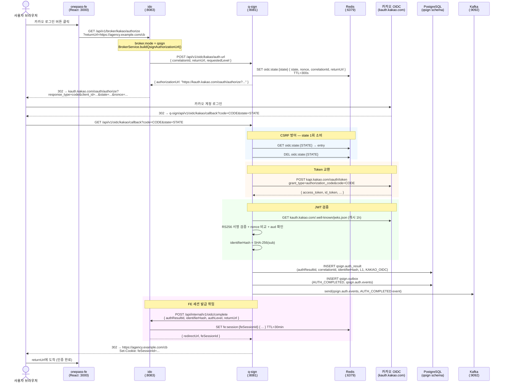
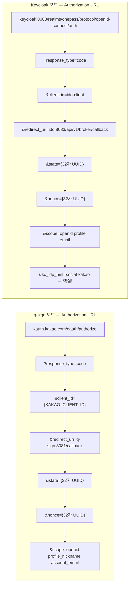
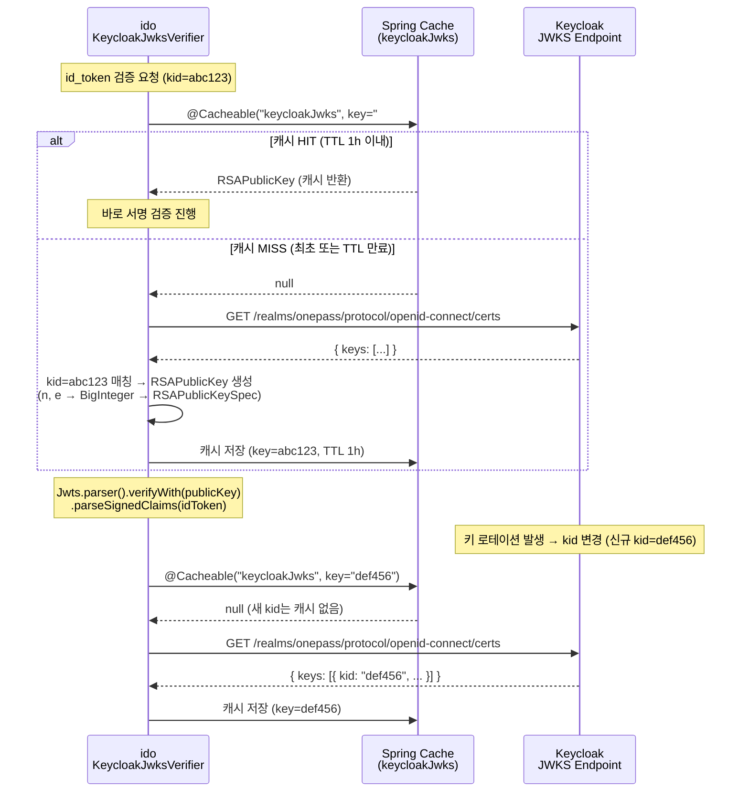
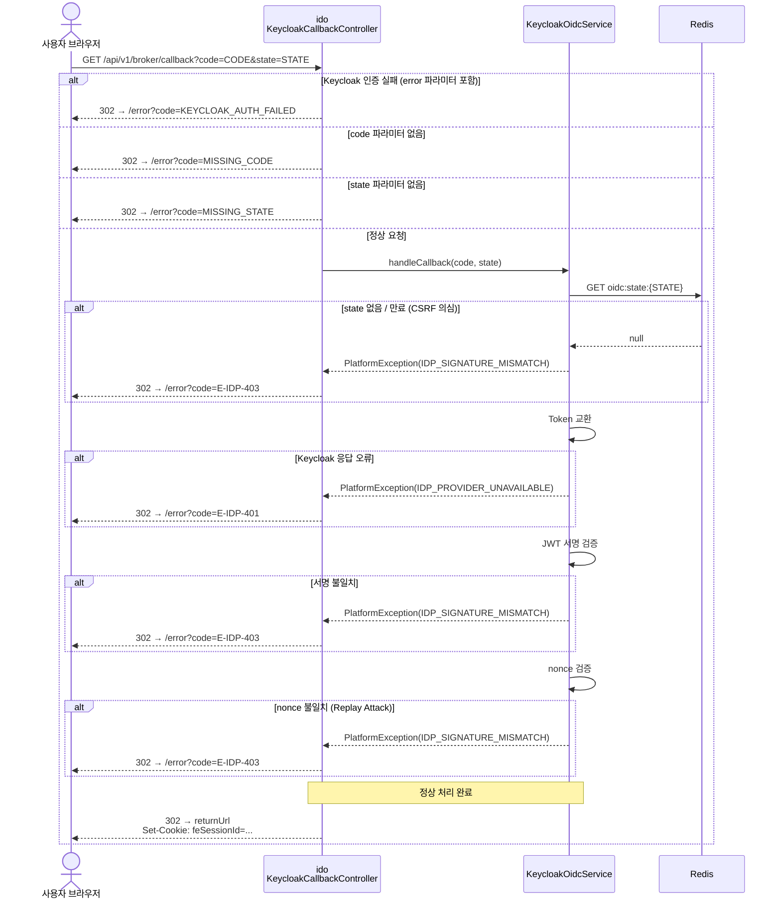
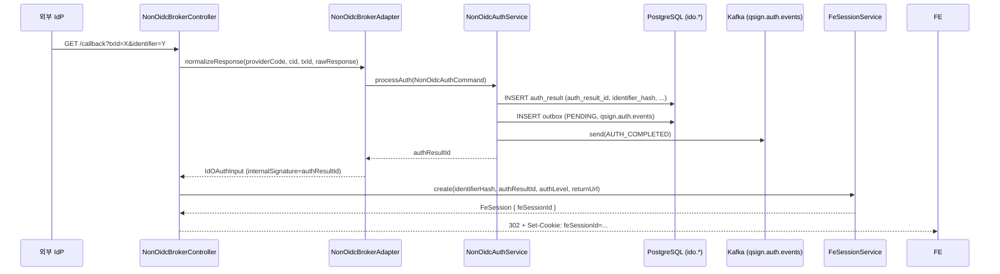
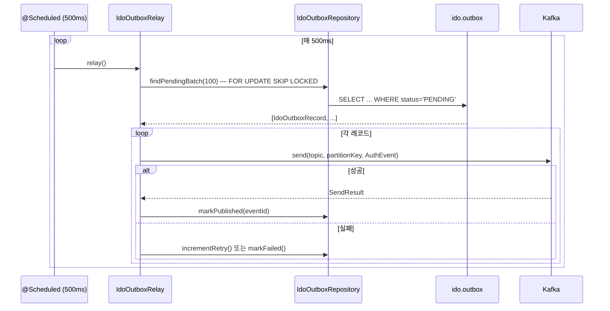

# OnePass 통합인증 플랫폼 — OIDC 브로커링 설계서

> **문서 분류**: 개발자 배포용 설계서 (Developer Design Document)  
> **버전**: v1.2.0  
> **최종 수정**: 2026-05-06  
> **대상 독자**: 백엔드 개발자, 인프라 엔지니어, 보안 검토자  
> **관련 모듈**: `ido`, `q-sign`, `onepass-fe`

---

## 목차

1. [개요 및 목적](#1-개요-및-목적)
2. [아키텍처 전체 구조](#2-아키텍처-전체-구조)
3. [브로커링 이중 모드 설계](#3-브로커링-이중-모드-설계)
4. [q-sign 직접 브로커 모드 (qsign mode)](#4-q-sign-직접-브로커-모드-qsign-mode)
5. [Keycloak OIDC 브로커 모드 (keycloak mode)](#5-keycloak-oidc-브로커-모드-keycloak-mode)
6. [시퀀스 다이어그램 — 전체 흐름 비교](#6-시퀀스-다이어그램--전체-흐름-비교)
7. [보안 설계](#7-보안-설계)
8. [데이터 모델](#8-데이터-모델)
9. [Keycloak 서버 설정 가이드](#9-keycloak-서버-설정-가이드)
10. [환경별 설정](#10-환경별-설정)
11. [에러 처리 및 에러 코드](#11-에러-처리-및-에러-코드)
12. [모드 전환 운영 절차](#12-모드-전환-운영-절차)
13. [클래스 책임 맵](#13-클래스-책임-맵)
14. [API 명세](#14-api-명세)
15. [모니터링 및 장애 대응](#15-모니터링-및-장애-대응)
16. [개발 환경 시작 가이드](#16-개발-환경-시작-가이드)

---

## 1. 개요 및 목적

### 1.1 배경

OnePass 통합인증 플랫폼은 **카카오, 네이버 등 외부 OIDC 사업자**를 통한 간편인증을 중개(브로커링)하는 플랫폼이다. 본 문서는 인증 브로커링의 두 가지 구현 전략을 상세히 설명한다.

| 구분 | q-sign 직접 브로커 (현재) | Keycloak OIDC 브로커 (전환 후) |
|------|--------------------------|-------------------------------|
| 브로커 역할 | `q-sign` Spring Boot 서비스 | Keycloak (Red Hat SSO) |
| OIDC 코드 교환 | `q-sign`이 직접 카카오 Token Endpoint 호출 | `ido`가 Keycloak Token Endpoint 호출 |
| JWT 검증 | `q-sign`의 `KakaoJwksVerifier` | `ido`의 `KeycloakJwksVerifier` |
| AuthResult 생성 | `q-sign.auth_result` 테이블 | `ido.auth_result` 테이블 (Strategy B) |
| FE 세션 발급 | q-sign → ido 내부 API 호출 | ido가 직접 발급 |
| 전환 방법 | — | `IDO_BROKER_MODE=keycloak` 환경변수 |

### 1.2 설계 원칙

- **무중단 전환**: `ido.broker.mode` 설정 하나로 q-sign ↔ Keycloak 전환 (코드 변경 없음)
- **하위 컨슈머 불변**: 두 모드 모두 동일한 Kafka 토픽(`qsign.auth.events`)으로 `AUTH_COMPLETED` 이벤트 발행 → 하위 소비자(`QsignAuthEventConsumer` 등) 변경 불필요
- **보안 우선**: CSRF(state), Replay Attack(nonce), JWT 위조(JWKS RS256), Audience 검증 등 4중 방어
- **감사 추적**: 모든 브로커링 과정은 `ido.oidc_session_log` + Kafka 이벤트로 추적 가능

### 1.3 용어 정의

| 용어 | 정의 |
|------|------|
| `ido` | Identity Orchestrator — 정책 오케스트레이터 서비스 (port 8083) |
| `q-sign` | Q-Sign — 인증 처리 서비스, 기존 브로커 역할 담당 (port 8081) |
| `onepass-fe` | React SPA 프론트엔드 (port 3000/3001) |
| `correlationId` | 단일 인증 요청의 전 과정 추적 UUID |
| `identifierHash` | SHA-256(사용자 고유 식별자 sub) — PII 직접 노출 방지 |
| `state` | CSRF 방어용 opaque 랜덤 값 (32자 UUID) |
| `nonce` | ID Token Replay Attack 방어용 랜덤 값 (32자 UUID) |
| `kc_idp_hint` | Keycloak에 특정 IdP(카카오 등)로 바로 리다이렉트하도록 지시하는 파라미터 |
| `acr` | Authentication Context Class Reference — 인증 수준 (1=L1, 2=L2, 3=L3) |
| `AuthLevel` | 플랫폼 인증 수준 (L1: 간편, L2: 본인인증, L3: 공인인증서) |

---

## 2. 아키텍처 전체 구조

```
┌───────────────────────────────────────────────────────────────────────────┐
│                        onepass-fe (React SPA)                             │
│                    http://localhost:3000  /  3001                         │
└───────────────────────────────┬───────────────────────────────────────────┘
                                │  GET /api/v1/broker/{provider}/authorize
                                ▼
┌───────────────────────────────────────────────────────────────────────────┐
│                              ido (:8083)                                   │
│                                                                           │
│  ┌─────────────────────┐    ┌──────────────────────────────────────────┐  │
│  │  BrokerController   │    │           BrokerService                  │  │
│  │ GET /{provider}/    │───▶│  mode=qsign  ──▶  q-sign 위임           │  │
│  │     authorize       │    │  mode=keycloak ▶  Keycloak URL 직접생성 │  │
│  └─────────────────────┘    └──────────────────────────────────────────┘  │
│                                                                           │
│  ┌──────────────────────────────────────────────────────────────────────┐ │
│  │   KeycloakCallbackController  GET /api/v1/broker/callback            │ │
│  │   (keycloak 모드 전용)                                                │ │
│  │   ┌──────────────────────────────────────────────────────────────┐   │ │
│  │   │  KeycloakOidcService                                         │   │ │
│  │   │   1. state 검증 (Redis 1회 소비)                              │   │ │
│  │   │   2. code → token 교환 (Keycloak Token EP)                   │   │ │
│  │   │   3. id_token JWKS 서명 검증 (KeycloakJwksVerifier)          │   │ │
│  │   │   4. nonce + audience 검증                                    │   │ │
│  │   │   5. identifierHash = SHA-256(sub)                           │   │ │
│  │   │   6. ido.auth_result INSERT (Strategy B)                     │   │ │
│  │   │   7. ido.outbox INSERT → Kafka qsign.auth.events             │   │ │
│  │   │   8. FE 세션 생성 → feSessionId 쿠키                          │   │ │
│  │   └──────────────────────────────────────────────────────────────┘   │ │
│  └──────────────────────────────────────────────────────────────────────┘ │
│                                                                           │
│  ┌──────────────────────────────────────────────────────────────────────┐ │
│  │   OidcCompleteController  POST /api/internal/v1/oidc/complete        │ │
│  │   (qsign 모드 전용 — q-sign이 호출)                                   │ │
│  └──────────────────────────────────────────────────────────────────────┘ │
└─────────────┬──────────────────────────────┬──────────────────────────────┘
              │                              │
     qsign mode                     keycloak mode
              │                              │
              ▼                              ▼
┌─────────────────────┐       ┌──────────────────────────┐
│    q-sign (:8081)   │       │   Keycloak (:8088)        │
│                     │       │                          │
│  KakaoOidcBroker    │       │  Realm: onepass          │
│  ├ StateStore (R.)  │       │  Client: ido-client      │
│  ├ KakaoJwksVerif.  │       │  IdP: social-kakao       │
│  └ AuthResultRepo   │       │      social-naver        │
└──────────┬──────────┘       └─────────────┬────────────┘
           │                                │
           ▼                                ▼
  kauth.kakao.com                  kauth.kakao.com
  (Kakao OIDC AS)                  (Kakao OIDC AS)
  [q-sign 직접 연결]               [Keycloak → 카카오]
```

---

## 3. 브로커링 이중 모드 설계

### 3.1 모드 전환 메커니즘

모드 전환은 **단일 환경변수** 변경만으로 가능하다. 코드 수정, 재컴파일, 서비스 재구성이 필요없다.

```yaml
# ido/src/main/resources/application.yml
ido:
  broker:
    mode: ${IDO_BROKER_MODE:qsign}   # qsign | keycloak
```

| 환경변수 값 | 동작 | 비고 |
|------------|------|------|
| `qsign` (기본) | 기존 q-sign 서비스에 URL 발급 위임 | q-sign 서비스 가동 필요 |
| `keycloak` | ido가 직접 Keycloak URL 생성 및 콜백 수신 | Keycloak 서버 가동 필요 |

### 3.2 BrokerService 분기 로직

```java
// BrokerService.buildAuthorizationUrl()
return switch (brokerMode) {
    case "keycloak" -> buildKeycloakAuthorizationUrl(provider, correlationId, returnUrl, requestedLevel);
    case "qsign"    -> buildQsignAuthorizationUrl(provider, correlationId, returnUrl, requestedLevel);
    default -> {
        log.warn("알 수 없는 브로커 모드: {} — qsign 폴백", brokerMode);
        yield buildQsignAuthorizationUrl(provider, correlationId, returnUrl, requestedLevel);
    }
};
```

> **안전 폴백**: 알 수 없는 모드 값은 자동으로 `qsign`으로 폴백하여 서비스 중단을 방지한다.

### 3.3 콜백 엔드포인트 비교

| 구분 | q-sign 모드 | Keycloak 모드 |
|------|------------|---------------|
| OIDC 콜백 수신자 | `q-sign` `/api/v1/oidc/kakao/callback` | `ido` `/api/v1/broker/callback` |
| FE 세션 발급 | q-sign → ido POST `/api/internal/v1/oidc/complete` | ido 자체 발급 |
| `OidcCompleteController` | **활성** — q-sign이 호출 | **비활성** — 409 반환 |
| `KeycloakCallbackController` | **비활성** — 409 반환 | **활성** |

---

## 4. q-sign 직접 브로커 모드 (qsign mode)

### 4.1 책임 분리

```
FE(browser) → ido BrokerController → q-sign KakaoAuthUrlController
                                           ↓
                                     state/nonce 생성 (Redis)
                                           ↓
                                   Kakao Authorization URL 반환
                                           ↓ (302 redirect chain)
FE(browser) → kauth.kakao.com → [카카오 로그인]
                                           ↓
                              q-sign KakaoOidcBrokerController
                                    (콜백 수신: code, state)
                                           ↓
                              1. state 검증 (Redis 소비)
                              2. code → token 교환 (카카오 Token EP)
                              3. id_token JWKS 검증 (KakaoJwksVerifier)
                              4. identifierHash = SHA-256(sub)
                              5. AuthResult INSERT (qsign.auth_result)
                              6. Outbox INSERT → Kafka qsign.auth.events
                              7. ido POST /api/internal/v1/oidc/complete
                                           ↓
                              ido OidcCompleteController
                              8. FE 세션 생성 (Redis)
                              9. feSessionId 쿠키 Set
                             10. redirectUrl 반환
                                           ↓
                              q-sign 302 → returnUrl
```

### 4.2 q-sign 모드 핵심 클래스

| 클래스 | 위치 | 역할 |
|--------|------|------|
| `BrokerController` | `ido/broker/` | `/api/v1/broker/kakao/authorize` 수신 → q-sign 위임 |
| `BrokerService.buildQsignAuthorizationUrl()` | `ido/broker/` | q-sign POST `/api/v1/oidc/kakao/auth-url` 호출 |
| `KakaoAuthUrlController` | `q-sign/broker/oidc/` | Authorization URL 발급 엔드포인트 |
| `KakaoOidcBrokerService` | `q-sign/broker/oidc/` | 전체 콜백 처리 오케스트레이션 |
| `KakaoOidcClient` | `q-sign/broker/oidc/` | 카카오 OIDC Token EP 호출 + 검증 |
| `KakaoJwksVerifier` | `q-sign/broker/oidc/` | 카카오 JWKS RS256 서명 검증 (캐시 적용) |
| `OidcStateStore` | `q-sign/broker/state/` | state/nonce Redis 저장·검증 |
| `OidcCompleteController` | `ido/broker/` | q-sign으로부터 완료 통보 수신 → FE 세션 발급 |

### 4.3 내부 API 연동 (q-sign → ido)

```http
POST /api/internal/v1/oidc/complete
Host: ido:8083
X-Internal-Caller: q-sign
X-Internal-Sig: {HMAC-SHA256 서명}
X-Correlation-Id: {correlationId}
Content-Type: application/json

{
  "correlationId":  "uuid",
  "authResultId":   "uuid",
  "identifierHash": "sha256hex",
  "authLevel":      "L1",
  "returnUrl":      "https://agency.example.com/callback"
}
```

**응답**:
```json
{
  "redirectUrl": "https://agency.example.com/callback",
  "feSessionId": "uuid"
}
```

> **보안 주의**: `X-Internal-Sig`는 PoC 수준의 단순 서명이다. 운영 환경에서는 **mTLS** 또는 **HMAC-SHA256(correlationId + timestamp, sharedSecret)** 방식으로 강화해야 한다.

---

## 5. Keycloak OIDC 브로커 모드 (keycloak mode)

### 5.1 Strategy B — IdO AuthResult 직접 생성

Keycloak 모드에서는 q-sign이 콜백을 수신하지 않는다. 대신 ido가 모든 책임을 직접 담당한다.

```
Strategy A (기존 q-sign 모드):
  q-sign이 AuthResult 생성 → qsign.auth_result 테이블
  q-sign이 qsign.auth.events Kafka 토픽 발행

Strategy B (Keycloak 모드, §8.3):
  ido가 AuthResult 직접 생성 → ido.auth_result 테이블
  ido가 qsign.auth.events Kafka 토픽 발행 (동일 토픽 — 하위 컨슈머 변경 없음)
```

### 5.2 Keycloak 모드 핵심 클래스

| 클래스 | 위치 | 역할 |
|--------|------|------|
| `BrokerController` | `ido/broker/` | `/api/v1/broker/{provider}/authorize` 수신 |
| `BrokerService.buildKeycloakAuthorizationUrl()` | `ido/broker/` | Keycloak Auth URL 직접 생성 + state/nonce Redis 저장 |
| `KeycloakCallbackController` | `ido/broker/keycloak/` | `GET /api/v1/broker/callback` — Keycloak 콜백 수신 |
| `KeycloakOidcService` | `ido/broker/keycloak/` | 콜백 처리 전 과정 오케스트레이션 (11단계) |
| `KeycloakJwksVerifier` | `ido/broker/keycloak/` | Keycloak JWKS RS256 서명 검증 (캐시 적용) |
| `KeycloakProperties` | `ido/broker/keycloak/` | Keycloak 연동 설정 (`ido.keycloak.*`) |
| `IdoOidcStateStore` | `ido/broker/state/` | state/nonce Redis 저장·검증 (1회 소비) |
| `IdoOidcStateEntry` | `ido/broker/state/` | Redis 저장 state 엔트리 DTO |
| `KeycloakJwtClaims` | `ido/broker/keycloak/dto/` | id_token JWT 클레임 DTO |
| `KeycloakTokenResponse` | `ido/broker/keycloak/dto/` | Token Endpoint 응답 DTO |

### 5.3 Keycloak 모드 처리 단계 (KeycloakOidcService.handleCallback)

```
단계 1: state 검증
  ┌─────────────────────────────────────────────────────────────┐
  │ Redis oidc:state:{state} 조회 → 존재하면 즉시 삭제 (1회 소비) │
  │ 없거나 만료 → PlatformException(IDP_SIGNATURE_MISMATCH)     │
  └─────────────────────────────────────────────────────────────┘

단계 2: Authorization Code → Token 교환
  ┌─────────────────────────────────────────────────────────────┐
  │ POST {keycloak}/realms/{realm}/protocol/openid-connect/token │
  │ Body: grant_type=authorization_code                          │
  │       code={code}                                            │
  │       redirect_uri={ido.keycloak.redirect-uri}               │
  │       client_id={ido.keycloak.client-id}                     │
  │       client_secret={ido.keycloak.client-secret}             │
  │ → KeycloakTokenResponse { access_token, id_token, ... }      │
  └─────────────────────────────────────────────────────────────┘

단계 3: id_token JWKS 서명 검증
  ┌─────────────────────────────────────────────────────────────┐
  │ JWT 헤더에서 kid 추출                                         │
  │ GET {keycloak}/realms/{realm}/protocol/openid-connect/certs  │
  │ → kid 매칭 RSA 공개키 조회 (캐시 1h)                          │
  │ → Jwts.parser().verifyWith(publicKey).parseSignedClaims()    │
  └─────────────────────────────────────────────────────────────┘

단계 4: nonce 검증 (Replay Attack 방지)
  ┌─────────────────────────────────────────────────────────────┐
  │ id_token.nonce == Redis에 저장된 entry.nonce 비교             │
  │ 불일치 → PlatformException(IDP_SIGNATURE_MISMATCH)           │
  └─────────────────────────────────────────────────────────────┘

단계 5: audience 검증
  ┌─────────────────────────────────────────────────────────────┐
  │ id_token.aud 포함 여부 확인: ido.keycloak.client-id           │
  │ 불일치 → PlatformException(IDP_SIGNATURE_MISMATCH)           │
  └─────────────────────────────────────────────────────────────┘

단계 6: identifierHash 생성
  ┌─────────────────────────────────────────────────────────────┐
  │ identifierHash = HexFormat(SHA-256(sub.getBytes(UTF-8)))     │
  │ 64자 hex 문자열 — PII(sub) 직접 저장 방지                     │
  └─────────────────────────────────────────────────────────────┘

단계 7: providerCode 결정
  ┌─────────────────────────────────────────────────────────────┐
  │ id_token.identity_provider 클레임 → resolveProviderCode()    │
  │ social-kakao → KAKAO_OIDC                                    │
  │ social-naver → NAVER_OIDC                                    │
  │ 없으면 stateEntry.provider 사용 (fallback)                    │
  └─────────────────────────────────────────────────────────────┘

단계 8: AuthResult 생성 + DB 저장
  ┌─────────────────────────────────────────────────────────────┐
  │ INSERT INTO ido.auth_result                                  │
  │   (auth_result_id, correlation_id, auth_level,              │
  │    provider_code, provider_tx_id, identifier_hash,          │
  │    verification_result='SUCCESS', source_system='ido-kc')   │
  └─────────────────────────────────────────────────────────────┘

단계 9: Outbox 이벤트 저장 + Kafka 즉시 발행
  ┌─────────────────────────────────────────────────────────────┐
  │ INSERT INTO ido.outbox (AUTH_COMPLETED, qsign.auth.events)  │
  │ KafkaTemplate.send(authEventsTopic, identifierHash, event)  │
  │ Kafka 실패 → 경고 로그만, Outbox relay가 재처리              │
  └─────────────────────────────────────────────────────────────┘

단계 10: FE 세션 생성
  ┌─────────────────────────────────────────────────────────────┐
  │ FeSessionService.create(identifierHash, authResultId,       │
  │                          authLevel, returnUrl)              │
  │ → Redis fe:session:{feSessionId} 저장                        │
  │ → 슬라이딩 TTL 30분 / 절대 만료 8시간                         │
  └─────────────────────────────────────────────────────────────┘

단계 11: OIDC 세션 로그 기록
  ┌─────────────────────────────────────────────────────────────┐
  │ INSERT INTO ido.oidc_session_log (감사 목적)                  │
  │ 저장 실패 → 경고 로그, 인증 흐름은 계속 진행                   │
  └─────────────────────────────────────────────────────────────┘
```

---

## 6. 시퀀스 다이어그램 — 전체 흐름 비교

### 6.1 q-sign 모드 전체 시퀀스



---

### 6.2 Keycloak 모드 전체 시퀀스

```mermaid
sequenceDiagram
    actor User as 사용자 브라우저
    participant FE as onepass-fe<br/>(React :3000)
    participant IDO as ido<br/>(:8083)
    participant KC as Keycloak<br/>(:8088)
    participant KAKAO as 카카오 OIDC<br/>(kauth.kakao.com)
    participant REDIS as Redis<br/>(:6379)
    participant DB as PostgreSQL<br/>(ido schema)
    participant KAFKA as Kafka<br/>(:9092)

    User->>FE: 카카오 로그인 버튼 클릭
    FE->>IDO: GET /api/v1/broker/kakao/authorize<br/>?returnUrl=https://agency.example.com/cb

    Note over IDO: broker.mode = keycloak<br/>BrokerService.buildKeycloakAuthorizationUrl()

    IDO->>REDIS: SET oidc:state:{state} { state, nonce, correlationId,<br/>returnUrl, provider='kakao' }<br/>TTL=300s
    IDO-->>User: 302 → keycloak:8088/realms/onepass/protocol/openid-connect/auth?<br/>response_type=code<br/>&client_id=ido-client<br/>&redirect_uri=http://ido:8083/api/v1/broker/callback<br/>&scope=openid profile email<br/>&state={state}<br/>&nonce={nonce}<br/>&kc_idp_hint=social-kakao

    User->>KC: Keycloak 로그인 페이지 접속
    
    rect rgb(240, 248, 255)
        Note over KC,KAKAO: Keycloak → 카카오 IdP 브로커링
        KC->>KAKAO: 카카오 OAuth2 Authorization URL 리다이렉트<br/>(kc_idp_hint=social-kakao에 의해 자동 선택)
        User->>KAKAO: 카카오 계정 로그인
        KAKAO-->>KC: 302 → Keycloak callback?code=KC_CODE
        KC->>KAKAO: POST kapi.kakao.com/oauth/token (Keycloak 내부 처리)
        KC->>KC: 카카오 토큰 검증, 사용자 정보 매핑
    end

    KC-->>User: 302 → ido:8083/api/v1/broker/callback?<br/>code=IDO_CODE&state={state}

    User->>IDO: GET /api/v1/broker/callback?code=IDO_CODE&state={state}
    
    Note over IDO: KeycloakCallbackController → KeycloakOidcService.handleCallback()
    
    rect rgb(240, 248, 255)
        Note over IDO,REDIS: 단계 1: CSRF 방어 — state 1회 소비
        IDO->>REDIS: GET oidc:state:{STATE} → { state, nonce, correlationId, ... }
        IDO->>REDIS: DEL oidc:state:{STATE}
    end

    rect rgb(255, 248, 240)
        Note over IDO,KC: 단계 2: Token 교환
        IDO->>KC: POST /realms/onepass/protocol/openid-connect/token<br/>grant_type=authorization_code&code=IDO_CODE<br/>&client_id=ido-client&client_secret=***
        KC-->>IDO: { access_token, id_token (JWT), refresh_token, ... }
    end

    rect rgb(240, 255, 240)
        Note over IDO,KC: 단계 3–5: JWT 검증
        IDO->>KC: GET /realms/onepass/protocol/openid-connect/certs<br/>(JWKS 조회 — 캐시 1h)
        KC-->>IDO: { keys: [ { kid, kty=RSA, use=sig, n, e } ] }
        IDO->>IDO: RS256 서명 검증 (kid 매칭 공개키)
        IDO->>IDO: nonce 검증 (id_token.nonce == Redis entry.nonce)
        IDO->>IDO: audience 검증 (id_token.aud contains 'ido-client')
    end

    rect rgb(255, 255, 240)
        Note over IDO,IDO: 단계 6–7: 식별자 처리
        IDO->>IDO: identifierHash = HexFormat(SHA-256(sub))
        IDO->>IDO: providerCode = resolveProviderCode(identity_provider)<br/>social-kakao → KAKAO_OIDC
    end

    rect rgb(255, 240, 240)
        Note over IDO,DB: 단계 8: Strategy B — IdO가 AuthResult 직접 저장
        IDO->>DB: INSERT ido.auth_result<br/>(authResultId, correlationId, L1, KAKAO_OIDC,<br/> identifierHash, 'SUCCESS', 'ido-keycloak')
    end

    rect rgb(240, 240, 255)
        Note over IDO,KAFKA: 단계 9: Outbox 이벤트 → Kafka (기존 토픽 동일)
        IDO->>DB: INSERT ido.outbox<br/>(AUTH_COMPLETED, topic=qsign.auth.events, PENDING)
        IDO->>KAFKA: send(qsign.auth.events, AUTH_COMPLETED)<br/>{ authResultId, identifierHash, authLevel=L1, ... }
    end

    rect rgb(240, 255, 255)
        Note over IDO,REDIS: 단계 10: FE 세션 생성
        IDO->>REDIS: SET fe:session:{feSessionId} { ... } TTL=30min
    end

    IDO->>DB: INSERT ido.oidc_session_log (감사)
    IDO-->>User: 302 → https://agency.example.com/cb<br/>Set-Cookie: feSessionId=...; HttpOnly; Secure; SameSite=Lax

    User->>FE: returnUrl에 도착 (인증 완료)
```

---

### 6.3 Authorization URL 구조 비교



### 6.4 JWKS 캐시 및 키 로테이션 시퀀스



### 6.5 에러 처리 흐름



---

## 7. 보안 설계

### 7.1 4중 보안 방어 계층

```
┌─────────────────────────────────────────────────────────────────────────┐
│  Layer 1: CSRF 방어 — state 파라미터                                      │
│  ─────────────────────────────────────────────────────────────────────  │
│  • state = UUID.randomUUID().toString().replace("-","") (32자)           │
│  • Redis 저장: oidc:state:{state} TTL=300초                              │
│  • 콜백 수신 즉시 1회 소비(DEL) → 재사용 불가                              │
│  • state 없거나 만료 → IDP_SIGNATURE_MISMATCH (즉시 거부)                 │
└─────────────────────────────────────────────────────────────────────────┘
┌─────────────────────────────────────────────────────────────────────────┐
│  Layer 2: Replay Attack 방어 — nonce                                     │
│  ─────────────────────────────────────────────────────────────────────  │
│  • nonce = UUID.randomUUID().toString().replace("-","") (32자)           │
│  • Keycloak이 id_token.nonce에 그대로 포함해야 함 (§10-5 설정 필요)        │
│  • 콜백 처리 시: id_token.nonce == Redis entry.nonce 비교                 │
│  • 불일치 → IDP_SIGNATURE_MISMATCH                                       │
│  • 보조: ido.oidc_nonce_used 테이블에 사용 이력 기록                       │
└─────────────────────────────────────────────────────────────────────────┘
┌─────────────────────────────────────────────────────────────────────────┐
│  Layer 3: JWT 위조 방어 — JWKS RS256 서명 검증                            │
│  ─────────────────────────────────────────────────────────────────────  │
│  • 알고리즘: RS256 (비대칭키, 위조 불가)                                   │
│  • kid 기반 공개키 조회: GET /realms/{realm}/openid-connect/certs        │
│  • 캐시: @Cacheable("keycloakJwks") TTL=1h                              │
│  • 키 로테이션: 새 kid → 자동 캐시 갱신 (kid별 독립 캐시)                  │
│  • 검증 실패 → IDP_SIGNATURE_MISMATCH                                    │
└─────────────────────────────────────────────────────────────────────────┘
┌─────────────────────────────────────────────────────────────────────────┐
│  Layer 4: Audience 검증                                                  │
│  ─────────────────────────────────────────────────────────────────────  │
│  • id_token.aud 포함 여부: ido.keycloak.client-id ('ido-client')         │
│  • 다른 클라이언트용 토큰으로 위장 시도 차단                                │
│  • 불일치 → IDP_SIGNATURE_MISMATCH                                       │
└─────────────────────────────────────────────────────────────────────────┘
```

### 7.2 개인정보 보호

| 항목 | 처리 방법 |
|------|----------|
| Kakao `sub` (고유 식별자) | SHA-256 해시 후 64자 hex로 저장 (`identifierHash`) |
| `sub` 원본 | `ido.oidc_session_log.provider_subject` 에만 저장 — 운영 환경 암호화 권고 |
| `email` | id_token에 포함되나 별도 저장 안 함 (PoC) — 운영 시 필요 시 별도 설계 |
| FE 세션 ID | SecureRandom 256비트 → Base64 URL-safe 인코딩 |

### 7.3 쿠키 보안 설정

```java
ResponseCookie cookie = ResponseCookie.from("feSessionId", session.getFeSessionId())
    .httpOnly(true)   // JavaScript 접근 차단 (XSS 방어)
    .secure(true)     // HTTPS 전송만 허용
    .sameSite("Lax")  // CSRF 방어 (동일 사이트 요청만 전송)
    .path("/")        // 전체 경로
    .build();
```

### 7.4 내부 서비스 간 인증 (q-sign → ido)

```
현재 (PoC): X-Internal-Sig: sig-{correlationId.substring(0,8)}
운영 권고:  X-Internal-Sig: HMAC-SHA256(correlationId + ":" + timestamp, sharedSecret)
최고 수준:  mTLS (mutual TLS) — 클라이언트 인증서 기반
```

---

## 8. 데이터 모델

### 8.1 V3 마이그레이션 테이블 목록

| 테이블 | 스키마 | 목적 |
|--------|--------|------|
| `ido.auth_result` | ido | Strategy B — Keycloak 모드 AuthResult SoR |
| `ido.auth_lock` | ido | 연속 인증 실패 잠금 |
| `ido.oidc_session_log` | ido | Keycloak OIDC 세션 감사 이력 |
| `ido.oidc_nonce_used` | ido | nonce 사용 이력 (replay 방지 보조) |
| `ido.provider_config` | ido | 인증 수단별 AuthLevel/모드 설정 |

### 8.2 ido.auth_result 스키마

```sql
CREATE TABLE ido.auth_result (
    auth_result_id      VARCHAR(36)   NOT NULL,           -- UUID PK
    correlation_id      VARCHAR(36)   NOT NULL,           -- 흐름 추적
    auth_level          VARCHAR(10)   NOT NULL,           -- L1 / L2 / L3
    provider_code       VARCHAR(50)   NOT NULL,           -- KAKAO_OIDC / NAVER_OIDC 등
    provider_tx_id      VARCHAR(200),                     -- Keycloak sub
    identifier_hash     VARCHAR(64)   NOT NULL,           -- SHA-256(sub)
    verification_result VARCHAR(20)   NOT NULL DEFAULT 'SUCCESS',
    source_system       VARCHAR(50)   NOT NULL,           -- ido-keycloak
    session_ref         VARCHAR(36),                      -- 연관 FE 세션
    authenticated_at    TIMESTAMPTZ   NOT NULL DEFAULT NOW(),
    created_at          TIMESTAMPTZ   NOT NULL DEFAULT NOW(),
    CONSTRAINT pk_ido_auth_result PRIMARY KEY (auth_result_id)
);

-- 인덱스
CREATE INDEX idx_ido_auth_result_correlation ON ido.auth_result (correlation_id);
CREATE INDEX idx_ido_auth_result_identifier  ON ido.auth_result (identifier_hash, authenticated_at DESC);
CREATE INDEX idx_ido_auth_result_provider    ON ido.auth_result (provider_code, authenticated_at DESC);
```

### 8.3 Redis 키 구조

```
Redis 키: oidc:state:{state}
값 (JSON):
{
  "state":          "a1b2c3d4e5f6...",   // 32자 UUID (하이픈 제거)
  "nonce":          "z9y8x7w6v5u4...",   // 32자 UUID (하이픈 제거)
  "correlationId":  "xxxxxxxx-xxxx-xxxx-xxxx-xxxxxxxxxxxx",
  "returnUrl":      "https://agency.example.com/callback",
  "requestedLevel": "L1",
  "provider":       "kakao"
}
TTL: 300초 (ido.keycloak.state-ttl-seconds)

Redis 키: fe:session:{feSessionId}
값: FE 세션 정보 (슬라이딩 TTL 30분, 절대 만료 8시간)
```

### 8.4 ido.provider_config 초기 데이터

```sql
INSERT INTO ido.provider_config (provider_code, display_name, auth_level, broker_mode, idp_hint, active)
VALUES
    ('KAKAO_OIDC',     '카카오 간편인증',     'L1', 'keycloak', 'social-kakao', TRUE),
    ('NAVER_OIDC',     '네이버 간편인증',     'L1', 'keycloak', 'social-naver', TRUE),
    ('PASS',           'PASS 본인인증',       'L2', 'direct',   NULL,           TRUE),
    ('FINANCIAL_CERT', '금융인증서',          'L3', 'direct',   NULL,           TRUE),
    ('GPKI',           '정부 공개키 인증서',  'L3', 'direct',   NULL,           TRUE),
    ('JOINT_CERT',     '공동인증서',          'L3', 'direct',   NULL,           TRUE);
```

---

## 9. Keycloak 서버 설정 가이드

> **이 섹션은 Keycloak 모드 전환 시 필수 수행 항목이다.**

### 9.1 Realm 생성

```
Keycloak Admin Console → Add realm
  Name: onepass
  Enabled: true
```

### 9.2 ido-client 등록 (Confidential Client)

```
Clients → Create
  Client ID:    ido-client
  Client type:  OpenID Connect
  Enabled:      true

Settings 탭:
  Client authentication: ON  (Confidential)
  Authorization:          OFF
  Authentication flow:    Standard flow ✓

Valid Redirect URIs:
  http://localhost:8083/api/v1/broker/callback   ← 로컬 개발
  https://ido.onepass.example.com/api/v1/broker/callback  ← 운영

Valid post logout redirect URIs: (선택)
  http://localhost:3000

Web origins:
  http://localhost:3000
  http://localhost:3001

Credentials 탭:
  → Client Secret 복사 → application.yml KEYCLOAK_CLIENT_SECRET 설정
```

### 9.3 카카오 Identity Provider 등록

```
Identity Providers → Add provider → OpenID Connect v1.0

Alias:              social-kakao            ← kc_idp_hint 값
Display name:       카카오 로그인
Enabled:            true

Discovery endpoint:
  https://kauth.kakao.com/.well-known/openid-configuration

Client authentication:
  Client ID:     {KAKAO_CLIENT_ID}           ← 카카오 개발자 콘솔
  Client secret: {KAKAO_CLIENT_SECRET}

Default scopes: openid profile_nickname account_email

Store tokens:     OFF  (보안상 불필요)
Trust email:      true
```

### 9.4 필수 Mapper 설정 (중요)

**nonce Mapper** — id_token에 nonce 포함 (기본 활성화 여부 확인):
```
Clients → ido-client → Client scopes → ido-client-dedicated → Add mapper
  Mapper type:   Hardcoded claim  (또는 OIDC 표준 nonce mapper)
  
  ※ Keycloak 기본 설정에서 nonce는 OIDC 표준에 따라 자동 포함됨.
     확인: Realm settings → Tokens → nonce 관련 설정 검토
```

**identity_provider Mapper** — id_token에 사용한 IdP alias 포함:
```
Clients → ido-client → Client scopes → ido-client-dedicated → Add mapper
  Mapper type:  User Session Note Mapper
  Name:         identity-provider-mapper
  User session note: identity_provider
  Token claim name: identity_provider
  Claim JSON type: String
  Add to ID token: ON   ← 반드시 ON
  Add to access token: OFF
```

**acr Mapper** — 인증 수준 매핑:
```
Authentication → Required Actions 또는
Realm Settings → Authentication Policy → ACR
  ※ Keycloak은 기본 acr 클레임을 발급한다.
  
  IdP 연동 후 acr를 커스텀 수준으로 제어하려면:
  Authentication → Flows → 카카오 IdP 흐름에 ACR 조건 추가
  
  application.yml 매핑:
    ido.keycloak.acr-to-auth-level:
      "1": L1
      "2": L2
```

### 9.5 네이버 Identity Provider 등록

```
Identity Providers → Add provider → OpenID Connect v1.0

Alias:              social-naver            ← kc_idp_hint 값
Display name:       네이버 로그인

※ 네이버는 표준 OIDC Discovery를 지원하지 않으므로 수동 설정 필요:
  Authorization URL: https://nid.naver.com/oauth2.0/authorize
  Token URL:         https://nid.naver.com/oauth2.0/token
  User Info URL:     https://openapi.naver.com/v1/nid/me
  JWKS URL:          (네이버 JWKS 엔드포인트 확인 필요)
  
  Client ID:     {NAVER_CLIENT_ID}
  Client secret: {NAVER_CLIENT_SECRET}
```

---

## 10. 환경별 설정

### 10.1 로컬 개발 환경

```yaml
# ido/src/main/resources/application.yml (로컬)
ido:
  broker:
    mode: ${IDO_BROKER_MODE:qsign}    # 기본 qsign, keycloak 전환 시 변경

  keycloak:
    base-url: ${KEYCLOAK_BASE_URL:http://localhost:8088}
    realm: ${KEYCLOAK_REALM:onepass}
    client-id: ${KEYCLOAK_CLIENT_ID:ido-client}
    client-secret: ${KEYCLOAK_CLIENT_SECRET:change-me}
    redirect-uri: ${KEYCLOAK_REDIRECT_URI:http://localhost:8083/api/v1/broker/callback}
    state-ttl-seconds: 300
    jwks-cache-ttl-seconds: 3600
    idp-hint-mapping:
      kakao: social-kakao
      naver: social-naver
    acr-to-auth-level:
      "1": L1
      "2": L2
      "3": L3
```

### 10.2 Docker Compose 환경 변수

```yaml
# infra/docker/docker-compose.yml — onepass-ido 서비스
services:
  onepass-ido:
    image: onepass-ido:latest
    environment:
      SPRING_PROFILES_ACTIVE: docker
      DB_HOST: onepass-postgres
      DB_PORT: 5432
      DB_NAME: onepass
      REDIS_HOST: onepass-redis
      KAFKA_BOOTSTRAP_SERVERS: kafka:29092
      
      # 브로커 모드 전환 (기본: qsign)
      IDO_BROKER_MODE: keycloak              # keycloak 모드 전환 시 변경
      
      # Keycloak 설정
      KEYCLOAK_BASE_URL: http://onepass-keycloak:8088
      KEYCLOAK_REALM: onepass
      KEYCLOAK_CLIENT_ID: ido-client
      KEYCLOAK_CLIENT_SECRET: ${KC_IDO_CLIENT_SECRET}  # .env 파일로 관리
      KEYCLOAK_REDIRECT_URI: http://localhost:8083/api/v1/broker/callback
      
      # CORS
      CORS_DEV_ORIGIN: http://localhost:3000
      CORS_PROD_ORIGIN: http://localhost:3001
```

### 10.3 환경변수 요약표

| 환경변수 | 기본값 | 설명 | 필수 여부 |
|---------|--------|------|----------|
| `IDO_BROKER_MODE` | `qsign` | 브로커 모드 (`qsign`/`keycloak`) | ○ |
| `KEYCLOAK_BASE_URL` | `http://localhost:8088` | Keycloak 서버 URL | Keycloak 모드 시 필수 |
| `KEYCLOAK_REALM` | `onepass` | Realm 이름 | Keycloak 모드 시 필수 |
| `KEYCLOAK_CLIENT_ID` | `ido-client` | ido-client 클라이언트 ID | Keycloak 모드 시 필수 |
| `KEYCLOAK_CLIENT_SECRET` | `change-me` | ido-client 시크릿 | **운영 필수** |
| `KEYCLOAK_REDIRECT_URI` | `http://localhost:8083/...` | Callback Redirect URI | Keycloak 모드 시 필수 |
| `DB_HOST` | `localhost` | PostgreSQL 호스트 | ○ |
| `REDIS_HOST` | `localhost` | Redis 호스트 | ○ |
| `KAFKA_BOOTSTRAP_SERVERS` | `localhost:9092` | Kafka 부트스트랩 서버 | ○ |

---

## 11. 에러 처리 및 에러 코드

### 11.1 플랫폼 에러 코드

| 에러 코드 | HTTP 상태 | 발생 조건 | 대응 방법 |
|----------|----------|----------|----------|
| `E-QS-001` (QS_AUTH_FAILED) | 401 | 인증 실패 일반 | 사용자에게 재시도 안내 |
| `E-QS-002` (QS_AUTH_LOCKED) | 429 | 연속 5회 실패 잠금 | 30분 후 재시도 안내 |
| `E-QS-003` (QS_PROVIDER_TIMEOUT) | 504 | 외부 사업자 응답 시간 초과 | 사업자 상태 확인 |
| `E-IDP-401` (IDP_PROVIDER_UNAVAILABLE) | 502 | Keycloak/카카오 연결 불가 | 서비스 상태 확인 |
| `E-IDP-402` (IDP_RESPONSE_INVALID) | 502 | 응답 형식 오류 (id_token 없음 등) | Keycloak 로그 확인 |
| `E-IDP-403` (IDP_SIGNATURE_MISMATCH) | 422 | state/nonce/JWT 서명 불일치 | 보안 경고 — 로그 분석 |
| `E-IDP-404` (IDP_CIRCUIT_OPEN) | 503 | Circuit Breaker OPEN | Keycloak 상태 복구 대기 |

### 11.2 Keycloak 특화 에러

| 에러 파라미터 | 발생 원인 | 처리 |
|-------------|---------|------|
| `error=access_denied` | 사용자가 카카오 로그인 취소 | `/error?code=KEYCLOAK_AUTH_FAILED` 리다이렉트 |
| `error=invalid_request` | redirect_uri 불일치 | Keycloak Valid Redirect URIs 설정 확인 |
| `MISSING_CODE` | code 파라미터 없음 | 요청 무결성 오류 |
| `MISSING_STATE` | state 파라미터 없음 | 요청 무결성 오류 |
| `BROKER_MODE_MISMATCH` | 잘못된 엔드포인트 호출 | 모드 설정 확인 |

### 11.3 Circuit Breaker 설정

> **P2 수정 (2026-05)**: Resilience4j 인스턴스 키를 `qsign-client` → `keycloak-client`로 변경.
> Keycloak HTTP 호출(token endpoint, JWKS) 및 비OIDC 외부 IdP 호출 모두를 `keycloak-client`로 보호.

```yaml
# Resilience4j (application.yml) — keycloak-client 키로 통일
resilience4j:
  circuitbreaker:
    instances:
      keycloak-client:          # 구 키: qsign-client (P2 수정)
        sliding-window-size: 10
        failure-rate-threshold: 50          # 50% 실패 시 OPEN
        slow-call-duration-threshold: 3s
        slow-call-rate-threshold: 80
        wait-duration-in-open-state: 30s    # 30초 후 HALF-OPEN
        permitted-calls-in-half-open-state: 5
        minimum-number-of-calls: 5
  retry:
    instances:
      keycloak-client:          # 구 키: qsign-client (P2 수정)
        max-attempts: 3
        wait-duration: 500ms
        retry-exceptions:
          - java.io.IOException
          - java.util.concurrent.TimeoutException
  timelimiter:
    instances:
      keycloak-client:          # 구 키: qsign-client (P2 수정)
        timeout-duration: 5s
```

---

## 12. 모드 전환 운영 절차

### 12.1 qsign → keycloak 전환 체크리스트

```
사전 준비:
  □ Keycloak 서버 설치 및 기동 확인 (§9 설정 완료)
  □ onepass Realm 생성 완료
  □ ido-client (Confidential) 등록 완료
  □ social-kakao IdP 등록 완료
  □ identity_provider Mapper 추가 완료 (§9.4)
  □ nonce Mapper 활성화 확인
  □ Valid Redirect URIs에 ido callback URL 등록 확인
  □ KEYCLOAK_CLIENT_SECRET 환경변수 설정 완료
  □ DB 마이그레이션 V3 적용 완료 (ido.auth_result 등 5개 테이블)
  □ Redis 연결 확인

전환:
  □ IDO_BROKER_MODE=keycloak 환경변수 설정
  □ ido 서비스 재시작

검증:
  □ GET /api/v1/broker/kakao/authorize → Keycloak 리다이렉트 확인
  □ Keycloak 로그인 → 카카오 로그인 → ido callback 수신 확인
  □ ido.auth_result 레코드 생성 확인
  □ Kafka qsign.auth.events 이벤트 발행 확인
  □ feSessionId 쿠키 발급 확인
  □ returnUrl 리다이렉트 확인
  □ ido.oidc_session_log 레코드 생성 확인

롤백 (문제 발생 시):
  □ IDO_BROKER_MODE=qsign 환경변수 변경
  □ ido 서비스 재시작 (약 30초 이내 복구)
```

### 12.2 카나리 배포 권장 순서

```
1단계 (10% 트래픽): IDO_BROKER_MODE=keycloak (일부 인스턴스)
  → 에러율, 응답 시간 모니터링 (5분)
  → Kafka 이벤트 정상 발행 확인

2단계 (50% 트래픽): 이상 없으면 확대
  → auth_result 레코드 증가 확인

3단계 (100% 트래픽): 전체 전환
  → qsign 서비스는 일정 기간 유지 (롤백 대비)

완전 전환 후:
  → q-sign 서비스 deprecated 처리 (향후 제거 계획 수립)
```

---

## 13. 클래스 책임 맵

### 13.1 ido 모듈 — 브로커 관련

```
ido/src/main/java/kr/go/smes/ido/
│
├── broker/
│   ├── BrokerController.java          ← GET /{provider}/authorize 진입점
│   │                                     (모드 무관 — 두 모드 공통)
│   │
│   ├── BrokerService.java             ← 모드 분기 오케스트레이터
│   │                                     buildQsignAuthorizationUrl()
│   │                                     buildKeycloakAuthorizationUrl()
│   │
│   ├── OidcCompleteController.java    ← q-sign 모드 전용 내부 콜백
│   │                                     POST /api/internal/v1/oidc/complete
│   │
│   ├── dto/
│   │   └── OidcCompleteRequest.java   ← q-sign → ido 완료 요청 DTO
│   │
│   ├── keycloak/
│   │   ├── KeycloakCallbackController.java  ← GET /api/v1/broker/callback
│   │   │                                      (Keycloak 모드 전용)
│   │   ├── KeycloakOidcService.java         ← 콜백 처리 11단계 오케스트레이터
│   │   ├── KeycloakJwksVerifier.java        ← JWKS RS256 검증 + 공개키 캐시
│   │   ├── KeycloakProperties.java          ← ido.keycloak.* 설정 바인딩
│   │   └── dto/
│   │       ├── KeycloakJwtClaims.java       ← id_token 클레임 DTO
│   │       └── KeycloakTokenResponse.java   ← Token Endpoint 응답 DTO
│   │
│   ├── nonoidc/
│   │   ├── NonOidcBrokerController.java    ← GET /{provider}/nonoidc/initiate
│   │   │                                     GET /{provider}/nonoidc/callback
│   │   │                                     (P0 추가 — 비OIDC 진입점)
│   │   ├── NonOidcBrokerAdapter.java       ← IdpBrokerService 구현체
│   │   │                                     PASS/금융인증서/GPKI/공동인증서
│   │   │                                     initiateAuth() + normalizeResponse()
│   │   ├── NonOidcAuthService.java         ← AuthResult 생성·Kafka 발행·잠금
│   │   │                                     processAuth() / recordFailure()
│   │   └── NonOidcAuthCommand.java         ← 비OIDC 인증 커맨드 DTO
│   │
│   ├── IdpBrokerService.java              ← 비OIDC 브로커 인터페이스 (Option 3)
│   ├── IdpBrokerResult.java               ← 브로커 결과 DTO (BrokerStatus enum)
│   │
│   └── state/
│       ├── IdoOidcStateStore.java           ← state/nonce Redis 저장·검증
│       └── IdoOidcStateEntry.java           ← state 엔트리 DTO (JSON 직렬화)
│
├── infrastructure/
│   └── outbox/
│       ├── IdoOutboxRelay.java             ← @Scheduled PENDING 레코드 재발행
│       │                                     (P0 추가 — ido.outbox 전용 relay)
│       ├── IdoOutboxRepository.java        ← ido.outbox JDBC 리포지토리
│       │                                     findPendingBatch / markPublished /
│       │                                     markFailed / incrementRetry
│       └── IdoOutboxRecord.java            ← ido.outbox 레코드 DTO
│
├── kafka/
│   └── QsignAuthEventConsumer.java        ← AUTH 이벤트 구독
│                                            (P1: 토픽 키 ido.kafka.topic-auth-events)
│
└── config/
    └── IdoWebConfig.java              ← RestTemplate, ObjectMapper, CacheManager 빈
```

### 13.2 q-sign 모듈 — 브로커 관련

```
q-sign/src/main/java/kr/go/smes/qsign/
│
└── broker/
    ├── oidc/
    │   ├── KakaoAuthUrlController.java       ← POST /api/v1/oidc/kakao/auth-url
    │   ├── KakaoOidcBrokerController.java    ← GET /api/v1/oidc/kakao/callback
    │   ├── KakaoOidcBrokerService.java       ← 카카오 브로커링 오케스트레이터
    │   ├── KakaoOidcClient.java              ← 카카오 OIDC Token EP 호출
    │   ├── KakaoJwksVerifier.java            ← 카카오 JWKS RS256 검증
    │   └── dto/
    │       ├── KakaoIdTokenClaims.java       ← 카카오 id_token 클레임 DTO
    │       └── KakaoTokenResponse.java       ← 카카오 Token 응답 DTO
    │
    └── state/
        ├── OidcStateStore.java               ← state/nonce Redis 저장·검증
        └── OidcStateEntry.java               ← state 엔트리 DTO
```

### 13.3 의존성 그래프 (Keycloak 모드)

```
onepass-fe (React)
    │
    │  GET /api/v1/broker/{provider}/authorize
    ▼
BrokerController
    │  brokerMode="keycloak"
    ▼
BrokerService.buildKeycloakAuthorizationUrl()
    ├──▶ IdoOidcStateStore.create()  → Redis
    ├──▶ KeycloakProperties.resolveIdpHint()
    └──▶ UriComponentsBuilder → Keycloak Auth URL
    │
    │  (브라우저 302 리다이렉트)
    ▼
Keycloak → 카카오 → 사용자 로그인
    │
    │  GET /api/v1/broker/callback?code=...&state=...
    ▼
KeycloakCallbackController
    │
    ▼
KeycloakOidcService.handleCallback()
    ├──▶ IdoOidcStateStore.consumeAndValidate()  → Redis DEL
    ├──▶ exchangeCodeForToken()  → Keycloak Token EP (RestTemplate)
    ├──▶ KeycloakJwksVerifier.verifyAndParse()
    │       └──▶ fetchPublicKey() @Cacheable  → Keycloak JWKS EP
    ├──▶ validateNonce() / validateAudience()
    ├──▶ saveAuthResult()  → JdbcTemplate → ido.auth_result
    ├──▶ saveOutboxEvent()  → JdbcTemplate → ido.outbox
    ├──▶ publishAuthEvent()  → KafkaTemplate → qsign.auth.events
    ├──▶ FeSessionService.create()  → Redis
    └──▶ saveOidcSessionLog()  → JdbcTemplate → ido.oidc_session_log
    │
    ▼
KeycloakCallbackController
    ├──▶ ResponseCookie (feSessionId, HttpOnly, Secure, SameSite=Lax)
    └──▶ 302 → returnUrl
```

---

## 14. API 명세

### 14.1 인증 시작 (공통)

```
GET /api/v1/broker/{provider}/authorize

Path Variables:
  provider: kakao | naver

Query Parameters:
  returnUrl       (optional) 인증 완료 후 리다이렉트 URL
                  예: https://agency.example.com/callback
  requestedLevel  (optional, default=L1) 요청 인증 수준 (L1/L2/L3)

Headers:
  X-Correlation-Id (optional) 흐름 추적 ID (없으면 자동 생성)

Response:
  302 Found
  Location: {Keycloak 또는 카카오 Authorization URL}

Error Response:
  4xx/5xx (PlatformException 발생 시)
  {"errorCode": "E-IDP-401", "message": "..."}
```

### 14.2 Keycloak 콜백 수신 (Keycloak 모드 전용)

```
GET /api/v1/broker/callback

Query Parameters:
  code              Keycloak authorization code (인증 성공 시)
  state             CSRF 검증용 state
  error             Keycloak 인증 실패 코드 (실패 시)
  error_description 에러 상세 설명 (실패 시)

Headers:
  X-Correlation-Id (optional)

Response (성공):
  302 Found
  Location: {returnUrl}
  Set-Cookie: feSessionId={uuid}; Path=/; HttpOnly; Secure; SameSite=Lax

Response (실패):
  302 Found
  Location: /error?code={에러코드}&detail={상세}
```

### 14.3 OIDC 완료 내부 API (q-sign 모드 전용)

```
POST /api/internal/v1/oidc/complete

Headers:
  X-Internal-Caller: q-sign
  X-Internal-Sig: {서명값}
  X-Correlation-Id: {correlationId}
  Content-Type: application/json

Body:
  {
    "correlationId":  "string (UUID)",
    "authResultId":   "string (UUID)",
    "identifierHash": "string (64자 hex)",
    "authLevel":      "L1 | L2 | L3",
    "returnUrl":      "string (URL, optional)"
  }

Response (qsign 모드):
  200 OK
  Set-Cookie: feSessionId=...
  {
    "redirectUrl": "https://agency.example.com/callback",
    "feSessionId": "uuid"
  }

Response (keycloak 모드 — 잘못된 경로):
  409 Conflict
  {
    "error": "BROKER_MODE_MISMATCH",
    "message": "keycloak 모드에서는 /api/v1/broker/callback을 사용하세요"
  }
```

### 14.4 q-sign Auth URL 발급 (q-sign 내부)

```
POST /api/v1/oidc/kakao/auth-url

Headers:
  X-Correlation-Id: {correlationId}
  X-Internal-Caller: ido
  X-Internal-Sig: {서명값}
  Content-Type: application/json

Body:
  {
    "correlationId":  "string",
    "returnUrl":      "string",
    "requestedLevel": "L1 | L2 | L3"
  }

Response:
  200 OK
  {
    "authorizationUrl": "https://kauth.kakao.com/oauth/authorize?..."
  }
```

---

## 15. 모니터링 및 장애 대응

### 15.1 주요 모니터링 지표

| 지표 | 확인 방법 | 임계값 |
|------|----------|--------|
| 인증 성공률 | `ido.auth_result WHERE verification_result='SUCCESS'` 비율 | < 95% 알람 |
| state 검증 실패 수 | 로그 `state 검증 실패` 건수 | 급증 시 CSRF 공격 의심 |
| JWT 서명 실패 수 | 로그 `JWT 서명 검증 실패` 건수 | 급증 시 토큰 위조 의심 |
| Keycloak 응답 시간 | `keycloak-client` Resilience4j 메트릭 | > 3초 알람 |
| Circuit Breaker 상태 | Actuator `/actuator/metrics/resilience4j.circuitbreaker.state` | OPEN 시 즉시 알람 |
| Outbox 미처리 건수 | `ido.outbox WHERE status='PENDING'` 건수 | > 100건 알람 |
| FE 세션 생성 실패 | 로그 `FE 세션 생성 실패` 건수 | 발생 즉시 알람 |

### 15.2 Actuator 엔드포인트

```bash
# 서비스 상태 확인
curl http://localhost:8083/actuator/health

# Circuit Breaker 상태
curl http://localhost:8083/actuator/metrics/resilience4j.circuitbreaker.state

# Flyway 마이그레이션 상태
curl http://localhost:8083/actuator/flyway

# Prometheus 메트릭
curl http://localhost:8083/actuator/prometheus
```

### 15.3 로그 패턴 가이드

```bash
# 인증 흐름 추적 (correlationId로 전체 흐름 조회)
grep "correlationId=TARGET_ID" /var/log/ido/application.log

# 보안 이벤트 모니터링
grep "state 검증 실패" /var/log/ido/application.log  # CSRF
grep "nonce 불일치"   /var/log/ido/application.log  # Replay Attack
grep "JWT 서명 검증 실패" /var/log/ido/application.log  # 위조 시도
grep "audience 불일치"   /var/log/ido/application.log  # Audience 공격

# Keycloak 연동 오류
grep "Keycloak token 교환 실패" /var/log/ido/application.log
grep "JWKS 조회/파싱 실패"     /var/log/ido/application.log

# Kafka 발행 모니터링
grep "Kafka 이벤트 발행"             /var/log/ido/application.log
grep "Kafka 즉시 발행 실패 (Outbox)" /var/log/ido/application.log
```

### 15.4 장애 시나리오별 대응

| 시나리오 | 증상 | 즉각 대응 | 근본 대응 |
|---------|------|----------|----------|
| Keycloak 다운 | `IDP_PROVIDER_UNAVAILABLE` 급증 | `IDO_BROKER_MODE=qsign` 롤백 | Keycloak HA 구성 |
| Redis 다운 | state/nonce 저장 실패 → 인증 불가 | Redis failover 전환 | Redis Sentinel/Cluster |
| Kafka 다운 | Outbox에 PENDING 쌓임 | 서비스 계속 (Outbox relay 재처리) | Kafka 클러스터 복구 |
| JWKS 캐시 만료 + KC 다운 | 서명 검증 실패 | Keycloak 복구 대기 (캐시 TTL 1h) | JWKS 로컬 백업 |
| DB 연결 오류 | auth_result 저장 실패 → 500 | DB Connection Pool 점검 | DB HA/Failover |

---

## 16. 개발 환경 시작 가이드

### 16.1 사전 요구사항

```
JDK 21+
Gradle 9.5+
Docker & Docker Compose
Git
```

### 16.2 인프라 기동

```bash
# 인프라 전체 기동 (PostgreSQL, Redis, Kafka, Keycloak)
cd infra/docker
docker compose up -d postgres redis kafka zookeeper

# Keycloak 포함 기동 (keycloak 모드 개발 시)
docker compose up -d postgres redis kafka zookeeper onepass-keycloak

# 상태 확인
docker compose ps
```

### 16.3 DB 마이그레이션 확인

```bash
# Flyway 마이그레이션 (ido 서비스 기동 시 자동 실행)
./gradlew :ido:bootRun

# 또는 직접 확인
psql -h localhost -U onepass -d onepass -c "\dt ido.*"
# 예상: auth_result, auth_lock, oidc_session_log, oidc_nonce_used, provider_config
```

### 16.4 q-sign 모드로 개발 시작

```bash
# 1. q-sign 서비스 기동 (port 8081)
./gradlew :q-sign:bootRun

# 2. ido 서비스 기동 (기본 qsign 모드, port 8083)
./gradlew :ido:bootRun

# 3. 프론트엔드 기동 (port 3000)
cd onepass-fe && npm install && npm run dev

# 4. 테스트
curl -v "http://localhost:8083/api/v1/broker/kakao/authorize?returnUrl=http://localhost:8084"
# → 302 to https://kauth.kakao.com/...
```

### 16.5 Keycloak 모드로 전환 개발

```bash
# 1. Keycloak 기동 (port 8088) — docker compose 사용 권장
docker run -d --name onepass-keycloak \
  -p 8088:8080 \
  -e KEYCLOAK_ADMIN=admin \
  -e KEYCLOAK_ADMIN_PASSWORD=admin \
  quay.io/keycloak/keycloak:24.0.3 start-dev

# 2. §9 Keycloak 설정 완료 (Realm, Client, IdP 설정)

# 3. ido 서비스 keycloak 모드로 기동
IDO_BROKER_MODE=keycloak \
KEYCLOAK_CLIENT_SECRET={복사한_시크릿} \
./gradlew :ido:bootRun

# 4. 테스트
curl -v "http://localhost:8083/api/v1/broker/kakao/authorize?returnUrl=http://localhost:8084"
# → 302 to http://localhost:8088/realms/onepass/protocol/openid-connect/auth?...&kc_idp_hint=social-kakao
```

### 16.6 빌드 및 테스트

```bash
# 전체 빌드 (테스트 제외)
./gradlew build -x test

# ido 모듈만 컴파일 확인
./gradlew :ido:compileJava

# 테스트 실행
./gradlew :ido:test

# Docker 이미지 빌드
cd infra/docker && docker build -f onepass-ido/Dockerfile -t onepass-ido:latest ../../
```

---

## 부록 A. q-sign vs Keycloak 기능 대응표

| 기능 | q-sign 모드 | Keycloak 모드 | 비고 |
|------|------------|---------------|------|
| state 생성·저장 | `OidcStateStore` (q-sign) | `IdoOidcStateStore` (ido) | Redis 키 동일 |
| nonce 생성·저장 | `OidcStateStore` (q-sign) | `IdoOidcStateStore` (ido) | |
| Authorization URL 조립 | `KakaoOidcClient` (q-sign) | `BrokerService` (ido) | |
| OIDC 콜백 수신 | `KakaoOidcBrokerController` (q-sign) | `KeycloakCallbackController` (ido) | |
| code → token 교환 | `KakaoOidcClient` (q-sign) | `KeycloakOidcService` (ido) | |
| JWKS 서명 검증 | `KakaoJwksVerifier` (q-sign) | `KeycloakJwksVerifier` (ido) | 동일 알고리즘 |
| identifierHash 생성 | `KakaoOidcClient` (q-sign) | `KeycloakOidcService` (ido) | SHA-256(sub) |
| AuthResult 저장 | `qsign.auth_result` | `ido.auth_result` | Strategy B |
| Kafka 이벤트 발행 | q-sign Outbox relay | ido Outbox relay | 동일 토픽 |
| FE 세션 발급 | ido (q-sign 요청) | ido (직접) | |

---

## 부록 B. 참조 링크

| 항목 | URL |
|------|-----|
| Keycloak 공식 문서 | https://www.keycloak.org/documentation |
| Keycloak OIDC 설정 | https://www.keycloak.org/docs/latest/securing_apps/index.html#_oidc |
| 카카오 OIDC | https://developers.kakao.com/docs/latest/ko/kakaologin/rest-api |
| RFC 6749 (OAuth 2.0) | https://www.rfc-editor.org/rfc/rfc6749 |
| RFC 7519 (JWT) | https://www.rfc-editor.org/rfc/rfc7519 |
| OpenID Connect Core | https://openid.net/specs/openid-connect-core-1_0.html |
| JJWT 라이브러리 | https://github.com/jwtk/jjwt |
| Resilience4j 문서 | https://resilience4j.readme.io/docs/circuitbreaker |

---

## 부록 D. 비OIDC 브로커 흐름 (Option 3)

### D.1 인증 시작 시퀀스

```mermaid
sequenceDiagram
    participant FE as onepass-fe
    participant Ido as ido (NonOidcBrokerController)
    participant Adapter as NonOidcBrokerAdapter
    participant IdP as 외부 IdP (PASS / GPKI 등)

    FE->>Ido: GET /api/v1/broker/{provider}/nonoidc/initiate
              ?returnUrl=...
    Ido->>Adapter: initiateAuth(providerCode, correlationId, callbackUrl)
    Adapter-->>Ido: IdpBrokerResult { redirectUrl, providerTxId, REDIRECT_REQUIRED }
    Ido-->>FE: 302 → 사업자 인증 페이지(redirectUrl)
    FE->>IdP: (사용자 인증 수행)
    IdP->>Ido: GET /api/v1/broker/{provider}/nonoidc/callback
              ?txId=...&identifier=...
```

### D.2 콜백 처리 시퀀스



### D.3 Outbox Relay 흐름



### D.4 비OIDC 지원 인증 수단

| 인증 수단 코드 | 표시명 | auth_level | broker_mode | PoC 상태 |
|--------------|--------|------------|-------------|----------|
| `PASS` | PASS 본인인증 | L2 | nonoidc | 플레이스홀더 (더미 URL) |
| `FINANCIAL_CERT` | 금융인증서 | L3 | nonoidc | 플레이스홀더 |
| `GPKI` | 정부공개키인증서 | L3 | nonoidc | 플레이스홀더 |
| `JOINT_CERT` | 공동인증서 | L3 | nonoidc | 플레이스홀더 |

> **운영 전환 시**: `NonOidcBrokerAdapter`의 `initPass()` / `initFinancialCert()` 등
> 각 사업자별 SDK 또는 REST API 호출 코드로 교체 필요.
> `verifyProviderResponse()`에 사업자별 전자서명(RSA/ECDSA) 검증 로직 추가 필수.

---

## 부록 C. 변경 이력

| 버전 | 날짜 | 변경 내용 | 작성자 |
|------|------|----------|--------|
| v1.0.0 | 2026-05-06 | 초안 — q-sign 직접 브로커 설계 | AI Developer |
| v1.1.0 | 2026-05-06 | Keycloak 이중 모드 브로커링 추가 | AI Developer |
| v1.2.0 | 2026-05-06 | 전체 시퀀스 다이어그램, Keycloak 설정 가이드, 운영 절차 완성 | AI Developer |
| v1.3.0 | 2026-05-06 | P0: NonOidcBrokerAdapter + Controller 구현 반영<br>P0: IdoOutboxRelay 구현 반영 (ido.outbox 전용 relay)<br>P1: Kafka 설정 키 `ido.kafka.topic-auth-events` 통일<br>P1: QsignAuthEventConsumer 토픽 키 수정<br>P2: Resilience4j `qsign-client` → `keycloak-client` 교체<br>P2: IdpBrokerService Javadoc Option 3 반영<br>부록 D 추가 (비OIDC 브로커 시퀀스 다이어그램) | AI Developer |

---

*문서 끝 — OnePass 통합인증 플랫폼 OIDC 브로커링 설계서 v1.3.0*
