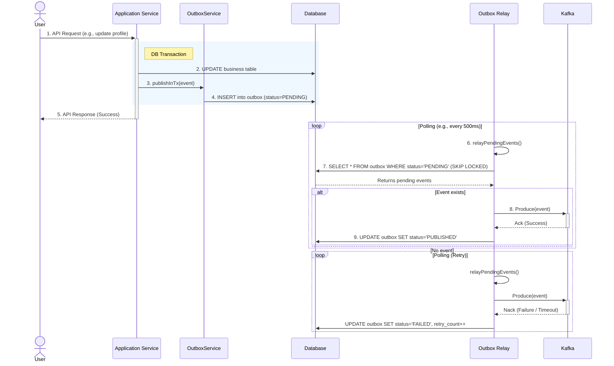

# Onepass-Platform Outbox 패턴 분석

이 문서는 onepass-platform 프로젝트에 적용된 Outbox 패턴의 구조와 데이터 흐름을 상세하게 분석합니다.

## 1. Outbox 패턴 개요

이 프로젝트는 여러 모듈(`ido`, `q-im`, `q-sign` 등)에서 Outbox 패턴을 도입하여 사용하고 있습니다. 각 모듈별로 대상 데이터베이스나 최종 목적지(Kafka, HTTP POST 등)에는 차이가 존재하지만, 핵심 아키텍처는 동일합니다.

Outbox 패턴은 메인 비즈니스 로직 처리(데이터베이스 갱신)와 외부 시스템(메시지 브로커 등)으로의 이벤트 발행을 하나의 분산 트랜잭션으로 묶는 대신, 로컬 트랜잭션을 활용하여 이벤트의 신뢰성 있는 전달(At-least-once delivery)을 보장하는 패턴입니다.

## 2. 주요 장점
*   **데이터 정합성**: 비즈니스 데이터의 변경과 발행될 이벤트 기록이 원자적으로 처리됩니다.
*   **신뢰성 있는 전달**: 이벤트는 메시지 큐에 최소 한 번 이상 전달됨이 보장됩니다(At-least-once).
*   **낮은 결합도**: Kafka 등 메시지 브로커의 일시적 장애가 비즈니스 서비스의 가용성(DB 트랜잭션 성공 여부)에 영향을 미치지 않습니다.

## 3. 핵심 컴포넌트 구조 (`q-im` 모듈 기준)

*   **`OutboxService`**: 비즈니스 서비스 로직과 동일한 트랜잭션 컨텍스트 내에서 실행되며, 이벤트를 `outbox` 테이블에 `PENDING` 상태로 저장(INSERT)합니다.
*   **`OutboxRelay`**: 스프링 스케줄러(`@Scheduled`) 등에 의해 비동기적으로 주기적 실행되는 릴레이 컴포넌트입니다. DB의 `outbox` 테이블을 폴링(Polling)하여 `PENDING` 상태의 메시지를 읽고, Kafka로 발행을 시도합니다.
*   **`OutboxRepository` & 테이블**:
    *   상태 관리: `status` 컬럼을 통해 발행 상태(`PENDING`, `PUBLISHED`, `FAILED`)를 관리합니다.
    *   페이로드 및 메타데이터: 전송할 실제 메시지(`payload`), 파티션 키, 재시도 횟수(`retry_count`) 등을 저장합니다.

## 4. 데이터 흐름 분석

1.  **이벤트 저장 (In-Transaction)**
    *   도메인 서비스(예: MemberService)에서 핵심 비즈니스 로직 수행 (예: 회원가입, 정보수정).
    *   서비스 내에서 `OutboxService.publishInTx()` 호출.
    *   **로컬 DB 트랜잭션 범위 안에서** 도메인 엔티티(회원 정보 등) UPDATE와 `outbox` 테이블에 이벤트 INSERT(`status='PENDING'`)가 동시에 커밋 됨.

2.  **이벤트 폴링 및 발행 (Out-of-Transaction)**
    *   백그라운드에서 `OutboxRelay` 스케줄러가 짧은 주기(예: 500ms, 1000ms)로 반복 실행됨.
    *   `outbox` 테이블에서 `status='PENDING'`인 레코드를 시간순으로 선입선출 조회함. 병렬 처리 환경에서는 `FOR UPDATE SKIP LOCKED` 구문을 통해 레코드 잠금 경합 및 중복 발송을 방지함.
    *   조회된 이벤트를 Kafka 등 목표 시스템에 발행(Produce)함.

3.  **발행 결과 업데이트**
    *   **발행 성공 (Ack)**: 해당 `outbox` 레코드의 `status`를 `PUBLISHED`로 갱신하여 처리 완료함.
    *   **발행 실패 (Nack/Timeout)**: 해당 레코드의 `status`를 `FAILED`로 마킹하고, `retry_count`를 1 증가시킴. 또한 실패 원인을 기록함. 일부 릴레이는 재시도에 지수 백오프(Exponential Backoff) 전략을 사용하여 다음 시도 시간을 늦춤.

## 5. 데이터 흐름 시퀀스 다이어그램

