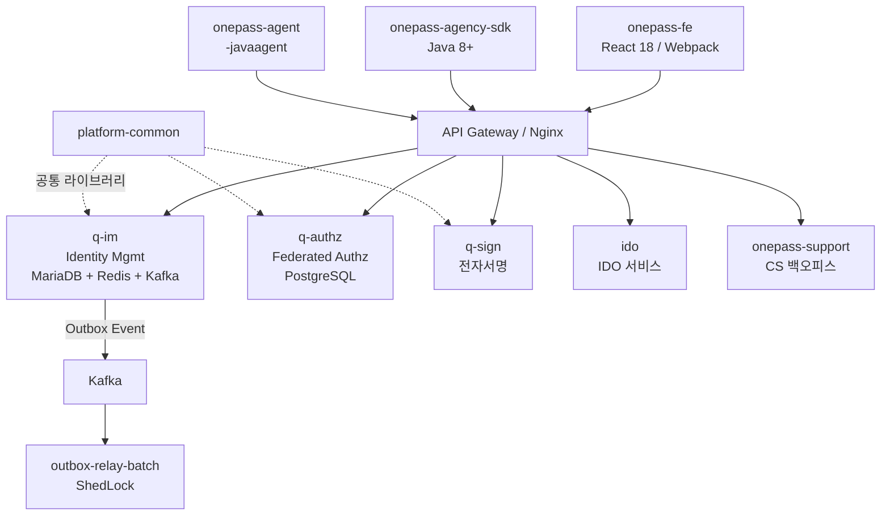

# OnePass 통합 인증 플랫폼 — 프로젝트 분석 보고서

> 분석 기준: 2026-06-30 | 버전: 0.1.0-SNAPSHOT | 개발 브랜치: `shipster`

---

## 1. 프로젝트 개요

| 항목 | 내용 |
|------|------|
| **프로젝트명** | OnePass 통합 인증 플랫폼 (integration-sso) |
| **루트 그룹** | `io.github.hipstermin.idem` |
| **빌드 시스템** | Gradle (Kotlin DSL) — 멀티 모듈 |
| **Java 버전** | JDK 21 (toolchain), SDK는 Java 8 호환 타겟 |
| **Spring Boot** | 3.5.9 |
| **CI/CD** | GitHub Actions (`.github/workflows/`) |
| **개발 브랜치** | `shipster` → `main` PR |
| **SonarCloud** | `HipsterMIN_integration-sso` |
| **주요 고객** | 중소벤처기업부 (MSSB), 유관기관 |

---

## 2. 모듈 구조 (Multi-Module Gradle)

```
onepass-platform (root)
├── platform-common          — 공통 라이브러리 (plain JAR, BootJar 없음)
├── q-sign                   — 전자서명 서비스
├── q-im                     — Identity Management (신원 관리)
├── q-authz                  — Federated Authorization (연합 인가, L1 코어)
├── ido                      — IDO 서비스
├── onepass-support          — 고객지원 / CS 백오피스
├── onepass-fe               — 프론트엔드 (React + TypeScript + Webpack)
├── agency-stub              — 유관기관 테스트 스텁
├── onepass-agency-sdk       — 기관 연동 Java SDK (Java 8+, 런타임 의존성 ZERO)
├── outbox-relay-batch       — Transactional Outbox 릴레이 배치 (ShedLock)
└── onepass-agent            — Java Agent (-javaagent 배포, 유관기관 WAS 자동 연동)
```

---

## 3. 모듈별 상세 분석

### 3-1. `q-im` — Identity Management

**역할**: 사용자 신원 관리 SoR (System of Record)

**기술 스택**:
- Spring Boot Web + JPA + Redis + Kafka
- DB: MariaDB (NHN Cloud RDS) / Flyway 마이그레이션
- `platform-common` 의존

**도메인 패키지** (`io.github.hipstermin.idem.registry`):
| 패키지 | 역할 |
|--------|------|
| `api` | REST 컨트롤러 레이어 |
| `application` | 애플리케이션 서비스 (유스케이스) |
| `biz` | 비즈니스 로직 |
| `config` | 설정 클래스 |
| `consent` | 동의 처리 |
| `conversion` | 데이터 변환 |
| `crypto` | 암호화 처리 |
| `domain` | 도메인 엔티티 / 애그리거트 |
| `guardian` | 보호자 관련 기능 |
| `identity` | 신원 핵심 도메인 |
| `infrastructure` | 외부 시스템 연동 (DB, Kafka, Redis) |
| `outbox` | Transactional Outbox 패턴 구현 |
| `user` | 사용자 관리 |
| `withdrawal` | 탈퇴 처리 |

---

### 3-2. `q-authz` — Federated Authorization

**역할**: 기관별 역할/권한 부여 (L1 코어)

**기술 스택**:
- Spring Boot Web + JPA + Actuator
- DB: PostgreSQL / Flyway
- SpringDoc OpenAPI (Swagger UI)
- `platform-common` 의존

---

### 3-3. `q-sign` — 전자서명 서비스

**특이사항**: 독립 Dockerfile 포함, Spring Boot 애플리케이션

---

### 3-4. `onepass-agency-sdk` — 기관 연동 SDK

**역할**: 유관기관이 OnePass Gateway API를 호출하기 위한 경량 클라이언트

**특징**:
- Java 8+ 호환 (`sourceCompatibility = Java 8`)
- **런타임 의존성 ZERO** — JDK 표준 API만 사용
- HTTP 어댑터: `HttpURLConnection` (기본) / OkHttp3 / Apache HC5 (선택적 compileOnly)
- Maven Central + 내부 Nexus 배포 지원
- GPG 서명 (CI: 환경변수 방식)
- 배포 좌표: `io.github.hipstermin.idem:onepass-agency-sdk`

---

### 3-5. `onepass-agent` — Java Agent

**역할**: 유관기관 WAS에 `-javaagent` 방식으로 배포, 자동 SSO 연동
- 완전 독립 모듈 (Spring/Lombok 비의존)
- byte-buddy shading(relocated) 사용

---

### 3-6. `outbox-relay-batch` — Outbox 릴레이 배치

**역할**: Transactional Outbox 패턴의 분산 릴레이
- ShedLock 기반 분산 락
- 독립 배포 아티팩트 (BootJar)

---

### 3-7. `onepass-fe` — 프론트엔드

**기술 스택**:
| 항목 | 버전 |
|------|------|
| React | 18.2.0 |
| TypeScript | ^4.0.5 |
| 번들러 | Webpack 5.94.0 |
| 패키지 매니저 | Yarn |
| UI 라이브러리 | Ant Design 5.17.0 |
| 상태관리 | Redux + react-query |
| 라우팅 | react-router-dom v5 + v6 compat |
| 차트 | Chart.js, D3, visx |
| 국제화 | i18next |
| 모니터링 | Grafana Faro, Sentry |
| 테스트 | Jest, Playwright |

**FE 소스 구조** (`frontend/src/`):
```
AppRoutes/        — 라우팅 설정
api/              — API 클라이언트
components/       — 재사용 컴포넌트
container/        — 컨테이너 컴포넌트
hooks/            — 커스텀 훅
pages/            — 페이지 컴포넌트
providers/        — Context Provider
store/            — Redux 스토어
types/            — TypeScript 타입 정의
utils/            — 유틸리티 함수
```

---

### 3-8. `onepass-support` — 고객지원 모듈

**특이사항**: CS 백오피스 기능, 지원 게시판 포함

---

## 4. 인프라 구성

### 4-1. Docker Compose 파일 분리 전략

```
infra/docker/
├── compose.base.yml           — 기본 네트워크/볼륨
├── compose.sso-im.yml         — SSO + IM 서비스 (DB 포함)
├── compose.sso-im-apps.yml    — 애플리케이션만 (외부 DB 연결)
├── compose.support.yml        — 지원 서비스
├── compose.tools.yml          — 개발 도구
├── compose.monitoring.yml     — 모니터링 스택
└── docker-compose.yml         — 전체 통합 (레거시)
```

### 4-2. 미들웨어 구성

| 미들웨어 | 용도 |
|----------|------|
| MariaDB | q-im 주 DB (NHN Cloud RDS) |
| PostgreSQL | q-authz DB |
| Redis | 세션/캐시 |
| Kafka | 이벤트 스트리밍 (Outbox 릴레이 포함) |
| Nginx | 리버스 프록시 |
| Keycloak | 외부 IdP 연동 |

### 4-3. 추가 인프라

```
infra/
├── helm/          — Kubernetes Helm 차트
├── k8s/           — Kubernetes 매니페스트
├── minikube/      — 로컬 K8s 환경
├── monitoring/    — Grafana/Prometheus 설정
├── owasp/         — 보안 취약점 억제 파일
└── scripts/       — 운영 스크립트
```

---

## 5. 품질 & 보안 체계

| 영역 | 도구 | 비고 |
|------|------|------|
| 코드 커버리지 | JaCoCo | 최소 50% (CI 게이트) |
| 정적 분석 | SonarQube/SonarCloud | `sonar.qualitygate.wait=false` |
| 보안 취약점 스캔 | OWASP Dependency-Check | CVSS 7.0+ 빌드 실패 |
| 테스트 | JUnit 5 + Mockito | Testcontainers (PostgreSQL, MariaDB, Kafka) |
| JVM Agent 호환성 | ADR-013 | byte-buddy-agent -javaagent 명시 주입 (JDK 24 대비) |

---

## 6. CI/CD 파이프라인

```
.github/workflows/
├── ci.yml          — 메인 CI 파이프라인
├── nogo-full.yml   — 전체 No-Go 검증
└── nogo-quick.yml  — 빠른 No-Go 검증
```

---

## 7. 문서화 현황

**활발한 문서화** — `docs/` 디렉토리에 상세 문서 다수:
- `sso-agency-developer-guide.md` — 기관 개발자 가이드
- `idem-sdk-java-usage-guide.md` — SDK 사용 가이드
- `idem-agent-integration-guide.md` — Agent 연동 가이드
- `idem-support-board-redesign-plan.md` — 지원 게시판 리디자인
- `kafka_easy_guide_for_developers.md` — Kafka 개발자 가이드
- `phased-rollout-strategy.md` — 단계별 릴리즈 전략
- `SPRINT_B_PLAN.md` — 스프린트 B 계획
- `Outbox패턴_개발자가이드.md` — Outbox 패턴 상세 가이드 (루트)

---

## 8. 아키텍처 특징 요약



---

## 9. 주요 관찰사항

> [!NOTE]
> **멀티 DB 전략**: q-im은 MariaDB(운영: NHN Cloud RDS), q-authz는 PostgreSQL을 사용하는 이종 DB 구성.

> [!IMPORTANT]
> **개발 브랜치 규칙**: 반드시 `shipster` 브랜치에서 작업 후 `main`으로 PR.

> [!TIP]
> **onepass-agency-sdk**: Java 8 호환 + 런타임 의존성 ZERO 설계로 레거시 기관 시스템 연동이 가능. Maven Central 및 내부 Nexus 양쪽 배포 지원.

> [!NOTE]
> **Transactional Outbox 패턴**: q-im 내부에 outbox 패키지 + 독립 outbox-relay-batch 모듈로 이중 구성. 관련 문서(개발자/비개발자 가이드, 다이어그램)가 루트에 위치.
