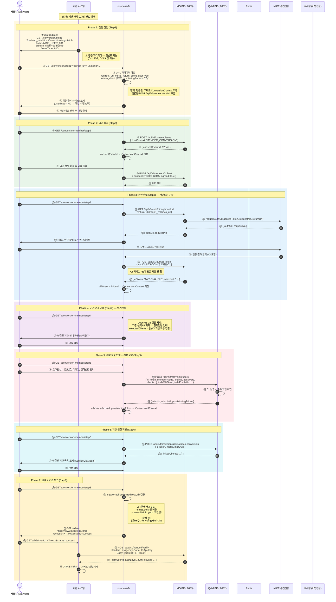
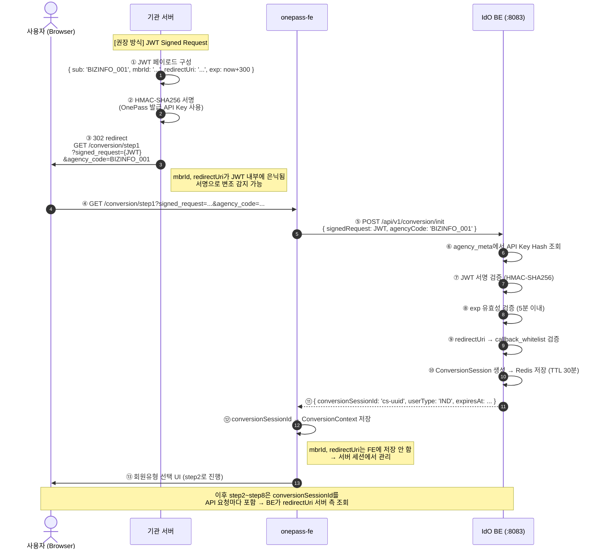

# 가이드 04: 회원 전환 데이터 흐름 — 순번 다이어그램

| 항목 | 내용 |
|------|------|
| **문서 ID** | GUIDE-004 |
| **제목** | 유관기관 → OnePass 회원 전환 전체 데이터 흐름 (순번 다이어그램) |
| **대상 독자** | OnePass FE/BE 개발팀, 유관기관 개발팀, 보안 검토자, 아키텍처 검토자 |
| **최종 갱신** | 2026-05-16 (v0.8.9) |
| **관련 문서** | [GUIDE-001](./01-agency-conversion-url-flow.md) · [GUIDE-002](./02-conversion-param-security.md) · [GUIDE-003](./03-conversion-launch-sample.md) |

> **범례**  
> ① ~ ㉞ — 순번 (브라우저 행위 포함 전체 순서)  
> `[현재]` — 현재 구현 동작  
> `[권장]` — GUIDE-002 적용 후 개선 동작  
> ⚠️ — 버그 또는 미설정 항목

---

## 다이어그램 1: 전체 흐름 개요 (아스키 아트)

```
┌──────────────┐    ┌──────────────────────────────────────────────────────────────┐    ┌────────────────┐
│ 기관 서버/FE  │    │                    OnePass 시스템                             │    │  외부 인증     │
│              │    │  ┌──────────────┐  ┌──────────────┐  ┌──────────────────┐   │    │  서비스        │
│              │    │  │ onepass-fe   │  │  IdO :8083   │  │  Q-IM :8082      │   │    │                │
│              │    │  │              │  │              │  │                  │   │    │ ┌────────────┐  │
│              │    │  │  Step1~Step8 │  │  BE API      │  │  회원 데이터     │   │    │ │NICE 본인인증│  │
│              │    │  │              │  │              │  │                  │   │    │ └────────────┘  │
└──────────────┘    │  └──────────────┘  └──────────────┘  └──────────────────┘   │    │ ┌────────────┐  │
                    │                            │                  │              │    │ │국세청 진위  │  │
                    │                       ┌──────────┐      ┌──────────┐        │    │ └────────────┘  │
                    │                       │  Redis   │      │PostgreSQL│        │    └────────────────┘
                    │                       │(Session) │      │  (DB)    │        │
                    │                       └──────────┘      └──────────┘        │
                    └──────────────────────────────────────────────────────────────┘

  ① 기관이 전환 URL 구성 후 사용자 브라우저 리다이렉트
  ② ~ ⑧ OnePass FE step1~step3 (파라미터 검증 + 약관 + 본인인증)
  ⑨ ~ ⑯ OnePass FE step4~step6 (기관 연결 + 계정 생성 + 연결 확인)
  ⑰ ~ ㉓ OnePass FE step8 + 기관 복귀 (완료 화면 + redirect_uri)
  ㉔ ~ ㉘ 기관 서버: Handoff Ticket 검증 (서버-서버)
```

---

## 다이어그램 2: 상세 시퀀스 — 현재 방식 (레거시 평문 파라미터)



---

## 다이어그램 3: Phase별 데이터 상태 추적

```
사용자 브라우저 ConversionContext 상태 변화 (React In-Memory):

Phase 1 완료 후:
┌────────────────────────────────────────────────────┐
│ ConversionContext                                  │
│  redirectUri   = "https://www.bizinfo.go.kr/cb"   │ ← URL 파라미터에서
│  mbrId         = "BIZ_USER_001"                   │ ← URL 파라미터에서
│  initialClientId = "sp-bizinfo"                   │ ← URL 파라미터에서
│  memberType    = "member"                          │ ← userType=IND
└────────────────────────────────────────────────────┘

Phase 2 완료 후:
┌────────────────────────────────────────────────────┐
│ ConversionContext                                  │
│  ... (이전 값 유지)                               │
│  consentEventId = 12345                            │ ← IdO 발급
└────────────────────────────────────────────────────┘

Phase 3 완료 후:
┌────────────────────────────────────────────────────┐
│ ConversionContext                                  │
│  ... (이전 값 유지)                               │
│  ciToken   = "eyJhbGci..."                         │ ← IdO CI 참조토큰
│  mbrUuid   = "qim-uuid-xxx"                        │ ← Q-IM 발급
│  birthDate = "19900101"                            │ ← NICE 인증 결과
│  ※ CI 원문은 FE에 저장되지 않음 (보안)            │
└────────────────────────────────────────────────────┘

Phase 4 완료 후:
┌────────────────────────────────────────────────────┐
│ ConversionContext                                  │
│  ... (이전 값 유지)                               │
│  selectedClients = []    ← 항상 빈 배열 (장관 지시 2026-05-15)
└────────────────────────────────────────────────────┘

Phase 5 완료 후:
┌────────────────────────────────────────────────────┐
│ ConversionContext                                  │
│  ... (이전 값 유지)                               │
│  mbrNo            = "MBR_20260516_001"             │ ← Q-IM 발급
│  mbrUuid          = "qim-uuid-xxx"                 │
│  provisioningToken = "prov-token-xxx"              │ ← Q-IM 발급
└────────────────────────────────────────────────────┘
```

---

## 다이어그램 4: 검증 레이어별 데이터 흐름

```
redirect_uri 검증 3-레이어 상세 흐름:

┌─────────────────────────────────────────────────────────────────────────────┐
│ LAYER 1: FE Step8.tsx isSafeRedirectUri()                                   │
│                                                                             │
│ 입력: ConversionContext.redirectUri                                         │
│       = "https://www.bizinfo.go.kr/callback"                                │
│                                                                             │
│ 현재 로직:                                                                  │
│   url.hostname.endsWith('.smes.go.kr')                                      │
│   → "www.bizinfo.go.kr".endsWith('.smes.go.kr') = false                    │
│   → ❌ 차단됨 (버그 B-1)                                                    │
│                                                                             │
│ 수정 후 로직 (Option B):                                                    │
│   REACT_APP_REDIRECT_ALLOWED_ORIGINS 기반 origin 매칭                       │
│   → "https://www.bizinfo.go.kr" in allowedOrigins = true                   │
│   → ✅ 통과                                                                 │
└─────────────────────────────────────────────────────────────────────────────┘
                           ↓ (수정 후 통과)
┌─────────────────────────────────────────────────────────────────────────────┐
│ LAYER 2: BE FeSessionServiceImpl.isValidReturnUrl()                         │
│          ← 브로커 인증 완료 후 returnUrl 검증 시 사용                       │
│                                                                             │
│ 입력: returnUrl = "https://www.bizinfo.go.kr/callback"                      │
│                                                                             │
│ 현재 설정 (미설정 — 버그 B-2):                                              │
│   allowed-return-urls:                                                      │
│     - https://agency-a.example.com   ← 더미값                              │
│     - https://agency-b.example.com   ← 더미값                              │
│   → ❌ "https://www.bizinfo.go.kr" 없음 → 검증 실패                         │
│                                                                             │
│ 수정 후 설정:                                                               │
│   allowed-return-urls:                                                      │
│     - https://www.bizinfo.go.kr      ← 실제 기관 URL                       │
│     - https://www.sbiz.or.kr         ← 실제 기관 URL                       │
│     - ... (68개 기관 전체)                                                  │
│   → ✅ "https://www.bizinfo.go.kr".startsWith(...) = true                  │
└─────────────────────────────────────────────────────────────────────────────┘
                           ↓
┌─────────────────────────────────────────────────────────────────────────────┐
│ LAYER 3: BE CallbackUrlValidator (Handoff Ticket 발급 시)                   │
│          ← 기관이 POST /api/v1/handoff/issue 호출 시 사용                  │
│                                                                             │
│ 입력: callbackUrl = "https://www.bizinfo.go.kr/callback"                    │
│ 출처: agency_meta.callback_whitelist (DB, 기관별 설정)                      │
│                                                                             │
│ BIZINFO_001 설정 예시:                                                      │
│   callback_whitelist = [                                                    │
│     "https://www.bizinfo.go.kr/callback",                                   │
│     "https://www.bizinfo.go.kr/mypage/onepass-linked"                       │
│   ]                                                                         │
│                                                                             │
│ 매칭 로직:                                                                  │
│   1. 완전일치 → ✅                                                          │
│   2. 와일드카드(*.bizinfo.go.kr) → ✅                                      │
│   3. 접두사 + 경로구분자 확인 → ✅                                         │
│                                                                             │
│ → ✅ 통과 (구조 정상, DB 등록만 하면 됨)                                   │
└─────────────────────────────────────────────────────────────────────────────┘
```

---

## 다이어그램 5: signed_request 방식 도입 후 개선 흐름



---

## 다이어그램 6: Handoff Ticket 발급·검증 상세 (㊴ ~ ㊶ 확대)

```
[기관 FE 브라우저]                [기관 서버]                    [IdO BE]
        │                              │                              │
        │  ㊳ redirect_uri 도달         │                              │
        │  GET /cb?ticketId=HT-xxxx    │                              │
        │─────────────────────────────▶│                              │
        │                              │                              │
        │                              │  ㊴ POST /api/v1/handoff/verify
        │                              │  Header: X-Agency-Code: BIZINFO_001
        │                              │          X-Api-Key: {기관 API Key}
        │                              │  Body: { ticketId: "HT-xxxx" }
        │                              │─────────────────────────────▶│
        │                              │                              │
        │                              │                        ┌─────┴──────────────────────┐
        │                              │                        │ ⑮ Ticket 조회 (Redis)       │
        │                              │                        │ ⑯ 기관 코드 일치 검증       │
        │                              │                        │ ⑰ Ticket 상태 = ISSUED?     │
        │                              │                        │ ⑱ Ticket 소비 (1회성)       │
        │                              │                        │    → 상태: CONSUMED         │
        │                              │                        └─────┬──────────────────────┘
        │                              │                              │
        │                              │  ㊵ 200 OK                  │
        │                              │  {                           │
        │                              │    qimUserId: "qim-xxx",     │
        │                              │    authLevel: "L2",          │
        │                              │    authResultId: "ar-xxx",   │
        │                              │    mbrUuid: "...",           │
        │                              │    agencyCode: "BIZINFO_001" │
        │                              │  }                           │
        │                              │◀─────────────────────────────│
        │                              │                              │
        │                        ┌─────┴───────────────────────────┐  │
        │                        │ ㊶ 기관 세션 생성               │  │
        │                        │    agencyUserId = qimUserId      │  │
        │                        │    authLevel 기록               │  │
        │                        │    기관 서비스 접근 허용         │  │
        │                        └─────┬───────────────────────────┘  │
        │                              │                              │
        │  ㊷ 기관 서비스 정상 응답     │                              │
        │◀─────────────────────────────│                              │
```

---

## 요약 — 순번별 핵심 동작 표

| 순번 | 주체 | 동작 | 상태/데이터 변화 |
|---|---|---|---|
| ① | 기관 서버 | 전환 URL 구성 → 302 redirect | - |
| ② | 브라우저 | `/conversion/step1` GET 요청 | - |
| ③ | FE Step1 | URL 파라미터 파싱 + 검증 | ConversionContext: `redirectUri`, `mbrId`, `initialClientId` |
| ④ | FE Step1 | 회원유형 선택 UI | `memberType` 설정 |
| ⑤ | 사용자 | 회원유형 선택 + 다음 | - |
| ⑥ | 브라우저 | `/conversion-member/step2` GET | - |
| ⑦⑧ | FE→IdO | 약관 동의 토큰 발급 | `consentEventId` |
| ⑨⑩⑪ | FE→IdO | 약관 동의 제출 | - |
| ⑫ | 브라우저 | `/conversion-member/step3` GET | - |
| ⑬~⑯ | FE→IdO→NICE | NICE 인증 URL 발급 | - |
| ⑰⑱ | 사용자→NICE | 실명 + 휴대폰 인증 | - |
| ⑲~㉑ | NICE→FE→IdO | CI 취득 → ciToken 발급 | `ciToken`, `mbrUuid` |
| ㉒㉓㉔ | 브라우저→FE | Step4 기관 연결 안내 (읽기전용) | `selectedClients=[]` |
| ㉕㉖ | 브라우저→사용자 | Step5 계정 정보 입력 | - |
| ㉗~㉙ | FE→QIM | `provisionUser()` API 호출 | `mbrNo`, `provisioningToken` |
| ㉚~㉜ | 브라우저→FE→QIM | Step6 `checkConversionProxy()` | 연결 기관 확인 |
| ㉝㉞ | FE→사용자 | ServiceListModal + 완료 | - |
| ㉟ | 브라우저 | `/conversion-member/step8` GET | - |
| ㊱ | FE Step8 | `isSafeRedirectUri()` 검증 | ⚠️ **현재 버그**: `*.smes.go.kr`만 통과 |
| ㊲ | 브라우저 | `redirect_uri`로 302 이동 | ⚠️ **버그 시**: `/login` 폴백 |
| ㊳ | 브라우저 | 기관 `redirect_uri` GET (`?ticketId=...`) | - |
| ㊴ | 기관 서버 | POST `/api/v1/handoff/verify` | Ticket 1회 소비 |
| ㊵ | IdO | Handoff Payload 반환 | `qimUserId`, `authLevel`, ... |
| ㊶ | 기관 서버 | 기관 세션 생성 | 서비스 이용 시작 |

---

> **이전 문서**: [GUIDE-003: 기관 오픈 URL 샘플](./03-conversion-launch-sample.md)  
> **전체 인덱스**: [Wiki INDEX](../INDEX.md)
