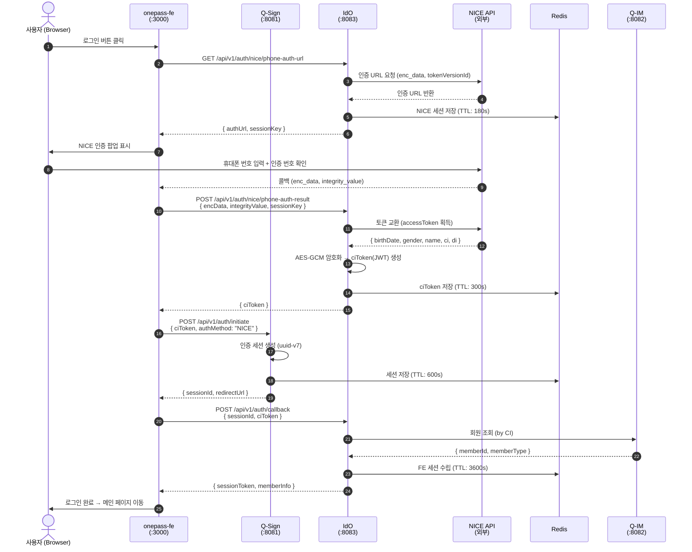
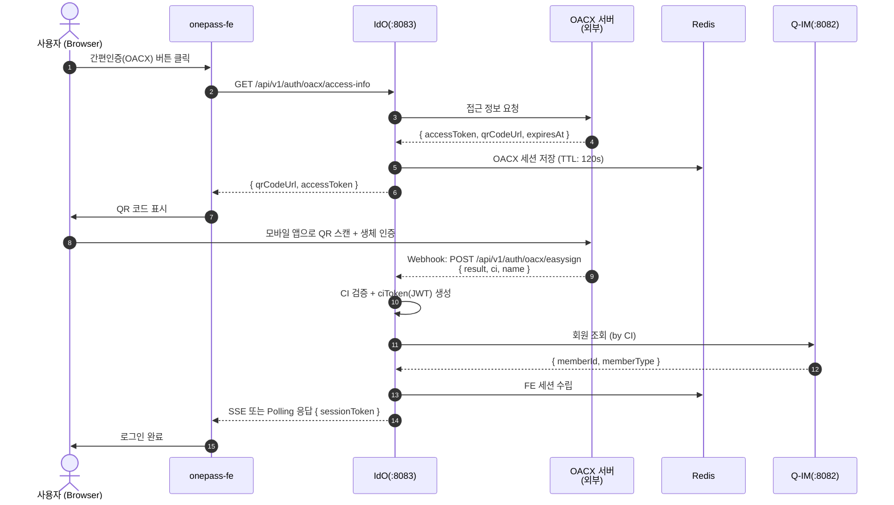
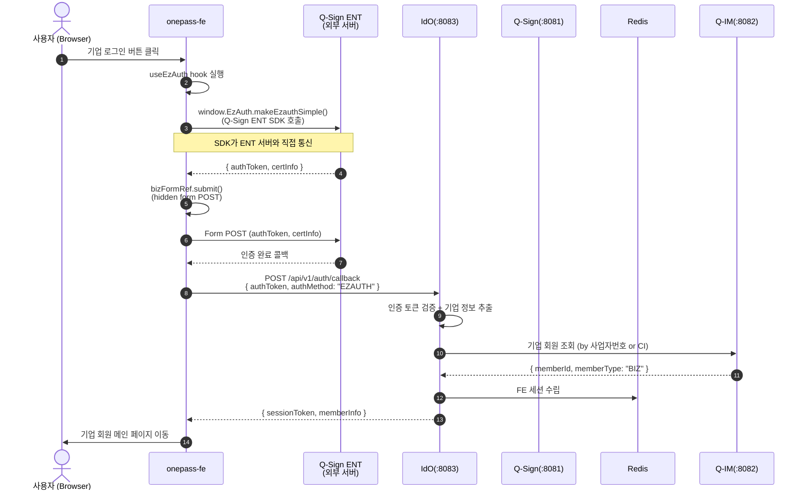
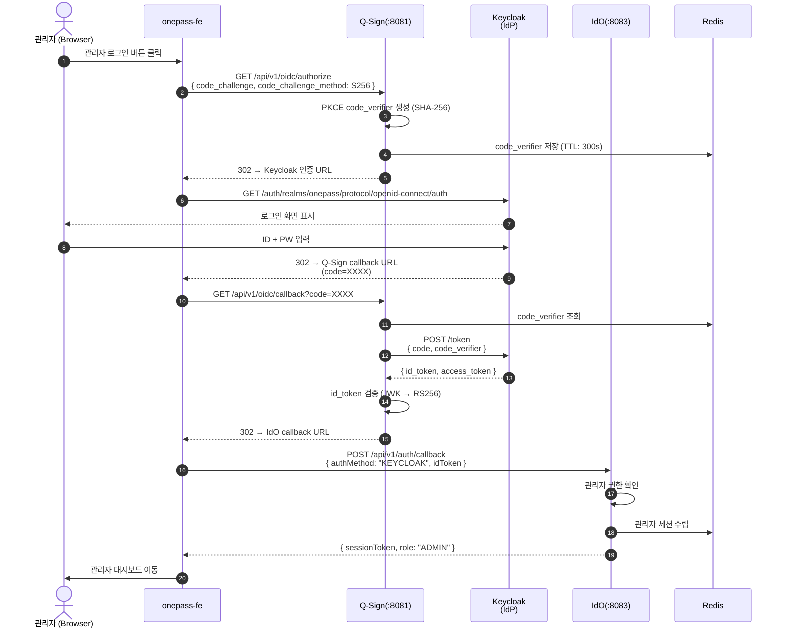

# 워크스루 01: 로그인 전체 흐름

| 항목 | 내용 |
|------|------|
| **문서 ID** | WT-001 |
| **제목** | 로그인 전체 흐름 (NICE · OACX · EzAuth · Keycloak) |
| **대상 독자** | 개발자, 시스템 설계자, QA 엔지니어 |
| **최종 갱신** | 2026-05-15 (v0.8.8) |
| **관련 ADR** | ADR-001, ADR-003, ADR-006, ADR-010, ADR-011, ADR-012 |

---

## 개요

OnePass 통합인증 플랫폼은 **4가지 인증 경로**를 지원한다.  
모든 경로는 FE → Q-Sign → IdO → Q-IM 순으로 수렴하며, 최종적으로 FE 세션이 수립된다.

```
[인증 경로]
  개인 회원  ── NICE 휴대폰 인증  ──┐
  개인 회원  ── OACX 간편인증      ──┤
  기업 회원  ── EzAuth (Q-Sign ENT) ──┤──► Q-Sign(:8081) ──► IdO(:8083) ──► Q-IM(:8082)
  관리자     ── Keycloak OIDC      ──┘
```

---

## 1. 인증 경로별 흐름

### 1-A. NICE 휴대폰 인증 (개인 회원)



**핵심 데이터 흐름**:
```
NICE 암호화 enc_data
  └─► IdO 복호화 (NICE SDK)
        └─► CI (연계정보) 추출
              └─► AES-GCM 암호화 → ciToken(JWT)
                    └─► Q-Sign 세션 연결
                          └─► Q-IM 회원 조회 (CI 기준)
                                └─► FE 세션 수립
```

---

### 1-B. OACX 간편인증 (개인 회원)



**OACX 특이사항**:
- QR 코드 방식으로 모바일 앱과 연동
- 인증 결과는 OACX → IdO Webhook으로 수신 (Push 방식)
- FE는 SSE/Polling으로 인증 완료를 감지

---

### 1-C. EzAuth Q-Sign ENT (기업 회원)



**EzAuth 특이사항**:
- **백엔드 연결 불필요**: SDK(`window.EzAuth.makeEzauthSimple()`)가 ENT 서버와 직접 통신
- FE의 `useEzAuth` hook → `bizFormRef.submit()` → Q-Sign ENT form POST
- Q2=B PoC FE 완료 상태 (백엔드는 인증 결과 수신만)

---

### 1-D. Keycloak OIDC (관리자 / PKCE)



**PKCE S256 흐름 요약**:
```
1. FE → Q-Sign: code_challenge = BASE64URL(SHA-256(code_verifier))
2. Q-Sign → Keycloak: 인가 요청 (code_challenge 포함)
3. Keycloak → Q-Sign: authorization_code 발급
4. Q-Sign → Keycloak: 토큰 요청 (code_verifier 포함, 검증)
5. Keycloak → Q-Sign: id_token + access_token 발급
```

---

## 2. CI(연계정보) 보안 처리 흐름

로그인 과정에서 CI는 **가장 민감한 PII**이며, 다음 경로로 보호된다:

```
NICE 원문 CI (32byte hex)
    │
    ▼ AES-256-GCM 암호화 (IdO 내부)
ciToken (JWT, RS256 서명)
    │ TTL: 300s
    ▼ Redis 저장 (암호화 상태)
Q-IM 조회 시 ciToken 전달
    │
    ▼ Q-IM: JWT 검증 → AES-256-GCM 복호화 → CI 원문 획득
Q-IM DB: members.ci_encrypted (AES-GCM, 컬럼 레벨 암호화)
```

**주의**: CI는 로그를 포함하여 평문으로 노출되어서는 안 된다.

---

## 3. FE 이중 Axios 인스턴스 보안 분리

로그인 과정에서 FE는 두 가지 Axios 인스턴스를 사용한다:

| 인스턴스 | 대상 | 비고 |
|----------|------|------|
| `beInstance` | IdO/Q-IM 내부 API | 세션 쿠키 기반 인증 |
| `extInstance` | 외부 CI API (`/api/ext/ci/**`) | ExtProxyController → API Key 서버사이드 주입 |

```typescript
// CI 관련 외부 API 호출 (extInstance 사용)
const ciCheckResult = await extInstance.post('/api/ext/ci/check', { encData });
// ↑ ExtProxyController에서 API Key 주입 후 외부 서비스 호출
// FE에는 API Key 노출 없음 (Q3=B 보안 요건)
```

---

## 4. 로그인 후 세션 상태

```
Redis 세션 구조 (key: fe:session:{sessionId})
{
  "memberId":    "qim-user-abc123",
  "memberType":  "PERSONAL" | "BIZ",
  "authMethod":  "NICE" | "OACX" | "EZAUTH" | "KEYCLOAK",
  "ci_ref":      "ciToken-jwt-xxx",   // CI 직접 저장 금지
  "loginAt":     1716812345,
  "agencyCode":  "SMBA_001",
  "role":        "MEMBER" | "BIZ_MEMBER" | "ADMIN"
}
TTL: 3600s (1시간), Sliding Window 미적용
```

---

## 5. 오류 처리 및 예외 흐름

| 상황 | 처리 방식 | 사용자 안내 |
|------|-----------|-------------|
| NICE 인증 시간 초과 (180s) | Redis TTL 만료 → 세션 키 무효 | "인증 시간이 만료되었습니다. 다시 시도해주세요." |
| NICE enc_data 검증 실패 | 400 Bad Request | "인증 정보가 유효하지 않습니다." |
| CI 기준 회원 미조회 | Q-IM 404 → IdO 분기 | 신규 가입 페이지로 이동 |
| Keycloak 토큰 검증 실패 | 401 Unauthorized | 재로그인 요청 |
| ciToken TTL 만료 (300s) | Redis TTL 만료 → 401 | "인증 세션이 만료되었습니다." |
| 동시 로그인 (Rate Limit) | Redis INCR → 429 | "잠시 후 다시 시도해주세요." |

---

## 6. 모니터링 포인트

| 지표 | 설명 | 경보 기준 |
|------|------|-----------|
| `auth.nice.latency` | NICE API 응답 시간 | P99 > 3s |
| `auth.oacx.webhook.count` | OACX Webhook 수신 수 | 급감 시 알림 |
| `auth.citoken.expired` | ciToken 만료 이벤트 | 1분 내 10건 초과 |
| `auth.session.count` | 활성 세션 수 | Redis 메모리 90% |
| `auth.keycloak.jwk.refresh` | JWK 갱신 주기 | 실패 시 알림 |

---

## 7. 관련 파일 참조

| 파일 | 역할 |
|------|------|
| `idem-hub/auth/controller/AuthController.java` | 모든 인증 수신 엔드포인트 |
| `idem-hub/auth/service/NiceAuthService.java` | NICE 인증 처리, ciToken 생성 |
| `idem-hub/auth/client/NiceApiClient.java` | NICE 외부 API 연동 |
| `idem-hub/auth/store/NiceAuthSessionStore.java` | Redis NICE 세션 관리 |
| `idem-hub/broker/keycloak/` | Keycloak OIDC 콜백·검증 |
| `idem-hub/ext/ExtProxyController.java` | CI API Key 서버사이드 주입 |
| `idem-console/src/hooks/useEzAuth.ts` | EzAuth SDK 호출 hook |
| `idem-console/src/pages/Login/index.tsx` | 로그인 페이지 (형식 POST 포함) |
| `idem-console/src/api/` | beInstance / extInstance 분리 |
| `qsign/auth/AuthSessionService.java` | Q-Sign 인증 세션 관리 |
| `qsign/broker/keycloak/KeycloakOidcHandler.java` | PKCE 검증, id_token 처리 |

---

> **다음 워크스루**: [WT-002: 신규 회원 가입 흐름](./02-member-register-walkthrough.md)
