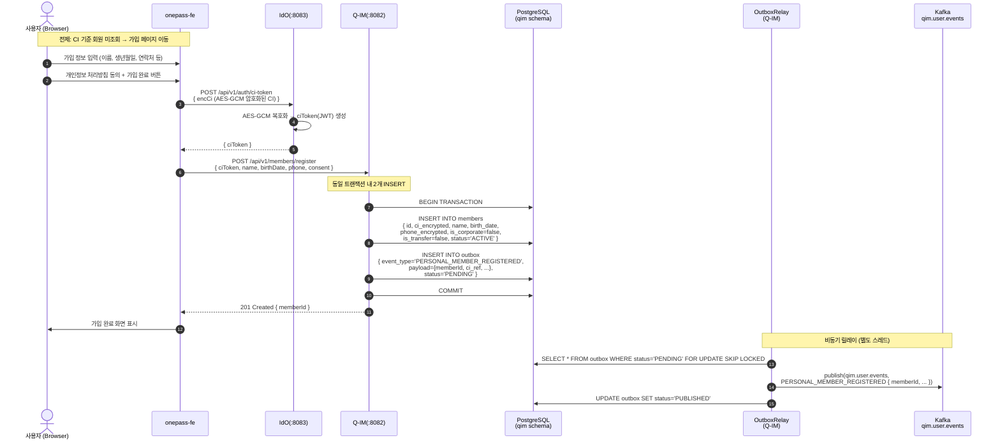
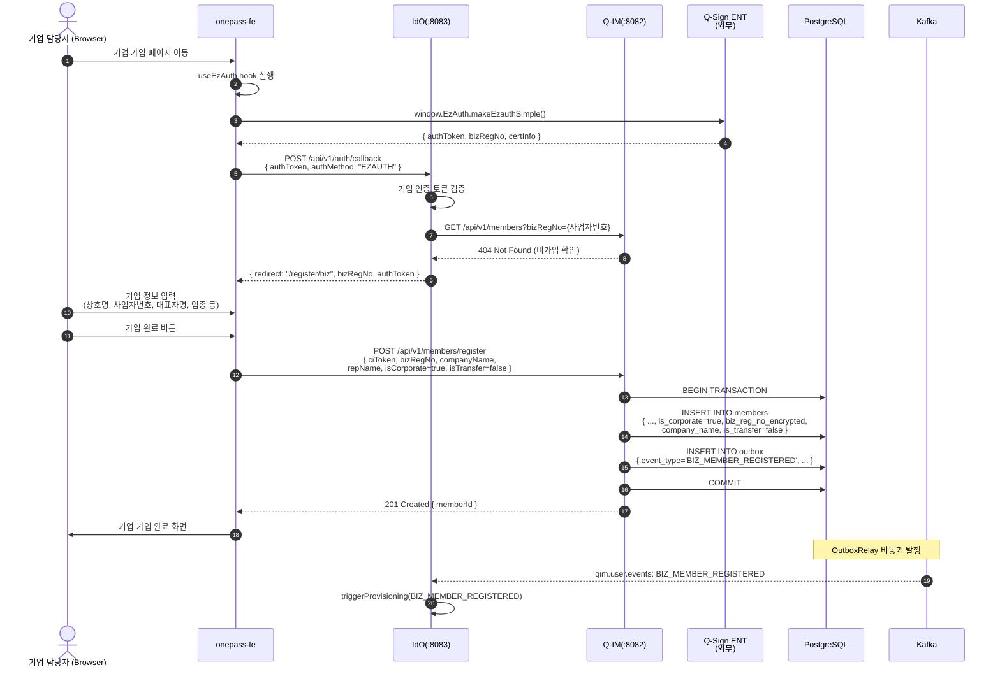

# 워크스루 02: 신규 회원 가입 흐름

| 항목 | 내용 |
|------|------|
| **문서 ID** | WT-002 |
| **제목** | 신규 회원 가입 흐름 (개인 / 기업 × Outbox 발행) |
| **대상 독자** | 개발자, 시스템 설계자, QA 엔지니어 |
| **최종 갱신** | 2026-05-15 (v0.8.8) |
| **관련 ADR** | ADR-004, ADR-008, ADR-009, ADR-005 |

---

## 개요

신규 회원 가입은 **Q-IM** 서비스가 주관하며, 가입 완료 시 **Transactional Outbox 패턴**으로  
`qim.user.events` Kafka 토픽에 이벤트를 발행한다.

```
FE ──► IdO(:8083) ──► Q-IM(:8082)
                          │ DB 트랜잭션
                          ├── members 테이블 INSERT
                          └── outbox 테이블 INSERT
                                    │ OutboxRelay (별도 스레드)
                                    ▼
                          Kafka: qim.user.events
                                    │
                                    ▼ QimEventConsumer
                          IdO(:8083): triggerProvisioning()
                                    │
                                    ├── provisioning_outbox INSERT
                                    └── 68개 기관 병렬 HTTP (Virtual Thread)
```

---

## 1. 개인 회원 신규 가입 흐름

### 전제 조건
- 로그인 시도 → CI 기준 회원 미조회 (Q-IM 404)
- IdO가 FE를 가입 페이지로 리다이렉트



---

### 1.1 QIM 회원 등록 핵심 로직

**`resolveRegisterEventType(isTransfer, isCorporate)` 2×2 매트릭스**:

```java
// Q-IM: QimSpReceiverService.java
public ProvisioningEventType resolveRegisterEventType(
        boolean isTransfer, boolean isCorporate) {
    if (!isTransfer && !isCorporate) return PERSONAL_MEMBER_REGISTERED;  // ①
    if ( isTransfer && !isCorporate) return PERSONAL_MEMBER_CONVERTED;   // ②
    if (!isTransfer &&  isCorporate) return BIZ_MEMBER_REGISTERED;       // ③
    if ( isTransfer &&  isCorporate) return BIZ_MEMBER_CONVERTED;        // ④
    throw new IllegalStateException("unreachable");
}
```

개인 신규 가입은 `isTransfer=false, isCorporate=false` → **`PERSONAL_MEMBER_REGISTERED`**

---

### 1.2 Outbox INSERT 보장 메커니즘

```
[동일 DB 트랜잭션]
  members INSERT ──┬── COMMIT ──► Outbox 발행 가능
                   │
  outbox INSERT ───┘

[비정상 케이스]
  members INSERT ──┬── ROLLBACK ──► outbox도 롤백 (이벤트 미발행 보장)
  outbox INSERT ───┘
```

**at-least-once 보장**: Outbox Relay는 `FOR UPDATE SKIP LOCKED`로 동시 처리를 방지하며,  
발행 실패 시 지수 백오프로 재시도한다.

---

## 2. 기업 회원 신규 가입 흐름



---

## 3. 데이터 흐름 상세 — Outbox 발행

### 3.1 Outbox 테이블 구조 (Q-IM)

```sql
-- qim.outbox (Q-IM 소유)
CREATE TABLE qim.outbox (
    id              UUID PRIMARY KEY DEFAULT gen_random_uuid(),
    event_type      VARCHAR(64) NOT NULL,
    aggregate_id    UUID NOT NULL,          -- member.id
    payload         JSONB NOT NULL,
    status          VARCHAR(16) DEFAULT 'PENDING',  -- PENDING | PUBLISHED | FAILED
    created_at      TIMESTAMPTZ DEFAULT now(),
    published_at    TIMESTAMPTZ,
    retry_count     INT DEFAULT 0,
    next_retry_at   TIMESTAMPTZ
);
```

### 3.2 Outbox Payload 구조 (PERSONAL_MEMBER_REGISTERED)

```json
{
  "eventType": "PERSONAL_MEMBER_REGISTERED",
  "eventId":   "uuid-v7-xxx",
  "occurredAt": "2026-05-15T10:30:00Z",
  "memberId":   "qim-user-abc123",
  "ciRef":      "ci-hash-sha256-xxx",     // CI 직접 포함 금지
  "isCorporate": false,
  "isTransfer":  false,
  "agencyCode":  null                      // 기관 미지정 (전체 프로비저닝)
}
```

### 3.3 Kafka 메시지 구조

```
Topic: qim.user.events
Partition Key: memberId (일관성 보장)
Headers:
  - eventType: PERSONAL_MEMBER_REGISTERED
  - version: 1
  - source: q-im
Value: <Outbox Payload JSON>
```

---

## 4. 회원 가입 시 CI 데이터 처리 경계

```
사용자 입력 단계
    │
    ▼
NICE enc_data (암호화된 CI 포함)
    │ IdO: AES-GCM 복호화
    ▼
ciToken (JWT, RS256) ── TTL: 300s ──► Redis
    │ Q-IM 수신 시 검증
    ▼
members.ci_encrypted (AES-256-GCM, 컬럼 레벨)
    │
    ▼
Outbox payload: ciRef (SHA-256 해시, 원문 아님)
    │
    ▼
Kafka: ciRef만 전달 (CI 원문 Kafka 미노출)
```

**중요**: Kafka 토픽에는 CI 원문을 포함하지 않는다.  
IdO → 기관 프로비저닝 시에도 `ciRef`(해시)만 전달한다.

---

## 5. 가입 실패 / 예외 처리

| 상황 | 처리 | 사용자 안내 |
|------|------|-------------|
| CI 중복 (이미 가입) | Q-IM 409 Conflict → IdO → FE | "이미 가입된 회원입니다. 로그인해주세요." |
| 사업자번호 중복 (기업) | Q-IM 409 Conflict | "이미 등록된 사업자번호입니다." |
| ciToken 만료 (300s) | IdO 401 → FE | 재인증 팝업 표시 |
| DB 트랜잭션 실패 | Q-IM 500 → 롤백 | "일시적 오류입니다. 잠시 후 다시 시도해주세요." |
| Outbox 발행 실패 | 재시도 (지수 백오프, 최대 5회) | 사용자 영향 없음 (비동기) |
| Kafka 브로커 다운 | DLQ로 이동 (qim.user.events.DLQ) | 사용자 영향 없음 (비동기) |

---

## 6. 멱등성 보장

**Q-IM 가입 엔드포인트**는 `Idempotency-Key` 헤더를 지원한다:

```http
POST /api/v1/members/register
Idempotency-Key: uuid-v7-request-xxx
Content-Type: application/json
```

- 동일 `Idempotency-Key`로 재요청 시 최초 응답 반환 (DB 중복 INSERT 방지)
- Redis에 `24시간` 캐싱

---

## 7. 신규 가입 완료 후 연계 흐름

```
회원 가입 완료 (DB COMMIT)
    │
    ├── [즉시] 로그인 세션 수립 (IdO → Redis)
    │         └─► FE: 가입 완료 후 자동 로그인
    │
    └── [비동기] Outbox → Kafka → IdO
                    └─► ProvisioningService (Virtual Thread)
                              └─► 68개 기관 병렬 HTTP
                                        └─► 프로비저닝 완료 (WT-004 참조)
```

---

## 8. 관련 파일 참조

| 파일 | 역할 |
|------|------|
| `qim/member/MemberService.java` | 회원 등록 핵심 로직 |
| `qim/member/MemberRepository.java` | members 테이블 CRUD |
| `qim/outbox/OutboxService.java` | Outbox INSERT |
| `qim/outbox/OutboxRelay.java` | 비동기 Kafka 발행 릴레이 |
| `qim/sp/service/QimSpReceiverService.java` | `resolveRegisterEventType()` 구현 |
| `ido/kafka/QimEventConsumer.java` | Kafka 이벤트 소비 → 프로비저닝 트리거 |
| `ido/provision/ProvisioningServiceImpl.java` | Virtual Thread 프로비저닝 |

---

> **이전 워크스루**: [WT-001: 로그인 전체 흐름](./01-login-walkthrough.md)  
> **다음 워크스루**: [WT-003: 기관 계정 전환 흐름](./03-member-conversion-walkthrough.md)
