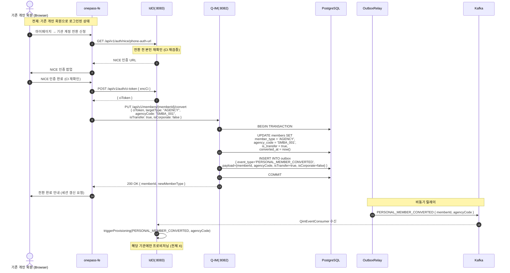
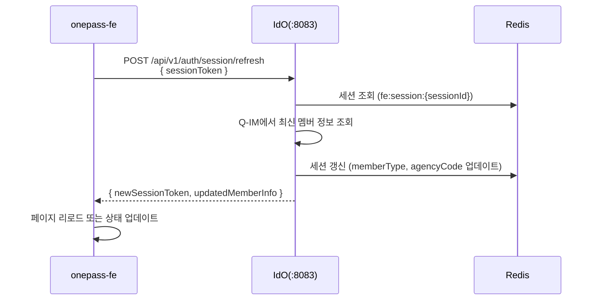
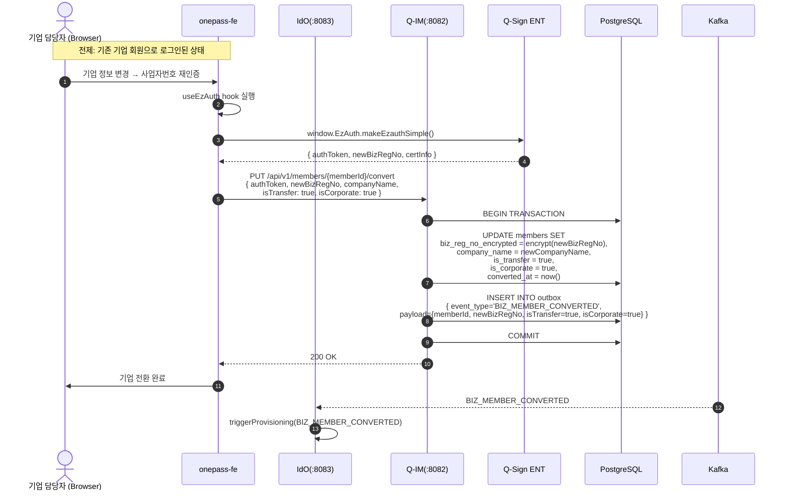

# 워크스루 03: 기관 계정 전환 흐름

| 항목 | 내용 |
|------|------|
| **문서 ID** | WT-003 |
| **제목** | 기관 계정 전환 흐름 (개인→기업 전환 · 개인→기관 연계) |
| **대상 독자** | 개발자, 시스템 설계자, QA 엔지니어 |
| **최종 갱신** | 2026-05-15 (v0.8.8) |
| **관련 ADR** | ADR-004, ADR-008, ADR-009 |

---

## 개요

**전환(Conversion)**은 기존 가입 회원이 계정 유형을 변경하는 시나리오다.  
전환 플래그 `isTransfer=true`로 신규 가입과 구별되며, Outbox 이벤트 타입이 달라진다.

```
[전환 유형]
  개인 → 기업(법인): PERSONAL_MEMBER_CONVERTED  (isTransfer=true, isCorporate=false)
  기업 → 다른 기업:   BIZ_MEMBER_CONVERTED       (isTransfer=true, isCorporate=true)
```

> **주의**: `isTransfer` 플래그는 "기존 계정에서 전환"을 의미하며,  
> 항상 기존 회원이 로그인된 상태에서만 전환이 가능하다.

---

## 1. 전환 유형 결정 매트릭스

| isTransfer | isCorporate | 이벤트 타입 | 설명 |
|:---:|:---:|---|---|
| false | false | `PERSONAL_MEMBER_REGISTERED` | 개인 신규 가입 (전환 아님) |
| **true** | **false** | **`PERSONAL_MEMBER_CONVERTED`** | **개인 계정 전환** |
| false | true | `BIZ_MEMBER_REGISTERED` | 기업 신규 가입 (전환 아님) |
| **true** | **true** | **`BIZ_MEMBER_CONVERTED`** | **기업 계정 전환** |

---

## 2. 개인 계정 전환 흐름 (PERSONAL_MEMBER_CONVERTED)

### 2.1 시나리오: 개인 회원이 기관 계정으로 전환



---

### 2.2 전환 시 세션 갱신

전환 완료 후 FE 세션의 `memberType`을 갱신해야 한다:



---

## 3. 기업 계정 전환 흐름 (BIZ_MEMBER_CONVERTED)

### 3.1 시나리오: 기업 회원이 다른 기관으로 전환



---

## 4. 전환 세션 관리 (전환 중 상태 보호)

전환 진행 중 동시 요청을 방지하기 위해 **분산락**을 사용한다:

```java
// Q-IM: MemberConversionService.java (개념)
RLock conversionLock = redissonClient.getLock("lock:member:convert:" + memberId);
boolean locked = conversionLock.tryLock(3, 30, TimeUnit.SECONDS);
if (!locked) {
    throw new ConversionInProgressException("전환이 이미 진행 중입니다.");
}
try {
    // DB UPDATE + Outbox INSERT (트랜잭션)
} finally {
    conversionLock.unlock();
}
```

**Redis 분산락 키**: `lock:member:convert:{memberId}`  
**TTL**: 30초 (전환 처리 최대 시간)

---

## 5. 전환 이벤트 Outbox Payload

### PERSONAL_MEMBER_CONVERTED Payload

```json
{
  "eventType":   "PERSONAL_MEMBER_CONVERTED",
  "eventId":     "uuid-v7-xxx",
  "occurredAt":  "2026-05-15T11:00:00Z",
  "memberId":    "qim-user-abc123",
  "ciRef":       "ci-hash-sha256-xxx",
  "isCorporate": false,
  "isTransfer":  true,
  "agencyCode":  "SMBA_001",
  "previousType": "PERSONAL",
  "newType":      "AGENCY"
}
```

### BIZ_MEMBER_CONVERTED Payload

```json
{
  "eventType":    "BIZ_MEMBER_CONVERTED",
  "eventId":      "uuid-v7-yyy",
  "occurredAt":   "2026-05-15T11:05:00Z",
  "memberId":     "qim-biz-xyz789",
  "bizRegNoRef":  "bizhash-sha256-yyy",
  "isCorporate":  true,
  "isTransfer":   true,
  "agencyCode":   null,
  "previousBizRegNo": "encrypted-ref-old",
  "newBizRegNo":      "encrypted-ref-new"
}
```

> **데이터 흐름 경계**: 사업자번호 원문은 Kafka에 포함하지 않으며,  
> 해시값(`bizRegNoRef`)만 전달한다.

---

## 6. 전환 vs 신규 가입 데이터 흐름 비교

```
[신규 가입]
  isTransfer=false
  → members INSERT (신규 row)
  → outbox: PERSONAL_MEMBER_REGISTERED or BIZ_MEMBER_REGISTERED
  → 전체 68개 기관 프로비저닝

[전환]
  isTransfer=true
  → members UPDATE (기존 row 갱신)
  → outbox: PERSONAL_MEMBER_CONVERTED or BIZ_MEMBER_CONVERTED
  → 특정 기관 프로비저닝 (agencyCode 지정 시)
    or 전체 기관 프로비저닝 (agencyCode=null 시)
```

---

## 7. 전환 실패 및 롤백

| 상황 | 처리 | 사용자 안내 |
|------|------|-------------|
| 분산락 획득 실패 | 409 Conflict | "전환이 이미 진행 중입니다. 잠시 후 재시도해주세요." |
| CI 재인증 실패 | 401 Unauthorized | 재인증 요청 |
| 사업자번호 중복 (기업 전환) | 409 Conflict | "이미 등록된 사업자번호입니다." |
| DB 트랜잭션 실패 | 500 + 롤백 | "일시적 오류입니다. 잠시 후 재시도해주세요." |
| Outbox 발행 실패 | 재시도 (지수 백오프) | 사용자 영향 없음 (비동기) |
| 전환 도중 세션 만료 | 401 | 재로그인 후 전환 재시도 |

---

## 8. 이벤트 타입 정합화 히스토리

```
구 타입 (Deprecated, V18 하위 호환)
  USER_REGISTERED  → 대체: PERSONAL_MEMBER_REGISTERED
  BIZ_CONVERTED    → 대체: BIZ_MEMBER_CONVERTED (부분 대응)
  USER_UPDATED     → 대체: PERSONAL_MEMBER_CONVERTED
  USER_WITHDRAWN   → 대체: MEMBER_WITHDRAWN

신규 타입 (QIM-OUTBOX-SPEC-001, V18 우선 허용)
  PERSONAL_MEMBER_REGISTERED
  PERSONAL_MEMBER_CONVERTED    ← 이 워크스루 대상
  BIZ_MEMBER_REGISTERED
  BIZ_MEMBER_CONVERTED         ← 이 워크스루 대상
  MEMBER_WITHDRAWN
```

---

## 9. 관련 파일 참조

| 파일 | 역할 |
|------|------|
| `qim/member/MemberConversionService.java` | 전환 핵심 로직, 분산락 |
| `qim/sp/service/QimSpReceiverService.java` | `resolveRegisterEventType()` |
| `qim/outbox/OutboxService.java` | 전환 이벤트 Outbox INSERT |
| `ido/kafka/QimEventConsumer.java` | 전환 이벤트 수신 → 프로비저닝 트리거 |
| `onepass-fe/src/hooks/useEzAuth.ts` | EzAuth 기업 인증 hook |
| `onepass-fe/src/pages/MyPage/` | 전환 신청 페이지 |

---

> **이전 워크스루**: [WT-002: 신규 회원 가입 흐름](./02-member-register-walkthrough.md)  
> **다음 워크스루**: [WT-004: 프로비저닝 흐름](./04-provisioning-walkthrough.md)
