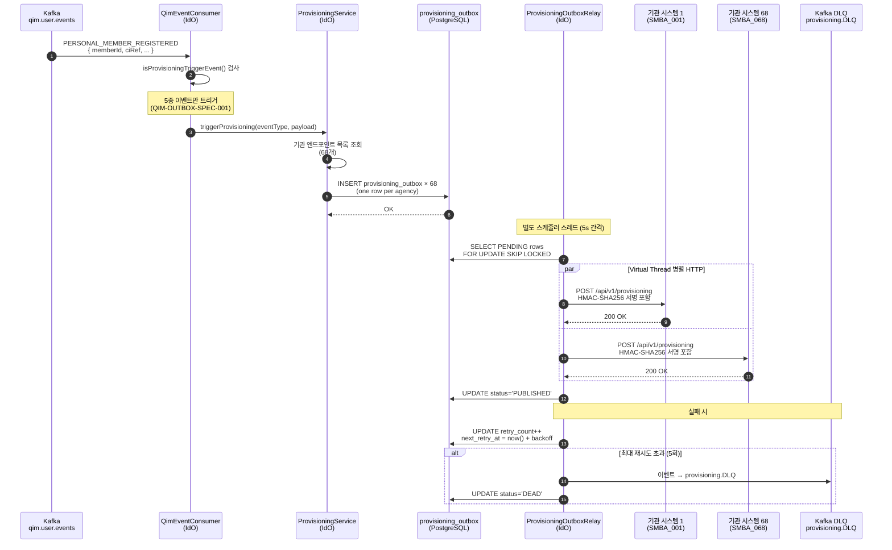
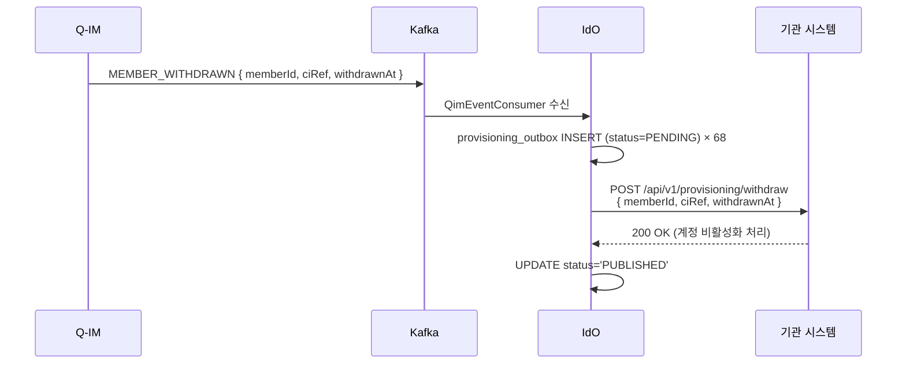

# 워크스루 04: 프로비저닝 전체 흐름

| 항목 | 내용 |
|------|------|
| **문서 ID** | WT-004 |
| **제목** | 프로비저닝 전체 흐름 (QIM-OUTBOX-SPEC-001 · Virtual Thread · 68기관 병렬) |
| **대상 독자** | 개발자, 시스템 설계자, 운영자 |
| **최종 갱신** | 2026-05-15 (v0.8.8) |
| **관련 ADR** | ADR-002, ADR-004, ADR-008, ADR-009, ADR-011 |

---

## 개요

프로비저닝은 **Q-IM 이벤트 발생 후 IdO가 68개 기관 시스템에 회원 정보를 전파**하는 과정이다.  
JDK 21 Virtual Thread로 68개 기관에 동시 HTTP 요청을 보내며, Transactional Outbox로 신뢰성을 보장한다.

```
Q-IM → Kafka → IdO → 68개 기관
         │          (Virtual Thread 병렬)
         │
   qim.user.events          provisioning_outbox
         │                        │
    QimEventConsumer         ProvisioningOutboxRelay
         │                        │
   triggerProvisioning()      기관별 HTTP POST
         │                        │
   provisioning_outbox         agency_endpoint × 68
         INSERT
```

---

## 1. 전체 프로비저닝 흐름도



---

## 2. QimEventConsumer — 이벤트 수신 및 필터링

```java
// idem-hub/kafka/QimEventConsumer.java
@KafkaListener(topics = "qim.user.events", groupId = "ido-provisioning-group")
public void onQimEvent(ConsumerRecord<String, String> record) {
    QimEvent event = deserialize(record.value());

    // [데이터 흐름 확인] 5종 이벤트만 프로비저닝 트리거
    if (!isProvisioningTriggerEvent(event.getEventType())) {
        log.debug("Non-trigger event: {}", event.getEventType());
        return;
    }

    provisioningService.triggerProvisioning(event);
}

private boolean isProvisioningTriggerEvent(String eventType) {
    return switch (eventType) {
        case "PERSONAL_MEMBER_REGISTERED",
             "PERSONAL_MEMBER_CONVERTED",
             "BIZ_MEMBER_REGISTERED",
             "BIZ_MEMBER_CONVERTED",
             "MEMBER_WITHDRAWN"           -> true;  // QIM-OUTBOX-SPEC-001 5종
        default                           -> false;
    };
}
```

**데이터 흐름 경계**:
```
Kafka 메시지 수신
    │ ciRef 포함 (CI 원문 아님)
    ▼
isProvisioningTriggerEvent() 필터
    │ 5종 통과 / 나머지 무시
    ▼
triggerProvisioning() 호출
    │ ciRef는 provisioning_outbox.payload에 저장
    ▼
기관 HTTP: ciRef 전달 (CI 원문 미전달)
```

---

## 3. ProvisioningServiceImpl — Virtual Thread 병렬 HTTP

```java
// idem-hub/provision/ProvisioningServiceImpl.java
@Override
public void triggerProvisioning(QimEvent event) {
    List<AgencyEndpoint> endpoints = agencyRepository.findAllActive(); // 68개

    // 이중 Outbox: provisioning_outbox INSERT (per agency)
    endpoints.forEach(ep ->
        outboxRepository.insertOutbox(ProvisioningOutboxRecord.builder()
            .agencyCode(ep.getAgencyCode())
            .eventType(event.getEventType())   // QIM-OUTBOX-SPEC-001 타입
            .payload(buildPayload(event, ep))
            .status("PENDING")
            .build())
    );
}

// ProvisioningOutboxRelay — Virtual Thread 병렬 HTTP
public void relay() {
    List<ProvisioningOutboxRecord> pending = outboxRepository
        .findPendingForUpdate(BATCH_SIZE);  // FOR UPDATE SKIP LOCKED

    // JDK 21 Virtual Thread Executor (ADR-002)
    try (ExecutorService vt = Executors.newVirtualThreadPerTaskExecutor()) {
        List<CompletableFuture<Void>> futures = pending.stream()
            .map(record -> CompletableFuture.runAsync(
                () -> dispatchToAgency(record), vt))
            .toList();

        CompletableFuture.allOf(futures.toArray(new CompletableFuture[0]))
            .join();  // 전체 완료 대기
    }
}
```

**Virtual Thread 선택 이유** (ADR-002):
```
Platform Thread × 68 → 68 OS 스레드 (메모리 ~136MB)
Virtual Thread × 68  → 68 경량 스레드 (메모리 ~1MB)
                                     ↑ 136배 절감
```

---

## 4. HMAC-SHA256 기관 인증 — 데이터 흐름

기관 HTTP 요청 시 **HMAC-SHA256 서명**을 첨부하여 요청 무결성을 보장한다.

```
프로비저닝 HTTP 요청 생성
    │
    ├── payload 구성 (memberId, eventType, timestamp, nonce)
    │
    ├── HMAC-SHA256 서명 생성
    │     key = agencyHmacKey (기관별 비밀키, Redis 캐싱)
    │     message = timestamp + "." + nonce + "." + payloadHash
    │     signature = HmacSHA256(key, message)
    │
    ├── HTTP Headers 추가
    │     X-HMAC-Timestamp: {timestamp}
    │     X-HMAC-Nonce: {nonce}
    │     X-HMAC-Signature: {Base64(signature)}
    │
    └── POST https://agency-001.example.com/api/v1/provisioning
              │
              ▼ 기관 시스템 (또는 Agency-Stub)
         HmacSignatureFilter 검증
              │ MessageDigest.isEqual() (상수 시간 비교)
              └── 검증 성공 → 프로비저닝 처리
```

**상수 시간 비교 코드** (타이밍 공격 방어):
```java
// idem-hub/gateway/HmacSignatureFilter.java
boolean valid = MessageDigest.isEqual(
    expectedSignature.getBytes(StandardCharsets.UTF_8),
    receivedSignature.getBytes(StandardCharsets.UTF_8)
);
```

---

## 5. provisioning_outbox 상태 머신

```
                    ┌─────────────────────┐
                    │        PENDING       │
                    └─────────┬───────────┘
                              │ ProvisioningOutboxRelay.relay()
                              ▼
              ┌───────────────────────────────┐
              │         HTTP 전송 시도         │
              └───────────────────────────────┘
                    │                   │
                 성공                실패
                    │                   │
                    ▼                   ▼
            ┌────────────┐    ┌──────────────────┐
            │ PUBLISHED  │    │ retry_count++     │
            └────────────┘    │ next_retry_at 설정│
                              └────────┬─────────┘
                                       │
                              retry_count ≥ 5?
                                  │         │
                                 YES        NO
                                  │         │
                                  ▼         ▼
                          ┌──────────┐  PENDING 유지
                          │   DEAD   │  (다음 사이클)
                          └──────────┘
                          Kafka DLQ 발행
```

**지수 백오프 공식**:
```
next_retry_at = now() + MIN(2^retry_count × 5초, 300초)

retry_count=0: 5초 후
retry_count=1: 10초 후
retry_count=2: 20초 후
retry_count=3: 40초 후
retry_count=4: 80초 후 → 이후 DEAD
```

---

## 6. provisioning_outbox 테이블 구조

```sql
-- ido.provisioning_outbox (V15 생성, V18 CHECK 제약 갱신)
CREATE TABLE ido.provisioning_outbox (
    id              UUID PRIMARY KEY DEFAULT gen_random_uuid(),
    agency_code     VARCHAR(32) NOT NULL,
    event_type      VARCHAR(64) NOT NULL,   -- QIM-OUTBOX-SPEC-001 5종 + 구 4종(하위 호환)
    payload         JSONB NOT NULL,
    status          VARCHAR(16) DEFAULT 'PENDING',
    retry_count     INT DEFAULT 0,
    next_retry_at   TIMESTAMPTZ,
    created_at      TIMESTAMPTZ DEFAULT now(),
    published_at    TIMESTAMPTZ,

    -- V18 CHECK 제약 (ADR-009)
    CONSTRAINT chk_prov_event_type CHECK (event_type IN (
        'PERSONAL_MEMBER_REGISTERED', 'PERSONAL_MEMBER_CONVERTED',
        'BIZ_MEMBER_REGISTERED', 'BIZ_MEMBER_CONVERTED', 'MEMBER_WITHDRAWN',
        'USER_REGISTERED', 'BIZ_CONVERTED', 'USER_UPDATED', 'USER_WITHDRAWN'
    ))
);
```

---

## 7. 기관별 프로비저닝 Payload

```json
{
  "eventType":   "PERSONAL_MEMBER_REGISTERED",
  "eventId":     "uuid-v7-xxx",
  "occurredAt":  "2026-05-15T10:30:00Z",
  "agencyCode":  "SMBA_001",
  "member": {
    "id":          "qim-user-abc123",
    "ciRef":       "ci-hash-sha256-xxx",   // CI 원문 미포함
    "memberType":  "PERSONAL",
    "status":      "ACTIVE"
  },
  "provisioningMeta": {
    "retryCount":  0,
    "batchId":     "batch-uuid-v7-yyy"
  }
}
```

---

## 8. Thundering Herd 방지 (V17)

여러 Relay 인스턴스가 동시에 같은 레코드를 처리하는 것을 방지:

```sql
-- ProvisioningOutboxRelay: SKIP LOCKED 사용
SELECT * FROM ido.provisioning_outbox
WHERE status = 'PENDING'
  AND (next_retry_at IS NULL OR next_retry_at <= now())
ORDER BY created_at
LIMIT 100
FOR UPDATE SKIP LOCKED;  -- 이미 잠긴 행 건너뜀 (V17 도입)
```

**EXCLUDED_TOPICS 분리** (PR #105):
```java
// provisioning_outbox relay는 별도 스케줄러로 분리
// (Kafka Consumer와 충돌하지 않도록 EXCLUDED_TOPICS에서 분리)
@Scheduled(fixedDelay = 5000)
public void relay() { ... }
```

---

## 9. 프로비저닝 모니터링

| 지표 | 설명 | 경보 기준 |
|------|------|-----------|
| `provisioning.pending.count` | PENDING 상태 레코드 수 | > 1000 |
| `provisioning.dead.count` | DEAD 상태 레코드 수 (발행 실패) | > 0 |
| `provisioning.latency.p99` | HTTP 전송 P99 레이턴시 | > 5s |
| `provisioning.agency.error_rate` | 기관별 오류율 | > 10% |
| `provisioning.dlq.count` | DLQ 메시지 수 | > 0 |
| `provisioning.vt.active` | 활성 Virtual Thread 수 | > 200 |

**관리자 대시보드 API**:
```http
GET /actuator/provisioning/status
GET /actuator/provisioning/dead?agencyCode=SMBA_001
POST /actuator/provisioning/retry/{outboxId}
```

---

## 10. 탈퇴(MEMBER_WITHDRAWN) 프로비저닝 특이사항



**탈퇴 특이사항**:
- 탈퇴 이벤트는 `isTransfer`, `isCorporate` 플래그 없음
- 기관 시스템은 해당 `ciRef`의 계정을 즉시 비활성화
- 7일 후 Q-IM에서 회원 데이터 익명화 처리 (별도 스케줄러)

---

## 11. 관련 파일 참조

| 파일 | 역할 |
|------|------|
| `idem-hub/provision/ProvisioningService.java` | 프로비저닝 인터페이스 (Javadoc: QIM-OUTBOX-SPEC-001) |
| `idem-hub/provision/ProvisioningServiceImpl.java` | Virtual Thread 병렬 구현 |
| `idem-hub/provision/ProvisioningOutboxRecord.java` | Outbox 레코드 (V18 CHECK 제약 Javadoc) |
| `idem-hub/provision/ProvisioningOutboxRelay.java` | 지수 백오프 릴레이 |
| `idem-hub/kafka/QimEventConsumer.java` | Kafka 이벤트 수신 + 5종 필터 |
| `idem-hub/gateway/HmacSignatureFilter.java` | HMAC-SHA256 기관 인증 |
| `idem-hub/provision/dto/ProvisioningEventType.java` | 이벤트 타입 열거형 |
| `idem-hub/src/main/resources/db/migration/V15__add_provisioning_outbox_and_agency_endpoint.sql` | provisioning_outbox 생성 |
| `idem-hub/src/main/resources/db/migration/V18__update_event_type_constraints.sql` | CHECK 제약 갱신 |

---

> **이전 워크스루**: [WT-003: 기관 계정 전환 흐름](./03-member-conversion-walkthrough.md)  
> **다음 워크스루**: [WT-005: Handoff SSO + CAST Token 흐름](./05-handoff-sso-walkthrough.md)
