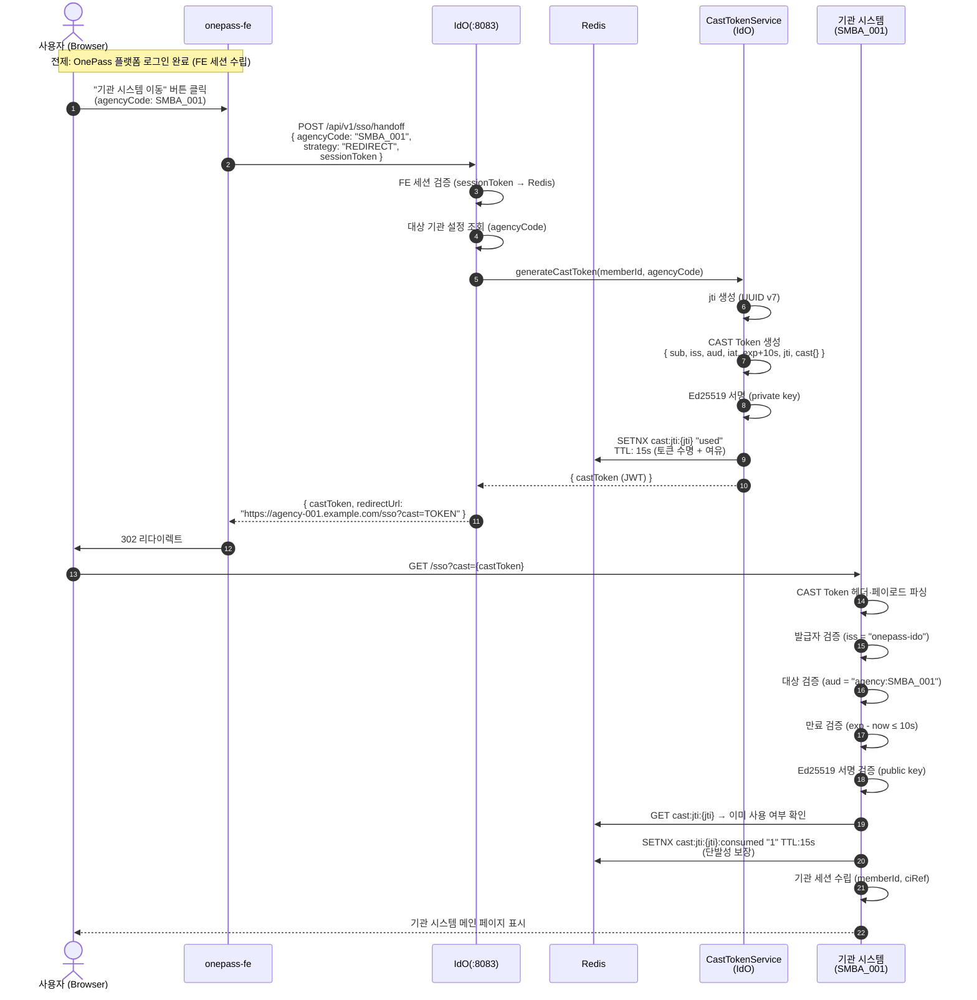
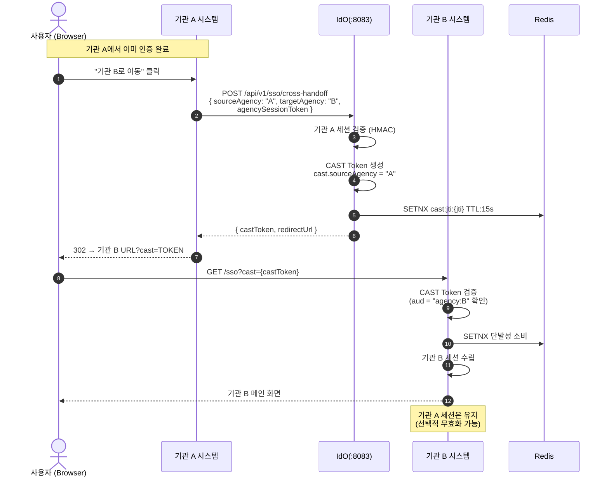

# 워크스루 05: Handoff SSO + CAST Token 흐름

| 항목 | 내용 |
|------|------|
| **문서 ID** | WT-005 |
| **제목** | Handoff SSO 전체 흐름 (CAST Token · Ed25519 · Cross-Agency SSO) |
| **대상 독자** | 개발자, 시스템 설계자, 보안 담당자 |
| **최종 갱신** | 2026-05-15 (v0.8.8) |
| **관련 ADR** | ADR-010, ADR-011, ADR-001 |

---

## 개요

**Handoff SSO**는 사용자가 OnePass 플랫폼에서 인증한 뒤, **재인증 없이** 개별 기관 시스템으로 이동하는 메커니즘이다.  
IdO는 **CAST Token(Cross-Agency Session Transfer Token)**을 발급하며, Ed25519 서명으로 위변조를 방지한다.

```
[전체 흐름 요약]
사용자 (OnePass 로그인 완료)
    │
    ▼ 기관 시스템 이동 버튼 클릭
IdO: CAST Token 발급 (Ed25519 서명, TTL 10초)
    │
    ▼ 단발성 토큰 (jti → Redis SETNX)
기관 시스템: CAST Token 검증
    │
    ▼ 검증 성공
기관 세션 수립 → 재인증 없이 접근
```

---

## 1. 4가지 Handoff 전략

IdO는 기관 시스템 특성에 따라 4가지 Handoff 방식을 지원한다:

| 전략 | 설명 | 적용 기관 |
|------|------|-----------|
| `REDIRECT` | CAST Token을 Query String으로 전달, GET 리다이렉트 | 표준 웹 기관 |
| `POST_FORM` | hidden form POST로 CAST Token 전달 | CSRF 보호 필요 기관 |
| `IFRAME` | iframe 내부에서 토큰 교환 | 임베디드 포털 |
| `API_CALLBACK` | 기관 API로 직접 CAST Token 전달 | API 연동 기관 |

---

## 2. 전체 Handoff SSO 흐름 (REDIRECT 전략)



---

## 3. CAST Token 구조 상세

```json
{
  "header": {
    "alg": "EdDSA",
    "crv": "Ed25519",
    "typ": "JWT",
    "kid": "cast-key-2026-v1"
  },
  "payload": {
    "sub": "qim-user-abc123",
    "iss": "onepass-ido",
    "aud": "agency:SMBA_001",
    "iat": 1716812345,
    "exp": 1716812355,
    "jti": "018f1234-5678-7abc-def0-123456789abc",
    "cast": {
      "sourceAgency": null,
      "targetAgency": "SMBA_001",
      "sessionRef":   "fe-session-id-xxx",
      "memberType":   "PERSONAL",
      "ciRef":        "ci-hash-sha256-xxx"
    }
  },
  "signature": "Ed25519_signature_base64url"
}
```

**핵심 필드**:
- `exp`: `iat + 10s` (단 10초 TTL)
- `jti`: UUID v7 (단발성, Redis SETNX로 재사용 방지)
- `ciRef`: CI 원문이 아닌 SHA-256 해시
- `kid`: 키 로테이션 추적용

---

## 4. Ed25519 서명 생성 / 검증

### 4.1 서명 생성 (IdO → CastTokenService)

```java
// idem-hub/sso/CastTokenServiceImpl.java
public String generateCastToken(CastTokenRequest req) {
    Map<String, Object> payload = Map.of(
        "sub", req.getMemberId(),
        "iss", "onepass-ido",
        "aud", "agency:" + req.getTargetAgency(),
        "iat", Instant.now().getEpochSecond(),
        "exp", Instant.now().plusSeconds(10).getEpochSecond(),
        "jti", UuidCreator.getTimeOrderedEpoch().toString(),  // UUID v7
        "cast", Map.of(
            "targetAgency", req.getTargetAgency(),
            "sessionRef",   req.getSessionRef(),
            "ciRef",        req.getCiRef()
        )
    );

    // Ed25519 서명 (BouncyCastle or java.security)
    PrivateKey privateKey = castKeyConfig.getPrivateKey();
    return Jwts.builder()
        .claims(payload)
        .signWith(privateKey, Jwts.SIG.EdDSA)
        .compact();
}
```

### 4.2 서명 검증 (기관 시스템 수신 측)

```java
// agency/CastTokenVerifier.java (기관 SDK)
public CastTokenClaims verify(String castToken) {
    PublicKey publicKey = castKeyConfig.getPublicKey("cast-key-2026-v1");
    try {
        Claims claims = Jwts.parser()
            .verifyWith(publicKey)      // Ed25519 공개키 검증
            .requireIssuer("onepass-ido")
            .requireAudience("agency:" + myAgencyCode)
            .build()
            .parseSignedClaims(castToken)
            .getPayload();

        // 단발성 검증 (Redis)
        String jti = claims.getId();
        boolean isNew = redis.setIfAbsent("cast:jti:" + jti, "consumed", 15, SECONDS);
        if (!isNew) throw new CastTokenReplayException("이미 사용된 토큰: " + jti);

        return CastTokenClaims.from(claims);
    } catch (JwtException e) {
        throw new CastTokenInvalidException("CAST Token 검증 실패", e);
    }
}
```

---

## 5. Cross-Agency SSO 흐름 (기관 A → 기관 B)

사용자가 기관 A에서 기관 B로 이동하는 시나리오:



---

## 6. POST_FORM 전략 상세

CSRF 보호가 필요한 기관에서 사용:

```html
<!-- IdO가 생성하는 auto-submit form -->
<form method="POST" action="https://agency-002.example.com/sso/receive"
      id="handoff-form" style="display:none">
  <input type="hidden" name="castToken"   value="{castToken}">
  <input type="hidden" name="agencyCode"  value="SMBA_002">
  <input type="hidden" name="timestamp"   value="{timestamp}">
  <input type="hidden" name="_csrf"       value="{csrfToken}">
</form>
<script>document.getElementById('handoff-form').submit();</script>
```

**FE 처리**:
```typescript
// idem-console/src/api/sso/handoff.ts
const response = await beInstance.post('/api/v1/sso/handoff', {
  agencyCode, strategy: 'POST_FORM'
});
// IdO가 HTML form을 반환하거나 formAction URL을 반환
if (response.strategy === 'POST_FORM') {
  submitHandoffForm(response.castToken, response.formAction);
}
```

---

## 7. CAST Token 보안 속성 요약

| 속성 | 값 | 목적 |
|------|-----|------|
| 알고리즘 | Ed25519 (EdDSA) | RSA-2048 대비 32배 짧은 키, 빠른 검증 |
| TTL | 10초 | 네트워크 지연 허용 + 최소 노출 시간 |
| 단발성 | jti + Redis SETNX | 리플레이 공격 방지 |
| CI 보호 | ciRef (해시) | CI 원문 토큰 미포함 |
| 키 식별 | kid 헤더 | 무중단 키 로테이션 지원 |
| 발급자 고정 | iss = "onepass-ido" | 위조 발급자 방지 |
| 대상 고정 | aud = "agency:{code}" | 다른 기관에서 재사용 방지 |

---

## 8. 키 로테이션 흐름

```
[사전 준비]
  새 Ed25519 키 쌍 생성 (kid: cast-key-2026-v2)
  기관 SDK에 신규 공개키 배포 (JWK Endpoint)

[로테이션 단계]
  Phase 1: IdO에서 구 키(v1)로 서명 계속
           기관은 v1 + v2 공개키 모두 허용 (kid로 구분)
  Phase 2: IdO가 신규 키(v2)로 서명 전환
  Phase 3: 구 키(v1)로 서명된 토큰 TTL(10s) 만료 후
           기관 SDK에서 v1 공개키 제거
```

**JWK Endpoint** (기관 공개키 배포):
```
GET /api/v1/sso/.well-known/jwks.json
{
  "keys": [
    { "kty": "OKP", "crv": "Ed25519", "kid": "cast-key-2026-v1", "x": "..." },
    { "kty": "OKP", "crv": "Ed25519", "kid": "cast-key-2026-v2", "x": "..." }
  ]
}
```

---

## 9. Handoff 오류 처리

| 오류 상황 | 처리 | 사용자 안내 |
|-----------|------|-------------|
| FE 세션 만료 | 401 → 재로그인 | "세션이 만료되었습니다. 다시 로그인해주세요." |
| CAST Token 만료 (10s 초과) | 기관 시스템 → 401 | IdO에서 새 토큰 재발급 후 재시도 |
| jti 재사용 (리플레이) | Redis SETNX 실패 → 403 | "유효하지 않은 접근입니다." |
| 서명 검증 실패 | 403 | "인증 토큰이 유효하지 않습니다." |
| 기관 코드 불일치 (aud 불일치) | 403 | "접근 권한이 없습니다." |
| 기관 시스템 다운 | 502 | "현재 기관 시스템에 접근할 수 없습니다." |
| Redis 다운 (jti 저장 실패) | 503 | Fallback: DB 기반 jti 추적 |

---

## 10. 관련 파일 참조

| 파일 | 역할 |
|------|------|
| `idem-hub/sso/CastTokenService.java` | CAST Token 인터페이스 |
| `idem-hub/sso/CastTokenServiceImpl.java` | Ed25519 서명 생성 구현 |
| `idem-hub/sso/CastKeyConfig.java` | 키 쌍 관리, JWK 엔드포인트 |
| `idem-hub/sso/CrossAgencySsoController.java` | `/api/v1/sso/handoff` 엔드포인트 |
| `idem-hub/handoff/strategy/` | 4가지 Handoff 전략 구현 |
| `idem-hub/handoff/HandoffStrategyRouter.java` | 기관 설정 기반 전략 선택 |
| `idem-console/src/api/sso/handoff.ts` | FE Handoff 요청 |
| `idem-tenant-sample/handoff/` | PoC 스텁: Handoff 수신 시뮬레이터 |

---

## 11. 전체 Handoff 아키텍처 요약

```
[OnePass 플랫폼]
  ┌─────────────────────────────────────┐
  │  사용자 (Browser)                    │
  │    │ 로그인 (NICE/OACX/EzAuth)       │
  │    ▼                                │
  │  FE 세션 (Redis TTL: 3600s)         │
  │    │                                │
  │    │ 기관 이동 요청                  │
  │    ▼                                │
  │  IdO: CAST Token 발급               │
  │    │ Ed25519 서명, TTL: 10s         │
  │    │ jti → Redis (단발성)           │
  └────┼────────────────────────────────┘
       │ CAST Token
       ▼
[기관 시스템 SMBA_001]
  ┌─────────────────────────────────────┐
  │  HmacSignatureFilter (IdO 인바운드)  │
  │  or CastTokenVerifier (기관 SDK)    │
  │    │ Ed25519 검증 + jti 소비         │
  │    ▼                                │
  │  기관 세션 수립 → 서비스 제공        │
  └─────────────────────────────────────┘
```

---

> **이전 워크스루**: [WT-004: 프로비저닝 흐름](./04-provisioning-walkthrough.md)  
> **인덱스로 돌아가기**: [Wiki INDEX](../INDEX.md)
